# 我们可以在不熟悉的(自然)语言上执行 NLP 吗？

> 原文：<https://towardsdatascience.com/can-we-perform-nlp-on-unfamiliar-natural-languages-138f6ea4af13?source=collection_archive---------14----------------------->

## 用保加利亚语造句比真正理解它容易吗？

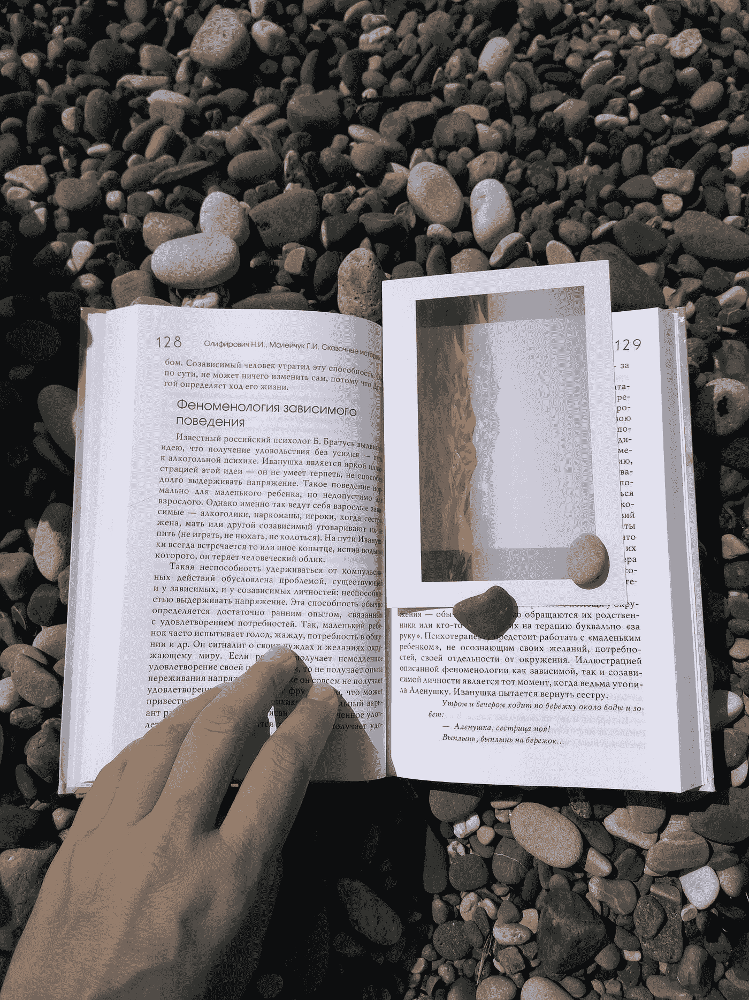

叶卡捷琳娜·诺维茨卡娅在 [Unsplash](https://unsplash.com?utm_source=medium&utm_medium=referral) 上的照片

这篇博文试图用一种我不熟悉的语言——保加利亚语来执行各种自然语言处理(NLP)。我将尝试探索这些数据，并在最后通过使用包含 BiLSTM(双向长短期记忆)层的机器学习模型来生成一些保加利亚语句子。

为了让我享受这个实验，我将使用保加利亚最著名的歌手/说唱歌手之一 Krisko 写的歌词作为文本数据。这里你可以看到克里斯科最近的歌曲，名为“[”даилине](https://www.youtube.com/watch?v=z_2xJOLOxTA)”——意思是“是”或“不是”

这篇文章的代码可以在我的 GitHub 页面上找到。

*所有歌词均来自[歌词翻译](https://lyricstranslate.com/en/krisko-lyrics.html)。

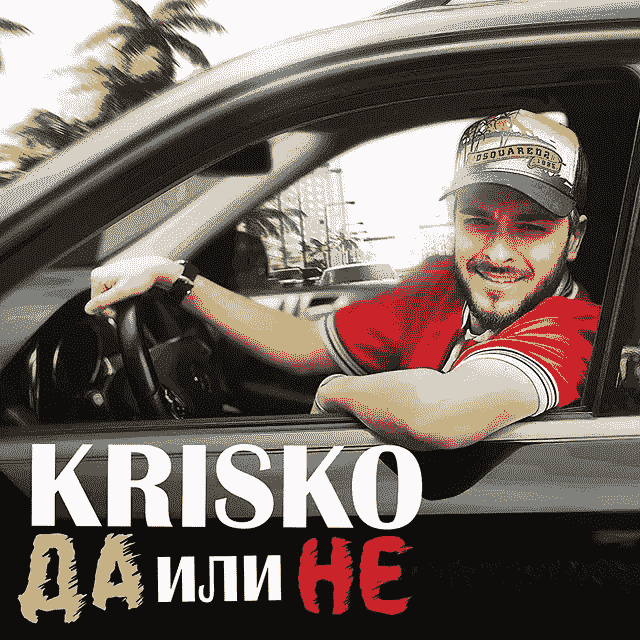

这是克里斯科:来自他的 [Instagram](https://www.instagram.com/p/ByNlgYVFa8u/)

## 一点点保加利亚语言和音乐介绍

> *保加利亚语是南斯拉夫语的一种，主要在保加利亚使用。保加利亚语是用西里尔文写的(事实上是欧盟官方语言中唯一用西里尔文写的语言)。西里尔文是由圣徒西里尔和卫理公会于 893 年在第一个保加利亚帝国发明的。*
> 
> 我个人喜欢保加利亚语，经常听保加利亚歌曲，尽管我并不真正理解它们的含义。保加利亚音乐非常有趣，当然音乐很好，但也受到了来自土耳其、希腊、塞尔维亚等邻国的深刻影响，尤其是一种叫做“Chalga”的民间流行音乐，你可以欣赏到这些不同音乐的完美融合。在这里你可以听一下艾米莉亚的一首名为[*акула*](https://www.youtube.com/watch?v=pY_uq9zLSNo)*的歌曲作为例子。*

# 目录

1.  **探索文本数据**
2.  **预处理文本数据**
3.  **使用 word2vec 探索单词关系**
4.  **构建 BiLSTM 模型以生成保加利亚语句子**
5.  **结论和后续步骤**

# **1。探索文本数据**

由于我不知道保加利亚语语法如何工作，甚至不知道许多基本单词，我将尝试在不做任何预处理的情况下探索数据集(克里斯科的歌词)。

首先，我会检查他的歌曲中经常使用的词是什么。

```
import io# Read the data
with io.open('/resources/data/krisko_lyrics.txt', encoding='utf-8') as f:krisko_text = f.read().lower().replace('\n', ' \n ')# Split into words and make a dataframe
words = [w for w in 
         krisko_text.split(' ') if w.strip() != '' or w == '\n']print('Corpus length in words:', len(words))word_df = pd.DataFrame(words,columns=['word'])
```

在数据集中，有 36 首歌曲，16453 个单词和 3741 个独特的单词。

```
top = word_df.word.value_counts().head(30)print(top)
```

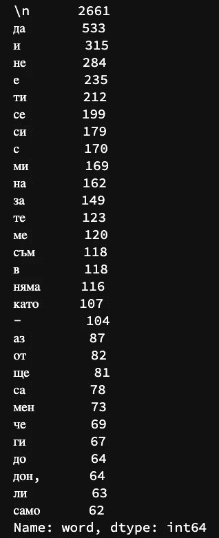

最常用的 30 个单词

我们可以由此创造出单词 cloud 来可视化。

```
# For word cloud
from wordcloud import WordCloud, ImageColorGenerator
import matplotlib.pyplot as pltwc = WordCloud(background_color="white", max_words=100,
               max_font_size=50, random_state=42)output = wc.generate(krisko_text)plt.figure()
plt.imshow(output,interpolation='bilinear')
plt.axis('off')
plt.show()
```

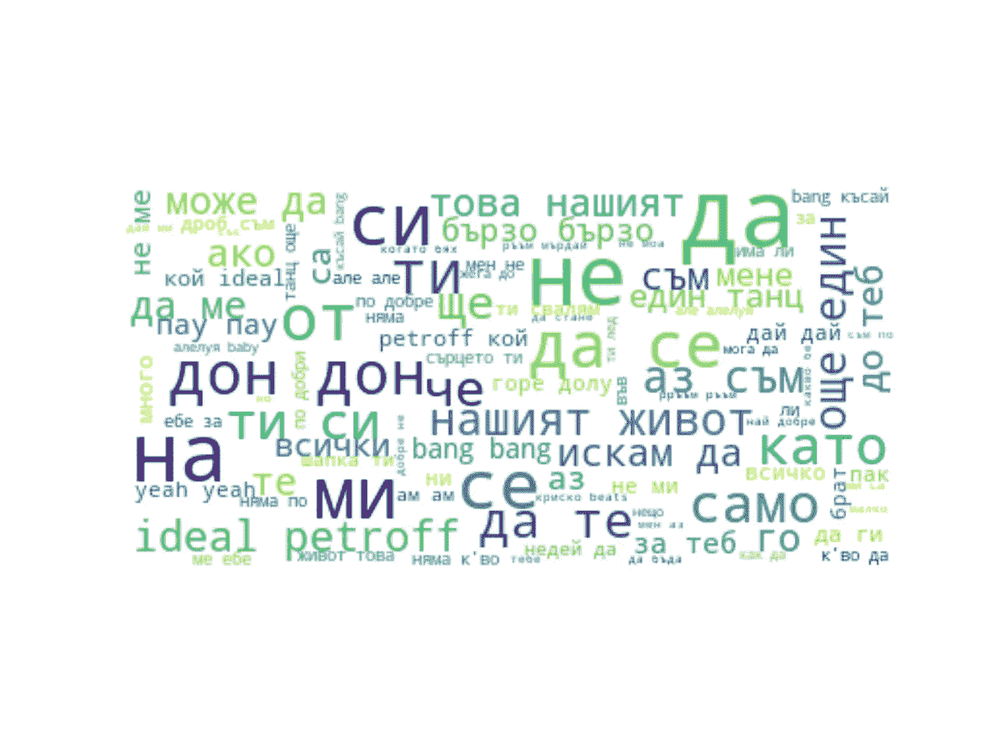

常用词(？)用在克里斯科的歌里

这看起来不错，对不对？不幸的是，它们看起来都像停用词，如“是”、“和”、“否”等。为了理解数据集，我需要删除这些停用词。我们将会看到这个过程是如何完成的，会有什么不同。

# 2.**预处理文本数据**

我在[空间](https://github.com/explosion/spaCy/blob/master/spacy/lang/bg/stop_words.py)中找到了保加利亚语的停用词列表，让我们使用它并从这次探索中移除那些停用词。

```
# Import Bulgarian stop words
from spacy.lang.bg.stop_words import STOP_WORDS as BG_STOPWORDS # Take punctuations out
krisko_cleaned = re.sub('\[,.*?“”…\]', '', krisko_text)# Tokenise the data
TOKENS = word_tokenize(krisko_cleaned) # Add some more stop words
EXTRA_STOPWORDS = {'теб','дон','кво','к\'во','бях','мене','нашият','ма','ше','yeah',           'недей','ей','ко','bang','ам','тебе','you','тука','мойта','тва',                    'але-але-алелуя','кат','tak','моа','оп','о','ся',
'та','тез','дето','ја','aз','tik','i','ѝ','ток','твоя',                    'a','some','ideal','petroff','–','так','тия','ee','к'}BG_STOPWORDS.update(EXTRA_STOPWORDS)# Filter those stop words out
filtered_sentence = []

for w in TOKENS: 
    if w not in BG_STOPWORDS: 
        filtered_sentence.append(w)with open ('~/resources/data/krisko_cleaned.txt','w') as output:
    output.write(str(filtered_sentence))with io.open('~/resources/data/krisko_cleaned.txt',
                 encoding='utf-8') as f:
    krisko_cleaned = f.read()krisko_cleaned = re.sub('[%s]' % 
                 re.escape(string.punctuation), '', krisko_cleaned)
```

删除这些单词后，我们可以创建热门单词列表。

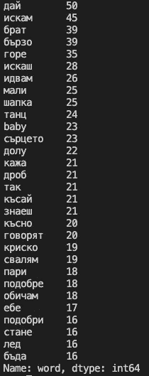

删除停用词后的前 30 个词

现在，这个列表看起来比以前更好。似乎这里所有的单词都有一些含义。最常用的词是‘дай’(дам的第二人称单数祈使形式)，意思是‘给予，允许’。第二个是‘искам’(第一人称单数祈使句)，意思是‘想要’。

这里有趣的一点是，单词的结尾会根据主题而变化。正如我上面提到的，'我想要'是'искам'，'你想要'是'искаш'，她/他/它想要'是'иска'，等等……所以我们实际上可以看出'我想要'和'你想要'之间的区别，而不像在英语中那样不知道主语。

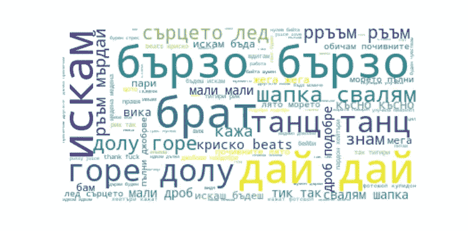

清理数据后的 WordCloud

这里是清理数据后的字云。看起来比上一个信息丰富多了。所以我在这幅图中看到的是‘искам’，'обичам'，'ръъм'，‘кииско’，…所以基本上，克里斯科唱的东西就像他想要并喜欢朗姆酒(？)——这完全说得通。

# **3。使用 word2vec 探索单词关系**

清理完数据后，我们可以通过 word2vec 算法看到单词之间的关系。Word2vec 算法是在给定输入语料库的情况下产生单词嵌入(向量)的模型。利用这一点，我们可以看到，例如，相似的词，预测下一个词，词之间的距离。

下面你可以找到我是如何建立我的模型的。

```
# Modules for word2vec
from nltk.tokenize import sent_tokenize, word_tokenize 
import gensim 
from gensim.models import Word2Vec 
from gensim.models import Phrases # preparation
input_words = []for i in sent_tokenize(krisko_cleaned): 
    temp = [] 

    # tokenize the sentence into words 
    for j in word_tokenize(i): 
        temp.append(j) 

    input_words.append(temp)# Create a word2vec model
w2vModel = Word2Vec(input_words, min_count=1, size=1000, window=1)
```

word2vec 中有几个参数；min_count 是输入单词中单词的最小频率——在我的模型中，我将它设置为 1，这样就包含了所有的单词。*大小*是维度的数量，而*窗口*是句子中当前单词和预测单词之间的最大距离。

让我们使用这个模型来探索数据集。首先，我们可以看到单词之间的相似性。作为一个例子，我可以用“女人”和“男人”这两个词来看它们的相似性。

```
# Investigate the similarity between man and womanprint('Similarity between мъж and жена:
                         '+str(w2vModel.similarity('мъж','жена')))Similarity between мъж and жена: -0.026726926
```

它们的相似度和-0.0267，也就是说那两个词并不像我们预期的那样彼此相似。现在我们可以看到男性和女性相似的词，看看他们之间是否也有一些差异，也可能是用法的上下文。下面你可以看到男人和女人相似词汇的列表。该列表包含三列，相似词，其翻译，以及-1 和 1 之间的相似度范围。由于我不知道很多保加利亚语，我用谷歌翻译创建了一个翻译专栏。由于一些翻译看起来有点奇怪，我怀疑一些相似的单词可能不正确。

```
# Creating the most similar words list for man and womanman_df = pd.DataFrame(w2vModel.most_similar('мъж'),columns=['similar_word','similarity'])
translate = ['chief','household','tiger','goes away','we dream',
             'lake','I ran','voodoo','haymans','stop']
man_df['translation'] = translate
man_df = man_df[['similar_word','translation','similarity']]woman_df = pd.DataFrame(w2vModel.most_similar('жена'),columns=['similar_word','similarity'])
translate = ['bucket','noisy','I know','you come',
             'polo','folk','ashamed','bon','bat','opportunity']
woman_df['translation'] = translate
woman_df = woman_df[['similar_word','translation','similarity']]
```

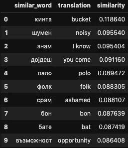

与мъж(男)(左)和жена(女)(右)相似的词

嗯，由于我还没有消除性别刻板印象的偏见([1] Bolukbasi et al .，2016)，我们仍然可以看到它。但与此同时，这篇博文的主要目的是探索数据集并生成保加利亚语的 Krisko-ish 句子，所以我认为最好不要去偏向以获得更多的 Krisko 味道。

所以在克里斯科的歌词中,“男人”这个词经常用在“男性”的语境中，如“首领”、“家庭”和“老虎”,而“女人”这个词类似于一点点负面的词，如“吵闹”和“羞愧”。

现在继续讨论“我想要”和“你想要”之间的相似之处。正如我上面提到的，我们可以在保加利亚语中看到这两个词的不同上下文。

```
print('Similarity between искам and искаш:
        '**+**str(w2vModel.similarity('искам','искаш')))Similarity between искам and искаш: 0.048260797
```

正如我所料，这两个词非常不同，尽管唯一的区别是动词的主语。现在我们可以探讨一下围绕那两个词用了什么样的词。因为这两个词的相似度很低，所以我认为它们周围的词也应该很不一样。

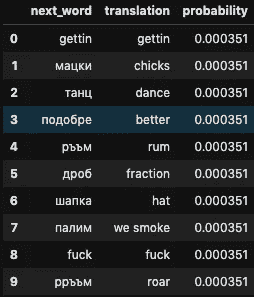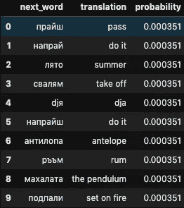

下一个词预测:искам(我要)(左)和искаш(你要)(右)

与我的猜测相反，我们并没有真正观察到它们之间的巨大差异。公平地说，列表只有 10 个单词，概率是相同的，所以如果我扩展列表，我们可能会看到一些明显的差异。

我能感觉到的一件事是‘我想要’这个词更男性化，比如‘我想要小鸡’、‘我想抽烟’(语法不正确)和‘我想做爱’。所以我猜克里斯科在用“我”的时候经常指的是他自己。而且我猜“你”通常指的是一个女孩，因为我在他的音乐视频中可以看到很多女孩(从词表上看不出来)。

现在，我们可以画出他的歌名的单词嵌入，来看它们之间的二维距离。我在这里使用的标题仅限于那些只包含一个单词的标题。

```
# Inspired by Stanford's [CS coursework](https://web.stanford.edu/class/cs224n/materials/Gensim%20word%20vector%20visualization.html)def display_pca_scatterplot(model, words):

    word_vectors = np.array([model[w] for w in words]) twodim = PCA().fit_transform(word_vectors)[:,:2]

    plt.figure(figsize=(12,12))
    plt.scatter(twodim[:,0], twodim[:,1], edgecolors='k', c='r')
    for word, (x,y) in zip(words, twodim):
        plt.text(x+0.0003, y-0.0001, word) display_pca_scatterplot(w2vModel,['базука','афтърмен',
                                  'горила','антилопа',
                                  'фотошоп','късай','герои',
                                  'мърдай','наздраве',
                                  'незаменим'])
```

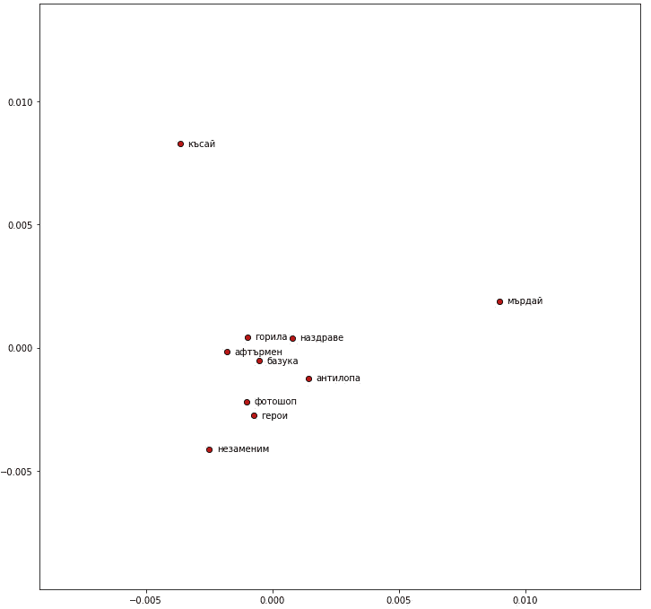

克里斯科的歌词单词嵌入

本次歌名列表中有三首歌词不是克里斯科演唱的，分别是[антилопа](https://www.youtube.com/watch?v=S37CvSvQN7o)(antilope)[фотошоп](https://www.youtube.com/watch?v=uCOhwj7J9bo)(Photoshop)[късай](https://www.youtube.com/watch?v=56b7a_FJzpQ)(tear)。这些歌词是克里斯科写的，但由蒂塔演唱。令人惊讶的是，这三首歌彼此并不相似，尤其是《късай》与其他所有歌曲相去甚远。还有[горила](https://www.youtube.com/watch?v=JLtaUvhTPsc)(大猩猩)是一首由 2BONA 和 Krisko 演唱的歌曲，但似乎与其他歌曲没有太大区别。[мърдай](https://www.youtube.com/watch?v=Ig5kvpoEH0I)(摆动)在右手边，这很有意义，因为这首歌是由多名歌手演唱的(克里斯科、迪姆和боропърви).

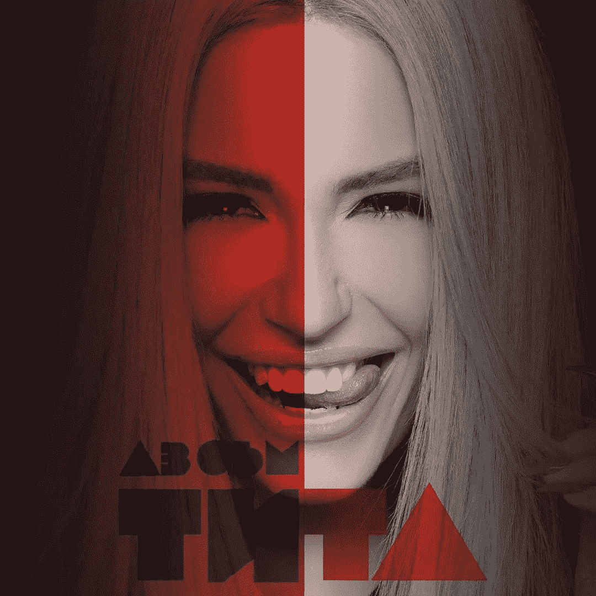

这是蒂塔:来自她的 Instagram

# **4。构建一个 BiLSTM 模型来生成保加利亚语句子**

现在，我们将看看是否可以通过从 Krisko 的歌词数据建立一个模型来生成一些保加利亚语的句子。该模型将包括嵌入和双向 LSTM (BiLSTM)层。

LSTM 是 RNN(递归神经网络)体系结构之一。虽然正常的 rnn 在输入序列中仅具有长期依赖性，但是 LSTM 具有输入、遗忘和输出门，并且这些门使得能够具有随机的短期依赖性。与普通的 LSTM(单向)不同，BiLSTM 从前后两个方向运行输入数据。因此，它不仅有助于理解过去单词的上下文。

为了建立一个模型，首先，我们需要准备输入序列。

```
# For BiLSTM modelimport feather
import tensorflow as tf
from tensorflow import keras
from keras.models import Model, Sequential
from keras.layers import Input, Dense, Embedding, Concatenate, Flatten, LSTM, Dropout, Reshape, Activation,Bidirectional,Layer
from keras.losses import binary_crossentropy
from keras import optimizers,activations,initializers
from tensorflow.keras.preprocessing.text import Tokenizer
from tensorflow.keras.preprocessing.sequence import pad_sequencestf.compat.v1.set_random_seed(42)
tokenizer = Tokenizer()# Make the text data into input sequencescorpus = [w for w in krisko_cleaned).split('\n') 
          if w.strip() != '' or w == '\n']tokenizer.fit_on_texts(corpus)TOTAL_WORDS = len(tokenizer.word_index)+1input_seq = []for line in corpus:
    token_list = tokenizer.texts_to_sequences([line])[0]
    for i in range(1,len(token_list)):
        n_gram_seq = token_list[:i+1]
        input_seq.append(n_gram_seq)MAX_SEQ_LEN = max([len(x) for x in input_seq])input_sequences = np.array(pad_sequences(input_seq,
                           maxlen=MAX_SEQ_LEN, padding='pre'))xs = input_sequences[:,:-1]
labels = input_sequences[:,-1]
ys = tf.keras.utils.to_categorical(labels, num_classes=TOTAL_WORDS)
```

我是这样建立模型的。下面这个模型是我做的第一个。这是一个单层的 BiLSTM 模型。首先，创建单词嵌入，然后将它们通过 BiLSTM 层，最后，使用 softmax 计算输出类的概率。

```
# Build a modelBATCH_SIZE = 128model = Sequential()
model.add(Embedding(TOTAL_WORDS, 128, input_length=MAX_SEQ_LEN-1))
model.add(Dropout(.5))
model.add(Bidirectional(
              LSTM(128,return_sequences=False,
                   kernel_initializer='random_uniform')))
model.add(Dropout(.5))
model.add(Dense(TOTAL_WORDS, activation='softmax'))model.compile(loss='categorical_crossentropy',
              optimizer=optimizers.Adam(lr=0.1,decay=.0001),
              metrics=['accuracy'])model.fit(xs,ys,epochs=500,verbose=1)
```

最后，我们将使用我创建的模型生成句子。我们将生成四个句子，以“我想要(искам)”、“你想要(искаш)')、“我是(азсъм)')”和“你是(тиси)”开始。

```
def textGenerator(seedText, textLength): for _ in range(textLength):
        token_list = tokenizer.texts_to_sequences([seedText])[0]
        token_list = pad_sequences([token_list], 
                                   maxlen = MAX_SEQ_LEN - 1,
                                   padding = 'pre')
        pred = model.predict_classes(token_list,verbose=0)output_word = "" for word, index in tokenizer.word_index.items():
            if index == pred:
                output_word = word
                break
        seedText += " " + output_word
    return print(seedText) textGenerator('искам',MAX_SEQ_LEN-1)
textGenerator('искаш',MAX_SEQ_LEN-1)
textGenerator('Аз съм',MAX_SEQ_LEN-2)
textGenerator('Ти си',MAX_SEQ_LEN-2)
```

这些是模型的结果。为了理解这个句子，我用了谷歌翻译(有些翻译似乎很离谱)。

**具有 128 个单元- 500 个时期的单个 BiLSTM 层**

> любовта——(我想给
> 
> искашдаседаседасеасеаасеаасеасееаасееасееасеееаселюбовта——(你想给就给，给，给，做爱)
> 
> **Аз съм** да се да се да се да се да се да се да се да любовта - (I am to give to give to give, to give to give to love)
> 
> **Ти си** е да ме да ме да ме да ме да ме да ме да ме любовта - (You are to give me to give me to give me to give me to love me)

This model didn’t learn much as we can see the predictions are all same for those seed text. Now increase the number of units.

**Single BiLSTM layer with 256 units — 500 epochs**

> **Искам** да източа не е важно е е е е е е е е е е или би - (I want to drain is not important is is is is is is is is or is)
> 
> **Искаш** мандарините ли да те закарам в мойта душа и да се повозим и да се повозим от - (Do you want tangerines to drive you into my soul and to ride and ride from)
> 
> **Аз съм** навсякъде където има ли има ли пожари да се оправя да се оправя да ме с - (I am everywhere where there are fires to handle to handle me with)
> 
> **Ти си** моят замък да се качиш и аз съм до теб жега е до лягане да телефона - (You’re my castle to get on and I’m up to you heat is to bed to phone)

We can see some improvements (at least the predictions are not the same for all the seed texts). But still not something we can say these are actual sentences. Continue to train until 1000 epochs.

**Single BiLSTM layer with 256 units — 1000 epochs**

> **Искам** да избягаме е е е лесна работа ти си риба и аз бързо бързо бързо бързо бързо - (I want to escape is is easy job you are a fish and I fast fast fast fast fast)
> 
> **Искаш** ли да се повозим в мойта кола да се повозим в мойта кола да се повозим на - (Do you want to drive in my car to drive in my car to drive in)
> 
> **Аз съм** slick да се гушка playmate трето поколение да се държи ма буден да се огледаш барна - (I’m slick to playmate third generation cuddle keep me awake to look around the bar)
> 
> **Ти си** моят замък е до теб жега е до теб жега е до теб жега е вързана - (You are my castle is to you heat is to you heat is to you heat is tied)

I feel the model is getting better. Some sentences kinda make sense. Now put one more BiLSTM layer and train 1000 epochs.

**Double BiLSTM layer with 256 units — 1000 epochs**

> **Искам** един танц на не дължа да се разбивам да се да се моля бе на фитнес запали - (I want a dance I don’t owe to break to pray it was on fitness lights)
> 
> **Искаш** да се възгордяваш да се възгордяваш няма никой те боли и не мога да върна духат любовта - (You want to be proud to be proud no one hurts you and I can’t bring back love)
> 
> **Аз съм** купидон да се качиш да се моля да се фука напиеме теб ми бе се предавам - (I’m a cupid to get up to pray fuck you I was giving up)
> 
> жена、моля、моля、моля和любовта

很难说这些是否比以前的预测更好，但这个模型也产生了一些可以理解的句子。

所以这个实验的答案是:用一种不熟悉的语言生成句子是可能的，但是，你可能不明白这个模型生成的句子。由于不熟悉这门语言，很难使用 n-gram 这样的技术。


由[道格·马洛尼](https://unsplash.com/@dougmaloney?utm_source=medium&utm_medium=referral)在 [Unsplash](https://unsplash.com?utm_source=medium&utm_medium=referral) 上拍摄

# 结论和后续步骤

这是一个非常有趣的实验。这个帖子通过了

*   数据探索
*   创建单词云可视化
*   使用 word2vec 探索更多信息
*   使用 BiLSTM 层构建文本生成器模型

接下来的步骤是

*   生成歌词(可能需要更多数据)
*   尝试 skipgram
*   提高包括<eos>和<sos>的数据质量，而不是预测固定长度的句子</sos></eos>
*   创建文本生成器 API

希望你对这篇文章感兴趣。如果你想和我联系，这是我的 LinkedIn 页面。

# 参考

[1]t . Bolukbasi，Chang，K. W .，Zou，J. Y .，Saligrama，v .，& Kalai，A. T. (2016 年)。男人对于电脑程序员就像女人对于家庭主妇一样？去偏置词嵌入。在*神经信息处理系统的进展*(第 4349–4357 页)。