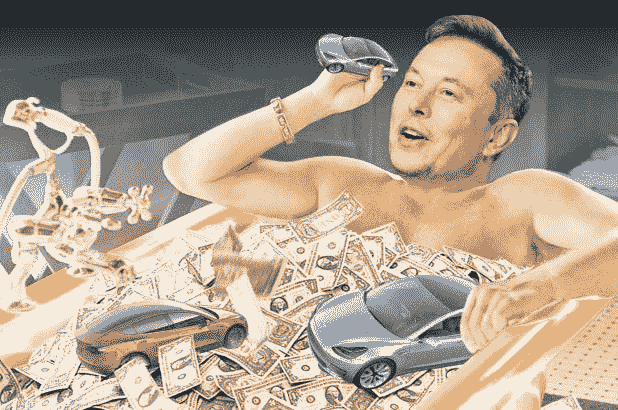
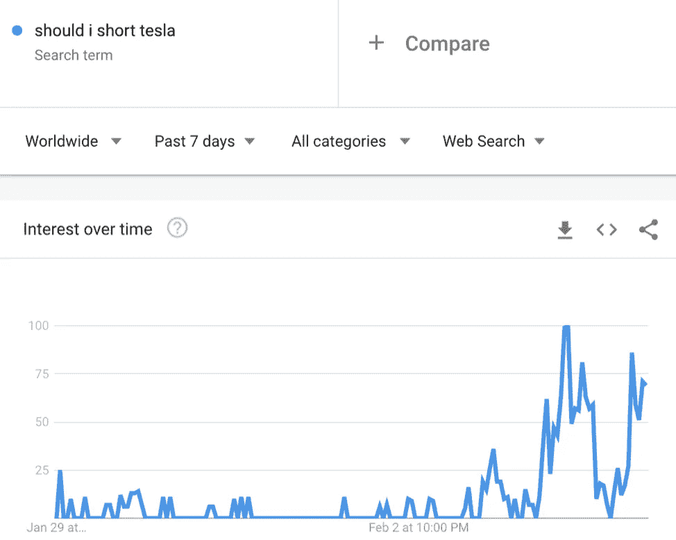
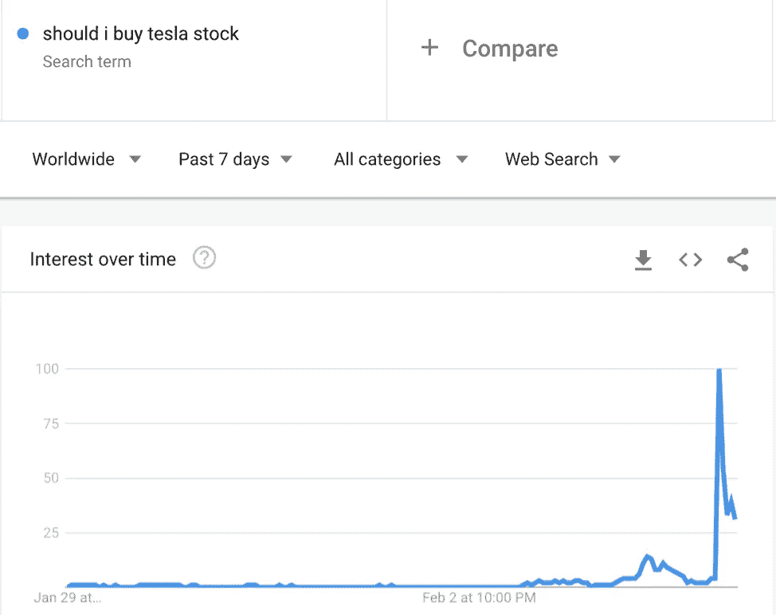
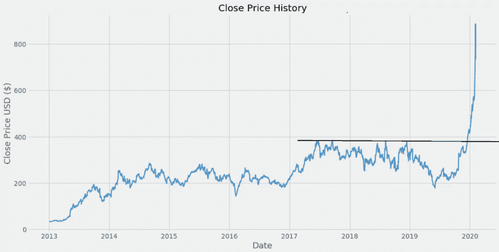
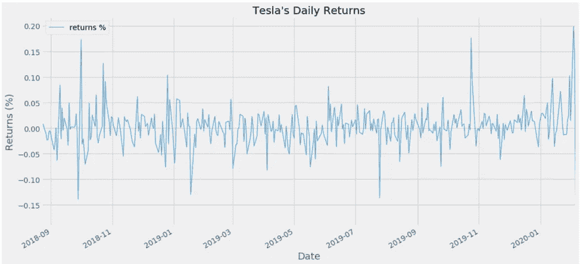
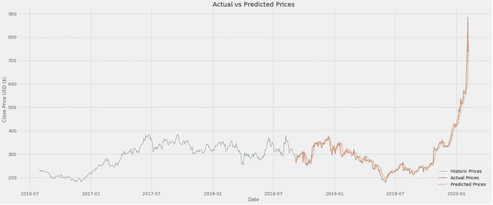
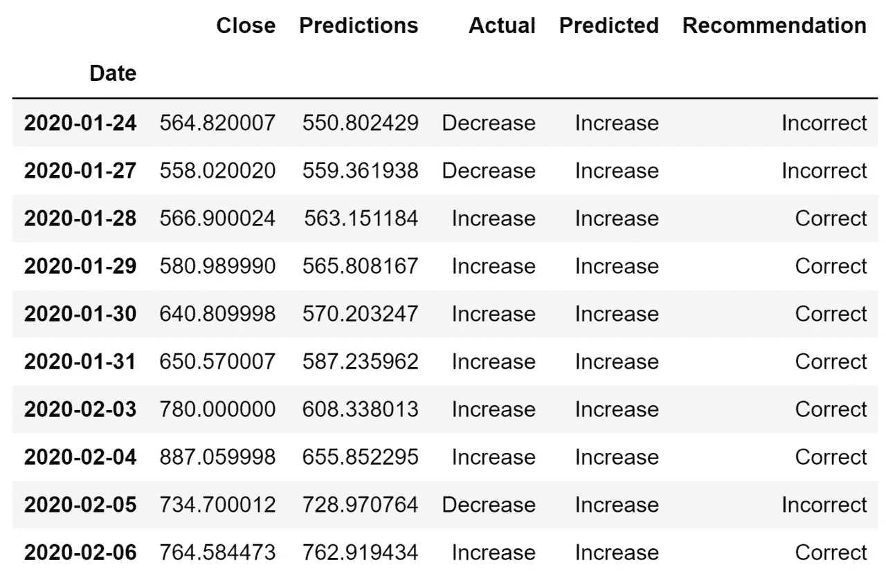

# 我们能用 AI 预测特斯拉的兴衰吗？

> 原文：<https://towardsdatascience.com/can-we-predict-teslas-rise-fall-using-ai-2a892ba1aee1?source=collection_archive---------27----------------------->

## 利用人工智能在自己的游戏中击败市场

*合著:* [*拉米哈曼*](https://medium.com/u/8a2493e3033c?source=post_page-----2a892ba1aee1--------------------------------)

阿拉米图像艺术

## 为什么分析师对特斯拉的下一步动向如此分歧？

在 5 天的时间内，特斯拉的股价涨幅超过了 10 年来的涨幅。分析师们现在分成了两派，一派根据其长期前景称其为汽车行业的下一个 1 万亿美元公司，一派称其为一种时尚，并将其与比特币等以前的投机泡沫进行比较，问题是:我们能利用人工智能的 LSTM 预测接下来会发生什么吗？

## 华尔街认可 AI 做股市分析吗？

数据科学家一直声称，人工智能将彻底改变我们使用数据预测和分析金融模式的方式，世界上最具流动性的金融生态系统纳斯达克最近刚刚证明了这一点，承认它利用机器学习和人工智能，以便从其庞大的数据集中学习错综复杂的模式和隐藏的关系。

照片由 Pexels 上的 [Pixaby](https://www.pexels.com/@pixabay) 拍摄

## 悲观的投资者会让你变富吗？

在特斯拉突然崛起之前，悲观的投资者押注于这家汽车制造商，谷歌趋势显示，搜索“我应该做空特斯拉吗？”为公司的年度股东大会做准备。

“我该做空特斯拉吗？”:截至 2020 年 2 月 5 日的谷歌趋势数据

## 投资者信心下降

这是由投资者押注特斯拉无法满足生产和交付时间表的记录以及一个主要预期推动的:特斯拉将像 16 年来一样，无法实现盈利。

投资者信心的下降也可能是由最近的 Cybertruck 失误造成的，马斯克的新“防弹”汽车的玻璃在电视直播中被打碎，在此期间股价下跌了 6%。

“我该不该买特斯拉股票？”:截至 2020 年 2 月 5 日的谷歌趋势数据

## 特斯拉的强势回归

然而，当特斯拉宣布拥有【T10 亿美元现金，并在 2019 年最后三个月实现**3.86 亿**美元利润，使其全年利润仅剩下**3580 万**美元的微弱优势时，它为自己准备了一个关键的变化:特斯拉现在可以不再依赖债务来弥补亏损和流动性不足，并开始自给自足。这对投资者来说是最大的冲击之一，批评者没有抓住特斯拉的主要批评点:盈利能力。

## 实现人工智能的 LSTM，以预测接下来会发生什么

我们的工作是展示神经网络如何能够从历史数据中学习，以便预测明天会发生什么，为那些希望通过在这一历史性泡沫中建立每日市场头寸来获利的人提供了一个巨大的机会。

## 但首先，让我们仔细看看这只股票的表现:

## 关闭价格历史记录

TSLA 在 2019 年底突破阻力，表明交易者将看涨，但不顾一切，它不仅走向相反的方向，而且达到了 961.86 美元的历史高点。

## 特斯拉的每日回报

此外，特斯拉在过去一年的回报相当不稳定，使其成为一只不可预测的股票，特别是在接近年底时，因为临近年度股东大会。

> 如果有一种方法可以准确预测明天的股票价格，一次预测一天，会怎么样？

## 预测任务

让我们把自己放回到 2018 年第四季度，我们需要预测未来会发生什么。这是我们建立一个长短期记忆(LSTM)神经网络模型的地方，该模型将对 80%的历史数据进行训练，并预测接下来的 20%，这个过程被称为回测。我们可以通过比较我们的预测和实际价格来评估我们的模型。

照片由 [Pietro Jeng](https://unsplash.com/@pietrozj) 在 Unsplash 上拍摄

## 什么是 LSTM？

LSTM 是一种用于深度学习领域的人工递归神经网络。

这些神经网络通常非常擅长通过循环信息、重新学习和调整先前犯下的错误来从长序列中提取模式。

> 作为人类，我们边走边学，当你读这句话的时候，你是根据你对前面单词的理解来理解每个单词的。你不会每读一个字就把所有的东西都扔掉，重新从头开始思考，你的想法是有持久性的。

## LSTM 预测泰斯拉运动的结果——一颗隐藏的宝石

该模型在识别和学习模式方面做得非常出色，因为它慢慢预见到了繁荣的发生。

# 我们的模式完美吗？

## 均方根误差:23.24

远非如此，但是对于每一个预测，结果平均只相差 23 美元**。**

## 让我们仔细看看我们的模型对过去 10 天的股价预测:

如你所见，该模型在预测股票走向方面做得相当不错。然而，当我们错了的时候，大多数时候我们只错了很小一部分，我们对 2020 年 2 月 6 日的最新预测只错了 0.22%。当我们的模型在特斯拉 961.86 美元的历史高点下跌 28%时，我们的模型仍然预测了正确的方向，这将为任何持有该股多头头寸的人赚钱。

不管怎样，即使我们的估计是错误的，总的方向还是会回到我们的预测。这使得我们的预测模型不仅更准确，而且相对于股票市场更直观，这个行业刚刚开始了解人工智能在模式识别方面提供的好处，创造了一个难得的利基机会。

## 短挤压现象

当投资者做空股票时，他们借入股票并卖出，希望以下跌的价格买回，并从中获利。然而，这也意味着，如果股价上涨，他们的损失可能是无限的，这就产生了一个疫情，促使他们尽快卖出股票以限制损失，反过来，这又会大幅放大股价。

所有这些因素加在一起，推动特斯拉的股价在周二上涨了 100%，达到 961.86 美元的历史新高，其中 40%可归因于过去两天。这种现象被称为**卖空**，卖空者在 2020 年已经损失了**80 亿美元**，其中仅在周一就损失了 25 亿美元。

# 结论

从定义上来说，特斯拉是一只情绪股票，事实上，我们的模型能够有如此高的准确性，还能学习如何在理解投资者情绪如何反映在数字上方面拥有高度的情商，这是一场革命。

## 方向与精度

就价格而言，这可能不是最准确的，但我们的目标是预测特斯拉股票的走向，这个模型在这方面达到了目的。

## 改进我们的模型

在改进我们的模型时，通过从 Google Trends & Twitter Analytics 中提取指标来纳入更多情绪将是有用的，如果一支股票被认为是情绪化的，那么在预测它时尽可能多地提取情绪是唯一合理的。

我们并不是说我们找到了成为亿万富翁的方法，而是说这可以作为在新闻混乱中完善现有交易策略的基础。

# 商务化人际关系网

【https://www.linkedin.com/in/nmukhtar 

[https://www.linkedin.com/in/ramy-hammam](https://www.linkedin.com/in/ramy-hammam/)

# 带代码的特斯拉预测模型

 [## RamyBot/Tesla 预测

### 在 GitHub 上创建一个帐户，为 RamyBot/Tesla-Predictions 的开发做出贡献。

github.com](https://github.com/RamyBot/Tesla-Predictions) 

> *更新:截至 2020 年 2 月 6 日，该模型已经能够反映当前疫情冠状病毒对中国和供应链的影响，这直接影响了特斯拉的股价。*