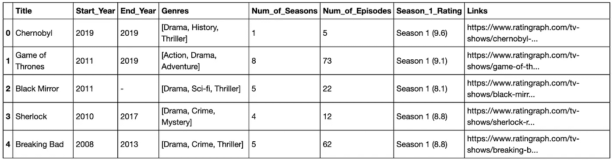
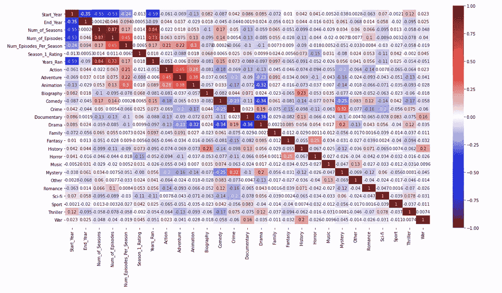
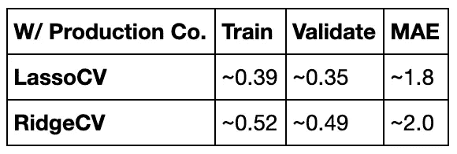
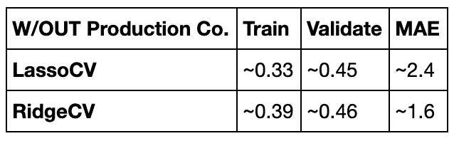
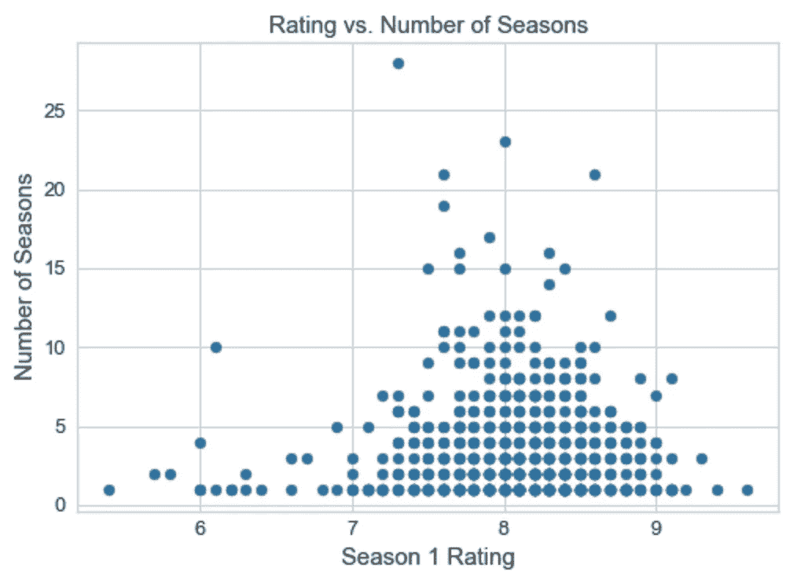
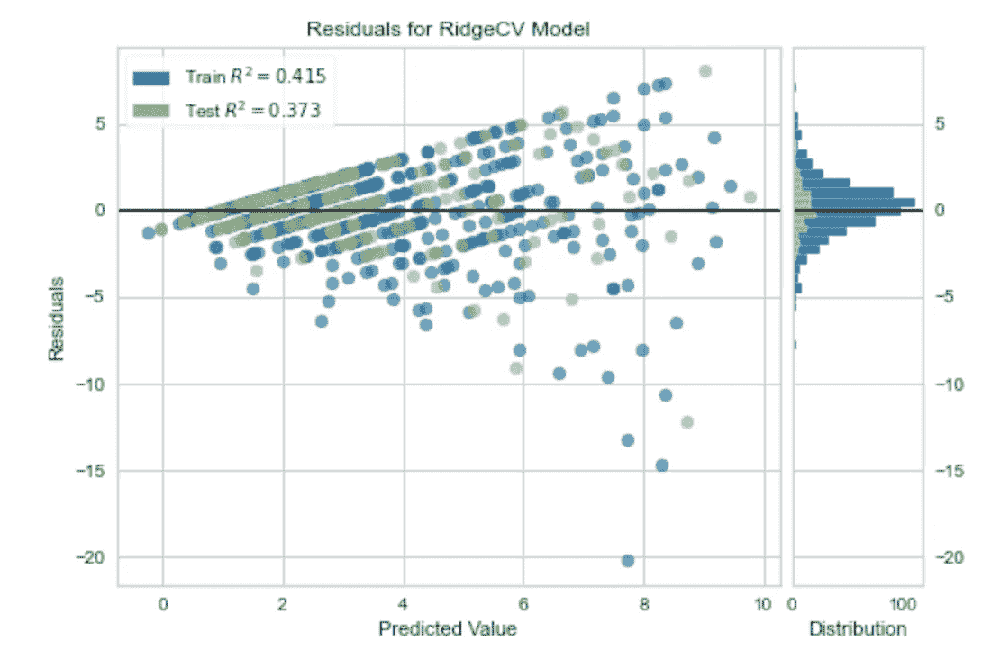

# 我们能预测电视节目的寿命吗？

> 原文：<https://towardsdatascience.com/can-we-predict-the-life-span-of-a-tv-show-212762ae7b8d?source=collection_archive---------68----------------------->

我所在的数据科学训练营 Metis 的第二个项目是对我们选择的主题进行预测。该项目的指导方针是从网站上收集数据，并使用线性回归对连续的目标变量进行预测。

讽刺的是，选择主题对我来说是最困难的部分之一。在被介绍到这个项目后，我花了太多的时间在不同的网站上搜索，寻找一些我可以预测的有趣目标。到第二天结束时，我觉得不可避免的是，我必须做一个我不感兴趣的项目，只是为了提交一些东西。感觉被打败了，我的思想开始徘徊，我想我最喜欢的电视节目是否会被更新。然后我突然想到，“与其等公告，我为什么不用数据来预测会不会续签？”然而，一个节目被更新或取消并不是一个连续的变量。在和我的团队中的其他几个人交谈后，预测电视节目寿命的想法出现了，我的项目想法最终得到了巩固。特别是，我的目标是建立一个模型，可以预测一个节目将会播放多少季。

**数据收集**

一开始，我从[分级网](https://www.ratingraph.com/tv-shows/)搜集了 1000 个电视节目的数据，然后我从分级网搜集了每个节目的美国电影协会分级和制作公司的 [IMDb](https://www.imdb.com/?ref_=nv_home) 。

从 RatinGraph 收集的前几行数据。图片作者。

我将数据限制在至少有一季的电视剧上，并且是在 1995 年或之后发行的。为了防止数据泄露，我只使用了在第一季结束时可用的数据作为我的模型的特征。

**数据处理**

我继续清理 RatinGraph 数据，最终发现并删除了一些节目的每集数的异常值。我还将出现次数少于 7 次的类型合并到“其他”类别中。为了使用流派作为特性，我为每个流派创建了虚拟变量列。每个节目在其包括的每个流派的虚拟列中得到 1，并且对于与该节目没有相关流派的所有其他虚拟列得到 0。接下来，我清理了 IMDb 的数据，删除了重复的和没有有效美国电影协会评级的显示。为了使用美国电影协会评级，我将其视为一个序数变量，并制作了一个映射，将评级从适合儿童(TV-Y)为 0 到最不适合儿童(TV- MA)为 6 进行排序。

在开始 Metis 之前，我不熟悉的一个策略是创建最小可行产品的过程，并通过多次迭代来改进它。在数据处理的每个里程碑之后，我创建了一个 EDA 笔记本来研究基线模型，并在其上逐步改进。那些笔记本可以在我的 GitHub repo 的附录里看到[这里](https://github.com/Neda-Sal/tv_show_lifespan)。这个迭代过程帮助我在早期获得一个工作模型，当我研究它的特性时，我可以合理地改进它。这也阻止了我在没有启动工作模型的情况下，花费所有的时间清理和获取更多的数据用于模型。

基准模型特征(左)和包括类型的模型特征(右)的相关热图。图片作者。

**正规化**

在整个 EDA 笔记本(在附录中)中，我对两组特征测试了线性回归、多项式回归、套索和岭回归。这两个节目的唯一区别在于，一个包含了一个二元变量，即该节目是否由大型制作公司制作，而另一个则没有。我决定继续关注 Lasso 和 Ridge，并使用 LassoCV 和 RidgeCV 来寻找最好的 alphas。

比较模型 R 的分数。图片作者。

考虑到所有的事情，我使用 RidgeCV 作为我的最终模型，alpha = 10，并且不包括制作公司的功能集。

我的模型中的许多系数都符合预期，而其他的则有点令人惊讶。我发现犯罪、喜剧和家庭这三种类型有最大的正系数。在调查了季数最多的电视节目后，我发现像*法律与秩序、*南方公园和*海绵宝宝*这样的节目是播放时间最长的，并且至少有其中一种类型。此外，纪录片和传记片等类型的系数为负。我认为这是因为纪录片和传记倾向于单一的独立系列。动作和冒险等类型的其他负系数没有那么清晰的推理。然而，也许最令人惊讶的负系数来自第一季的收视率。

我怀疑第一季收视率高的电视剧一般会有更多季。当我看着第一季收视率与季数的关系图时，我发现有些很长的剧集第一季收视率并不高。例如，节目 *Top Gear* 已经播放了 28 季，第一季的收视率为 7.3。值得注意的是，这部剧的类型之一是喜剧，这是我们贡献最大的积极因素之一。

图片作者。

至于我的模型的准确性，它的得分为 R =~.37，在最终测试集上调整后的 R =~ .35。它也有大约 1.6 个季节的平均绝对误差。

最终模型的残差。图片作者。

回到知道我最喜欢的节目是否会继续，我用我的模型做了预测。它预测它只会运行 1.3 季。事实上，该剧刚刚续订了第三季！这和我的平均绝对误差是~1.6 个赛季是一致的。虽然我的模型低估了这部电视剧的寿命，但对于我最喜欢的电视剧来说，这并不是我太担心的事情。

**结论**

选择一个我真正感兴趣的主题是我成功完成项目的关键。我发现自己被迷住了，寻找额外的数据和更多的特性来添加到我的模型中。然而，从一个基线模型开始，然后添加到它允许我做出合理的改进。我开始回答这个问题“我们能预测一部电视剧的寿命吗？”嗯，根据我的模型，我们可能无法准确预测它，但我们可以根据它的特征进行合理的猜测。

完整的项目代码可以在[这里](https://github.com/Neda-Sal/tv_show_lifespan)找到。