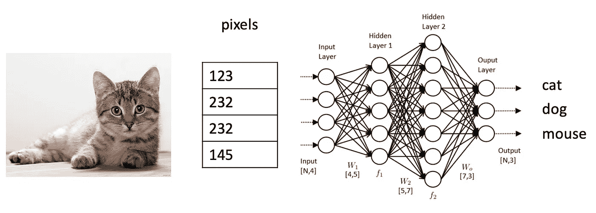
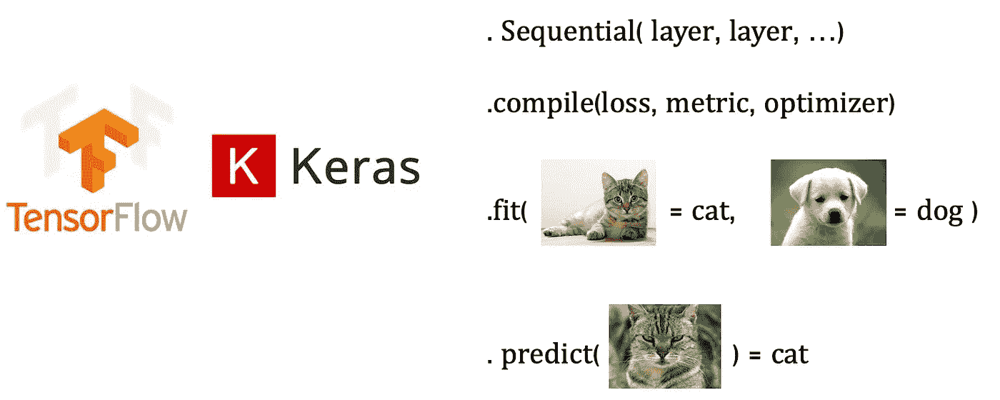
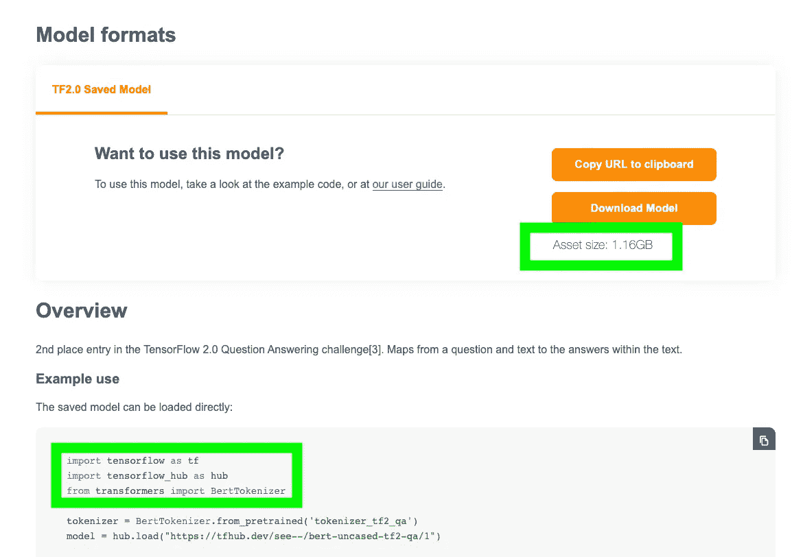

# 我们真的可以在浏览器中运行 AI 吗？

> 原文：<https://towardsdatascience.com/can-we-really-run-ai-in-the-browser-aaf8a5c17d0?source=collection_archive---------65----------------------->

## 让我们用 tensorflow.js 来探索一下

> 这篇文章的目的是看看如何在浏览器中运行深度学习模型，以及这种方法的利弊。要复制的代码可以在 [github](https://github.com/tdetry/tensorflowJS-in-React) 上找到。

如果我们把人工智能定义为一个经过训练的大模型。这个模型是一个函数 *f()* ，它接受输入并以结果的形式产生输出，


其中 *f()* 可以表示为下列之一:



神经网络的图形表示。



神经网络的抽象。

…在我们的浏览器中运行这种**模型有多容易？**这种方法的**优点**和**缺点**是什么？让我们通过尝试来探索。

## 实验

为此，我使用了 [tensorflow.js](https://www.tensorflow.org/js) 。我想使用一个预先训练好的模型，这意味着有人已经调整了函数并向其输入数据以获得参数。这些参数可以被视为一个大的数字列表，它将决定如何将输入转换为输出。这个人是好心分享参数和功能。就 Tensorflow 而言，这种情况可能发生在 TensorHub 中。之后，我可以决定改进模型，这将被视为迁移学习，或将其用于手头的任务。

让我们采取三个步骤的方法在我们的浏览器中运行这个模型。

1.  理解 Python 中的模型，并将其导出到 Javascript

我想尝试用[伯特问题&回答](https://tfhub.dev/see--/bert-uncased-tf2-qa/1)，但是我遇到了一些问题。第一个是模型的大小。我不认为我的用户会等待 1gb 的**参数来下载**。在这方面，看起来正在用 [Tensorflow Lite](https://www.tensorflow.org/lite/) 缩小模型的尺寸。它通过使用[量化技术](https://www.tensorflow.org/lite/guide/get_started#quantization)，专注于尺寸/性能优化。

其次，记号化器是将字母、单词、句子转换成函数可以理解的输入的一段代码。它依靠的是 [HuggingFace](https://huggingface.co/) ，一个用 Python 写的库。我不太赞成用 Javascript 重写它。



来自 [TensorHub](https://tfhub.dev/see--/bert-uncased-tf2-qa/1) 的打印屏幕。

所以我决定不依靠 TensorHub，而是依靠这个[教程](https://www.tensorflow.org/tutorials/keras/text_classification)。我按照所有的步骤从零开始快速训练了一个*小*模型。该模型的任务是执行情感分析，并将短句转化为从 0(负面情感)到 1(正面情感)的情感得分。事后，我将其转换为 tensorflow.js 模型。

```
// Python - save modelimport tensorflowjs as tfjs
tfjs.converters.save_keras_model(model, tfjs_target_dir)
```

然后按照文档，在 Javascript 代码中“简单地”这样做来加载模型。

```
// JavaScript - import model

import * as tf from '@tensorflow/tfjs';

const model = await tf.loadLayersModel('https://foo.bar/tfjs_artifacts/model.json');
```

然而，在这个过程中我遇到了很多问题(版本控制、层命名、tensorflow.js 中不支持的层等等)。如果你[钻研代码](https://github.com/tdetry/tensorflowJS-in-React/blob/master/src/index.js#L23)，你会发现我决定依赖相同的模型，但是被 Google 转换成 Javascript。

所以 tensorflow.js 是存在的，但是它没有我们在 tensorflow 中找到的所有功能。

2.用 Javascript 试试这个模型

一旦你在浏览器中得到你的模型，还有一些工作要做。您需要确保您收到的输入符合模型的预期，并处理其结果。在那里我得到了 ml5 库的帮助。我没有使用这个库，但它极大地帮助了我理解，为了得到结果，你需要经历这些步骤。

```
// JavaScript - get predictionconst predictOut = model.predict(input);const score = predictOut.dataSync()[0];predictOut.dispose();input.dispose();
```

这与 Tensorflow 关于将数字转换成 tensors 的故事有关，反之亦然。

3.构建一个小 UI 并公开它

一旦模型的 Javascript 部分被破解。我将它打包成一个小的 React 应用程序，并使用 [surge.sh](http://surge.sh/) 让它快速服务。这是结果，一个 Tensorflow 模型直接在你的浏览器中运行，对预测的后端调用为零。

[](https://tensorflow-browser.surge.sh/) [## 情感检查器

### 使用 Tensorflow 的情感检查器

tensorflow-browser.surge.sh](https://tensorflow-browser.surge.sh/) 

为了繁殖:

```
// bash# clone the repository and cd to directory
git clone [https://github.com/tdetry/tensorflowJS-in-React](https://github.com/tdetry/tensorflowJS-in-React)
cd tensorflowJS-in-React/# install the dependancies and build the application
npm i
npm run build# expose the build to the internet thanks to surge
cd build
surge
```

## 回顾的

理论上，只要模型不包含太多的参数，它应该可以在浏览器中工作。然而，我们看到**模型的规模**越来越大，例如，新[脸书聊天机器人](https://ai.facebook.com/blog/state-of-the-art-open-source-chatbot)的 94 亿个参数。下载所有参数所需的时间将是一个问题。但是对于如此庞大的模型，及时获得预测也将很快成为一个问题，因为输入需要与所有这些参数“相乘”才能获得输出。在这方面，与 Javascript 相比，Web 组装等技术可以用来加快计算速度。正如谷歌地球已经[的情况一样。](https://blog.chromium.org/2019/06/webassembly-brings-google-earth-to-more.html)

问题是，它能否克服网络延迟问题(让计算在后端执行，然后发送到前端)？

最后是**隐私和知识产权**部分。从隐私的角度来看，让模型在浏览器中运行对用户来说很棒，因为他不必发送他的个人数据。这些都保存在他的浏览器里。我看到了两个不错的应用。例如，检查你是否有资格获得某些东西(贷款？)而不发送您的完整身份。此外，您可以使用一种模型，允许您通过眼睛或手的移动来浏览，而无需发送您的面部和背景。

然而，我看到了一个知识产权的风险，因为完整的模型将被发送给用户，用户可能会越过模型许可并将其用于其他目的。

## 结论

让我们回顾一下。

优点:

*   数据隐私。你不需要发送你的数据来得到一个预测。
*   运行时的网络延迟。你不需要依赖网络来接收预测。除了先下载模型。

缺点:

*   获取模型的网络延迟。模型越大，下载的时间就越多。
*   型号 IP。你的完整模型暴露了。
*   预测性能。模型越大，在浏览器中运行的计算就越多。
*   有很好的框架来服务于端点之上的模型，比如服务于的 [TensorFlow。](https://www.tensorflow.org/tfx/guide/serving)
*   Javascript 对 ML 的支持相当有限。

我希望你喜欢阅读，如果你有问题，评论，我会很乐意在评论中回答。

[托马斯](http://tdetry.net/)