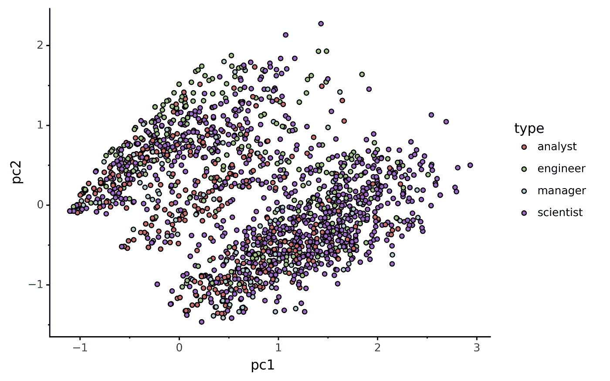
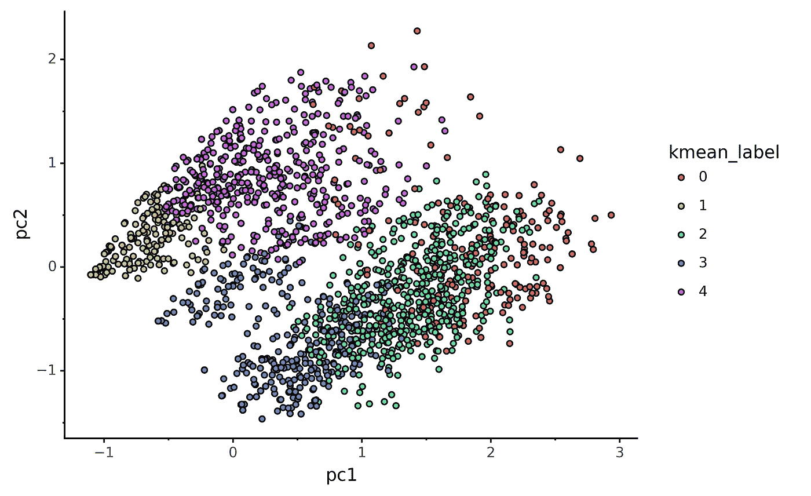
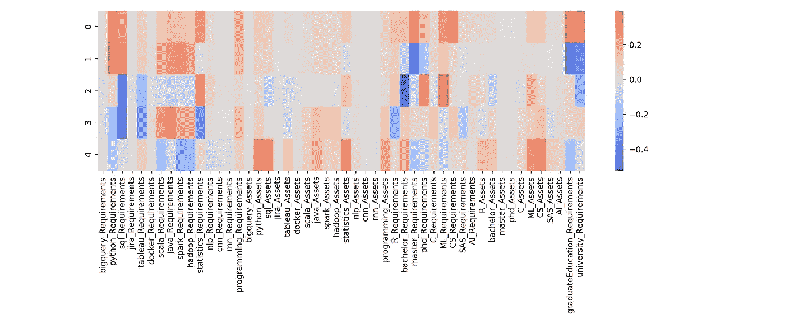
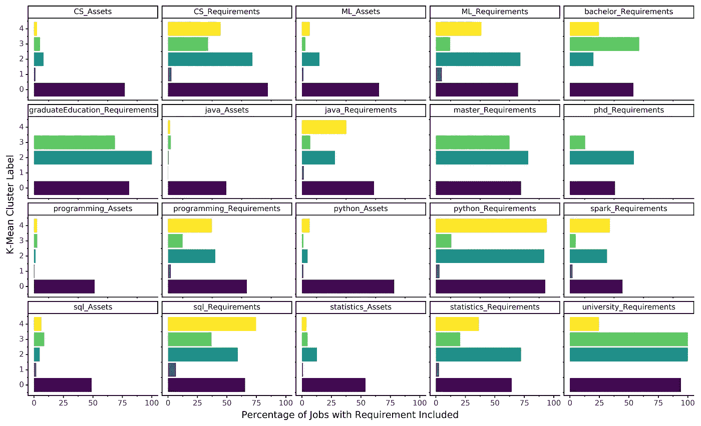
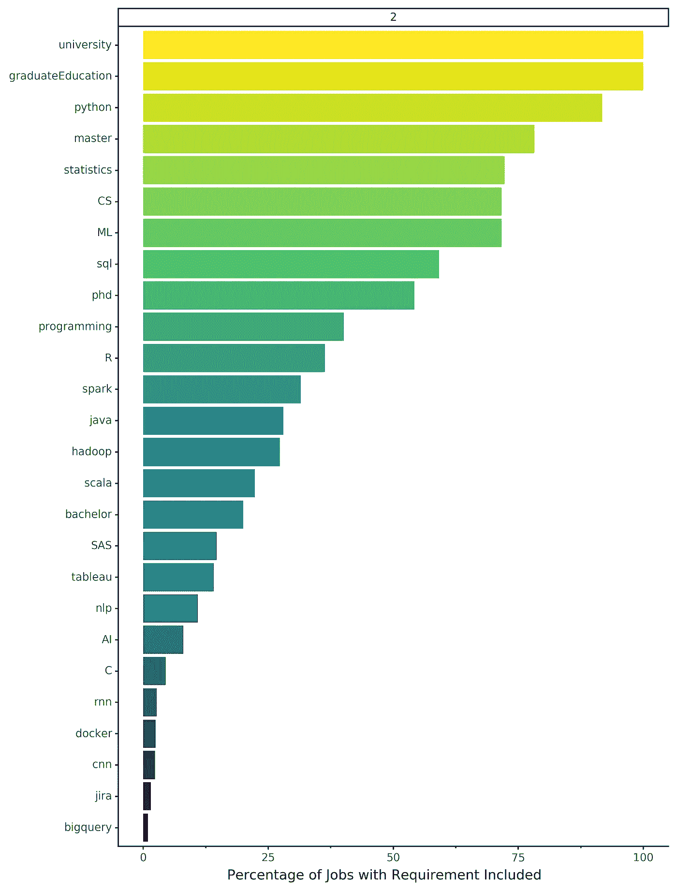
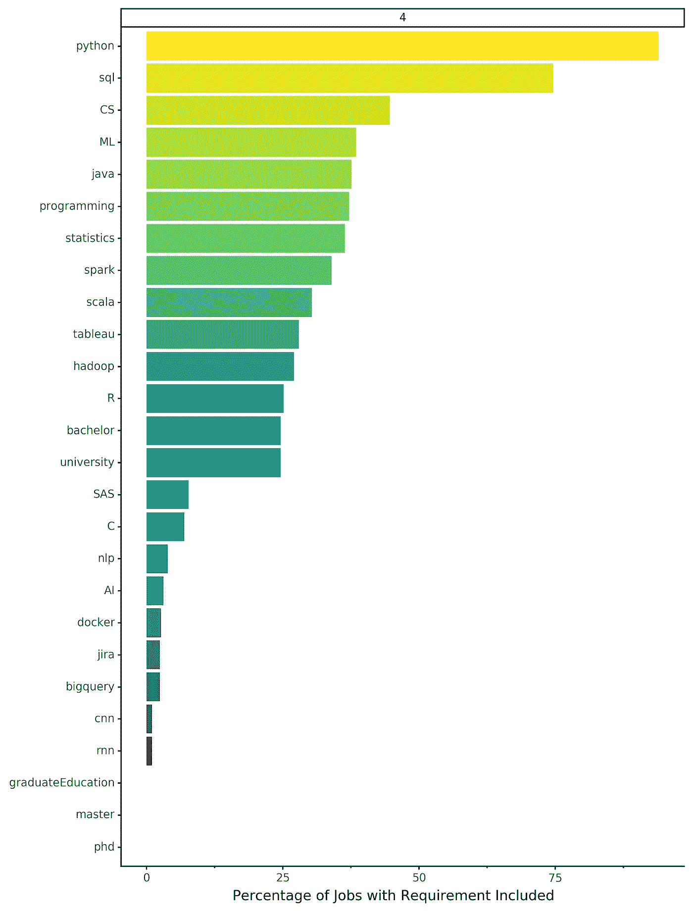
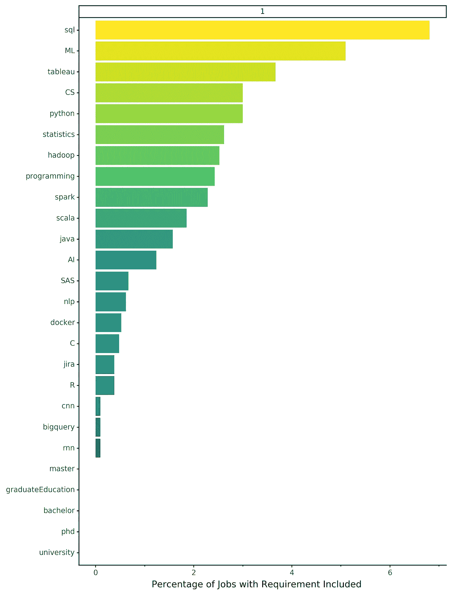

# 我们可以基于角色重新定义数据科学头衔吗？

> 原文：<https://towardsdatascience.com/can-we-redefine-data-science-titles-based-on-roles-6a2c321201c7?source=collection_archive---------23----------------------->

## 让我们来看看工作描述是否准确到他们描述的标题。

我意识到我已经做了一部分艰苦的工作，为之前的一篇文章扩展数据。我通过收集北美各个城市的数据科学帖子来扩展这一点。我想专注于工作描述，给出的职位名称，以及描述是否与名称相符。

在这里，我将应用一些技巧来更好地区分这些位置。首先，我从招聘信息中提取数据，并提取我认为相关的关键数据科学术语的存在或缺失。我把它们归类为职位的“要求”或“资产”(或“最好拥有”)。

根据职位是否包含“分析师”、“科学家”、“工程师”或“经理”等关键词，所有职位都被分配了“工作类型”。我从这些开始，因为这些的一些版本通常被接受为数据科学工作的“类型”[那里](https://blog.udacity.com/2018/01/4-types-data-science-jobs.html)。我从大约 6000 个职位发布开始，过滤掉了大约 1000 个职位，我无法将它们归类为这些“类型”(例如“劳动力规划副总裁”或没有给出职位名称的职位)。

对于这个数据集，我们有 50 个维度的技能、编程语言和软件知识，这些都是公司正在寻找的“需求”或“资产”。我用最大似然估计器进行了第一次主成分分析，以确定要识别的成分数量，并丢弃了解释方差小于 5%的任何成分，留下了 5 个有意义的成分。然后，我用 5 种成分重新运行 PCA，结果如下，按描述的职位类型进行着色:

这是一个相当大的混乱，因为工作类型没有给出数据分布之间的清晰描述。因此，我运行了一个包含 5 个聚类的 k 均值聚类。然后，我重新制作了上面的图，将颜色从*描述的*位置类型更改为 k 均值标签*标识的*簇。

主成分分析，工作公告上有 5 个成分，用 k 均值识别标签着色。

仍然有一些重叠，特别是在聚类 0 和 2 中，并且在一些聚类中仍然有一些大的分布，但是这些 k 均值确定的标签似乎比标题更好地描述了位置中的方差。

**但是这些 k 均值标签是什么意思呢？**

就其本身而言，除了他们已经识别和分类了不同的集群之外，他们实际上没有任何意义。因此，让我们来关注一下这些集群在不同的必需技能和属性方面的最大差异。对于下面的热图，我们希望将重点放在最深的颜色(最深的红色和蓝色)上，因为这些是解释该集群最大差异的技能。此外，沿着“列”阅读图表，我们可以看到哪些属性导致了个集群之间的最大差异*，例如 python_requirements 在大多数集群之间存在差异，或者 graduateEducation_requirements 在集群 0 和 1 之间以及这些集群和其余集群之间存在较大差异。*

每个聚类中每项技能的 PCA 贡献热图。

接下来，我们转向这些技能在不同集群的招聘信息中出现的频率。首先，我们将那些 K-means 标记的聚类之间的差异大于 40%的聚类进行子集化，以确定该技能或属性是否是必需的。集群 2 通常是最高的，或者列出了许多其他帖子没有列出的需求/资产。其他主要差异出现在集群 1 和集群 4 对大学教育的重视程度较低(注意“大学”、“硕士”和“博士”面板)。您还可以看到集群 0、2 和 4 中对一些机器学习的强调(例如 python、机器学习和 spark)。

分类中最小出现次数和最大出现次数之间的差异大于 40%的作业属性。

如果我们缩小到所有要求，我们再次看到集群 2 非常重视教育，100%的职位要求研究生教育，超过 50%的职位要求博士学位。这也有一些相关的关键字，这将符合我们对这一群的理解，即具有像计算机科学和统计这样的关键字的高学历(例如，如“计算机科学或统计的博士或硕士”)

第 2 组不同技能的重要性，其中“教育”要求排在首位。

**但是这些集群有意义吗？**从第四个集群的工作要求来看，他们几乎同样可能包括 Hadoop 和 Tableau。这些似乎是数据工程师的数据科学工作与使用仪表板和可视化的更多分析角色的不同领域。SQL 是这个角色的第二个最常见的需求，这可以从这些角色的两个方面得到证明。

另一个确定的集群是在给定要求很少的职位周围。我对此的解释是，招聘启事描述了职位，但没有列出许多要求或资产，这些被聚集在一起作为某种“空”职位。这对我们理解这些立场并没有太大的帮助。

具有很少必需技能的群组 1(注意 x 轴刻度)。

如果我们回到兰迪提出的更好的角色定义的“乐观结果”，我不认为我们达到了这个目标。由于数据科学职位通常以洗衣单的形式书写，或者寻找他们的[数据科学家独角兽](/the-data-scientist-unicorn-8c86cb712dde?gi=eef59c5f4116)，这些数据很可能是复杂和嘈杂的。围绕这一点的另一个相关警告是，这些差异是否实际上归因于角色的差异，或者是否一些公司或个人以不同的方式编写描述。有些人可能会写一些关于上市要求和资产的帖子，而其他人可能只是笼统地描述职位，而没有我在这里搜索的关键词。因此，虽然如果我们能够更清楚地了解不同的数据科学职位及其要求和角色会很好，但我无法通过这种分析达到目的。

如果你有如何改善这个问题或其他问题的想法，请随时联系 [LinkedIn](https://www.linkedin.com/in/timcashion/) 或 [Twitter](https://twitter.com/FishingForFeed) 。

**注释**

1.  对于我在本次分析中使用的更新代码，请查看我的 [Github 库](https://github.com/timcashion/DS_Jobs_Vancouver)。
2.  在做了一些专注于我现在的城市温哥华的早期工作后，我想这样做。
3.  其他人在整理这些角色时比我幸运:[https://towards data science . com/what-type-of-data-scientist-are-84c 3c 2 b 9 fc 16](/what-type-of-data-scientist-are-you-84c3c2b9fc16)。成功的差异可能归因于搜索更具体的职位(例如，“数据工程师”、“机器学习工程师”)和更小的数据集。
4.  技能/资产完整列表:" bigquery "、" python "、" sql "、" jira "、" tableau "、" docker "、" scala "、" java "、" spark "、" hadoop "、"统计学"、" nlp "、" cnn "、" rnn "、"编程"、" R "、"学士"、"硕士"、"博士"、" C "、"机器学习"、" cs "、" SAS "、" AI "。