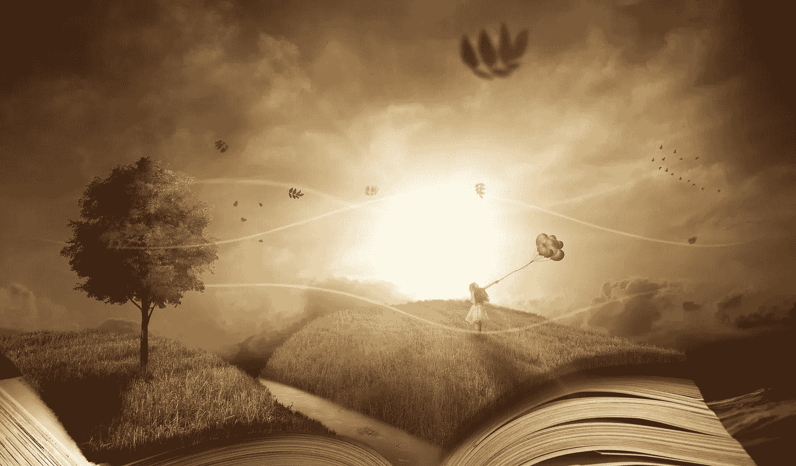
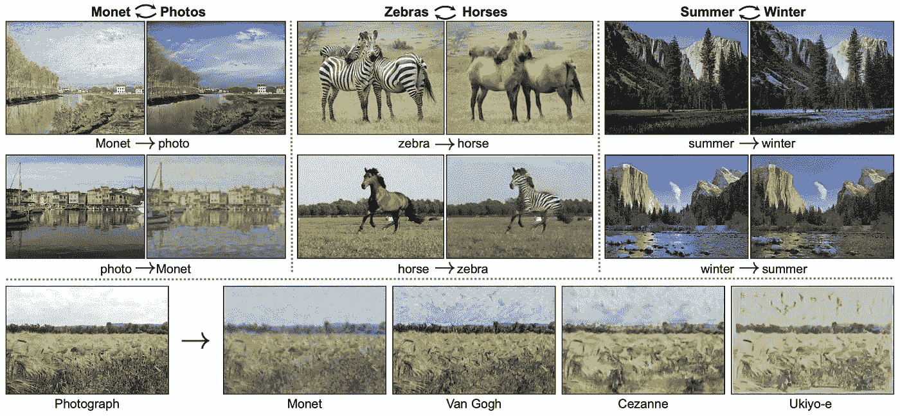

# 使用 GANs 超越生成艺术？

> 原文：<https://towardsdatascience.com/can-we-use-gans-beyond-generating-art-c550cce0d467?source=collection_archive---------33----------------------->

## gan 相对较新，许多研究方向仍然开放。

图片由[com break](https://pixabay.com/users/Comfreak-51581/?utm_source=link-attribution&utm_medium=referral&utm_campaign=image&utm_content=2929646)来自 [Pixabay](https://pixabay.com/?utm_source=link-attribution&utm_medium=referral&utm_campaign=image&utm_content=2929646)

生成对抗网络(GANs)取得了实质性的进展，它可以合成近乎完美的人脸[ [1](https://arxiv.org/abs/1912.04958) ]，恢复旧视频[ [2](http://iizuka.cs.tsukuba.ac.jp/projects/remastering/en/index.html) ]的颜色和质量，并生成逼真的 [Deepfake](/realistic-deepfakes-colab-e13ef7b2bba7?source=friends_link&sk=a9d432c8b01ae6fd8ed57b501886ce63) 视频[ [3](https://aliaksandrsiarohin.github.io/first-order-model-website/) ]。

GANs 主要关注样本生成。GANs 的基本思想包括一个生成器和一个鉴别器。发生器产生来自训练数据的样本，而鉴别器判断产生的样本以确定它们是真的还是假的。一个例子是:一个伪造者试图学会制造与真钱不同的货币，而警察则学会了捕捉假币。

由于 GAN 是最成功的，并且主要应用于图像合成，我们能在艺术创作之外使用 GAN 吗？

# 图像到图像的翻译

类似于通过学习句子/短语对映射将源语言翻译成目标语言的机器翻译，图像到图像翻译学习输入图像和输出图像对之间的映射。

自动将图像从一张“翻译”到另一张[ [纸张](https://arxiv.org/pdf/1703.10593.pdf)

在 Berkeley [ [4](https://arxiv.org/pdf/1703.10593.pdf) ]完成的一项研究中，他们的算法学习将一幅图像从一幅图像翻译成另一幅图像。比如从斑马到马，从夏天到冬天。在他们的工作中，他们提出了一种使用对抗损失从配对样本的缺乏中学习的方法，推动了无监督学习的边界。一定要看看他们的[网站](https://junyanz.github.io/CycleGAN/)，上面有各种使用他们作品的创意(比如[把堡垒之夜变成 PUBG](/turning-fortnite-into-pubg-with-deep-learning-cyclegan-2f9d339dcdb0) )应用。

# 文本生成

文本的性质使得 GAN 很难生成离散记号的序列。因为(来自生成模型的)离散输出使得难以将梯度更新从判别模型传递到生成模型。

然而，于等人[等人](https://arxiv.org/pdf/1609.05473.pdf)却提出了诗体生成汉诗的命题。使用 [BLEU score](https://en.wikipedia.org/wiki/BLEU) ，一种评估文本质量的指标，SeqGAN 生成了与人类诗歌创作相当的文本。此外，他们将真实的和生成的中国诗歌混合在一起，并邀请中国诗歌专家来判断每首诗歌是人类还是机器创作的。评委们无法区分真正的诗歌和机器生成的诗歌。

# 生成网络图

生成合成但真实的图形的能力对于异常检测很重要，异常检测就是将异常网络与正常网络区分开。图形生成技术已经应用于物理学、数学、社会学、生物学和计算机科学。

Bojchevski 等人[ [6](https://arxiv.org/pdf/1803.00816.pdf) ]提出了 NetGAN，它生成的图形展示了使用 Wasserstein GAN 目标训练的众所周知的网络模式。像典型的 GAN 一样，NetGAN 的生成器学习生成真实图形中似乎合理的随机行走，而鉴别器将图形与原始图形区分开来。

# 音频合成

合成音频已经应用于音乐和电影的创造性声音设计中。这些声音剪辑存储在大型音效数据库中，但有时库中可能不存在理想的音效。如果我们可以通过微调一些输入参数来生成砾石路或沙地上脚步声的声音效果，会怎么样？

加州大学圣地亚哥分校推出了 WaveGAN [ [7](https://arxiv.org/pdf/1802.04208.pdf) ]，学习合成音频以产生声音效果。它已经学会了产生踢鼓和小军鼓的声音效果，它也能产生各种不同的鸟叫。对于钢琴声音生成，它捕捉各种调号和节奏模式。他们实验的声音样本可以在他们的[网站](https://chrisdonahue.com/wavegan_examples/)上找到。

于等人[ [5](https://arxiv.org/pdf/1609.05473.pdf) ]也使用 SeqGAN 通过训练一组 midi 文件格式的民间曲调来生成音乐。在他们的工作中，他们将 midi 文件转换成从 1 到 88 的数字序列，以代表与钢琴上的键相对应的 88 个音高。他们的方法优于现有的算法，但他们没有提供人类判断的分析。

> GANs 是一种相对较新的方法，许多研究方向仍然开放。伊恩·古德菲勒

[1]t . Karras，Laine，s .，Aittala，m .，Hellsten，j .，Lehtinen，j .和 t . Aila，2019 年。stylegan 图像质量的分析与改进。 *arXiv 预印本 arXiv:1912.04958* 。[[https://arxiv.org/abs/1912.04958](https://arxiv.org/abs/1912.04958)

[2] Iizuka，s .和 Simo-Serra，e .，2019 年。用于综合视频增强的时间源参考注意力网络。*《美国计算机学会图形汇刊(TOG)】*， *38* (6)，第 1–13 页。[[http://iizuka . cs . Tsukuba . AC . jp/projects/remastering/en/index . html](http://iizuka.cs.tsukuba.ac.jp/projects/remastering/en/index.html)]

[3] Siarohin，a .，Lathuilière，s .，Tulyakov，s .，Ricci，e .和 Sebe，n .，2019 年。图像动画的一阶运动模型。在*神经信息处理系统的进展*(第 7135-7145 页)。[[https://aliaksandrsiarohin . github . io/first-order-model-website/](https://aliaksandrsiarohin.github.io/first-order-model-website/)]

[4]朱，J.Y .，朴，t .，伊索拉，p .和埃夫罗斯，A.A .，2017 年。使用循环一致对抗网络的不成对图像到图像翻译。IEEE 计算机视觉国际会议论文集(第 2223-2232 页)。https://arxiv.org/pdf/1703.10593.pdf

[5]俞，李，张，王伟，王，于，2017 年 2 月。Seqgan:具有策略梯度的序列生成对抗网。在第三十一届 AAAI 人工智能会议上。https://arxiv.org/pdf/1609.05473.pdf

[6] Bojchevski，a .，Shchur，o .，Zügner，d .和 Günnemann，s .，2018 年。Netgan:通过随机漫步生成图形。 *arXiv 预印本 arXiv:1803.00816* 。https://arxiv.org/pdf/1803.00816.pdf

[7]c .多纳休，j .麦考利和 m .帕克特，2018 年。对抗性音频合成。 *arXiv 预印本 arXiv:1802.04208。*[https://arxiv.org/pdf/1802.04208.pdf](https://arxiv.org/pdf/1802.04208.pdf)