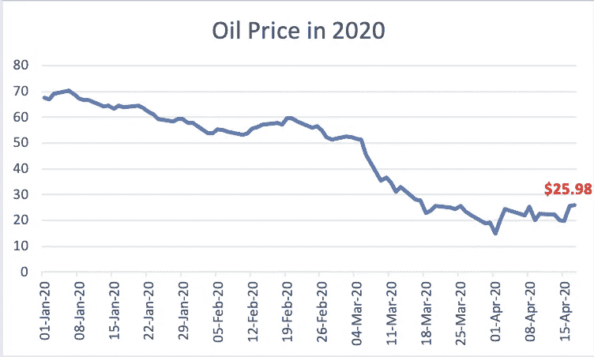
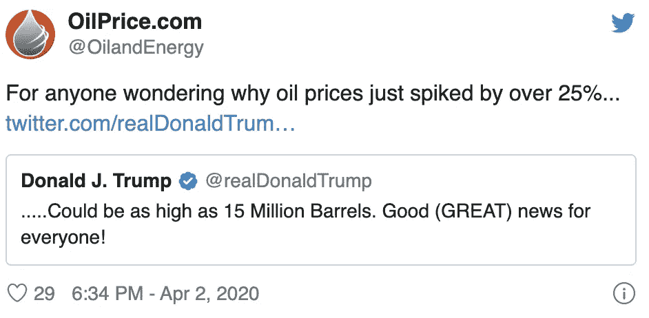
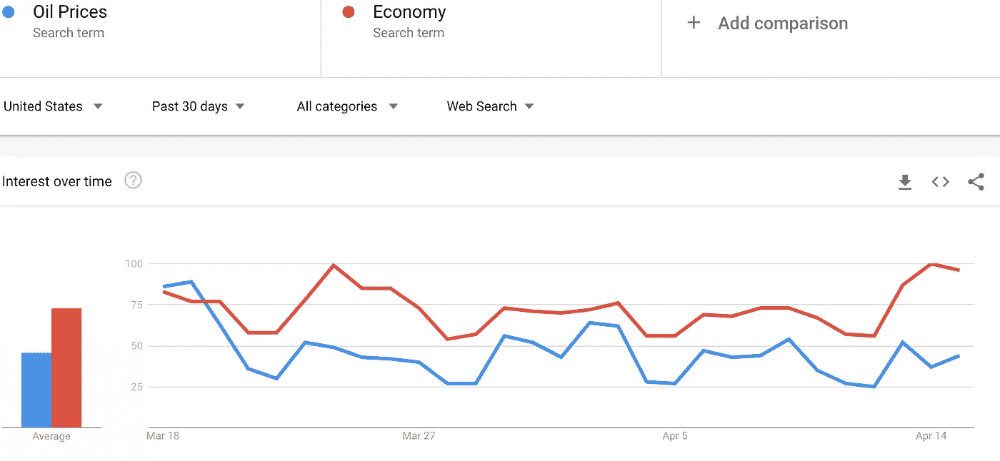
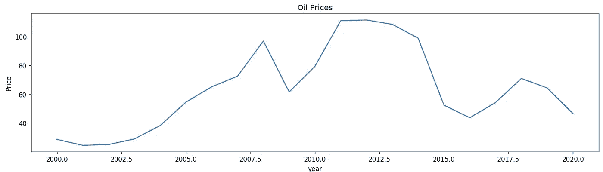
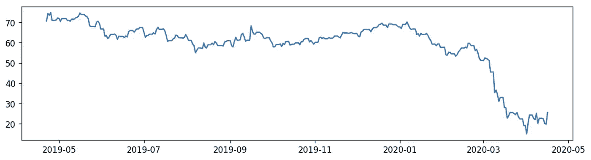
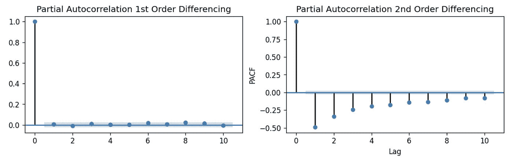
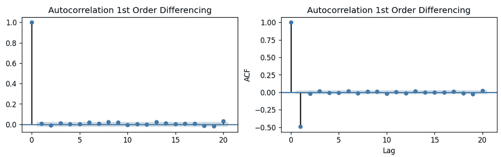
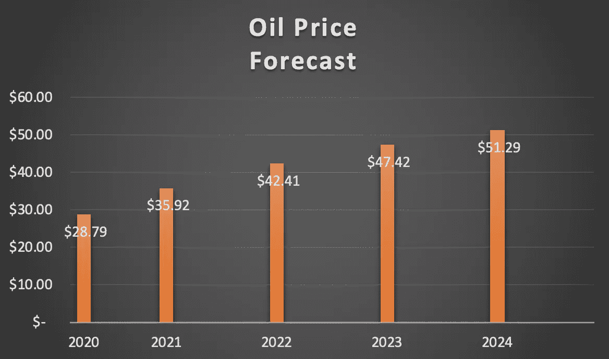
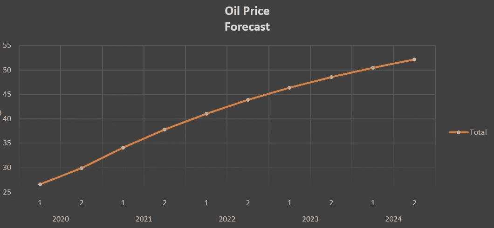

# 我们可以使用机器学习来预测 2020 年崩溃期间的油价吗？

> 原文：<https://towardsdatascience.com/can-we-use-machine-learning-to-forecast-oil-prices-during-the-2020-collapse-4873f03336e9?source=collection_archive---------26----------------------->

## 利用机器学习的蛮力预测新冠肺炎疫情爆发后油价的回升

照片由 [Unsplash](https://unsplash.com?utm_source=medium&utm_medium=referral) 上的 [Zbynek Burival](https://unsplash.com/@zburival?utm_source=medium&utm_medium=referral) 拍摄

# 敏感商品

在 [Unsplash](https://unsplash.com?utm_source=medium&utm_medium=referral) 上[科普高清](https://unsplash.com/@scienceinhd?utm_source=medium&utm_medium=referral)照片

## 石油定价基础

众所周知，石油是一种大宗商品，在一次市场事件后，其走势会完全相反。

这是因为油价的基本面很少基于实时数据，相反，它是由外部性驱动的，这使得我们预测油价的努力更加具有挑战性。

# 2020 年:跌宕起伏的一年

## 新冠肺炎（新型冠状病毒肺炎）

2020 年，新冠肺炎的影响提醒人们，相对于外部冲击，油价是多么不可预测和敏感。

## 2020 年初

今年年初，由于石油输出国组织主导的减产、美国对多个主要石油出口国的制裁以及利比亚紧张局势升级，油价飙升。

## 2020 年中期

然而，当全球经济的健康状况在新冠肺炎之后被投入投机时，所有这一切都发生了重大转折，更糟糕的是，行业专家认为现在“**几乎不可能**”充满信心地预测石油价格。

更令人困惑的是，几十年来，总统们一直在宣扬廉价石油的好处，包括特朗普总统本人就在一个月前。

唐纳德·特朗普在推特上称赞低油价——2020 年 3 月 9 日

唐纳德·特朗普称赞高油价——2020 年 4 月 2 日

然而，特朗普现在正在尽一切努力推动价格回升，包括发布一条推文，导致油价暂时飙升 25%——有史以来最大的单日涨幅。

## 石油输出国组织交易—2020 年 4 月 9 日

具有历史意义的石油输出国组织减产 10%的协议，只是起到了遏制仍在对市场造成的损害的作用。面对不断升级的财务损失，油气生产商仍在削减股息和资本支出，以保护自己的资产负债表。

# 为什么要关心油价？

我们创建这个模型的原因是因为经济的**健康状况**与石油价格的联系，每当石油价格稍微偏离正常水平，经济就会受到剧烈影响，这从谷歌趋势上的平行运动可以明显看出。

(紧密交织的经济和油价——谷歌趋势，2020 年)

## 时间序列分析

时间序列分析是一种洞察某种商品如何随时间变化的方式，然而，我们需要更进一步，使用机器学习的 **ARIMA** 创建一个预测模型。

## 什么是 ARIMA？

**自回归综合移动平均**模型是一种回归分析形式，通过检查序列中的值与实际值之间的差异来预测未来的变化。

这是实施这一算法的最佳时机，因为鉴于石油输出国组织交易的新近性，我们预计短期内不会再有任何重大的历史性交易。

# 预报期

## 时间框架 1:2020 年 4 月 20 日–2020 年 10 月 1 日

(新冠肺炎统计——谷歌新闻 2020 年 4 月 18 日)

我们预测的第一个时间段是从 2020 年 4 月 20 日**到 2020 年 10 月 1 日**，几乎占全年的一半。

这背后的基本原理是因为我们尚未达到新冠肺炎的全球峰值，这给了我们一个合理的保证，即根据疫情之前的时间表，完全自由的新冠肺炎市场不可能在仅仅 *5 个半月*内存在，这使我们的预测更加准确。

## 时间框架 2:2020 年 4 月 20 日–2025 年 1 月 1 日

这个时间框架将作为我们对预计**复苏时间**的预测，直到**油价能够回到 2020 年崩盘前的 50 多美元的高位**。

Erik Mclean 在 [Unsplash](https://unsplash.com?utm_source=medium&utm_medium=referral) 上拍摄的照片

## 资料组

我们的数据集来源于**美国能源信息署**，包含从 1987 年 5 月 17 日**—**2020 年 4 月 17 日**起 **37 年**的**每日历史布伦特油价**，这意味着它包括了最近的石油输出国组织交易后一周的油价走势。**

## **培养**

**在对数据进行预处理后，我们发现从 2000 年开始的数据训练显示了更高的准确性。**

****

**训练数据集—石油价格[2000–2020]**

> **模型的统计微调**

## **ARIMA 的差异**

**差异的整个要点是使时间序列平稳，并且测量今天和昨天之间的差异，直到我们达到统计特性随时间恒定的点。**

## **测试我们是否有一个平稳的时间序列**

**我们运行一个增强的 Dickey-Fuller，如果 p 值> 0.005，在我们的例子中为 0.297299，我们继续进行差分。**

****

**非平稳时间序列的可视化表示—石油价格[2019/05–2020/05]**

**在运行了三个测试之后，我们确信选择差值 1 的**阶的决定是最合适的。****

**此后，我们通过检查偏自相关(PACF)图来确定模型是否需要 **AR** 项，该图显示了序列与其滞后之间的相关性。**

****

**PACF:一阶和二阶微分自相关**

**然后，我们找到移动平均项 **q** 的阶，这是滞后预测的误差，通过查看 ACF 来查看需要多少 MA 项来消除平稳化序列中的任何自相关。**

****

**自相关一阶和二阶差分**

**经过测试，我们决定将 q 设置为 1，使三个参数(p，d，q)为(1，0，1)。**

# **模型预测:**

# **2020 年 4 月 20 日–2020 年 10 月 1 日预测**

****时间范围:新冠肺炎[** *未来 5.5 个月* ]的预期高峰**

> ****布伦特原油预测平均价格:27.79 美元*****

**然而，美国大选离我们的预测结束还有一个月，因此，我们决定根据大选可能给经济和油价带来的波动，再提供两种情景。**

## **通配符:德克萨斯**

****

**Matthew T Rader 在 [Unsplash](https://unsplash.com?utm_source=medium&utm_medium=referral) 上拍摄的照片**

**德克萨斯生产的石油比除沙特阿拉伯以外的任何一个石油输出国组织国家都多，但是现在它正在被廉价的石油压垮。**

## **这意味着两件事:**

1.  **特朗普需要高油价来获得德克萨斯州的选票，以获得连任**
2.  **德克萨斯州有可能在 40 多年来首次限制产量，以进一步提高油价**

**本质上，这两个原因都给了我们足够的理由来推测，在可预见的未来，油价将会出现更多的飙升，这意味着我们的预测可能会出现比我们预期更多的起伏，然而，根据目前的情况，它可能会倾向于乐观的估计，即使只是暂时的。**

> ****保守估计——布伦特原油平均价格:23.62 美元****
> 
> ****乐观估计——布伦特原油平均价格:34.74 美元*****

# **2020–2024 年预测**

**不管油价飙升与否，我们的模型在预测总体走势方面做得很好，为我们提供了油价复苏预期时间框架的良好指标。**

****

**ARIMA 预测—油价[2020–2024]**

****

**ARIMA 预测—每期油价[1: Q1/Q2 对 2:第三季度/第四季度]**

# **结果分类**

**石油价格过去有一些可预测的季节性波动，在春天有一个高峰，然后在秋天和冬天下降。**

## **然而，有 4 个主要因素可能导致未来油价进一步偏离我们的预测:**

## **1)全球需求放缓**

**2020 年 4 月，全球石油需求比 2019 年的年平均水平低约 1700 万桶，这是有史以来的最大降幅。**

## **2)美国石油产量上升**

**2018 年，美国成为世界上最大的石油生产国，一年后，自 1948 年以来，美国出口的石油首次超过进口。**

## **3)石油输出国组织的影响力减弱**

**石油输出国组织没有削减足够的产量来支撑价格。**

## **4)美元价值上升**

**自 2014 年以来，外汇交易员一直在夸大美元的价值，石油交易以美元支付，这意味着美元上涨 25%抵消了油价下跌 25%，全球经济的不确定性使美元保持强势，这是我们的方向。**

# **恢复时间**

****

**[M. B. M.](https://unsplash.com/@m_b_m?utm_source=medium&utm_medium=referral) 在 [Unsplash](https://unsplash.com?utm_source=medium&utm_medium=referral) 上拍摄的照片**

## **总之，我们认为，根据外部性，石油价格将需要大约 4 年时间才能恢复到 2020 年崩盘前的水平。**

# **商务化人际关系网**

** [## 诺亚·穆赫塔尔——分析师——BDC | LinkedIn

### 未来的分析硕士毕业于麦吉尔大学的商业分析专业从…

www.linkedin.com](https://www.linkedin.com/in/nmukhtar/) 

# GitHub 代码

 [## 石油价格 2020

### 预测油价的机器学习算法 ARIMA-Noah MMA/Oil Prices 2020

github.com](https://github.com/NoahMMA/oilprices2020)**