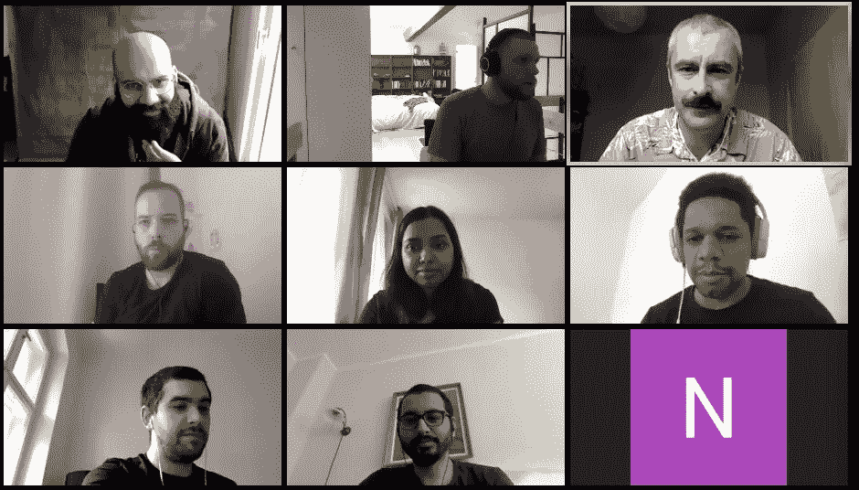
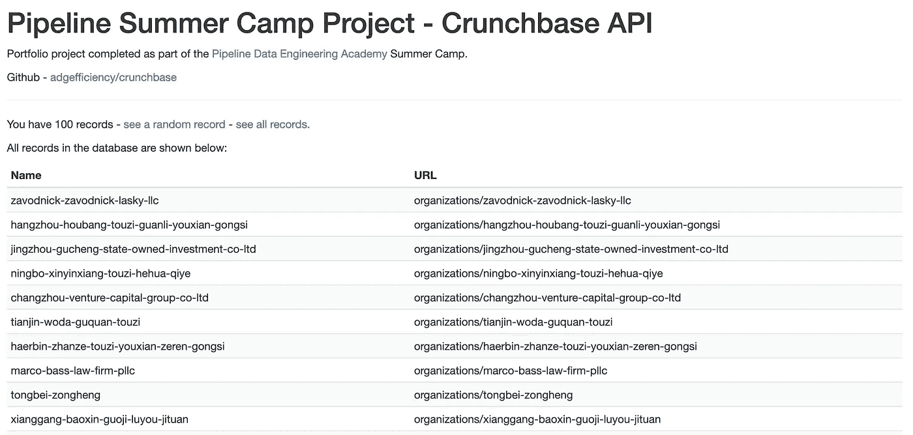
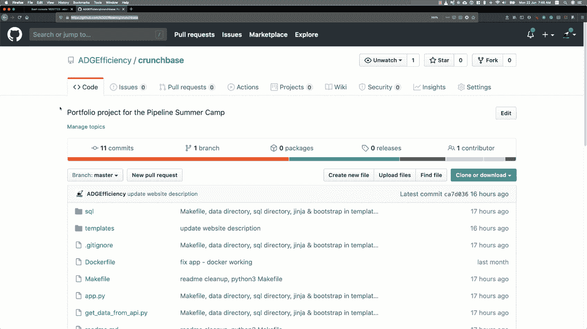

# 你能在一周内建立一个数据工程产品吗？

> 原文：<https://towardsdatascience.com/can-you-build-a-data-engineering-product-in-a-week-fb532dd7bdb4?source=collection_archive---------52----------------------->

## 用管道预热数据工程

2020 年 5 月，我参加了 Pipeline 夏令营，这是柏林数据工程训练营 Pipeline 数据工程学院的首次活动。

我写这篇文章是为了感谢[彼得](https://www.linkedin.com/in/peter-fabian-000/) & [丹尼尔](https://www.linkedin.com/in/soobrosa/)(Pipeline 的创始人)。正如你将在下面看到的，我从他们的夏令营中获益匪浅。我希望这篇文章能帮助其他人从彼得·丹尼尔试图带给世界的价值中受益。

我在[数据科学静修](https://www.datascienceretreat.com/)时认识彼得，在那里他将商业头脑与对学生成功的真诚关怀结合在一起。我只在网上见过 Daniel，从夏令营中可以明显看出，他的技术专长、经验和教学方法的结合对新的数据工程师非常有价值。

这是一个令人兴奋的团队，我期待着看到 Pipeline 在柏林立足——把我当成一个粉丝吧。

# 夏令营是什么？

夏令营是为期一周的数据工程课程，于 2020 年 5 月在网上举行，当时世界上大部分人口都处于封锁状态。

全球都感受到了日冕的影响——然而在这场危机中也有机会。管道已经表明，他们能够在危机中看到机遇。

在线教学并不容易——在[数据科学务虚会]的最后几个月里，我们一直在为学校制定冠状病毒战略，包括如何在线授课。课程内容(主要是幻灯片讲座)讲授得很有技巧，技术上也很相关。学生们都觉得提问很舒服，这是一堂好课的标志。

该课程是精益方法的一个很好的例子——有大量客户反馈的最小可行产品。很高兴成为其中的一员，我期待着看到 Pipeline 扩展他们在数据工程教育方面的服务。

这门课程是通过 Zoom & Slack 远程提供的——大约一半的教学时间，一半的项目工作。课程的目标很简单——在一周内构建一个数据工程产品。

# 你在一周内建立了一个数据工程产品？

是啊！在这一周，我们有一个简单的数据产品在本地运行，构建自:

*   使用 Python 进行 API 数据访问
*   SQLite
*   显示数据的 Flask web 服务器
*   Docker(因为为什么不呢？)

后来，技术债务得到偿还，应用程序得以部署:

*   Makefile 来简化常见操作
*   Jinja &前端的引导模板

[你可以在 PythonAnywhere](http://adamg33.pythonanywhere.com/) 上看到部署的应用——你也可以[在 GitHub](https://github.com/ADGEfficiency/crunchbase) 上看到源码。你可以看到我在下面的 PythonAnywhere 上部署应用程序:

作为一个教过一段时间数据科学的人，印象最深的是堆栈的简单性。在教学时，很容易让学生的事情变得复杂，或者教授复杂的工具，这些工具带来的困惑多于帮助。

不能低估带着工作产品五天后离开的力量。能够看到您的数据并与之交互的价值是巨大的，对于发现您的数据管道的问题并向客户(或雇主)炫耀来说！).

SQLite 的使用对我来说是一个亮点——我不知道它有多广泛(它在`/usr/bin/sqlite3`就可以使用，或者在许多手机上运行)。没有设置/安装成本的技术是伟大的。SQLite 并不是解决所有问题的最佳数据库选择，但是很高兴知道它是新项目的合理选择。

另一个是 Makefiles 对于构建 Dag 的有用性。我很熟悉 Airflow & Tensorflow 中 DAGs 的概念——很高兴知道我可以使用`make` & `Makefile`在语义上做类似的事情。

课程中还教授了一些其他工具，包括 Datasette 和 GitHub Actions——在我的`TODO`上玩这些工具。

我也能够在其他项目中运用经验和知识，比如[气候新闻数据库](https://github.com/ADGEfficiency/climate-news-db)。它还为我提供了一个堆栈(Python、Flask、SQLite、PythonAnywhere、Jinja & Bootstrap ),支持全堆栈、敏捷数据科学。

# 一周内你能学到什么？

除了项目工作，还有更传统的教学内容。技术内容是自以为是的(没有宗教色彩)，充满了对数据工程的有用观点:

*   获取数据
*   将事物联系在一起
*   `get / load, store, deploy`

一个特别有用的见解是丰富数据，使其对业务有价值—包括一个将 UNIX 时间戳转换为具有语义意义和价值的数据的出色示例:

*   UNIX 纪元时间(626629357)
*   日期时间(1989 年 11 月 9 日)
*   星期四(可计算)
*   柏林墙的倒塌(可以用强化器解决)

他们还强调要务实，避免绝对化，并意识到没有放之四海而皆准的解决方案:

*   云上没有好地方，都有不好的地方，最好的策略是做好准备！
*   数据的三种用途

1.  分析(将会发生什么)
2.  法医(发生了什么)
3.  监控(发生了什么)

*   9/10 的问题发生在外部数据上
*   过滤然后连接
*   要有防御性
*   宁可可以理解
*   考虑如何在磁盘上构建数据时分离关注点/依赖性

# 接下来去哪里

如果你正在考虑成为一名数据专家(尤其是作为一名数据工程师)，那么[考虑 Pipeline 数据工程学院](https://www.dataengineering.academy/)的数据工程。

感谢阅读！

*原载于 2020 年 6 月 21 日*[*【https://adgefficiency.com】*](https://adgefficiency.com/pipeline-data-engineering-academy/)*。*