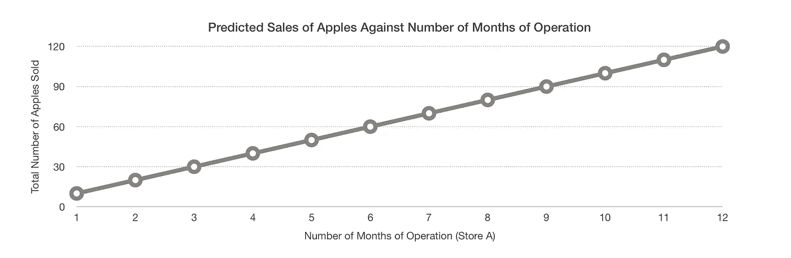

# 你能预测冠状病毒如何传播吗？

> 原文：<https://towardsdatascience.com/can-you-predict-how-the-coronavirus-spreads-43b3631a1b1b?source=collection_archive---------8----------------------->

## 流行病中的数据、人工智能和预测模型

截至 2020 年 3 月 11 日，世界卫生组织(世卫组织)已经正式宣布冠状病毒现在是疫情。世界各地的人们都在争先恐后地遏制这种病毒，没有人真正知道未来会怎样。已经发表了许多文章推测这种疾病的发展，一些科学家[声称世界范围的高峰将在明年冬天](https://news.sky.com/story/coronavirus-worldwide-peak-will-come-next-winter-scientific-model-predicts-11954441)到来。无论是预测增长率还是试图进行先发制人的检测，许多人都试图使用我们称之为模型的方法来预测未来。

这些模型有多可靠？为了回答这个问题，我们需要了解它们是如何产生的。

# 创建模型

数学模型本质上有助于说明因果关系。模型有两个组成部分:自变量和因变量。

这里，我们用一个非常简单的数学模型来说明我的观点。线性回归模型就足够了，因为我们可以很容易地通过 Excel 甚至手工绘制它。不需要复杂的软件，理解起来很直观。下面是我绘制的图表:

资料来源:杨春伟，基于自己生成的图解(图 1)

假设我是一个小水果店的老板，很好奇评价苹果的销售业绩。作为一个假设，我预测我的苹果总销售额(y 轴)将与我的商店运营的月数(x 轴)成正比。数学上，这条线形成一个 y = 10x 的等式。

如此完美的数据仅仅是一个幻想。现实中，我们通常会得到这样的东西:

资料来源:杨春伟，下图 2 的数据点(表 1)

然后绘制一条线性回归线(浅灰色)来估计苹果的未来销量。

资料来源:杨春伟，基于表 1 的回归图(图 2)

这里，我们可以看到最佳拟合线非常接近我们的假设，方程为 y = 10.2x - 0.6667。R 值，也称为决定系数，也非常接近 1，这意味着我们记录的数据几乎完全符合线性趋势。

在这种情况下，为该模型提供的独立变量是商店 A 的运营月数——实际上是时间。这个自变量(因)影响因变量——卖出的苹果总数(果)。每当 *x* 发生变化， *y* 也随之变化，这就是这里的因果关系。

然而，我们必须警惕这么快就下结论。需要注意的是，通常这种模型仅仅显示**相关性和** **非因果关系。**

# 数据不足

## 相关性与因果性

在统计学中，有一句名言:“相关性并不意味着因果关系”。它指的是无法仅仅根据观察到的两个变量之间的关联或相关性来合理地推断出它们之间的因果关系。

想象一下，有数据显示，每当冰淇淋销量增加，就有更多的孩子出生在这个世界上。这种相关性可能会引起一些人的惊讶，但简单地将这两者联系起来作为因果关系是很不公平的。

与任何形式的建模一样，存在确认偏差的危险和不完善信息的负担。这就是为什么科学家和数学家在选择正确的数据时要小心谨慎，以确保他们的模型是可靠的。

## 对病毒理解的局限性

对于任何模型，总要做出某些假设。当我今天写这篇文章的时候，我们仍然相信再感染的可能性接近于零。如果这个假设不成立，将会对我们的模型产生更大的影响，使现有的模型变得不准确。

# 预测疫情

对于这样复杂的情况，自变量肯定不止一个。除了时间和空间，人们可能会关注其他变量，如人口密度、互动概率等。我们的预测目标也因人而异。一些人可能想知道病毒可能会在哪里传播，而另一些人可能只是关心它传播的速度。

## 基于爆发分析的模型

在新闻中，我们最常看到的话题是:

“病例数什么时候会达到峰值？”

“什么时候结束？”

“随着时间的推移，它扩散了多少？”

因此，数学模型通常显示相对于时间的病例总数。在传播的早期阶段，我们通常看到的是这种具有指数增长特征的曲线，就像意大利的情况一样:

资料来源:杨春伟，数据摘自[https://www.worldometers.info/coronavirus/country/italy/](https://www.worldometers.info/coronavirus/country/italy/)

然而，由于一个非常实际的原因，在现实生活中真正的指数增长是不可能的。存在一个理论终点，即所有人群成员都被感染的情况。随着越来越多的人被感染，考虑到固定人口的限制，他们可以传播的人数会减少。因此，冠状病毒减少的速率并因此不符合指数增长的条件。

最终，当感染人数达到人口极限时，或者当疾病开始得到控制时，如中国的情况，病例总数将达到峰值并趋于平稳。

资料来源:杨春伟，数据摘自 https://www.worldometers.info/coronavirus/country/china/

乐观地说，我们会希望尽快到达拐点。这就是病例数增长率开始放缓的地方，[缓和曲线，使其“变平”](https://www.cbsnews.com/news/flattening-the-curve-coronavirus-graph-social-distancing-self-quarantine-no-large-events-covid-19/)。

基于现有病例数量来推断数据的数学模型仅仅是作为一种估计来衡量问题将变得有多严重。这远远不是最准确的模型，任何准确的预测模型都不可能建立在大约两个月的数据上。

## 基于非结构化数据的模型

最近，一家加拿大人工智能公司 BlueDot 因比其他人更早预测疾病爆发而成为新闻焦点。它的独特之处在于，它接受各种语言的新故事、航班信息以及更多数据。只有人工智能能够获取这种非结构化的信息，并使之有意义。

AI 的力量在于合成的力量。与人类相比，计算机在记忆和处理大量信息的能力方面都要优越得多。

虽然我们可以理解人工智能提供的结论，但这个过程对人们来说通常是一个黑箱。这有时可能是人工智能的一个不良副作用，因为理解导致某种结论的思维过程和推理是至关重要的。如果不是，我们只是盲目的追随者，与让算命师决定命运的人没有什么不同。

好的人工智能系统允许你对它的预测做出自己的判断。

# 结束

随着技术的出现，我们有幸拥有更多的工具来利用和补充我们的决策。然而，我们不应该完全依赖模型来代表我们做出判断。技术应该补充我们，而不是取代我们。

保持安全，保持健康，让我们都尽自己的一份力量来阻止疾病的传播。