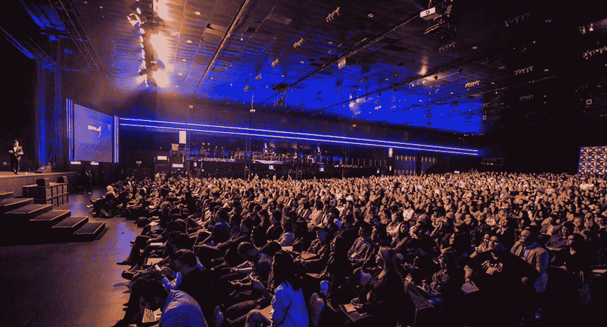
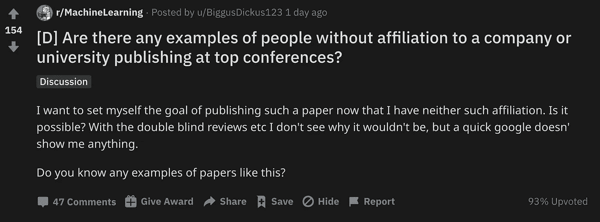

# 可以在机器学习大会上发表论文吗？

> 原文：<https://towardsdatascience.com/can-you-publish-a-paper-at-machine-learning-conference-656053f8f312?source=collection_archive---------25----------------------->

## 在没有公司或大学隶属关系的情况下，有可能在机器学习会议上发表研究论文吗？



塞缪尔·佩雷拉在 [Unsplash](https://unsplash.com?utm_source=medium&utm_medium=referral) 上拍摄的照片

一位 Redditor 最近问**是否有可能在顶级机器学习会议上发表不隶属于公司或大学的论文？**原发帖人(OP)想发表一篇科学论文，但不知道是否可能。



[原 Reddit 讨论](https://www.reddit.com/r/MachineLearning/comments/ik3kvg/d_are_there_any_examples_of_people_without/)

**这里有几个你可能会感兴趣的链接:**

```
- [Labeling and Data Engineering for Conversational AI and Analytics](https://www.humanfirst.ai/)- [Data Science for Business Leaders](https://imp.i115008.net/c/2402645/880006/11298) [Course]- [Intro to Machine Learning with PyTorch](https://imp.i115008.net/c/2402645/788201/11298) [Course]- [Become a Growth Product Manager](https://imp.i115008.net/c/2402645/803127/11298) [Course]- [Deep Learning (Adaptive Computation and ML series)](https://amzn.to/3ncTG7D) [Ebook]- [Free skill tests for Data Scientists & Machine Learning Engineers](https://aigents.co/skills)
```

*上面的一些链接是附属链接，如果你通过它们购买，我会赚取佣金。请记住，我链接课程是因为它们的质量，而不是因为我从你的购买中获得的佣金。*

# 没有隶属关系可以发表吗？

另一位 Redditor 证实这是可能的，并分享了他的个人经历。他的论文“在序列长度上并行化线性递归神经网络”被提交给 NeurIPs 2017(世界顶级 ML 会议之一)，但被拒绝，因为审稿人声称实验太弱。


Nik Shuliahin 在 [Unsplash](https://unsplash.com?utm_source=medium&utm_medium=referral) 上拍摄的照片

他和他的同事随后致力于改进实验，论文被发送到 ICLR 2018(一个非常受人尊敬的 ML 会议)并被接受。

由于工作职责，他不得不非常努力地工作，并且经常在晚上完成研究。理论和编码很有趣，但是实验很乏味。

> 虽然我很高兴有这样的经历，但我不会再做了，除非这是一份全职工作，我可以把主要时间花在研究上。

# 如何提出一个研究想法


由[absolute vision](https://unsplash.com/@freegraphictoday?utm_source=medium&utm_medium=referral)在 [Unsplash](https://unsplash.com?utm_source=medium&utm_medium=referral) 上拍摄的照片

当被问及如何产生这一研究想法时，他说他是一名数据科学家，并意识到他正在实施的一个工作项目可以与之前关于并行化(并行扫描算法)的研究相结合，做出新颖的研究贡献。

他最大的遗憾是，如果他有更多的时间花在这个项目上，与同事讨论想法，促进工作，他可能会产生更大的研究影响。

# 独立出版商


弗兰克·麦肯纳在 [Unsplash](https://unsplash.com?utm_source=medium&utm_medium=referral) 上拍摄的照片

Andreas Madsen 和 Alexia joliceour-Martine au 是独立出版商。你看不到很多独立出版商的原因是，通常情况下，喜欢出版的人会被那些能给他们提供最佳出版平台的机构所吸引。这些机构提供研究所需的**计算资源和财政支持**(因为如果一篇论文被接受，大多数 ML 会议会收取发表费；期刊更贵)。

另一个例子是单个研究人员的论文“深度神经网络的细粒度优化”，没有隶属关系。有关联的研究人员经常与独立的研究人员合作。他们说，这在玩游戏的人工智能中尤为明显，在那里，研究人员将与制作视频游戏引擎的独立爱好者合作。

# 不同意见


照片由[吴伟成](https://unsplash.com/@spencerwuwu?utm_source=medium&utm_medium=referral)在 [Unsplash](https://unsplash.com?utm_source=medium&utm_medium=referral) 上拍摄

另一位 Redditor 说他从未见过它——不是因为它不被允许，而是因为没有好的顾问、合作者或培训的人将无法进行有影响力的研究。

另一种观点认为，人工智能极其简单，独立研究人员可以产生重大影响，但会议过于豪华，因此会拒绝不符合正规学术写作的论文。你经常会被拒绝，不是因为你的想法不好，而是因为你的写作方式不适合会议。

# 结论


[庞余浩](https://unsplash.com/@yuhao?utm_source=medium&utm_medium=referral)在 [Unsplash](https://unsplash.com?utm_source=medium&utm_medium=referral) 上拍照

这次讨论的共识是，不限制独立研究者在顶级会议上发表论文。然而，这并不常见。不常见的原因似乎是隶属于一个研究机构提供了一些优势，如合作、监督、培训、时间、计算机硬件和资金，而这些是独立研究人员可能缺乏的。然而，在顶级会议上有足够多的独立研究的例子表明，只要有足够的决心和正确的方法，这是可能的。

# 在你走之前

在 [Twitter](https://twitter.com/romanorac) 上关注我，在那里我定期[发布关于数据科学和机器学习的](https://twitter.com/romanorac/status/1328952374447267843)。


由[考特尼·海杰](https://unsplash.com/@cmhedger?utm_source=medium&utm_medium=referral)在 [Unsplash](https://unsplash.com/?utm_source=medium&utm_medium=referral) 拍摄的照片