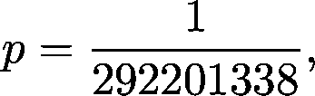
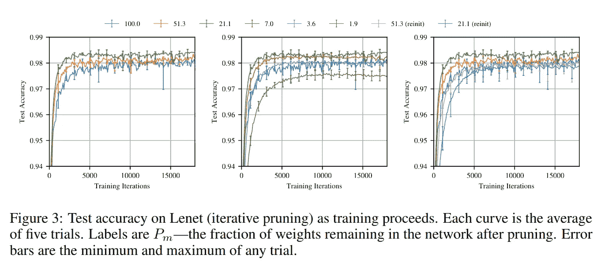

# 你能移除 99%的神经网络而不损失准确性吗？

> 原文：<https://towardsdatascience.com/can-you-remove-99-of-a-neural-network-without-losing-accuracy-915b1fab873b?source=collection_archive---------14----------------------->

## 权重剪枝简介

即使是最常见的神经网络架构也有许多参数。ResNet50 是一种常用的基线模型，拥有约 2500 万个。这意味着在训练期间，我们在 2500 万维的参数空间中执行搜索。

为了客观地看待这个数字，让我们来看看这个空间中的一个立方体。一个 n 维立方体有 2ⁿ顶点，所以在 2500 万维中，我们谈论的是 2 个⁵⁰⁰⁰⁰⁰⁰点。在搜索网格中，这只是一个元素。相比之下，可观测宇宙中的原子数量估计在 10⁸左右。可以肯定地说，这个问题的严重性是我们人类无法理解的。

因此，减少参数的数量有几个好处。稀疏网络不仅更小，而且训练和使用更快。在硬件有限的地方，比如嵌入式设备或智能手机，速度和大小可以决定一个模式的成败。此外，更复杂的模型更容易过度拟合。因此，限制搜索空间也是一种正则化。

然而，这并不是一项简单的任务，因为减少模型的容量也会导致准确性的损失。因此，复杂性和性能之间存在微妙的平衡。在本帖中，我们将深入探讨挑战和潜在的解决方案。

# 权重修剪

首先，最简单的问题是在训练后，减少模型参数*。这对训练本身没有帮助，但会减少推理的计算需求。*

消除权重的过程被称为*修剪*。(从现在起，我将使用可互换的权重和参数。)它的起源可以追溯到 Yann LeCun、John S. Denker 和 Sara A. Solla 的著名论文 [*最优脑损伤*](http://papers.nips.cc/paper/250-optimal-brain-damage.pdf) 。*(如果知道更早的参考，欢迎留言评论！)*

他们提出了以下迭代修剪方法。

1.  训练模型。
2.  估计每个权重的*显著性*，这由扰动权重时损失函数的变化来定义。变化越小，重量对训练的影响越小。
3.  移除显著性最低的权重。(也就是说，将它们的值设置为零，并在余下的过程中保持不变。)
4.  转到步骤 1。并重新训练修剪后的模型。

继续训练与修剪重量是必要的。作者观察到，如果没有它，当大部分重量被移除时，目标函数(也称为损失)会显著增加。

来源: [*最佳大脑损伤*](http://papers.nips.cc/paper/250-optimal-brain-damage.pdf) 作者:扬·勒昆、约翰·s·登克和萨拉·a·索拉

当修剪后的网络被重新训练时，这种方法出现了一个特殊的挑战。事实证明，由于其能力下降，再培训更加困难。这个问题的解决方案是后来才出现的，还有所谓的彩票假说，把这个问题放到了一个完全不同的角度。

# 彩票假说

赢得彩票头奖的机会很小。例如，如果你在玩强力球，你每张彩票有 292，201，338 分之一的胜算。如果你购买了 *n* 张票，你的机会有多大？所以，如果赢的概率是

那么*不赢*的概率是

当我们购买 *n* 张票时，*张票都没中* s 的概率是

由此得出结论，他们中至少有一个人赢的概率是

如果 *n* 很大，这个可以任意接近 1。

 [## 概率的数学基础

### 测度论导论

towardsdatascience.com](/the-mathematical-foundations-of-probability-beb8d8426651) 

这和神经网络有什么关系？在训练之前，模型的权重被随机初始化*。会不会碰巧有一个随机初始化的网络的子网*“中了初始化彩票”*？在他们的工作中，乔纳森·弗兰克尔和迈克尔·卡宾陈述了 [**彩票假说**](https://arxiv.org/abs/1803.03635) :*

> *一个随机初始化的密集神经网络包含一个子网络，该子网络被初始化为当被隔离训练时，它可以在最多相同次数的迭代训练后匹配原始网络的测试精度。*

*最重要的问题是用最多相同数量的训练步骤实现与整个网络相同的精度。正如我们之前看到的，这是修剪的最大挑战:由于建模能力下降，训练较小的网络可能更加困难。*

*我们如何找到这样的初始化彩票中奖者？他们真的存在吗？作者已经找到了一种在某些架构中一致识别这种子网的方法。他们的方法如下。*

1.  *随机初始化一个神经网络。*
2.  *为 *n* 个训练步骤训练网络。*
3.  *移除最低重量的 *k%* 。*
4.  *将剩余权重重置为随机初始化期间的值。*
5.  *转到步骤 2。并且迭代训练和修剪。*

*与以前的方法相比，这里有两个关键步骤。首先，简单地根据它们的大小去除权重。第二，**修剪后的网络的权重不重新初始化，而是重置到第一次初始化后的状态**。这已经被证明是必要的:当超过 80%的权重被移除时，被修剪的网络的随机重新初始化导致显著更差的结果。*

**

*乔纳森·弗兰克尔和迈克尔·卡宾修剪方法的性能。来源:[彩票假说:寻找稀疏的、可训练的神经网络](https://arxiv.org/abs/1803.03635)，作者乔纳森·弗兰克尔和迈克尔·卡宾*

*然而，这种方法有很大的局限性。首先，它不能很好地处理大规模的问题和架构。在最初的论文中，作者指出，对于更复杂的数据集(如 ImageNet)和更深层次的架构(如 ResNet)，该方法无法识别初始化抽奖的赢家。*

*一般来说，实现良好的稀疏性-准确性权衡是一个困难的问题。这是一个非常活跃的研究领域，并且技术水平在不断提高。*

*尽管这种方法是一个巨大的改进，但它并没有解决一个重要的问题:修剪后的子网仍然需要重新训练。令人惊讶的是，这是通过颠倒整个问题来解决的。*

# *重量不可知的神经网络*

*到目前为止，我们已经从一个大的神经网络开始，反复地修剪它来压缩它。然而，有一种与逻辑相反的替代方法:我们可以从最小的架构开始，然后逐步增加。*

*这是亚当·盖尔和大卫·哈在他们最近的论文[重量不可知神经网络](https://arxiv.org/abs/1803.03635)中的出发点。除了获得最小的网络，他们还有一个更雄心勃勃的目标:*最终的架构应该在随机权重下表现良好*。如果你还记得的话，权重剪枝方法最大的缺点是产生的子网很难训练。这样，就不需要培训了。*

*本质上，他们的方法是在可能的架构空间中的进化搜索。与以前的方法相比，他们的搜索更喜欢简单和重量不可知的属性。*

1.  *创建一组最小的神经网络架构，这些架构**可以嵌入到单个父架构**中。此时没有权重值，只有连接。基本上，每个网络都相当于对父架构的特定修剪。*
2.  *用多组共享权重测试网络**。共享权重是必不可少的，因为这迫使搜索更倾向于权重不可知的架构。***
3.  *根据网络的性能和复杂性对网络进行排序。因为权重在网络之间共享，所以性能也反映了权重不可知的能力。*
4.  *通过选择排名靠前的网络并随机修改它们来创建新网络。*
5.  *获取获得的网络，并转到步骤 2。*

*作者在下图中总结了这一过程。*

**

*来源:[亚当·盖尔和大卫·哈的重量不可知神经网络](https://arxiv.org/abs/1803.03635)*

*这样，他们就能够找到在随机权重下表现良好的架构。这是一个相当令人印象深刻的结果。*

*该方法适用于多种机器学习任务，而不仅仅是手写数字识别。他们能够为几个连续的控制问题设计最小的重量不可知的架构，例如杆平衡和赛车。*

**

*来源: [*权重不可知神经网络*](https://arxiv.org/abs/1803.03635) 作者:亚当·盖尔和大卫·哈*

*到目前为止，这种方法让我们最接近于找到不需要培训的最小架构。然而，还有许多事情要做。对于更复杂的任务，如 ImageNet 分类，找到精确的权重不可知网络仍然是未解决的问题。*

## *令人兴奋的新发展*

*就在我写这篇文章的时候，一篇新的论文出现了，并声称实现了理论上的最大压缩——无需查看数据！在田畑秀则·田中等人的论文 [*中，通过迭代保存突触流*](https://arxiv.org/abs/2006.05467) 在没有任何数据的情况下修剪神经网络，他们的算法 SynFlow 能够处理那些以前的方法无法处理的复杂任务。我非常期待了解更多这方面的知识，并深入研究这篇论文！*

# *实践中的修剪*

*到目前为止，我们只讨论了修剪的理论方面。最后，我想收集一些你可以马上开始使用的工具。*

*如果你是一个 [TensorFlow](https://www.tensorflow.org/) 用户，有几个内置的模型优化工具，包括剪枝。*

* [## TensorFlow 模型优化工具包简介

### 我们很高兴在 TensorFlow 中推出一个新的优化工具包:一套技术，开发者，无论是…

medium.com](https://medium.com/tensorflow/introducing-the-model-optimization-toolkit-for-tensorflow-254aca1ba0a3)  [## TensorFlow 模型优化工具包—修剪 API

### 自从我们引入了模型优化工具包——一套开发人员，无论是新手还是高级开发人员…

medium.com](https://medium.com/tensorflow/tensorflow-model-optimization-toolkit-pruning-api-42cac9157a6a) 

类似地， [PyTorch](https://pytorch.org) 也有类似的功能。你可以在这里找到他们关于权重修剪的[教程](https://pytorch.org/tutorials/intermediate/pruning_tutorial.html)，但是我也写了一个关于这个和其他可用工具如模型量化的快速总结。

 [## 5 个高级 PyTorch 工具提升您的工作流程

### 从开发到生产

towardsdatascience.com](/5-advanced-pytorch-tools-to-level-up-your-workflow-d0bcf0603ad5) 

# 摘要

机器学习不会停留在训练精确的模型上。在部署到生产环境时，速度和大小非常重要。为了使复杂的体系结构适应生产约束，可以通过削减某些权重来减小模型的大小。(还有很多其他的方法，我们没有讲过。)

这不是一项简单的任务，因为必须考虑精度损失。此外，较小的架构需要重新培训，由于建模能力下降，这可能会更加困难。这里，我们回顾了两种权重修剪方法和一种互补的架构搜索方法，它们逐步解决了这些挑战。

然而，这只是冰山一角。权重剪枝是一个活跃的研究领域，特别是对于更复杂的任务，如大规模图像识别。(想想 ImageNet 大小。)

现代深度学习框架(如 TensorFlow 和 PyTorch)中提供了修剪方法，因此您可以在工作中立即开始尝试这些方法，甚至可以尝试推动艺术的发展。因此，如果您发现这个主题很有趣，请将这些令人惊叹的方法付诸实践:)

# 参考

[1] [*最佳大脑损伤*](http://papers.nips.cc/paper/250-optimal-brain-damage.pdf) 作者扬·勒昆、约翰·s·登克和萨拉·a·索拉

[2] [*彩票假说:寻找稀疏的、可训练的神经网络*](https://arxiv.org/abs/1803.03635) 作者乔纳森·弗兰克尔和迈克尔·卡宾

[3] [*权重不可知的神经网络*](https://arxiv.org/abs/1803.03635) 由 Adam Gaier 和 David Ha

[4] [*通过迭代保存突触流来修剪无任何数据的神经网络*](https://arxiv.org/abs/2006.05467)*田畑秀则·田中、丹尼尔·库宁、丹尼尔·l·k·亚明斯和苏亚甘古利*

*[***如果你喜欢把机器学习概念拆开，理解是什么让它们运转，我们有很多共同点。看看我的博客，我经常在那里发表这样的技术文章！***](https://www.tivadardanka.com/blog)**