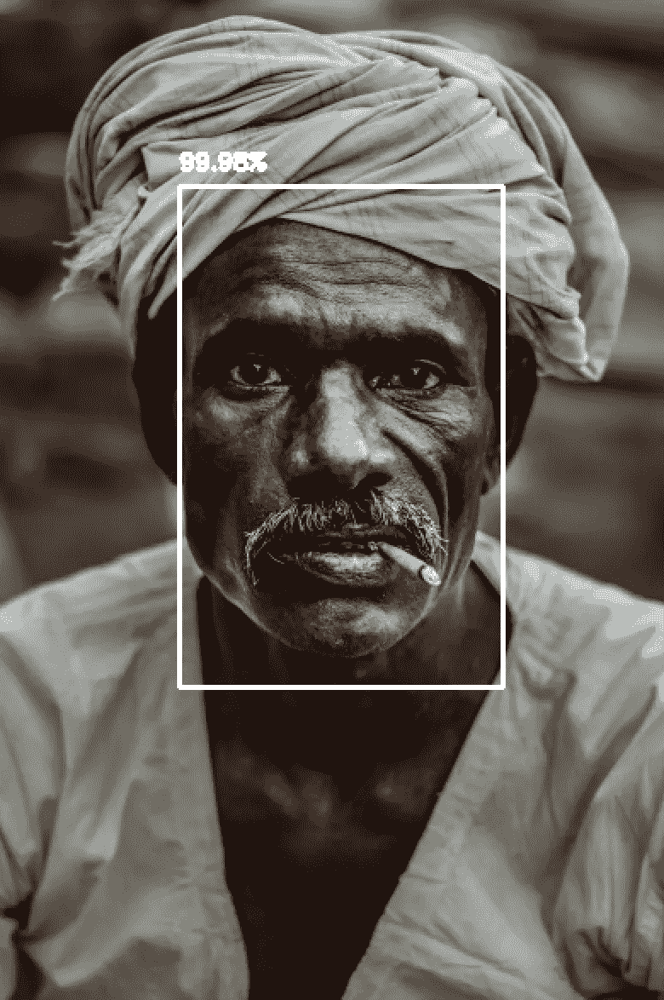
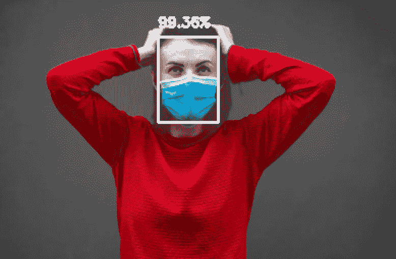

# 你的脸型能应付新冠肺炎流行的面具吗？

> 原文：<https://towardsdatascience.com/can-your-face-model-handle-masks-prevalent-due-to-covid-19-9f3fff1bf7cb?source=collection_archive---------63----------------------->

## 探索面具人脸检测

昨天，我和一个朋友谈论开发一个可以检测人脸面具的模型。基于她给我的一些见解，我开始寻找带有面具的数据集。但是我突然想到了一个问题！

> 我们需要更新所有的人脸模型来适应戴着面具的人脸检测吗？

我很想找到答案，并真诚地期待我以前的模型可能会失败。让我们看看我在研究中发现了什么。

# iPhone Face ID

哈帕尔·辛格在 [Unsplash](https://unsplash.com?utm_source=medium&utm_medium=referral) 上的照片

如果你有一部最新的 iphone，它有 Face ID 检测系统来解锁你的手机，你会像我一样戴着面具遇到麻烦。因为脸部的大部分被覆盖，所以系统无法破译确切的脸部，因此无法解锁设备。

我试着出去散步，不得不记录时间，下一首要播放的歌曲和要采取的步骤。我必须不断解锁我的设备来检查这些数据。这变得非常烦人，因为我总是戴着面具，它需要额外的 5-10 秒来询问密码，而不是 Face ID，然后让我输入密码。

**苹果最近发布了新的 iOS 版本 13.5，该版本可以检测带面具的人脸，并直接提示密码选项，这非常简单，也节省了时间。**虽然这很棒，但原来的系统还是坏了，因为我不能再用 Face ID 和我的面具了。可以理解的是，它不能只依赖于半张脸，但这只是我们希望避免的额外开销。

> 安全永远是赢家！

# 人脸检测模型

虽然像 Face ID 这样的系统不能损害安全性，但其他只检测人脸而不用于安全的模型呢？一种可能的情况是计算一次聚会中的人数(面孔)，以粗略估计到场的人数。

为了测试这一点，我决定使用我以前用于检测面部的模型。代码如下:

 [## kb22/使用 OpenCV 的人脸检测

### 使用 OpenCV 的内置模型进行人脸检测。OpenCV 提供了一个非常精确的内置人脸检测模型。在这个…

github.com](https://github.com/kb22/Face-Detection-using-OpenCV) 

老实说，我预计这个模型也可能会失败，因为大部分被面具覆盖的脸并不像一张脸。此外，该模型不是在带有面具的人脸上训练的。

然而，结果令人惊讶。

> 该模型能够准确地检测到人脸，即使他们戴着面具，并且有很高的可信度。

我能想到这个模型成功的两个原因:

*   首先，该模型分析像素值的变化来检测人脸。即使打开了蒙版，背景和面部之间的像素值强度变化也很明显。
*   即使当面具在脸上时，脸的一般结构仍然是相同的，因此，模型可能能够识别脸。

下面是我测试的几张图片。所有图片均取自[https://unsplash.com/](https://unsplash.com/)

> 还要注意，面部检测器文件需要一个 PNG 文件，所以我必须更新代码，使其接受 JPG 文件。

## 没有面具的图像

请注意，该模型在没有面具的人脸上表现得非常好。所有图像的置信度值都高于 90%。

## 带面罩的图像

我们注意到该模型仍然正确地识别人脸，并且在大多数情况下，置信度也相当高(无论如何都不是 100%)。

# 结论

与我最初的预期相反，并不是所有的模型都需要更新。我们需要仔细识别当前使用人脸检测模型的所有用例，这些用例可能需要重新训练。

我们注意到，人脸检测模型可能需要更新，以适应新冠肺炎引入的新趋势，即外出或聚会时频繁使用口罩。

我希望你喜欢这个。如果你有任何问题，想法或建议，请留下评论，让我知道。你也可以通过 LinkedIn 联系我:【https://www.linkedin.com/in/bhanotkaran22/ 