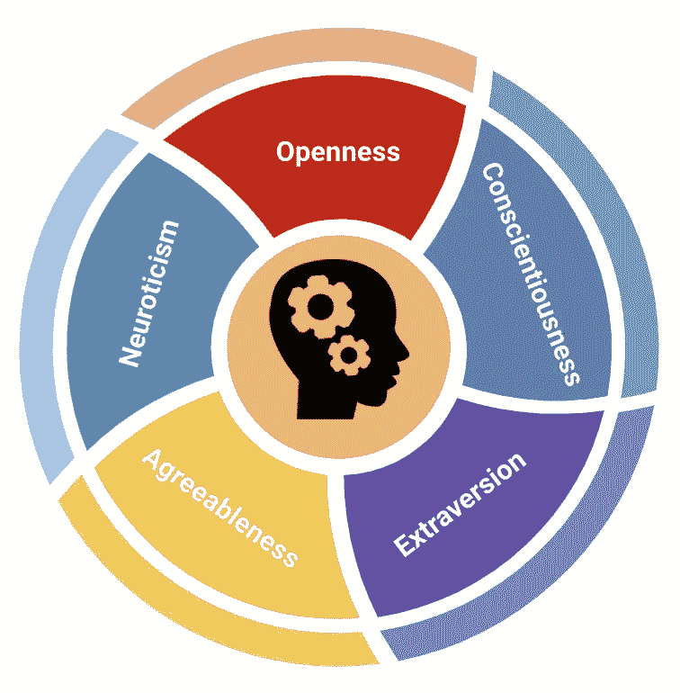
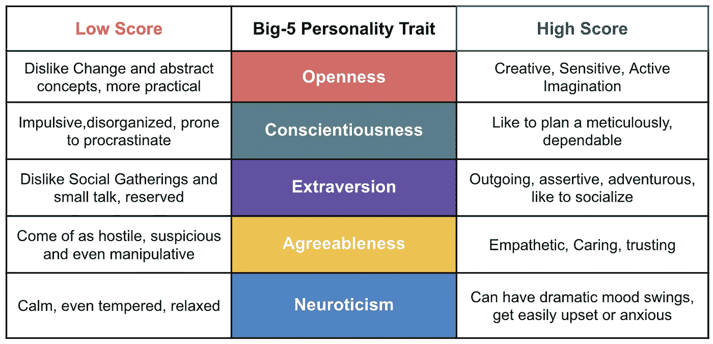
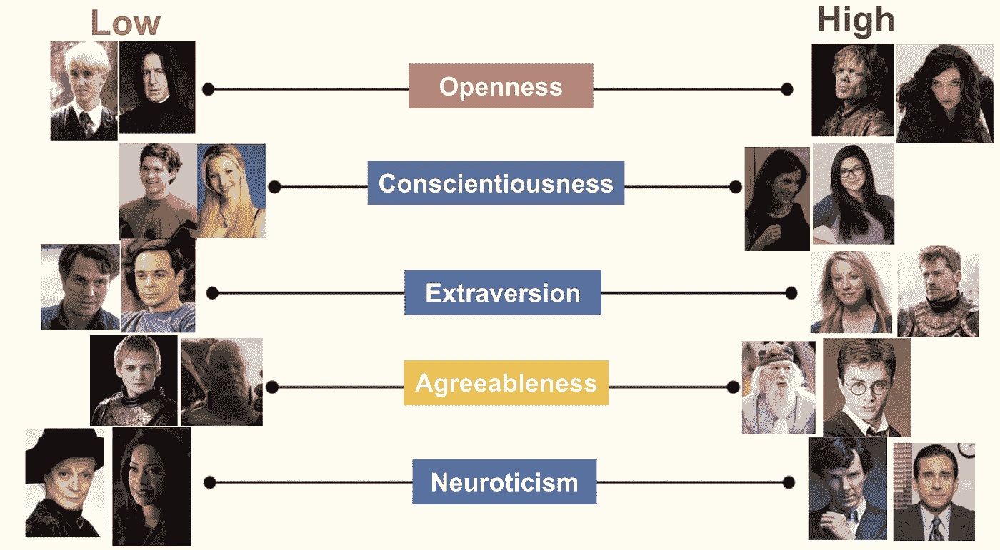
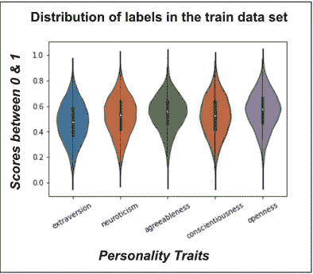
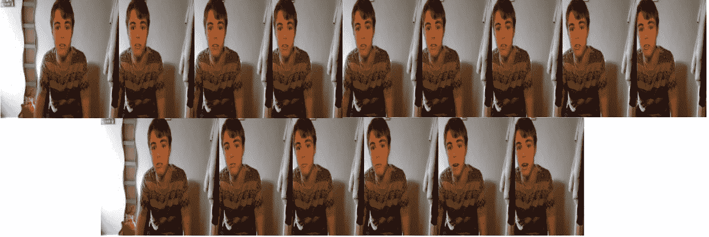
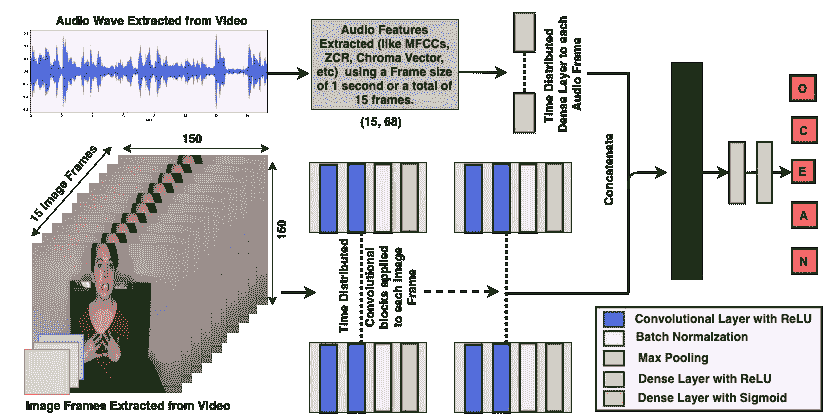
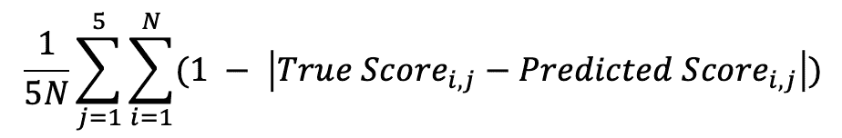
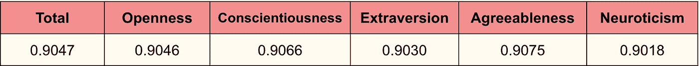

# 视频如何被用来检测你的性格？

> 原文：<https://towardsdatascience.com/can-your-video-be-used-to-detect-your-personality-d8423f6d3cb3?source=collection_archive---------19----------------------->


[腾雅特](https://unsplash.com/@tengyart?utm_source=unsplash&utm_medium=referral&utm_content=creditCopyText)在 [Unsplash](https://unsplash.com/s/photos/emotions?utm_source=unsplash&utm_medium=referral&utm_content=creditCopyText) 上拍摄的照片

## 基于 Google Colab 上第一印象挑战的视频，研究一种时间分布的深度双峰方法来预测大 5 人格特质的得分。

## 视频是新的第一印象！

想想自 2020 年 3 月以来，您参与的视频通话的大致数量。现在，将其与之前您参与的视频通话次数进行比较。我敢肯定，对我们大多数人来说,**的差别是巨大的。与家人、朋友和同事的会议已经转变为视频通话。**

视频通话还使我们能够不断扩大我们的网络，结识新朋友，同时保持社交距离。因此，可以这么说，我们对视频产生了相当多的个人和专业的第一印象。通过第一印象获得的个性感知可能相当主观，甚至会导致第一印象偏差*。当然，也有自我报告的性格评估测试，但它们往往会受到社会期望偏差的影响。这给了我们一个机会来利用人工智能找到一种更客观的方法来分析表观性格。*

记住这一点，这篇博客的目的是展示一种这样的深度学习方法，它使用视频来预测五大人格特质的分数。



由作者创建

## 大五人格特质是什么？

大多数当代心理学家[认为，人格有 5 个核心维度:**外向**、**随和**、**开放**、**尽责**和**神经质；**通常简称为**海洋。不同于许多以前的同行相信人格特质的二元性，大五人格特质理论断言每个人格特质都是一个谱。**](https://www.verywellmind.com/the-big-five-personality-dimensions-2795422)

**让我们看看每种特质是如何被描述的，然后是一些受欢迎的虚构人物在五大人格特质上的得分图……**



由作者使用其维基个人资料中的角色图像创建

大五人格特质理论的一个有趣的方面是，这些*特质是独立的，但不是相互排斥的*。例如，我们可以在上面的图像中看到，谢尔顿·库珀(《生活大爆炸》)在外向性方面得分较低，但在神经质方面得分较高，菲比·布菲(《老友记》)在尽责性方面得分较低，但在开放性方面得分较高，等等…

## 关于数据集

[第一印象挑战赛](http://chalearnlap.cvc.uab.es/dataset/24/description/)提供了来自 3k 个 YouTube 视频的 10k 个片段的数据集。这项挑战的目的是了解如何使用深度学习方法从受试者在摄像机前说话的视频中推断出明显的性格特征。

训练集由 6k 个视频组成。验证集和测试集各有 2k 视频。视频的平均时长为 15 秒。每个视频的基本事实标签由五个分数组成，代表五大人格特质中每一个的表现。这些分数在 0 到 1 之间。标签是由亚马逊土耳其工人完成的。关于挑战和数据集的更多信息可以在这篇[论文](https://arxiv.org/pdf/1802.00745.pdf)中找到。

视频数据是非结构化的，但是具有丰富的多媒体特征。这篇博文中解释的方法使用了视频中的音频和视觉特征。分析和建模在 Google Colab 上完成。代码可以在 [Github](https://github.com/MS1997/Apparent-personality-analysis-using-videos) 上访问。

## 基本事实标签的分布



由作者创建

左边的图表显示了训练数据集中个性分数的分布。有趣的是，分数的分布非常相似，甚至沿平均值对称。这种对称的原因可能是分数不是自我报告的。由于*社会期望偏差*，自我报告的个性评估分数通常是有偏差的。

## 提取视觉特征

视频由图像帧组成。这些帧是使用 *OpenCV* 从视频中提取的。在表观人格分析中，视觉特征包括面部暗示、手的运动、人的姿势等。由于数据集由平均持续时间为 15 秒的视频组成，因此从每个视频中提取了 15 个随机帧。然后将每个提取的帧的大小调整为 150×150，并按 1/255 的因子缩放。



由作者使用第一印象挑战赛的视频创建

## **提取音频特征**

使用 *ffmpeg* 子过程从每个视频中提取音频波形。开源工具包 *pyAudioAnalysis* 用于从 15 个不重叠的帧中提取音频特征(保持帧步长等于音频分析子过程中的帧长度)。这些包括 34 个特征以及它们的 delta 特征。输出是每个帧的 1×68 维向量或 15 个音频帧的 15×68 维张量。

通过 pyAudioAnalysis 提取的特征类型包括过零率、色度向量、色度偏差、MFCCs、能量、能量熵、频谱质心、频谱扩展、频谱熵、频谱通量和频谱滚降。

## *深度双峰回归模型*

以 Tensorflow 为后端的 Keras 功能 API 用于定义模型。该模型分两个阶段定义。在第一阶段，提取图像和音频特征，然后处理视频的序列特征。为了处理音频和视频特征，在第一阶段采用双模态时间分布方法。

Keras 有一个时间分布图层，可用于将同一图层单独应用于多个输入，从而实现“多对多”映射。简而言之，时间分布包装器允许任何图层分别从每个帧或时间步长中提取要素。*结果:*输入和输出中的附加时间维度，代表时间步长的索引。

通过 pyAudioAnalysis 提取的音频特征在时间分布包装器中通过具有 32 个单元的密集层。因此，相同的密集层被应用于每个音频帧的 1×68 维向量。类似地，每个图像帧以*并行*方式通过一系列卷积块。



由作者创建

在这一步之后，音频和视觉模型被连接起来。为了处理视频的时间顺序或时间方面，连接的输出被进一步传递到具有 0.2 的丢失率和重复丢失率的堆叠 LSTM 模型。堆叠 LSTM 的输出被传递到具有 0.5 的 ReLU 激活和丢失率的密集层。最终的致密层有 5 个输出单元(每个人格特征一个)，以及 sigmoid 激活，以获得 0 到 1 之间的预测分数。

## 发电机功能

最大的挑战是管理有限的内存资源。这是使用*小批量梯度下降*完成的。为了实现它，自定义生成器函数定义如下:

*注:*生成器功能在一个列表中生成音频和视觉模型的输入。与此相对应，通过将两个输入的列表传递给 keras 的模型类来定义模型:

```
model = Model([input_img,input_aud],output) 
```

## 结果

该模型使用 Adam 优化器编译，学习率为 0.00001。该模型被训练 20 个时期，最小批量为 8。均方误差作为损失函数。定义了一个名为“平均准确度”的自定义指标来查看模型的性能。计算如下:



**这里 N 是输入视频的数量。**

总的来说，该模型表现得相当好，最终测试平均精度为 0.9047。


由作者创建

下表显示了每种大五人格特质的测试平均准确度。该模型显示了所有 5 种人格特质的相似表现。



由作者创建

## 前方的路…

根据处理能力的可用性，通过增加帧的大小和长度，可以进一步改进模型的结果。视频转录的 NLP 分析也可以用于获得附加特征。

虽然自动表观人格分析有重要的用例，但应该确保*算法偏差*不会影响结果。这种人工智能应用的目的是提供一种更客观的方法。然而，只有在每个阶段(即从数据收集到结果解释)都排除了偏见，这种客观性才能实现。

## 参考资料:

[1] T .詹纳科普洛斯，pyAudioAnalysis(2015)，【https://github.com/tyiannak/pyAudioAnalysis 

[2] A .苏布拉马年，v .帕特尔，a .米什拉，p .巴拉苏布拉曼尼安，a .米塔尔，[使用时间有序深度音频和随机视觉特征的双模态第一印象识别](https://arxiv.org/abs/1610.10048) (2016)

[3]张春华，张海涛，魏晓伟，吴军，[深度双峰回归用于表观人格分析](https://cs.nju.edu.cn/wujx/paper/eccvw16_APA.pdf) (2016)