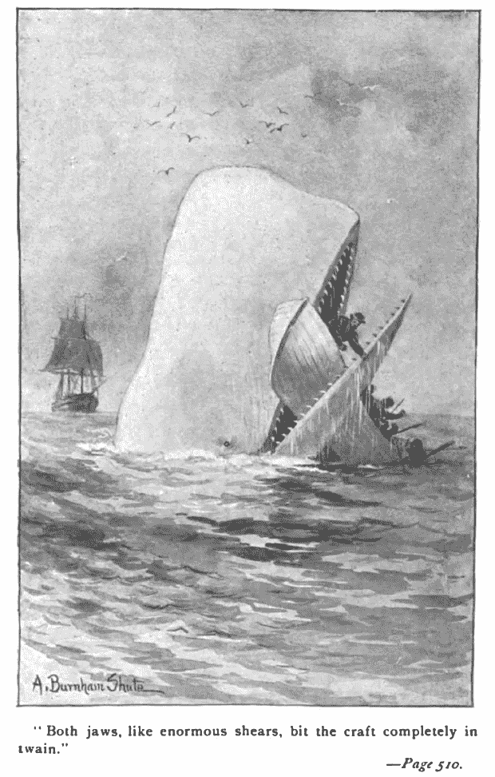
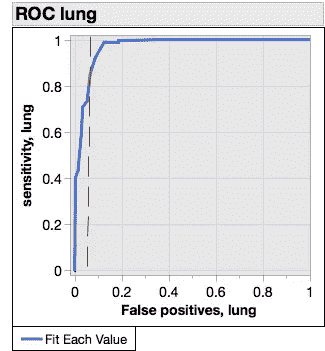
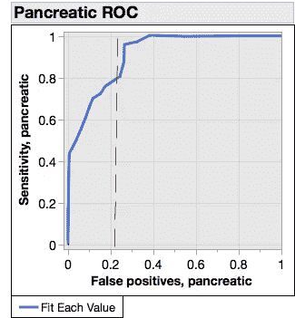
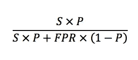
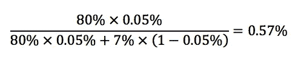

# 癌症研究人员开发新技术将投资者和他们的钱分开

> 原文：<https://towardsdatascience.com/cancer-researchers-develop-new-technology-for-separating-investors-from-their-money-1ff7a0eb2b69?source=collection_archive---------38----------------------->

## 贝叶斯先验胜过酷科技

液体活检在癌症筛查中风靡一时。但是筛查——对表面上健康的人进行疾病检测——是癌症诊断中的大白鲸。我预测，在未来十年，它将失去更多的风险投资家，比其他所有 Dx 游戏加起来还要多。但是没关系。将资金从富有但无知的投资者手中重新分配给值得的科学家绝对是一件好事(科学家说)。

流行的鲸鱼吞噬了无数的现金。奥古斯都·伯纳姆·舒特[公共领域]

很少有投资者——也很少有生物学家——理解贝叶斯统计。疾病流行的先验知识表明，看似高效的测试并没有多少预测价值。

让我们走一遍。

假阳性是任何筛查低患病率疾病的测试的祸根。在美国，每年大约有 0.5%的人口被诊断患有癌症。

现在让我们想象一个 99%特异的癌症检测。也就是说，对于每 100 名没有患病的患者，该检测只返回一个假阳性。听起来不错，不是吗？

但事实上这将是可怕的。如果对 1000 名美国人进行癌症筛查，我们预计会有 5 名真正的阳性者(如果该测试 100%敏感，这是一个非常慷慨的假设)。这 5 名患者将受益于更快获得他们需要的护理。但是我们也会得到 10 个假阳性——即使他们是健康的，他们也被告知患有癌症。它们会发生什么？

我们肯定知道他们会害怕。他们将接受更多的测试。但是我们没有任何能排除癌症的测试。没有任何时候可以肯定地告诉他们“你很好，没必要担心”。然后他们将不得不决定是观望，还是接受治疗。等待可能意味着在治疗最有效的时候推迟治疗。但是继续治疗并不是一个容易的选择。癌症治疗既昂贵又有毒，还带有自身的伤害风险——比如[增加患癌症的风险](https://www.ncbi.nlm.nih.gov/pmc/articles/PMC5738212/)。道德上你不能让健康的人接受。

这是癌症筛查的普遍问题。让我们看看癌症筛查中的[新热点](https://www.sciencedaily.com/releases/2018/11/181114132000.htm?utm_source=quora&utm_medium=referral)——基于无细胞 DNA 差异甲基化的液体活检——如何累积。

以下是一些主要结果:

新液体活检试验验证集的 ROC 曲线。自己的工作，数据来自[使用无浆细胞 DNA 亚甲基的敏感肿瘤检测和分类](https://www.nature.com/articles/s41586-018-0703-0)

这些是接收器-操作器曲线，之所以这样叫是因为它们被设计用来优化无线电传输中从噪声中过滤信号。它们是评估诊断测试的标准方法。他们设想了灵敏度和特异性之间的权衡(1-假阳性)。完美的测试应该是与左上角的角成直角(100%灵敏度和 0%假阳性)。一个完全无用的测试将遵循对角线。

你会注意到这些图是针对不同的特定癌症，而不是“癌症”。我们将回到这一点。

让我们假设我们希望测试有 80%的灵敏度(这意味着我们愿意接受 20%的癌症会被遗漏)。这听起来不是很好(事实并非如此——大多数 FDA 批准的诊断方法的灵敏度≥95%)，但这比其他癌症的血液 DNA 测试要好得多，后者的灵敏度为 50-70%(见[这里](https://www.ncbi.nlm.nih.gov/pubmed/27377626)和[这里](https://www.ncbi.nlm.nih.gov/pubmed/28814544))。

现在从 y 轴上的 0.8 到它与蓝色 ROC 曲线相交的地方画一条线。向下读取到 x 轴。这是 80%灵敏度下的假阳性率。肺癌的发病率约为 7%，胰腺癌为 20%。

在 0.5%的总癌症发病率下，这意味着每一个真阳性都会有许多假阳性。但由于这些是针对特定癌症的测试，假阳性与真阳性的比率要差得多。

美国人口肺癌诊断发病率约为[0.05%/年](https://seer.cancer.gov/statfacts/html/lungb.html)，胰腺癌[0.01%/年](https://seer.cancer.gov/statfacts/html/pancreas.html)。因此，在我们 80%灵敏度的情况下，假阳性与真阳性的比率将在 100 到 2000 之间。

因此，对于每一个得到帮助的病人，至少有一百人会因为这项测试的结果而受到惊吓或伤害。我认为没有人认为这是可以接受的。

作为优秀的 Bayesians 人，我们将把这些结果表达为阳性预测值:测试呈阳性且实际患有该疾病的患者比例。根据敏感性(S)、患病率(P)和假阳性率(FPR，等于 1-特异性)，这是:

对于我们的肺癌测试示例，我们得到:

接受测试并获得阳性结果将使我们患病的概率从 0.05%(我们之前的)增加到约 0.6%。这种差异很重要，但毫无用处。没有人会接受基于这些结果的治疗。

实际上比这更糟。这不是一个单一的测试，而是一组测试，每个测试都有自己独立的假阳性率。如果我们测试 10 种最常见的癌症，平均假阳性率为 1%(比目前的表现好得多)，那么整整 10%的患者将至少有一种癌症的*测试呈阳性。真是一场灾难。*

我不想在这里谈论科学。看起来很有前景，我相信技术会越来越好。但是我想让你们了解这个问题有多难。任何一种测试技术都不太可能胜任这项任务。也许这种观察 DNA 甲基化模式的方法可以与 [CancerSEEK 测试](https://drewsmithblog.com/2018/02/how-does-cancerseek-compare-to-other-liquid-biopsies/)(性能更好)结合起来，开始使筛查高危人群变得可行。

我希望那会发生。我确信这不会很快发生。与此同时，我希望没有 TDS 的读者被液体活检的炒作所迷惑。

**2020 年 1 月 6 日更新:**一个中国小组已经[发表了一篇文章](https://stm.sciencemag.org/content/12/524/eaax7533?utm_campaign=toc_stm_2020-01-01&et_rid=621271464&et_cid=3146918)1 月 4 日描述了一种类似的方法，在结直肠癌检测方面有更好的结果。在验证队列中，它们的敏感性和特异性分别为 90%和 87%。令人印象深刻。在筛查高风险人群(结肠直肠癌和癌前病变的患病率为 7.1%)时，计算出的 PPV 为 35%。这个数字高得足以证明干预是正当的。但美国的结直肠癌年发病率为 0.04%。对人群的筛查将导致 0.3%的 PPV。对公众实施这项测试弊大于利。

显而易见的结论是，像这样的测试必须与其他风险因素相结合才有用。使用似然比是做到这一点的最佳方式，也将是未来文章的主题。