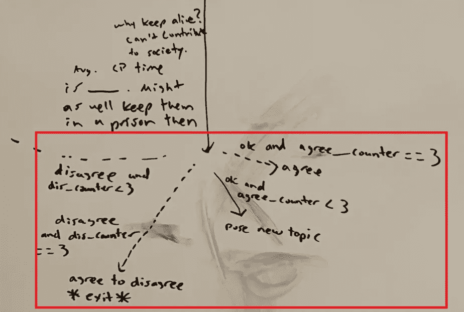
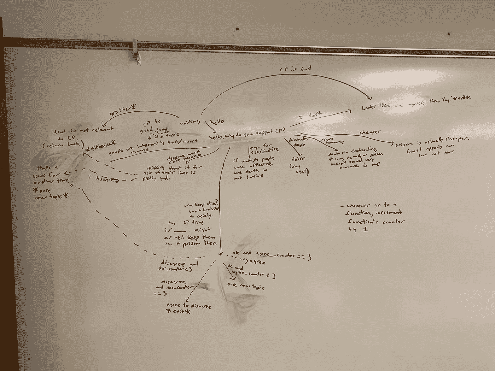
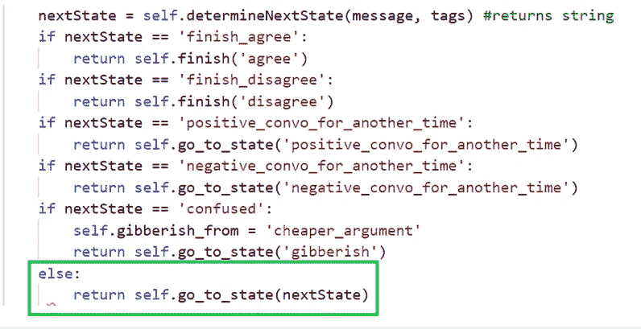
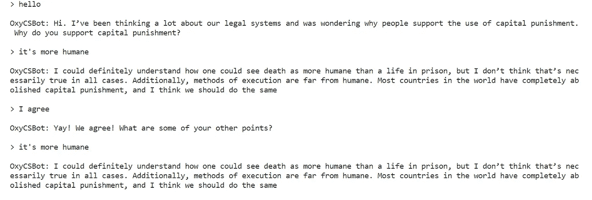

# CapPun:一个模仿人类联系来讨论死刑的聊天机器人

> 原文：<https://towardsdatascience.com/cappun-a-chatbot-that-emulates-human-connection-to-debate-capital-punishment-c1aba6549162?source=collection_archive---------44----------------------->

# 介绍

你好，读者！既然我们已经[剖析了 Oxy 课程注册系统的各个方面](https://medium.com/@joeyrose1999/why-oxys-course-registration-system-is-bad-1f2f868d655f)并且[试图将其中的一些](https://medium.com/@joeyrose1999/how-to-fix-a-part-of-oxys-course-registration-system-47415adcc34a)重新组合起来*，我想我们是时候转移到另一个话题了。*

如果设计正确，将会导致人类灭亡的东西听起来如何？

嗯，我想你不能提供任何反馈是件好事，因为…

> 我和我的团队已经通过构建一个聊天机器人[做到了这一点！](https://github.com/Jfarneroxy/oxycsbot)

现在，你可能很困惑。毕竟，聊天机器人是如何导致人类灭亡的？

你能让我解释一下吗？

简单来说，如果人类能够给计算机编写理解人类语言的程序，那么人类就不需要做任何任务，也不存在了。谢天谢地，走到这一步真的很难做到。这被认为是一个完全人工智能的问题，创造一个*理解*自然语言而不是*处理*的程序需要一个像人一样聪明的人工智能。举几个例子来说，这意味着能够进行指称解析(找到文本中指代同一实体的所有表达式)，理解句子句法、语义和语用，以及拥有常识、道德和记忆。

尽管聊天机器人旨在满足许多需求，但人类在使用聊天机器人时有一个共同的核心需求:

**能够感受到某种联系。**

这是因为通过自然语言与技术交流远比用编程语言更自然。通过改善人机交互和设计以人类为中心执行任务的聊天机器人，[我们可能会颠倒使用技术时谁做重活的角色](https://www.wired.co.uk/article/conversational-ai-making-technology-more-human)，释放人类表达的能力。

为了满足这种需求，我们大幅缩小了名为 CapPun 的聊天机器人的范围，设计它只做一件事:辩论死刑的使用。

在这篇文章中，我将讨论这样一个设计的发展，以及我们如何利用用户反馈在无数次设计迭代中改进它。

我们开始吧。

# 为什么是死刑？

在日常对话中，一个对话可以有无数种方式。鉴于这一点，以及同一对话可以有数百种不同方式的事实，设计一个可以预测、解释并以有意义的方式做出回应的聊天机器人是非常具有挑战性的。此外，要做到这一点，需要对神经网络有深入的了解，而我们团队中没有人有这方面的经验。

因此，我们没有建立一个能够处理所有这些对话结果的人工智能，而是尽可能限制聊天机器人可以完成的任务范围。这样，我们可以根据对话的路径对 CapPun 的响应进行硬编码。

为了做到这一点，我们需要一个能产生一些预测对话路径的任务。此外，这样的任务必须有足够的情感成分，才能人为地向 CapPun 注入情感。最后，所述任务必须能够完全通过口语来执行，因为机器人不会有任何物理方面。

经过几天的深思熟虑，我们决定开发一个辩论机器人，与用户就一个“热门话题”进行辩论。最后，我们一致认为死刑辩论的双方都很伤感，因此这是合适的讨论话题。

# 用户+目标

CapPun 是为支持死刑的人设计的。虽然这可能看起来像一个激进的用户群，但我们通过观察发现，这种立场在很大程度上是由情绪驱动的，并且可以根据用户事先是否有创伤性情况而被迅速采纳。

CapPun 的目标之一是让持赞成死刑立场的人了解反对死刑的立场，也许还能增加他们对这个话题的理解。此外，它还旨在推动聊天机器人的约束，看看我们是否可以建立一些用户与之建立联系的东西。

总的来说，项目的设计阶段发生在以下几个阶段:*设计+用户测试*

接下来，我们来看看这几个阶段！

# 设计拱门

## 首次设计+首次用户测试

***头脑风暴过程***

为了让事情顺利进行，我们决定使用 [Justin Li 的聊天机器人的启动代码，该代码提供 Oxy CS 教授的办公时间信息](https://github.com/justinnhli/oxycsbot)。在这种情况下，对话可以进行的路径被分解成不同的“状态”，或者可以被调用的功能。根据用户对其他状态的响应，或者用户消息中的哪些单词和短语与 CapPun 理解的预定义“标签”匹配，可以“进入”不同的状态。

因为大多数辩论都是由观点/反驳组成的，我们花了大量的时间列出支持死刑的观点，然后将它们映射到各自的反对死刑的反驳中。我们在我们的团队中这样做了，但也有两名精通该主题的学生(大三哲学专业和大三经济学专业)。他们归结为这七个论点:

*   它更便宜
*   这样更人道
*   它阻止人们犯下其他罪行
*   这是以眼还眼
*   如果人们在监狱里度过一生，他们就无法对社会做出贡献
*   他们应该得到最糟糕的命运
*   他们不会像监狱里的人一样改变

与其他对话代理不同，我们决定让 CapPun 最终“结束”对话，以最小化讨论的范围，并减少我们必须预测和考虑的可能状态的数量。在最初的头脑风暴会议中，我们预测辩论要么以同意结束，要么以不同意结束，因此会有两种结束状态。为了减少假阳性或假阴性结局的数量，仅当用户分别同意或不同意 CapPun 的三个点时，才输入这样的结局状态。

根据用户同意/不同意的点数，状态从对点转换

因此，如果当时没有满足这些结束条件，聊天机器人会要求用户提出他们的另一个观点，根据用户同意还是不同意 CapPun 的对位法来调整这样一个响应的情绪。

在用户不同意它的一个论点后，CapPun 如何循环到下一个争论点

如果用户发送一条充满胡言乱语的消息——当用户消息中没有单词或短语与 CapPun 的预定义标签匹配时确定——cap pun 会要求用户发送一条有意义的消息，然后再转移到另一个状态。

用户如何处理无意义的用户输入

对话会以这种方式循环进行。

为了将初始等待状态与这些其他状态联系起来，我们将发送给机器人的初始消息数量减少到三类:死刑是好的、介绍性消息和死刑是坏的。如果用户说死刑是好的，CapPun 会表示不同意，并要求用户给出原因。如果用户给出一个介绍性的信息，CapPun 会问用户为什么他们支持死刑。在这两种情况下，用户都被引导到七种“参数”状态之一。

七个可能的参数状态用户可以在整个辩论过程中访问

然而，如果用户说了一些与死刑不好的想法有关的话，CapPun 会立即进入协议完成状态，并以快乐的方式结束辩论。因为 CapPun 的预期用户群是那些支持死刑的人，所以这种设计特点在给人思想自由的错觉的同时，也尽早将持反死刑信念的人引向“最终状态”。

卡彭如何让反对死刑的人迅速结束对话

太多了！

简而言之，CapPun 最初被设计成通过用户提出的各种赞成死刑的观点进行循环，评估他们在这一过程中同意或不同意 CapPun 的程度。它通过调用被认为是“状态”的函数来实现这一点，这取决于用户给出的文本输入。总的来说，它有一个初始的“等待”状态、一个中间的“胡言乱语”状态、许多“参数主题”状态和两个“结束”状态，如下面的初始流程图所示:

CapPun 的初始迭代是如何工作的

***用户测试***

为了了解最初的设计是否满足允许用户与机器人连接的核心需求，我们以定性的方式进行了第一轮用户测试，要求用户在告诉他们它做什么任务后与 CapPun 聊天。当他们探索聊天机器人时，我们评估了他们的非语言，并记录了他们的评论。

总的来说，用户感觉到了与 CapPun 的某种联系！然而，许多问题出现了，最大的疑虑归结为两个话题:*对话进程*和*捕捉响应含义*。

*会话进程*

虽然大部分对话从一点过渡到另一点很顺利，但是在每个用户测试中至少有一点 CapPun 扰乱了对话的自然流程。关于“结束”这场辩论，一名大二历史专业的学生觉得卡彭结束这场对话太突然了。例如，在听到卡彭的一个反对意见后，他们提出了一个单独的支持死刑的观点，他们立即被提示“同意不同意”。我现在不跟你争论了。”

或者，一名大二物理专业的学生觉得 CapPun 的临别留言没有清楚地传达出谈话结束了，或者为什么谈话结束了！例如，在他们同意了足够多的 CapPun 的反对意见并收到消息“看来我们同意了”之后。耶！”，他们继续与 CapPun 交谈，如下所示:

**注意:“OxyCSBot”是 CapPun 的初始名称**

当谈话结束时，卡普恩如何没能传达

这些结尾不符合用户对辩论如何结束的概念模型，因此直接阻碍了与 CapPun 建立联系的需要。

为了解决这个问题，我们修改了 CapPun 在进入结束状态时提供的响应。现在，CapPun 告诉用户“太好了！很高兴我们在这一点上看法一致，我期待与您进行更多的对话！”在他们同意了三个反对意见之后，“我不认为我们在这个问题上意见完全一致。在他们不同意三个反对意见后，我们下次再继续这个对话，如下所示:

不太突然结束的新的结尾回应**和**传达了辩论结束的原因/时间

除了尴尬的结局，这个最初的设计没有考虑到这场辩论的无缝引入。虽然最初的设计考虑了用户的许多开场白，但它没有考虑到用户以支持死刑的观点开始的情况。相反，如果用户在他们的观点中提到“极刑”或“死刑”，CapPun 会进入“极刑是不好的”状态，并询问用户他们为什么支持极刑:

CapPun 如何从一开始就不允许用户摆姿势的例子

如果他们只是提出观点，CapPun 会简单地进入“胡言乱语”状态，因为消息没有任何匹配的标签，如下所示:

CapPun 如何从一开始就不允许用户摆姿势的例子

无论如何，这两种情况都与用户关于辩论如何开始的概念模型相冲突，削弱了对话的真实性，并阻碍了与机器人连接的需求。

为了解决这个问题，我们允许用户从一开始就提出问题:

CapPun 是如何改变的，以允许用户从一开始就提出问题

另外，在 CapPun 提供了一个与用户观点相反的观点后，许多对话嘎然而止。而用户则用诸如“我不知道任何其他反驳意见”和“我现在该说什么？”这样的语句来口头表达他们的困惑他们的困惑还表现在他们非语言的反应时间延长。以下面的交互为例:

卡彭提出对位法后，对话进展受阻的例子

大多数时候，用户试图拒绝对方提供的反驳，而不仅仅是以二元方式接受或拒绝。

这很有道理。

在大多数辩论中，人们在一个单一的问题上花费了大量的时间。此外，人类天生多疑，因此不太可能不经反驳就接受对手的陈述。因为 CapPun 不具备这两个特征，它不符合用户用于辩论的概念模型，因此阻碍了与机器人连接的需要。

为了暂时补救这一点，我们增加了提出替代观点的能力，以进一步推动对话，这将被视为不同意 CapPun，承认需要做更多的工作才能进一步完成。

如果 CapPun 没有根据用户输入的标签进入任何结束、辅助或无意义的状态，它将进入一个单独的参数状态

最后，一名计算机科学专业的大四学生发现了这个机器人的一个漏洞，使得他们可以和 CapPun 永远谈论同一个话题。

CapPun 愿意反复讨论同一个话题的例子

这危及了这名学生与 CapPun 之间的联系，因为他们从未遇到过愿意无限期讨论同一问题的人，导致他们对人类行为的概念模型不匹配。

为了解决这个问题，我们创建了一个参数列表，这样，当输入一个参数状态时，如果当用户键入一个被认为是“乱码”的消息时，该状态没有返回，则相应的参数将在数组中被标记为“无”。

CapPun 如何记住它讨论过的论点

然后，在访问下一个状态(由用户的响应决定)之前，CapPun 检查状态是否存在于 not 中。如果有，它就进入那个状态。如果没有，它会告诉用户之前已经讨论过这个话题。

CapPun 如何检查之前是否讨论过用户的观点

*捕捉响应含义*

另一方面，有时 CapPun 过于贪婪地对用户消息的含义进行分类，错误地解释了许多消息，导致机器人做出不适当的响应。例如，当一个计算机科学和戏剧专业的大三学生以“我同意死刑”开始谈话时。卡彭去了‘极刑不好’的州。

尽管这一声明清楚地表明了一种带有积极情绪的支持死刑的立场，但卡彭将其解读为一种带有消极情绪的信息，从而认为他们采取了反对死刑的立场。这样的事件是糟糕的，因为人类很少误解口语的情感，因此这样的设计缺陷阻碍了 CapPun 满足与用户建立联系的需求的能力。

为了提高这种能力，我们试图改进 CapPun 对初始用户输入的情感分析。经过进一步调查，我们发现“惩罚”一词使整个句子偏向于否定，而“同意”一词偏向于肯定，这解释了为什么“我同意死刑”这句话被解释为否定的。因此，在评估用户消息的情绪之前，我们让 CapPun 用下面一行代码删除“惩罚”、“死亡”和“惩罚”等词:

message = message.replace('惩罚'，' ')。替换('死亡'，' ')。替换('惩罚'，'')

此外，我们从 [indico 的预建情感分析模块](https://indico.io/blog/docs/indico-api/text-analysis/sentiment-analysis/)切换到[Vader perspective 的预建模块](https://github.com/cjhutto/vaderSentiment)来计算句子的情感，因为前者*仍然*将“我同意资本”视为否定句。

蒂斯克·蒂斯克。

除了 CapPun 错误地解释用户初始输入的情绪之外，CapPun 还错误地解释了用户句子的含义，如果它们包含有意义的二元语法。例如，一名未申报的大一新生对 CapPun 的一个对位法回应“我不同意”，然而 CapPun 看到“同意”并将其解释为用户*同意*该对位法，如下所示:

CapPun 曲解用户输入情感的例子

这进一步损害了 CapPun 解释用户信息含义的能力，从而损害了它满足与用户联系需求的能力。

为了解决这个问题，在检查消息是否表示同意之前，我们检查消息是否有表示不同意的标签**。**

CapPun 如何最小化其错误解释的数量

最后，另一方面，在对用户信息的含义进行分类时，CapPun 不够贪婪。下面的对话清楚地表明了这一点:

CapPun 无法响应大范围用户输入的示例

这种贪婪的缺乏限制了可接受的用户输入的范围，阻止了用户在整个辩论中充分表达他们的想法，阻碍了与 CapPun 的联系。为了解决这个问题，我们将每个参数中的标签总数从 45 增加到 132。

现在，让我们进入下一个设计迭代！

## 第二次设计+第二次用户测试

***新设计***

总之，我们在初始设计中增加了以下更改:

*   以更人性化的方式结束对话
*   阻止了重复相同对话的能力
*   通过删除停用词(即“惩罚”、“死亡”等)改进了情感分析。)和从 indicoio 到 Vader 情操
*   允许更多的方式从一点过渡到另一点(通过从对点和等待状态设置替代点)
*   减少了假阳性解释的数量
*   将标签数量从 45 个增加到 132 个

***用户测试***

因为从上一次设计迭代以来做了很多改变，为了评估它们是否提高了 CapPun 的能力，以满足允许用户与机器人连接的核心需求，我们再次以定性的方式进行了下一轮用户测试。像上次一样，在告诉用户 CapPun 做什么任务后，我们记录了用户在整个对话过程中的非语言和语言。然而，与上次不同的是，我们测试了一组*不同的*用户，以提高收到的反馈的多样性。

总的来说，用户感觉与 CapPun 的联系更加紧密了！然而，许多问题出现了，最大的疑虑归结为一个话题:*对话的深度*。

*谈话深度*

虽然我们增加了用户在收到 CapPun 的反对意见后提出单独观点的能力——除了同意或不同意它们之外——但用户仍然无法深入讨论某个观点。一个家庭成员与 CapPun 的对话显示了这一点:

CapPun 不能长时间谈论某一点的例子

这种无法深入的情况没有给 CapPun 足够的时间来改变用户的观点，这是不好的，原因有二:首先，如果它不能有效地执行其作为辩论者的任务，它就会削弱其作为聊天机器人的目的。此外，它减少了用户与 CapPun 的交互次数，损害了它满足建立连接需求的能力。

为了解决这个问题，我们将 CapPun 的对位法分成多个状态，只有当用户不同意它前面的对位法时才会进入这些状态。如果用户*同意*其中之一，CapPun 将跳过该论点的其余对位法状态，增加同意计数器，并要求用户提出不同的观点。

用户同意对位法后 CapPun 如何转换到下一个状态

只有当用户到达 CapPun 的特定论点的最后一个对位法，并且*不同意*或*提出一个单独的论点*时，不同意计数器才会增加，并且用户会被提示另一个不同的论点。

用户不同意非终结对位法后，CapPun 如何过渡到计数器的下一阶段

在通往最后一个反驳点的过程中，CapPun 在其反驳点中使用了更多个性化的介绍性从句(例如，“嗯，我认为……”或“当然，但我相信……”)。在这样做的时候，像“思考”和“相信”这样的词传达了一种对主题的情感依恋感，这是大多数人在对死刑这样的沉重问题进行辩论时所拥有的，加强了 CapPun 与用户建立联系的能力。或者，像“嗯…”和“当然…”这样的词让 CapPun 看起来像是在承认用户的观点，但实际上并没有这样做。

这种设计让用户有更多的自由来改变他们的想法，因为他们将不得不倾听和不同意卡彭提出的每一个观点，直到它被认为是争论中的一个分歧。

此外，虽然标签的数量比第一次设计迭代增加了两倍多，但当前的迭代**仍然**缺乏响应大范围用户输入的能力。以下面的交互为例:

CapPun 未能响应大范围用户输入的示例

当用户明确提出“不会改变”的论点时，CapPun 却没有这样解释。

这个问题集中并限制了用户可以对 CapPun 说的事情，这与他们关于人类对话如何发展的概念模型相矛盾，阻碍了他们与 CapPun 建立联系。为了解决这个问题，我们向 CapPun 添加了 13 个标签。

现在，让我们进入下一个设计迭代！

## 第三次设计+第三次用户测试

**新设计**

总之，我们做了以下更改:

*   增加了 CapPun 可以保持的对话深度
*   增加了 CapPun 可以响应的用户输入范围(通过增加它能够识别的标签数量)

**用户测试**

第三个用户测试的目标是定量评估 CapPun 能够维持的对话深度。

为了做到这一点，我们要求用户在辩论中特别关注一个支持死刑的观点，并记录他们在回应时的非语言和时间。

**总的来说，我们得到的反馈主要是正面的！**

在整个测试过程中，响应时间变化不大**并且**用户在交谈时没有排除任何沮丧的迹象。

前进到下一个设计迭代！

## 最终设计+最终用户测试

**新设计**

没有其他变化

**用户测试**

由于上一次用户测试的反馈非常积极，我们希望获得另一个总体评估，看看 CapPun 在多大程度上满足了用户连接它的需求。为了做到这一点，我们让一组不同的用户像以前一样与 CapPun 进行辩论，并将对话的手稿交给一个单独的第三方，并要求他们指出对话中任何感觉“不合适”的方面。如果这些测试人员只提出了少数几个方面，那么我们可以得出结论，CapPun 满足了建立连接的需要。

**总的来说，每个对话至少有一个方面破坏了 CapPun 的真实性。**

首先，测试者很快意识到这样一个事实，即反对死刑的辩论者在第一次对话中重复他们自己。例如，回答“与死刑问题无关”的人经常说，没有任何变化，如下所示:

CapPun 重复响应的示例

当给予更多的对话时，几乎每个测试人员都报告了这一方面。

此外，很大一部分测试者质疑为什么反对死刑的辩手总是提出一个相反的观点，而从不提出自己的观点。

最后，他们质疑为什么它有时会做出“奇怪”的反应。以下面的交互为例:

CapPun 奇怪回应的例子

任何人都能够恰当地回答这个问题，然而，卡普恩却做不到。

虽然这些方面经常被报道，而且大多数测试者都知道有些东西感觉“不对劲”，但是很少有人真正质疑任何一个辩论者是不是人类。

正因为如此，我们相信这个设计迭代满足了用户与聊天机器人连接的需求，尽管有许多不完美之处。所以，我们宣布它是我们的最终产品！

# 摘要

就这样，我们设计下一个人类堕落的尝试完成了(暂时)。

在 CapPun 的开发过程中，我的团队探索了无数的特性。虽然最终的设计非常细致，但其特点都可以追溯到最初的设计，以及李的启动代码。像最初的设计一样，CapPun 的当前版本循环通过用户提出的赞成死刑的点，评估在整个对话中持有的分歧和同意的数量。使用李的启动代码 T5，CapPun 可以从一个状态跳到另一个状态，或者从另一个状态调用一个函数，这取决于用户响应中与 CapPun 为每个状态预定义的标签相匹配的标签。

为了与用户建立情感联系，CapPun 的当前版本超越了这一点，通过分隔其响应来引出关于特定点的辩论，以更有利于人类的方式结束对话，防止重复相同对话的能力，通过删除停用词(即“惩罚”、“死亡”等)来改善情感分析。)，允许更多的从点到点的过渡方式(通过摆出备选点)，并将标签的数量从 45 个增加到 145 个。

**尽管有这些改进，但重要的是要认识到 CapPun 从未真正试图理解用户，而是欺骗他们这样想。**

虽然有许多方面暴露了 CapPun 作为聊天机器人的身份，例如重复响应，无法回答用户的问题，以及给出奇怪的响应，但许多用户对 CapPun 有情感联系，大多数第三方测试人员无法根据其文本输出识别 CapPun 是聊天机器人。

# 外卖食品

虽然我们声称我们的第四次设计迭代是最终的设计，但实际上，有无数的改进可以提高 CapPun 与用户建立联系的能力。

制作一个好的聊天机器人很难。

虽然建立一个类似人类的聊天机器人的目标是一个完全人工智能的问题，很可能无法做到完美，但我们在为 CapPun 提供各种人类联系元素方面取得了巨大进步，并尽最大努力推动人机交互的极限。事实证明，对于这种规模的聊天机器人，你可以走得很远，而实际上并没有让它了解那么多自然语言！

展望未来，我们将继续改善 CapPun 的响应多样性和理解标签的领域。因为自然语言理解领域正在不断涌现，谁知道几年后 CapPun 会是什么样子呢？

我想你必须保持关注。