# 国家独立性度量:在奥运舞台上，国家运作的体育系统有多有效。

> 原文：<https://towardsdatascience.com/capstone-the-state-independency-metric-how-effective-is-state-run-sports-system-on-the-olympic-8ce06db17344?source=collection_archive---------75----------------------->

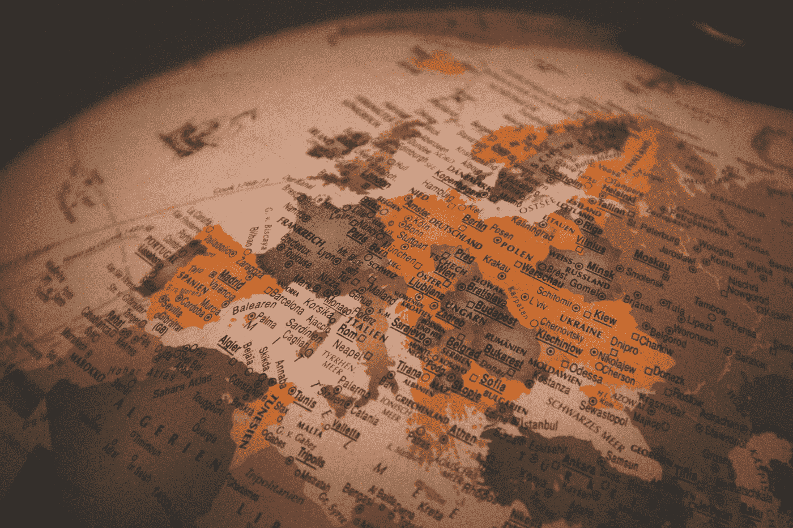

克里斯蒂安·卢在 [Unsplash](https://unsplash.com?utm_source=medium&utm_medium=referral) 上的照片

我有一些在学术项目中使用 Python 进行数据分析的经验，我想做一个简单的项目，将 Python 和 SQL 结合起来，提取一些数据见解。自从奥运会开始以来，我和每一位参与者都接触过“奥运会数据集——120 年的数据”。这种分析很有意思，可以观察国家支持的体育体制是否会提高运动员的奖牌产量。它不仅是一种宣传手段，还帮助孩子们找到了生活的目标，并帮助人们通过大众体育文化保持健康。苏联运动员在奥运会上的成功就是一个很好的例子。虽然这个国家在 1954 年加入了国际奥委会，并一直竞争到 1992 年，但结果是惊人的，值得进一步探索。

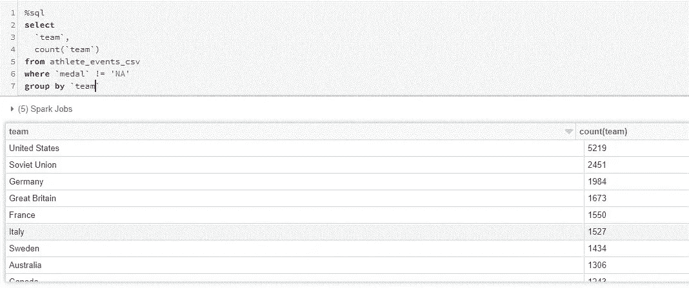

1992 年代表队由来自已经解体的苏联的运动员组成

**我假设的客户:**

我与 SportsStats 密切合作，为他们的合作伙伴发现有趣的事实。在审查所提供的数据后，有希望产生有新闻价值的故事或健康见解。

**假设:**

1)在美国之外，所有国家控制的体育系统国家都将比业余国家表现更好。

2)每一个苏联国家都会有一个时间滞后，在这个时间滞后里，新的制度会被实行。因此，从参赛开始的 3 个奥运周期后，所有的成绩都会提高。

**做法:**
1。导入和清理数据；将原始数据集分成第一个和第二个 word countries 表；
2。根据团队和年份进行筛选，以查看绩效；
3。通过 Pearson 和 P 值进行统计分析，找出相关性。

**第一步:导入并清理数据。**

我们从导入库和数据集的 csv 开始。一旦导入，最好熟悉我们已经得到的数据。

在浏览了各列之后，很明显并不是所有提供的数据都是分析所必需的。所以我们将放弃其中一些。

一旦我们过滤了所需的列，就该将数据集分为苏联和资本主义两类了。为了获得更准确的结果，我们将使用 1952 年至 1992 年的时间限制，因为在此期间，苏联系统在华沙条约组织国家实施并活跃。

**第二步:根据团队和年份进行筛选，查看绩效。**

一旦我们把我们的国家分成几个表，就该看看他们在全球范围内的表现了！我们将创建一个函数来计算每个国家的奖牌数，以及苏联赢得的奖牌总数。当我们在前 3 个奥运周期运行该函数时，我们得到以下结果:

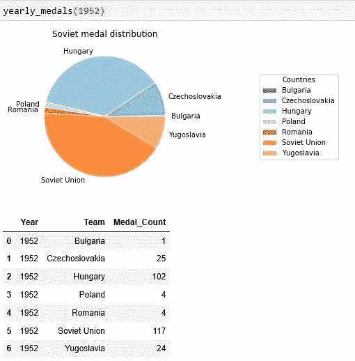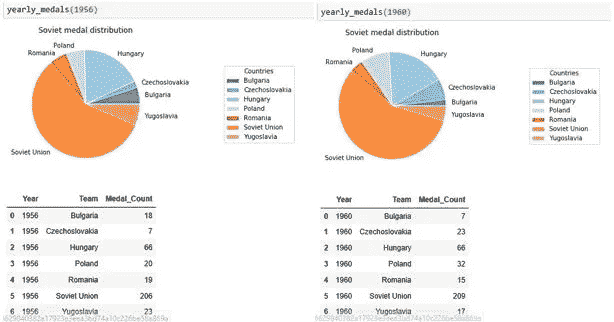

从提供的数字来看，趋势并不一致。随着时间的推移，苏联、保加利亚、捷克斯洛伐克、波兰和罗马尼亚的奖牌数都在增加。然而，匈牙利(在 1954 年奥运会上获得第三名)和南斯拉夫表现出下降趋势。同样值得注意的是，直到 1964 年，德国作为一个统一的国家参加，所以从 1968 年奥运会的奖牌情况来看将是一个好主意。

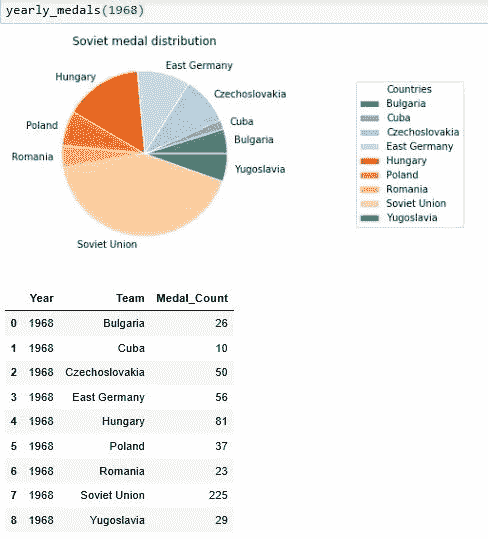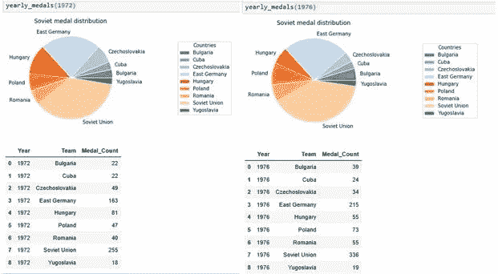

随着东德的引入，大多数球队都表现出类似的趋势。随着时间的推移，苏联、东德、保加利亚、古巴、波兰和罗马尼亚的奖牌数都在增加。而匈牙利、南斯拉夫(略有增加)和捷克斯洛伐克则呈下降趋势。这使得我们的第二个假设有点混乱——随着时间的推移，大多数国家开始显示出更好的结果，但也有一些国家，显示出相反的动态。

我们将使用相同的构建函数来确定资本主义集团中的哪些国家对整体奖牌表现贡献最大。

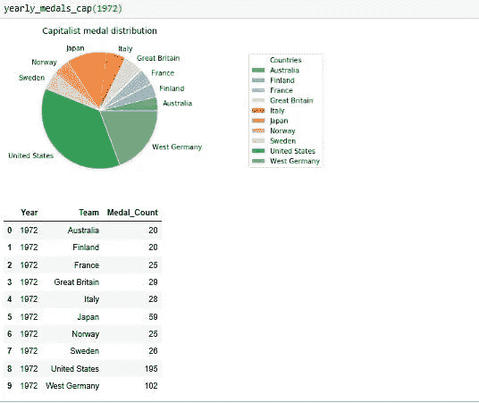

提供的两个游戏摘要让我们可以比较苏联对资本主义国家的表现。一旦计算出这一指标，就会发现在 1968 年之前，表现最好的资本主义国家生产率更高。然而，在美国之外，这些国家比他们的苏联对手表现得更好，直到东德和它的贡献越来越大，从 1972 年开始扭转了局势。

(*注:我们不包括 1980 年和 1984 年的奥运会，因为分别在 1980 年和 1984 年遭到资本主义国家和苏联的抵制。)

在对所有游戏运行该功能后，我们设法分离出表现最好的国家。现在，我们可以创建一个他们最有成效的学科的表格，这样我们就可以确定，在给定的运动中，哪个系统是最好的，以及哪个领域被证明是每个区块最有成效的。

我们可以在上面的柱状图中清楚地看到哪些运动对美国在奥运会上的成功贡献最大。为列表中的每个团队运行这些图表，我们将为两个模块创建性能表。

所有被讨论的国家都有几项运动的优异表现要感谢。通过游戏年份过滤国家，我们得到以下结果。

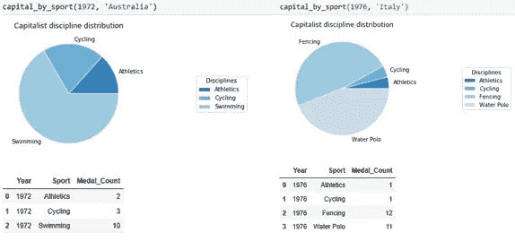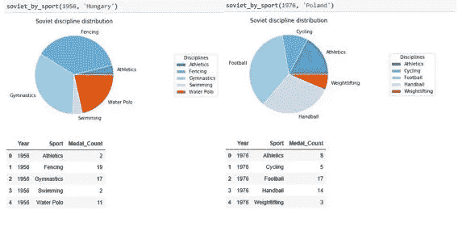

这些图表表明，苏联国家更喜欢团队运动，他们一直是一股强大的力量。

测量的周期。个别学科更倾向于哪个体育学校对个别国家来说更强(例如苏联的滑雪)。同样显而易见的是，在苏联对该国的体育制度进行改革后，成绩有所提高，并且从零开始建立了联合会(古巴的拳击运动，直到革命后才普及)。

另一方面，资本主义国家更擅长个别项目——田径、游泳、自行车。后来的调查显示，在这个国家最受欢迎或最普及的运动最终占据了奖牌的希望——就像美国的田径、英国的自行车或英国和澳大利亚的曲棍球。

**第三步。通过 Pearson 和 P 值进行统计分析，找出相关性。**

***

**皮尔逊相关**(双变量相关)是一种统计，用于测量两个变量 X 和 y 之间的线性[相关](https://en.wikipedia.org/wiki/Correlation)。它的值介于+1 和 1 之间，其中 1 表示完全正线性相关，0 表示没有线性相关，1 表示完全负线性相关。

**P-value** 是如果相关系数实际上为零(零假设)，您找到当前结果的概率。如果这个概率低于常规的 5% (P < 0.05)，则相关系数称为统计显著性。

***

我们要找出每张桌子上运动表现之间的相关性。由于对奖牌榜贡献最大的是田径和游泳，我们将首先比较它们，然后看看其他学科的表现如何。

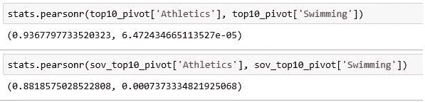

看起来两个表的相关性很强。这并不奇怪，因为我们看到的是历届奥运会中最成功的球队。让我们来看看田径运动和自行车运动之间的关系。

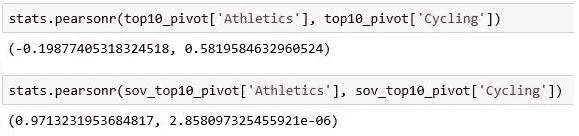

这显示了更强的相关性，但我们的资本主义表给出了一个很弱的皮尔逊值和一个很高的 P 值。因此，正确的结果将是这两者之间的非线性相关。水上运动的情况与整个水上运动家族非常相似:在一个家族中表现出色的人通常在另一个家族中表现出色。

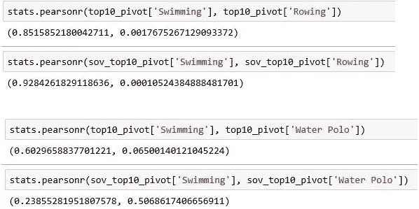

然而，资本主义表显示更多的是线性关系，而苏联看起来像是非线性关系。

但是团队运动呢？既然苏联队应该表现得“好得多”？结果并不简单:

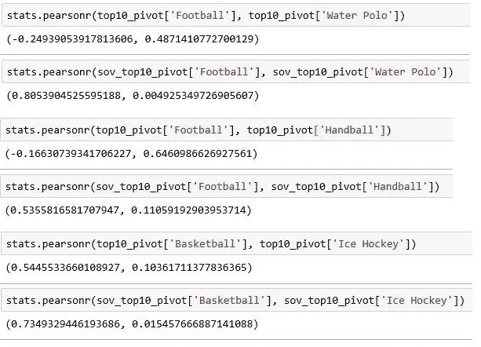

资本主义表中的关系几乎没有显示出任何相关性，而苏联的表现更加线性，尽管不是完全线性。

**结论。**

1.采用苏联的体育体制提高了每个国家每一届比赛的成绩，即使从结果来看，最大的受益者是苏联

2.具有独立准备体系的资本主义国家在其最强的学科中表现出更一致的结果。

3.东欧体操学校给了苏联国家巨大的优势。从 20 世纪 50 年代初开始，为了“提高苏联人民的身体健康水平”，体操运动开始普及。后来，这项法令变成了在最高级别上赢得更多奖牌的一种方式，这导致了苏联在奥运会舞台上的统治地位。除了日本，没有哪个资本主义国家在奥运会上表现更好。

4.特别值得一提的是击剑。作为一项竞技运动，它起源于意大利，意大利一直是这项运动中最强大的力量。匈牙利击剑学校也被认为是欧洲第二好的学校。在欧洲赛区之后，高标准的匈牙利击剑在整个苏联地区被教授，结果苏联运动员有了很大的提高。

5.加入苏联阵营的每个国家的强校都为其他国家的训练方法做出了贡献。苏维埃制度吸取了一个国家的经验并采用了这种做法。很好的例子——击剑、体操和水球

# 假设:结论

1.除了美国之外，所有国家控制的体育系统国家都会比业余的表现更好。
部分正确——从 1972 年奥运会开始。

2.**每个苏联国家都会有一个时间差，在这个时间差里，新的制度会被实施。因此，从参赛开始的 3 个奥运周期后，所有的成绩都会提高。** 部分正确——部分国家呈下降趋势。1968 年东德加入后，所有国家都呈现稳定增长。

# 讨论。

尽管体育是苏联政权的一种政治宣传手段，但它是一种大众现象，吸取了它所庇护的国家的最佳实践，并全面实施。中国在筹备 2008 年奥运会时也采取了同样的方法，这促使他们成为奥运会的主要力量之一。在国际合作方面有很大的空间，当谈到最佳的训练方法，以使奥运会更具竞争力，胜利者的范围更广，更包容其他国家。

感谢您的阅读，您可以在我的 [GitHub](https://github.com/NiqDS/State-Independency-Metric) 上找到代码，任何反馈、意见、建议都将不胜感激！