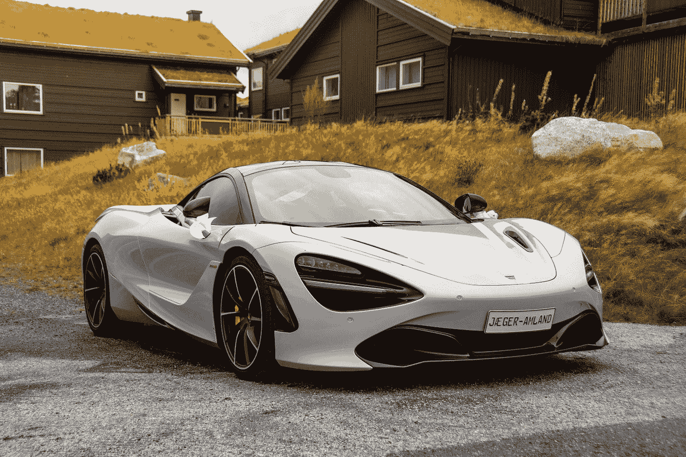
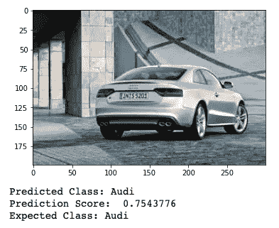
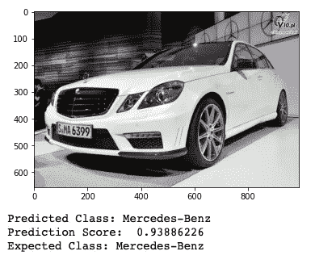
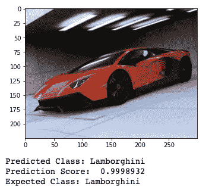
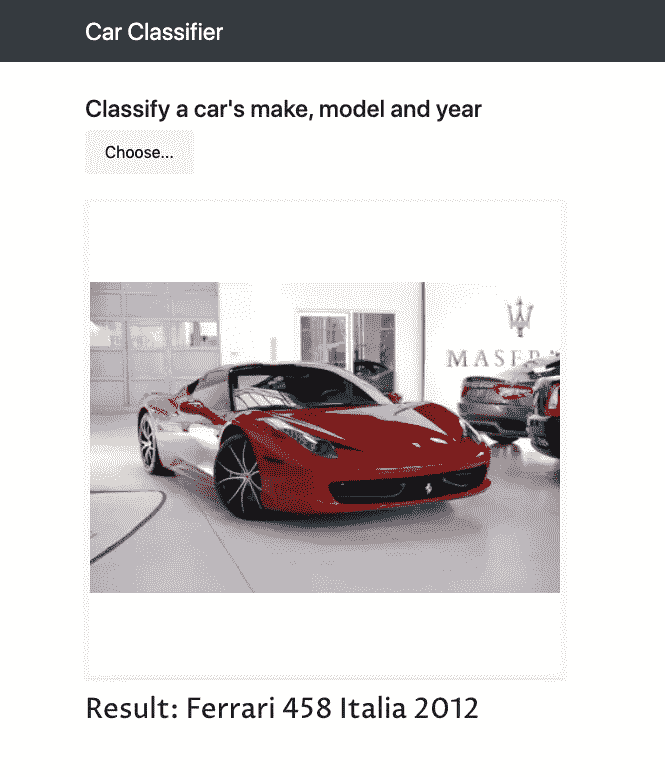

# 使用 Inception-v3 进行汽车分类

> 原文：<https://towardsdatascience.com/car-classification-using-inception-v3-71b63e9825b7?source=collection_archive---------20----------------------->

## 关于使用 Monk 训练 3 个模型来分类汽车的品牌、型号和年份，并通过 Flask API 部署它们的文章



奥拉夫·特维特在 [Unsplash](https://unsplash.com?utm_source=medium&utm_medium=referral) 拍摄的照片

# 介绍

这篇文章是关于使用 [Monk](https://github.com/Tessellate-Imaging/monk_v1) 训练 3 个深度卷积神经网络，这是一个计算机视觉的开源库，然后通过一个 API 部署它们。这些模型以汽车的图像作为输入，然后预测汽车的品牌、型号和年份。这些模型已经在 [Cars 数据集](https://ai.stanford.edu/~jkrause/cars/car_dataset.html)上进行了训练。

对于**迁移学习**，使用了带有预训练权重的 **Inception-v3** 架构。一些初始层被冻结，并且在剩余层上进行训练。

训练之后，模型通过 Flask API 被**部署**。它通过 POST 请求接受图像，并将预测返回给用户。

对于**培训笔记本，**勾选[本](https://github.com/PiyushM1/Car-make-model-and-year-classifier)。

对于**烧瓶 API，**检查[这个](https://github.com/PiyushM1/Car-classification-API)。

# 目录

1.  安装 Monk
2.  数据集
3.  训练模型
4.  培训结果
5.  通过 API 部署模型
6.  运行 API
7.  结论

# 1.安装 Monk

Monk 是一个开源的计算机视觉库。你不需要深入了解 Python 或任何深度学习框架就能使用它。它通过为流行的深度学习框架提供包装函数来简化计算机视觉，并使人们能够使用最少的代码来使用它们的功能。查看它的 [GitHub 库](https://github.com/Tessellate-Imaging/monk_v1)以获取更多信息。

本文使用 Monk 库的 PyTorch 后端，但是如果您愿意，您可以安装任何其他版本的 Monk。点击查看[的详细安装说明。](https://github.com/PiyushM1/Car-make-model-and-year-classifier/blob/master/Car_make_model_year_classifier.ipynb)

*   **CPU(非 GPU)** : `pip install -U monk-pytorch-cpu`
*   **谷歌实验室** : `pip install -U monk-colab`
*   **卡格尔** : `pip install -U monk-kaggle`
*   对于支持 **CUDA** 的版本，请遵循这里[提供的说明](https://github.com/PiyushM1/Car-make-model-and-year-classifier/blob/master/Car_make_model_year_classifier.ipynb)。

要手动安装库**，请遵循此处提供的说明[。](https://github.com/PiyushM1/Car-make-model-and-year-classifier/blob/master/Car_make_model_year_classifier.ipynb)**

# **2.数据集**

**用于该任务的训练数据集是 [**Cars 数据集**](https://ai.stanford.edu/~jkrause/cars/car_dataset.html) 。它包含 196 类汽车的 16，185 张图片。级别通常在*品牌、型号、年份*级别，例如特斯拉 Model S 2012 或宝马 M3 coupe 2012。数据集附带一个 devkit，其中包含每张图像的标签，以及汽车周围边界框的坐标。但是我们只用标签。这里给出的代码打算在 python 笔记本中运行。**

****下载数据集:****

```
*# Create a directory for the dataset*
! mkdir data*# Download train dataset and extract it* ! wget "http://imagenet.stanford.edu/internal/car196/cars_train.tgz"
! tar -xvf 'cars_train.tgz' -C 'data'*# Download test dataset and extract it* ! wget "http://imagenet.stanford.edu/internal/car196/cars_test.tgz"
! tar -xvf 'cars_test.tgz' -C 'data'*# Download the devkit and extract it*
! wget "https://ai.stanford.edu/~jkrause/cars/cars_devkit.tgz"
! tar -xvf 'cars_devkit.tgz' -C 'data'
```

****准备标签:****

**准备标签所需的 devkit 中的文件:**

*   ****cars_meta.mat** :包含类名的单元格数组，每个类一个。**
*   ****cars_train_annos.mat** :包含变量‘annotations’，其中每个元素都有边界框的坐标，字段‘class’是图像的整数类 id，字段‘fname’是图像文件夹中图像的文件名。**

**要为培训准备标签:**

*   **首先，我们处理文件 **cars_meta.mat** 来分离每个类 id 的品牌、型号和年份。**
*   **然后，我们处理文件 **cars_train_annos.mat** ，为数据集中的每个图像分配标签，包括品牌、型号和年份。**

*   **从[此处](http://imagenet.stanford.edu/internal/car196/cars_test_annos_withlabels.mat)下载**cars _ test _ annos _ with labels . mat**后，可以按照类似的程序给测试图像分配标签。**
*   ****或者**，准备好的 csv 文件可以从[这里](https://github.com/PiyushM1/Car-make-model-and-year-classifier/tree/master/Labels)下载。**

****目录结构:****

```
./Project_directory/
|
|-------data (for dataset)
|         |
|         |------cars_test
|         |         |----------00001.jpg
|         |         |----------........(and so on)
|         |------cars_train
|         |         |----------00001.jpg
|         |         |----------........(and so on)
|         |------devkit
|         |         |----------cars_meta.mat
|         |         |----------cars_train_annos.mat
|         |         |----------........(and other files)
|                               _
|------vehicles_make.csv         |
|------vehicles_model.csv        |  (csv files with labels)
|------vehicles_year.csv        _|
|
|------.......(and other files/folders)
```

# **3.训练模型**

**当使用[和尚](https://github.com/Tessellate-Imaging/monk_v1)时，实验模型变得非常容易。通过更改几个参数，我们可以很快看到它如何影响模型的整体性能。这也加快了原型制作的速度。**

**我们将使用 Monk 的 PyTorch 后端。但是，Keras 和 MXNet-gluon 后端也是可用的。**

**在这里，我将解释训练 **Make 分类器**的程序。其他两个分类器可以用类似的方式训练。你可以在这里找到整个训练笔记本[。](https://github.com/PiyushM1/Car-make-model-and-year-classifier/blob/master/Car_make_model_year_classifier.ipynb)**

****导入并打开一个项目:****

****分配数据集:****

****设置模型参数:****

**我们将用预训练的权重加载 **Inception-v3** 模型，以便使用**迁移学习**来训练分类器。当训练数据集不够大时，这通常会使模型表现得更好。**

**我也尝试过训练 ResNet-50 模型，但是它的性能远不如 Inception-v3。**

****设置训练参数:****

**现在，我们将为 5 个时期训练模型。如果学习率和其他超参数足够好，训练可以从最后一个时期继续。我们将使用 **softmax 交叉熵**作为损失函数，因为它通常对分类任务非常有用。对于乐观者来说，我已经试验了随机梯度下降，但是 **RMSProp** 似乎表现得更好。**

****培训:****

**这将把在每个时期之后获得的模型连同一些与训练相关的附加信息一起保存到工作空间目录中。**

**运行`ptf.Summary()`可获得培训的详细总结。**

# **4.培训结果**

**我们将对整个测试数据运行模型以获得测试准确性，然后对一些单独的图像运行它们。**

****根据测试数据评估模型:****

**下面的代码返回了总体测试精度以及基于类的单个精度，这可以用来获得关于其性能的一些有用的见解。**

****运行部分图像的训练模型:****

****获得的结果:****

**在 8，041 幅图像的全部测试数据上评估模型。验证集与原始训练数据集有 20%的差异。模型获得的精度:**

1.  **制作分类器:最佳验证准确率:94.72%。测试准确率:84.27%**
2.  **模型分类器:最佳验证准确率:96.50%。测试准确率:83.99%**
3.  **年分类器:最佳验证准确率:94.17%。测试准确率:83.19%**

************

**从测试数据获得的图像预测**

# **5.通过 API 部署模型**

**当使用 Monk 训练模型时，它会自动创建一个工作空间目录。它包含所有的训练日志和在训练期间获得的所有中间模型。为了开发 API，我们只需要最终的模型具有与创建它们时相同的目录结构。如果你已经训练了你的模型，你可以使用它们。否则，你可以从[这里](https://github.com/PiyushM1/Car-classification-API/tree/master/workspace)下载最终模型的工作空间。**

**如果只是想测试 API，就勾选[这个](https://github.com/PiyushM1/Car-classification-API)。自述文件中有设置环境的详细说明。**

**在项目目录中创建一个名为“uploads”的子目录，用户上传的文件将在返回预测之前保存在其中。设置[虚拟环境](https://docs.python.org/3/tutorial/venv.html)并安装所需的库。虚拟环境不是必需的，但建议使用。从[这里](https://github.com/PiyushM1/Car-classification-API/blob/master/requirements.txt)下载 requirements.txt 文件并运行`pip install -r requirements.txt`**

**在工作区所在的项目目录下创建一个名为 **app.py** 的文件。我们将在这个文件中编写 API 的代码。**

****导入和实用功能:****

****响应 HTTP 请求的函数:****

**我已经为 API 提供了一个用户界面，但这不是必需的。如果你也想使用它，将[这个](https://github.com/PiyushM1/Car-classification-API/tree/master/static)和[这个](https://github.com/PiyushM1/Car-classification-API/tree/master/templates)目录下载到项目目录中，然后定义下面给出的 index()函数，使 API 在通过浏览器访问时加载网页。**

**upload()函数在“/predict”处响应 POST 请求，将其保存到名为“uploads”的子目录中，如果文件是有效的图像，则返回带有预测的字符串。**

****驱动功能:****

**它加载模型并启动服务器。**

# **6.运行 API**

**使用终端中的命令`python3 app.py`运行应用程序。**

**一旦服务器启动，您就可以通过使用 cURL 发送 POST 请求来测试 API。为此，如果您还没有 cURL，那么您首先需要安装它。然后，通过您的终端，在用图像的有效路径替换了<image_path>之后，运行下面的命令。</image_path>**

**`curl -X POST -F file=@'<image_path>' ‘http://0.0.0.0:5000/predict'`**

**这将把预测返回到您的终端本身。**

****或者**，您可以在您的浏览器中进入[**http://0 . 0 . 0:5000**](http://0.0.0.0:5000/)查看用户界面。然后使用“选择”按钮上传任何图像，并单击“预测”。然后它会返回这样一个预测:**

********

**API 的用户界面**

# **7.结论**

**本文涵盖了整个过程，包括数据准备、训练图像分类模型，以及最终通过 Flask API 部署它们。我们还使用了数据标准化、随机水平翻转、迁移学习、自定义优化器、学习率和损失函数。根据测试数据评估模型，它们表现得非常好，准确率接近 85%。然而，我对年份分类器具有如此好的准确性感到有点困惑，因为确实没有任何明显的特征可以帮助预测汽车的制造年份。我不确定仅仅用图像来预测年份是否是个好主意。**

**你也应该尝试调整一些超参数，或者使用不同的模型架构，看看它会怎么样。也可以用 Monk 同时测试模型或超参数的多个组合，点击[查看](https://github.com/Tessellate-Imaging/monk_v1)。**

# **参考资料:**

1.  **培训笔记本的 GitHub 存储库:[https://GitHub . com/piyu shm 1/Car-make-model-and-year-classifier](https://github.com/PiyushM1/Car-make-model-and-year-classifier)**
2.  **API 的 GitHub 存储库:[https://github.com/PiyushM1/Car-classification-API](https://github.com/PiyushM1/Car-classification-API)**
3.  **数据集:[https://ai.stanford.edu/~jkrause/cars/car_dataset.html](https://ai.stanford.edu/~jkrause/cars/car_dataset.html)**
4.  **僧库:[https://github.com/Tessellate-Imaging/monk_v1](https://github.com/Tessellate-Imaging/monk_v1)**

**感谢阅读！如果你觉得这篇文章有帮助，请告诉我。我们通过 [LinkedIn](https://www.linkedin.com/in/piyushmaheshwari1/) 来连线。**