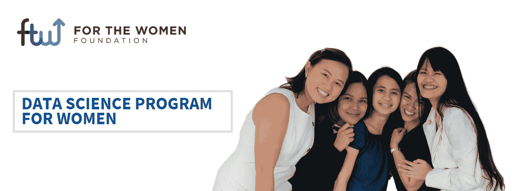
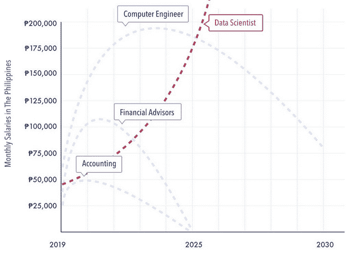
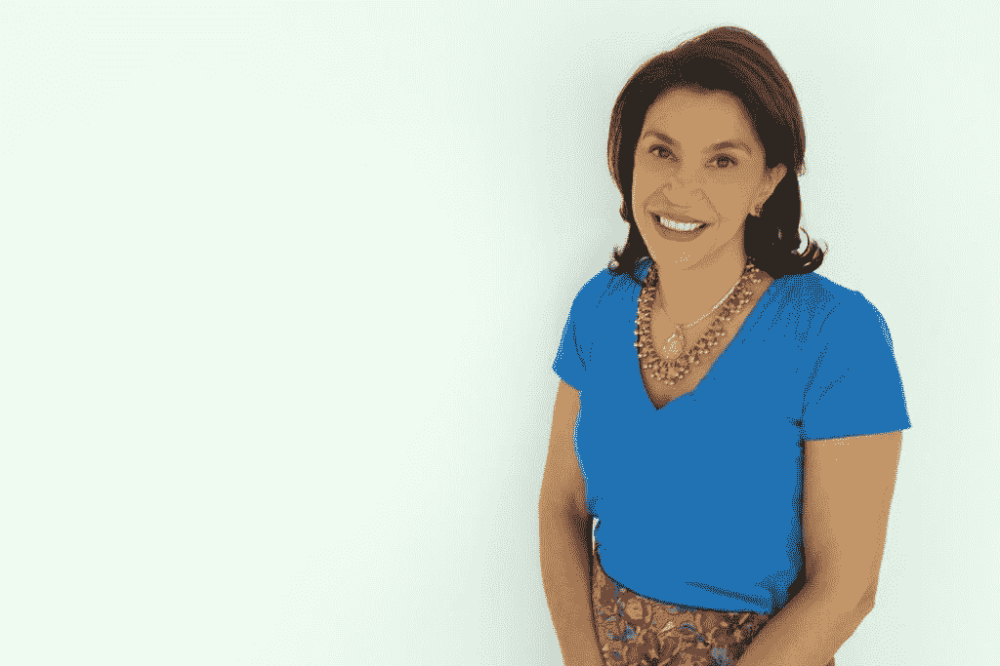
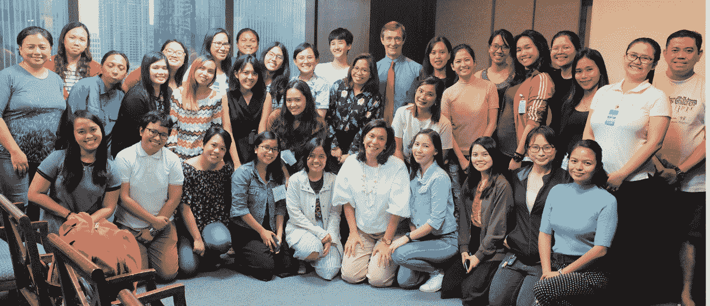
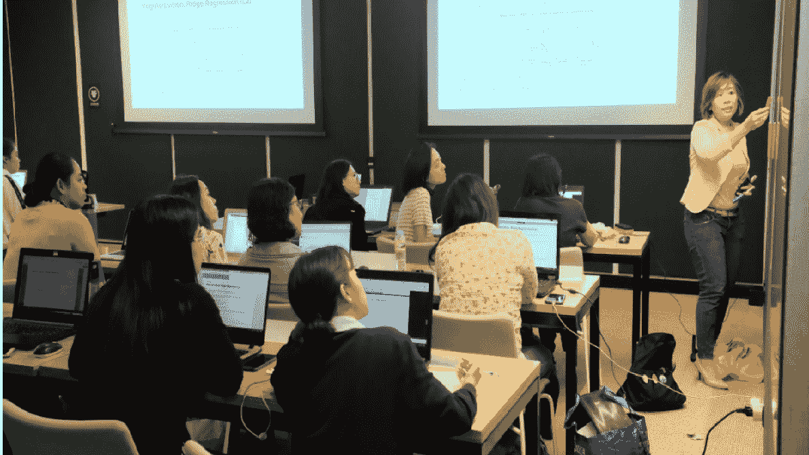
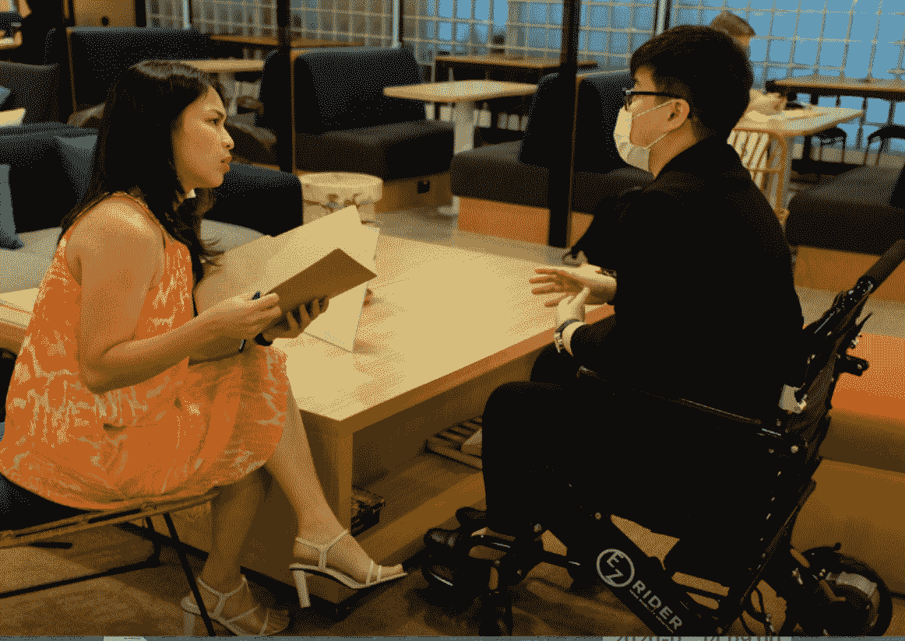

# 卡拉·威尔逊:通过技术教育提升职业流动性

> 原文：<https://towardsdatascience.com/cara-wilson-enabling-upward-career-mobility-through-tech-education-26eed4190fcb?source=collection_archive---------54----------------------->

## *科技女性系列*

## 菲律宾妇女基金会联合创始人访谈

尽管数据科学的发展和越来越多的报告描述了人工智能日益增长的重要性，但显然“并非所有的工作都有光明的未来”。在菲律宾等新兴国家，技术性别差距仍然很大，创造包容性的技术环境对该领域的整体发展至关重要。特别是在菲律宾，只有约 50%的工作年龄女性加入了劳动力大军——其中近一半从事“不稳定工作”[一个组织正在带头创建一个技术领域的菲律宾人社区，他们被授权打破这个玻璃天花板](https://www.ftwfoundation.org/)。

图片由菲律宾 FTW 基金会提供

for the Women Foundation(FTW Foundation)是一家菲律宾非营利机构，为女性提供免费的数据科学和人工智能培训。他们的使命是“[通过密集的技术技能培训来改变女性的生活，以实现向上的职业流动](https://www.ftwfoundation.org/about)”⁴ FTW 基金会的第一批数据科学团队在为期 14 周的项目结束后，月薪平均增长了 286%。此外，他们 92%的学者仅在 6 周内就获得了数据科学工作。ftw 基金会成立于 2018 年，迄今已培训和安置了近 100 名学者。通过他们的影响，FTW 基金会开创了一项运动——无论女性的社会经济和学术背景如何，每个参与该计划的 FTW 学者都有一个坚定不移的目标，即通过技术解决一些社会最大的问题来帮助菲律宾。⁶

图片由菲律宾 FTW 基金会提供

作为一名在马尼拉长大的菲律宾裔美国人，卡拉·威尔逊在美国完成了大学学业，之后在意大利米兰生活和工作了 22 年。她在哈佛学院学习历史，然后在纽约和马尼拉从事广告工作。此后不久，卡拉在意大利米兰的 SDA Bocconi 完成了 MBA 课程，然后在那里工作并组建了家庭。"我想你可以说我在三大洲安家了！"卡拉说，当我问她背景时。

图片由卡拉·威尔逊提供

Amber: 你一直都知道你想从事科技行业吗？
**Cara:** 完全不是。作为一名人文学者和营销主管，我一直认为技术对我来说就像一门外语。然而，由于我热爱语言，我想这最终是一个令人愉快的发现。技术可以是一个很好的均衡器，这就是 FTW 所利用的。

> [一个组织正在带头创建一个技术领域的菲律宾人社区，他们被赋予打破玻璃天花板的权力](https://www.ftwfoundation.org/)

**答:**是什么激励你从事数据科学职业，并开始为妇女基金会工作？你在市场营销方面的经验，以及你的历史学位，对你的决定起了什么作用？
**C:** 首先，我想澄清一下，我不是一名数据科学家，但我必须熟悉数据科学/分析的基础知识，以便完成 FTW 的使命，让值得帮助的女性进入这一充满希望的职业。当我在米兰的时候，我遇到了许多聪明的菲律宾妇女，她们被困在家务劳动中，尽管她们受过教育，有潜力做更多的事情。这一切都是因为在菲律宾缺少有前途的工作机会，他们不得不去国外工作，以便寄钱回家养家。在菲律宾，这意味着一代孩子在没有母亲和姐妹的情况下成长。我想成为解决方案的一部分，试着在某一天改变这一切。这是一次非常有益的经历。

我认为历史学位是让你投身于任何职业的完美方式——它不仅教会你写作，还让你拥有全面的视角，以及获取大量信息并以简洁的方式提取关键知识的能力。作为一名营销人员，我敏锐地意识到沟通的重要性，这些都是我工作中重要的技能。我认为我的思考和分析过程因为有这样的背景而得到了加强。

图片由菲律宾环球时报提供

**A:** 你创办 FTW 基金会时面临的最大挑战是什么，你是如何克服的？
**C:【嗯，我想我不得不实际一点，说筹资过去是——现在也是——艰难，但不知何故，既然我对自己的工作充满热情，宇宙似乎站在我们这一边，事情就迎刃而解了。我还认为，找到相信我们倡导的敬业导师也是一个挑战。数据科学家大多是年轻的专业人士，他们忙于建立自己的事业，很难要求他们抽出一些时间投入教学。然而，一旦我们找到了合适的人选，他们很快就会对我们的女学者的干劲和参与度印象深刻，这是灵感的巨大来源。他们可以真正看到这项工作如何让他们继续从事有趣的数据项目，同时真正改变生活。**

> **FTW 基金会正在带头发起一场运动，为女性和科技行业的转行者增加可及性和经济机会。**

****答:** FTW 基金会的愿景是创建一个技术领域的菲律宾人社区，让他们能够突破职业障碍。FTW 基金会是如何实现这一使命的，从第一批学生到现在的学生，你们的方法有什么变化？C: 通过我们短短的 1.5 年和近 100 名女性毕业生，我们对课程进行了改进，以反映菲律宾就业市场的现实。可持续就业是我们的成功标准，因此这很重要。我们还在为每位学员定制学习体验，并收集数据以不断改进我们的选择和培训方式。**

**一个有趣的发现是，我们已经意识到支持性社区学习经历在 FTW 项目中是多么重要。女性转行者往往是冒名顶替综合症的受害者，你需要一个强大的支持系统来鼓励你去争取，即使你有所怀疑。这种精神是 FTW 团队和我们校友的强大力量。我们的毕业生都自愿回来指导下一批学者。他们相信自己得到了这个独一无二的机会，他们想要付出——这个社区的力量随着每一个新的群体而增长。这已经成为一项真正的资产。**

****

**图片由菲律宾环球时报提供**

****A:** 你对其他希望在数据科学领域发展事业的女性有什么建议？
**C:** 我会建议他们沉浸在所有关于数据和数据科学的课程、小组和网络研讨会中。这是培养技能和从事个人数据项目的大好时机。这种“暂停”也是一个思考更大图景的独特机会——互联网、政府和特殊利益集团如何使用或滥用数据来操纵他们的信息。数据所扮演的角色在这场(冠状病毒公共卫生)危机中得到了凸显，他们应该思考自己为什么要成为数据科学家，以及自己希望在数据伦理领域扮演什么角色。这可能会给他们的职业道路带来更多的目标。**

****答:**你认为菲律宾下一代女性技术专家面临的最大挑战是什么，已经入行的女性能帮上什么忙？
**C:** 在菲律宾，最大的挑战是为所有菲律宾人提供高质量的教育机会，从而实现就业。社会经济差距很大，我担心随着 covid 危机的发展，这些经济不平等会更加明显。对于许多经济困难的女性来说，找到这些机会并拥有利用它们的资源是很困难的。**

**已经在科技领域取得成功的女性可以做很多事情来提供帮助——主持一场科技研讨会或网络研讨会，自愿参加一场鼓舞人心的演讲，指导一位开始科技职业生涯的女性，参与公司的多元化目标，为年轻女性营造一个可以茁壮成长的支持空间。我很惊讶有多少成功女性在确定了回报的优先顺序后，真的找到了分享她们经历的意义。他们只需要做出这样做的决定。**

****

**图片由菲律宾 FTW 基金会提供**

****答:**我们的读者如何参与 FTWFoundation？
**C:** FTW 正在招聘和寻找我们课程中许多主题的讲师、客座讲师和合作者/志愿者。我们还在设计一个新的导师计划，让有经验的数据专业人员能够单独了解我们的学员，并真正塑造他们开始数据职业生涯的第一步。这是一次鼓舞人心的经历，对导师和学员都有好处，而且可以远程完成。我很乐意听到任何感兴趣的人的意见，所以请联系我在[cara@ftwfoundation.org](mailto:cara@ftwfoundation.org)这样我们就可以探索合作——这些只是一些可能的参与方式，当然还有很多其他方式。**

**FTW 基金会正在带头发起一场运动，为女性和科技行业的转行者增加可及性和经济机会。不仅仅是提高妇女的技术素养和技能，FTW 基金会还教导他们的菲律宾学者要相信自己，为更美好的未来而奋斗。**

**要了解菲律宾妇女基金会的更多信息，请随时通过以下平台与他们联系:网站上的
*:*:[:](https://www.ftwfoundation.org/):
:*:*:[:【https://www.facebook.com/ftwfoundation/】:](https://www.facebook.com/ftwfoundation/):
:*；LinkedIn:*:[:](https://www.linkedin.com/company/ftwfoundation)**

***特别感谢 Cara Wilson 允许我为这个系列采访她，也非常感谢 TDS 编辑团队对这个项目的支持。***

**你认识一位鼓舞人心的科技界女性，你希望她出现在这个系列中吗？你是否正在从事任何你希望我写的很酷的数据科学和技术项目？欢迎给我发电子邮件，向 angelamarieteng@gmail.com 寻求意见和建议。感谢阅读！**

**[1]引自 FTW 网站[https://www.ftwfoundation.org/](https://www.ftwfoundation.org/)**

**[2]统计自以下文章[https://www . wheninmanila . com/read-ftw-foundation-provides-free-tech-courses-for-young-women/](https://www.wheninmanila.com/read-ftw-foundation-provides-free-tech-courses-for-young-women/)**

**[3]视觉来自 FTW 网站[https://www.ftwfoundation.org/](https://www.ftwfoundation.org/)**

**[4]来自 FTW 网站的任务[https://www.ftwfoundation.org/](https://www.ftwfoundation.org/)**

**[5]从 FTW 官方网站获得的统计数据**

**[6]关于这方面的更多信息，请见 https://www.ftwfoundation.org/about**

## **参考**

**彭扎兰，凯利。阅读:FTW 基金会为年轻女性提供免费的技术课程。**

***FTW 基金会*。[https://www . edukasyon . ph/organizations/ftw-foundation/about。](https://www.edukasyon.ph/organizations/ftw-foundation/about.)**

**埃拉·里维拉。*这些女性在数据科学领域处于领先地位，你也可以*。[https://young star . ph/这些女人在数据科学领域处于领先地位。](https://youngstar.ph/these-women-are-leading-the-pack-in-data-science-and-so-can-you/.)**

**马纳洛，希拉。*Sherlyn Malit 主持的第一次 FTW 基金会开工演习*。[https://medium . com/the-looking-glass/1st-ftw-foundation-commencement-exercises-by-sherlyn-malit-bf7ab 845250 b。](https://medium.com/the-looking-glass/1st-ftw-foundation-commencement-exercises-by-sherlyn-malit-bf7ab845250b.)**

***为妇女基金会*。[https://www.ftwfoundation.org/.](https://www.ftwfoundation.org/.)**