# 媒体混合建模中的遗留和形状效应:论文综述

> 原文：<https://towardsdatascience.com/carryover-and-shape-effects-in-media-mix-modeling-paper-review-fd699b509e2d?source=collection_archive---------5----------------------->

## 在下面的文章中，我将回顾并实现“带遗留和形状效应的媒体混合建模的贝叶斯方法”的主要部分。

全文可以在这里找到:[链接](https://static.googleusercontent.com/media/research.google.com/en//pubs/archive/46001.pdf)

**目录**

*   [媒体组合造型](#7da9)
*   [滞后效应](#2449)
*   [形状效果](#2174)
*   [全型号](#92e4)
*   [模拟](#8764)
*   [计算 roa/mroa](#5f29)
*   [优化营销预算](#e0df)

— — —

首先，媒体组合模型(MMM)旨在揭示付费媒体对利益衡量标准(通常是销售额)的因果影响。从历史上看，这个问题在很大程度上是通过线性回归建模的，因果影响是使用 Rubin 的潜在结果框架得出的。

用简单的(数据科学)术语来说，这意味着

1.  使用媒体支出和控制变量训练预测销售额的回归模型。
2.  通过比较媒体支出达到观察金额时和媒体支出为零时的销售额，得出因果影响。

从观察数据中估计偶然影响有许多问题，例如，对于初学者来说，“相关性不等于因果关系”。媒体混合模型有许多独特的问题需要注意。在这里可以找到对这些问题的精彩回顾:[媒体混合建模的挑战和机遇](https://storage.googleapis.com/pub-tools-public-publication-data/pdf/2d0395bc7d4d13ddedef54d744ba7748e8ba8dd1.pdf)

本文重点讨论两个具体问题:

*   结转效应，即滞后效应
*   形状效应，即收益递减

同时还提供贝叶斯模型、ROAS 计算和优化方法。

## 遗留效应

结转效应，通常被称为滞后效应，发生在媒体支出影响几天的销售时。例如，如果我们今天在展示广告上花了 100 美元，我们可能几天都看不到这笔花费的效果。adstock 函数试图将这种现象参数化，本文采用两种方法对 [adstock 建模](https://en.wikipedia.org/wiki/Advertising_adstock):

**几何**

*   这是过去 L 天的加权平均值，其中 L 可能因媒体渠道而异。
*   该效应对消费日的影响最大，并在此后衰减。

**延迟的股票**

*   媒体花费的影响在媒体花费之后 T(θ)天达到峰值。

## 履行

```
**def** **geoDecay**(alpha, L):
    '''
    weighted average with geometric decay

    weight_T = alpha ^ T-1 

    returns: weights of length L to calculate weighted averages with. 
    '''
    **return** alpha******(np**.**ones(L)**.**cumsum()**-**1)

**def** **delayed_adstock**(alpha, theta, L):
        '''
    weighted average with dealyed adstock function

    weight_T = 

    returns: weights of length L to calculate weighted averages with. 
    '''
    **return** alpha******((np**.**ones(L)**.**cumsum()**-**1)**-**theta)******2

**def** **carryover**(x, alpha, L, theta **=** None, func**=**'geo'):
    '''
    1\. x is a vector of media spend going back L timeslots, so it should be len(x) == L

    2\. Weights is a vector of length L showing how much previous time periods spend has on current period. 

    3\. L is max length of Lag.

    returns transformed vector of spend

    # update with numpy average 
    # np.average(x[:2], weights=[1,.9])
    '''
    transformed_x **=** []
    **if** func**==**'geo':
        weights **=** geoDecay(alpha, L)

    **elif** func**==**'delayed':
        weights **=** delayed_adstock(alpha, theta, L)

    **for** t **in** range(x**.**shape[0]):
        upper_window **=** t**+**1
        lower_window **=** max(0,upper_window**-**L)
        current_window_x **=** x[:upper_window]
        t_in_window **=** len(current_window_x)
        **if** t **<** L:
            new_x **=** (current_window_x*****np**.**flip(weights[:t_in_window], axis**=**0))**.**sum()
            transformed_x**.**append(new_x**/**weights[:t_in_window]**.**sum())
        **elif** t **>=** L:
            current_window_x **=** x[upper_window**-**L:upper_window]
            ext_weights **=** np**.**flip(weights, axis**=**0)             new_x **=** (current_window_x*****ext_weights)**.**sum()
            transformed_x**.**append(new_x**/**ext_weights**.**sum())

    **return** np**.**array(transformed_x)
```

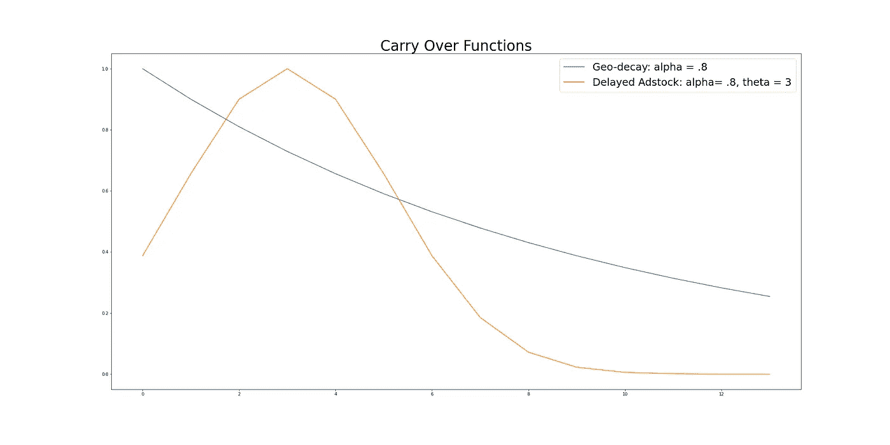

上面，我们可以看到给定参数的几何和延迟的 adstock 函数的形状。正如预期的那样，几何函数以强烈的冲击开始，然后稳步下降，而延迟的 adstock 函数在花费后 3 天(θ= 3)达到峰值，然后迅速下降。

## 形状效应和收益递减

接下来，本文讨论了收益递减现象，在本文中称为形状效应。当媒体渠道开始失去其有效性时，即花费 0 美元和 50 美元之间的差额远大于 200 美元和 250 美元时，就会出现这种情况。

[Hill 函数](https://en.wikipedia.org/wiki/Hill_equation_(biochemistry))用于对此建模，这源于生物化学。

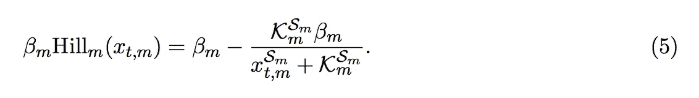

哪里；

*   S =斜率；大于 0
*   K =半饱和点；大于 0
*   β=通道系数；大于 0
*   x =媒体支出

```
**def** **beta_hill**(x, S, K, beta):
    **return** beta **-** (K******S*****beta)**/**(x******S**+**K******S)
```

上面的等式是原始等式的修改版。在最初的希尔函数中，当 X 接近无穷大时，该函数接近 1，因此我们乘以一个β系数来说明营销渠道的各种优势。如果我们排除贝塔变量，每个渠道将有同样的效果。

论文确实指出了函数的可辨识性差。例如，当 K(半饱和度)点在观察到的媒体花费之外时。

*   我们可以在下图的蓝线中看到这一点。请注意，我们没有观察到半饱和点，即由于收益递减，蓝线没有开始变平，因此我们的模型不可能找到正确的值。因此，随着媒体支出持续增加，我们的模型可能会错误地预测高回报。

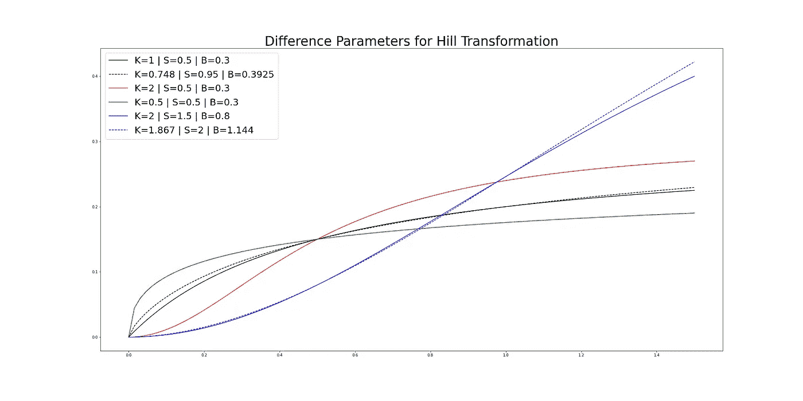

上图显示了希尔函数可以呈现的各种形状。

## 组合:结转和形状/滞后和收益递减

接下来，我们需要一种方法来结合遗留效应和形状效应。该文件提出了两种可能的方法。

1.  首先应用 adstock 函数，然后应用 shape 函数。
2.  首先应用 shape 函数，然后应用 adstock 函数。

如果在任何给定的时间段内都有少量的花费，本文推荐路线 1。这是有意义的，因为形状效应不太可能被小额消费激活。或者，对于大的持续花费，首先应用形状(收益递减)效果，然后应用 adstock 函数是有意义的。

## 模型

现在我们可以指定我们(报纸)媒体组合模型的功能形式:

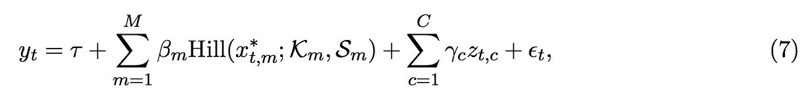

其中 Xt 已经通过 Adstock 函数进行了转换，Z 代表控制变量。

## 模拟

接下来我们进入模拟阶段。当从观察研究中估计因果效应时，模拟总是很重要的。通过模拟，我们可以生成一个合成数据集，使用我们的模型来估计因果关系，并将我们的估计与地面事实进行比较。这使得我们可以用一种用观测数据不可能的方式来测试我们的模型。

模拟数据集将包含:

*   两年的销售数据
*   三个媒体渠道
*   一个控制变量(价格)
*   媒体支出是通过将白噪声加入以一年为周期的正弦季节性而产生的
*   价格是通过 AR(1)系列生成的

```
*# media channels* N **=** 102 *# number of data points* t **=** np**.**linspace(0, 4*****np**.**pi, N)
data **=** 3**+**np**.**sin(t**+**0.001) **+** 0.5 **+** np**.**random**.**randn(N)
media_1 **=** ((data**-**min(data))**/**(max(data)**-**min(data)) ) 

t **=** np**.**linspace(0, 4*****np**.**pi, N)
data **=** 3**+**np**.**sin(t**+**0.001) **+** 0.5 **+** np**.**random**.**randn(N)
media_2 **=** ((data**-**min(data))**/**(max(data)**-**min(data)) )  

t **=** np**.**linspace(0, 4*****np**.**pi, N)
data **=** 3**+**np**.**sin(t**+**0.001) **+** 0.5 **+** np**.**random**.**randn(N)
media_3 **=** ((data**-**min(data))**/**(max(data)**-**min(data)) )  

*# price* **from** statsmodels.tsa **import** arima_process **as** arima

arparams **=** np**.**array([.7, .6])
maparams **=** np**.**array([.1, .02])
ar **=** np**.**r_[1, arparams] *# add zero-lag and negate* ma **=** np**.**r_[1, maparams] price_variable = arima.arma_generate_sample(ar,ma,102)alpha_media_1 **=** .6
theta_media_1 **=** 5
k_media_1     **=** .2
s_media_1     **=** 1
beta_media_1  **=** .8

alpha_media_2 **=** .8
theta_media_2 **=** 3
k_media_2     **=** .2
s_media_2     **=** 2
beta_media_2  **=** .6

alpha_media_3 **=** .8
theta_media_3 **=** 4
k_media_3     **=** .2
s_media_3     **=** 2
beta_media_3  **=** .3

L**=**13
ru**=**4
lamb **=** **-**.5
ep **=** .05******2

m1 **=** [beta_hill(x, s_media_1, k_media_1, beta_media_1) **for** x **in** carryover(media_1, alpha_media_1, L, theta **=** theta_media_1, func**=**'delayed')]m2 **=** [beta_hill(x, s_media_2, k_media_2, beta_media_2) **for** x **in** carryover(media_2, alpha_media_2, L, theta **=** theta_media_2, func**=**'delayed')]m3 **=** [beta_hill(x, s_media_3, k_media_3, beta_media_3) **for** x **in** carryover(media_3, alpha_media_3, L, theta **=** theta_media_3, func**=**'delayed')]

y **=** np**.**repeat(ru, N) **+** m1 **+** m2 **+** m3 **+** (lamb*****price_variable) **+** np**.**random**.**normal(0, ep, N)
```

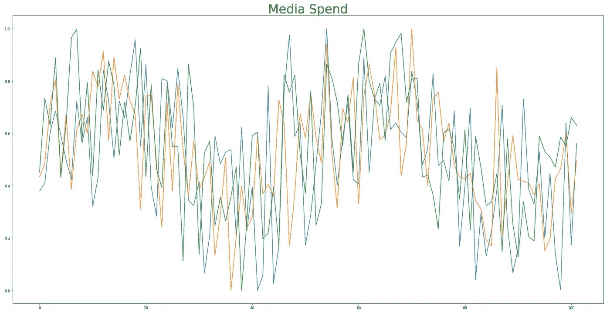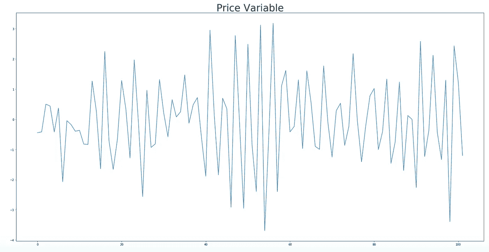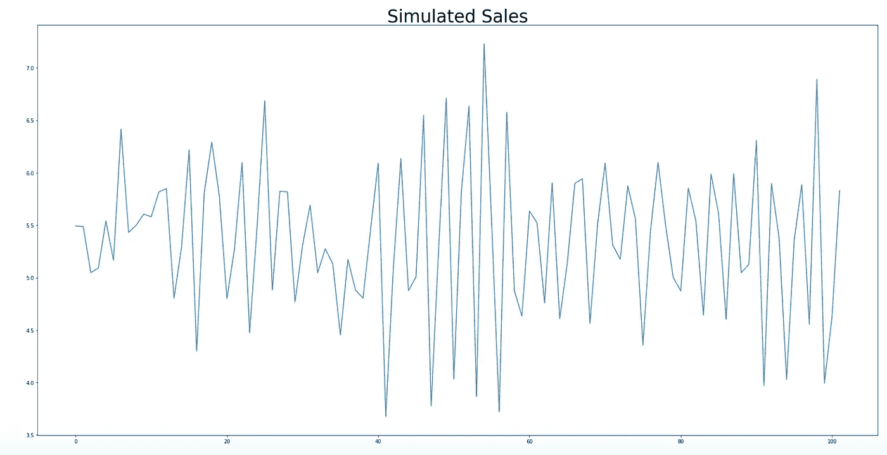

# 拟合模型。

既然已经模拟了数据集，现在是时候拟合模型了。论文用的是 STAN，然而我用的是 Python/PyMC3。

```
import arviz as az
import pymc3 as pmwith pm.Model() as m:
    alpha = pm.Beta('alpha'          , 3 , 3  , shape=3)
    theta = pm.Uniform('theta'       , 0 , 12 , shape=3)
    k     = pm.Beta('k'              , 2 , 2  , shape=3)
    s     = pm.Gamma('s'             , 3 , 1 , shape=3)
    beta  = pm.HalfNormal('beta'     , 1      , shape=3)
    ru    = pm.HalfNormal('intercept', 5) 
    lamb  = pm.Normal('lamb'         , 0 , 1) 
    noise = pm.InverseGamma('noise'  , 0.05, 0.0005) 

    transpose_m1 = [beta_hill(x, s[0], k[0], beta[0]) for x in carryover(media_1, alpha[0], L, theta = theta[0], func='delayed')]
    transpose_m2 = [beta_hill(x, s[1], k[1], beta[1]) for x in carryover(media_2, alpha[1], L, theta = theta[1], func='delayed')]
    transpose_m3 = [beta_hill(x, s[2], k[2], beta[2]) for x in carryover(media_3, alpha[2], L, theta = theta[2], func='delayed')]

    y_hat = pm.Normal('y_hat', mu=ru + transpose_m1 + transpose_m2 + transpose_m3 + lamb * price_variable,
                  sigma=noise, 
                  observed=y)trace = pm.fit(method='svgd')
```

## 结果

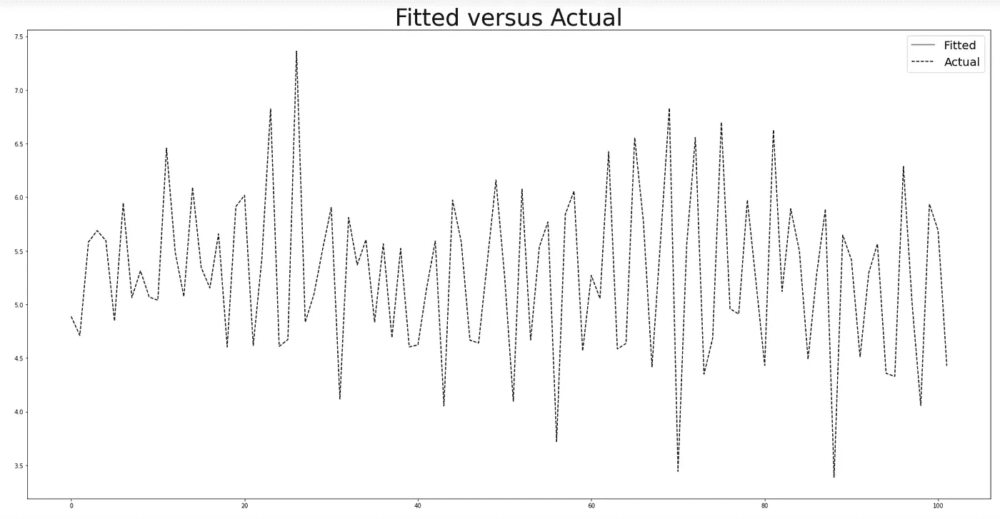

*   MAPE: 0.12
*   平均寿命:0.026

正如所料，样本内拟合(MAE 梅伊)相当好，1)因为它是样本内的，2)因为我们生成的数据与我们正在建模的函数形式相同。因此，这归结于 MCMC 近似的效果。

## 真实参数与近似参数。

下面，我们可以看到模型参数相对于真实模型参数的后验分布(蓝线)。这使我们能够了解我们的模型在恢复真实模型参数方面表现如何。

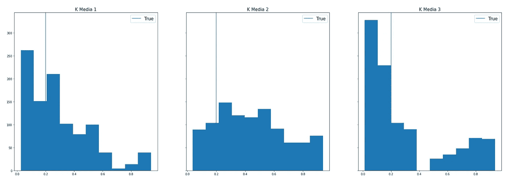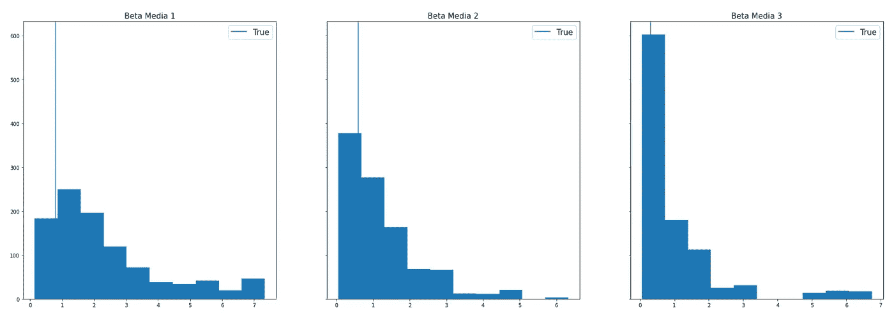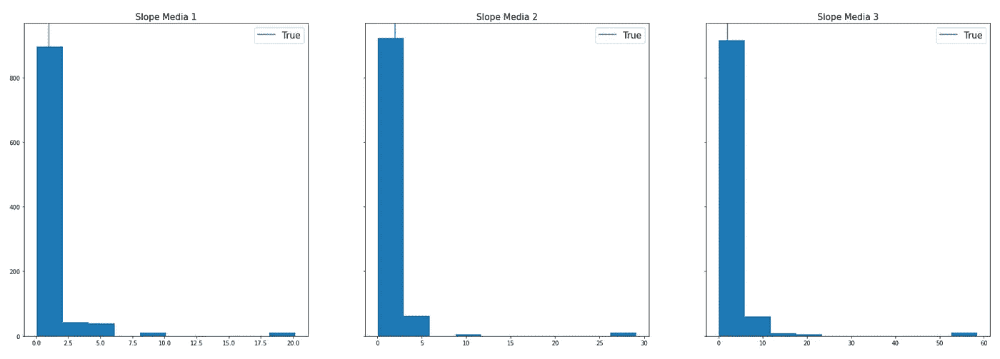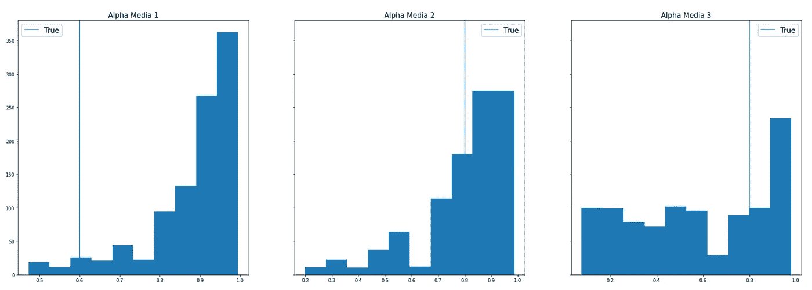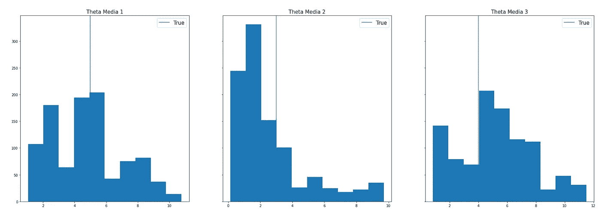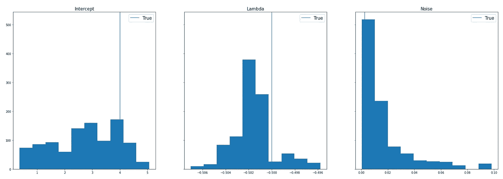

## ROAS / mROAS 计算

现在，我们用以下公式计算 roa 和 mROAS。

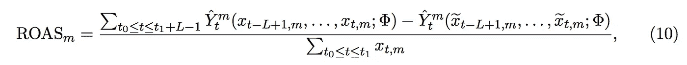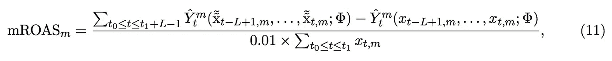

在英语中，上面的等式转化为所有媒体渠道打开时的预测销售额减去除第 M 个媒体渠道之外的所有媒体渠道的预测销售额，再除以支出。唯一的问题是，我们必须考虑后期效应(即合成实验结束后的遗留效应)。因此，我们不仅要计算变更期，还必须包括后变更期。

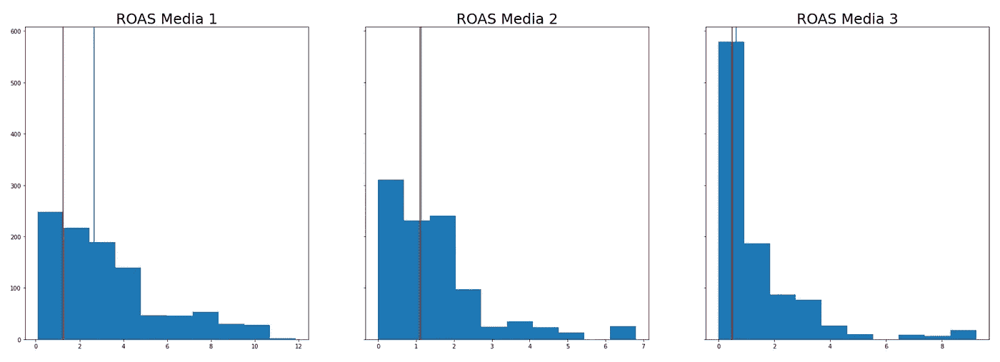

```
# simulate ROAS media_1_roas = []
media_2_roas = []
media_3_roas = []burnin=500
for i in range(1000):
    burnin=5
    s = np.random.randint(1,1000-burnin)
    intercept = t['intercept'][s]

    s_sample1, s_sample2, s_sample3 = t['s'][:,0][burnin:][s],     t['s'][:,1][burnin:][s],  t['s'][:,2][burnin:][s]
    k_sample1, k_sample2, k_sample3 = t['k'][:,0][burnin:][s],     t['k'][:,1][burnin:][s],  t['k'][:,2][burnin:][s]
    b_sample1, b_sample2, b_sample3 = t['beta'][:,0][burnin:][s],  t['beta'][:,1][burnin:][s],  t['beta'][:,2][burnin:][s]

    a_sample1, a_sample2, a_sample3 = t['alpha'][:,0][burnin:][s], t['alpha'][:,1][burnin:][s],  t['alpha'][:,2][burnin:][s]
    t_sample1, t_sample2, t_sample3 = t['theta'][:,0][burnin:][s], t['theta'][:,1][burnin:][s],  t['theta'][:,2][burnin:][s]

    fitted_m1 = [beta_hill(x, s_sample1, k_sample1, b_sample1) for x in carryover(media_1, a_sample1, L, theta = t_sample1, func='delayed')]
    fitted_m2 = [beta_hill(x, s_sample2, k_sample2, b_sample2) for x in carryover(media_2, a_sample2, L, theta = t_sample2, func='delayed')]
    fitted_m3 = [beta_hill(x, s_sample3, k_sample3, b_sample3) for x in carryover(media_3, a_sample3, L, theta = t_sample3, func='delayed')]

    y_hat    = intercept + fitted_m1 + fitted_m2 + fitted_m3 + t['lamb'][burnin:][s] * price_variable

    y_hat_m1 = intercept + fitted_m2 + fitted_m3 + t['lamb'][burnin:][s] * price_variable
    y_hat_m2 = intercept + fitted_m1 + fitted_m3 + t['lamb'][burnin:][s] * price_variable
    y_hat_m3 = intercept + fitted_m1 + fitted_m2 + t['lamb'][burnin:][s] * price_variable media_1_roas.append(sum(y_hat[L:]-y_hat_m1[L:]) / media_1[L:len(media_1)-L].sum())
    media_2_roas.append(sum(y_hat[L:]-y_hat_m2[L:]) / media_2[L:len(media_1)-L].sum())
    media_3_roas.append(sum(y_hat[L:]-y_hat_m3[L:]) / media_3[L:len(media_1)-L].sum())
```

## 优化营销预算

最后，我们继续优化预算。为了做到这一点，我们采用我们的模拟 ROAS 数，并将其转化为一个约束优化问题。

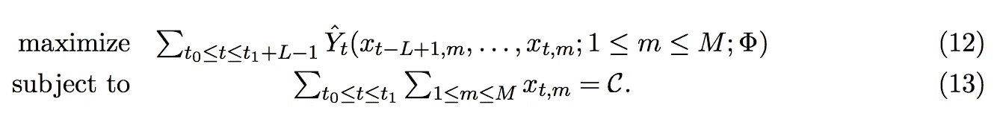

为了实现这一点，我们可以将我们的 ROAS 数字插入到一个 SciPy 优化函数中，以找到我们的销售额最大化的支出。

## 摘要

本文探讨了与介质混合建模相关的许多方面，重点是遗留物和形状效应，但也提供了贝叶斯模型的规范，并探讨了它在合成数据集上恢复真实模型参数的有效性以及先验和样本大小的影响(未涵盖)。

下一步，我会发现有趣的是，如何用这个模型做出决策，不仅最大化销售，而且最大化模型的“知识”。我们可以认为这是强化学习中的“探索”阶段。