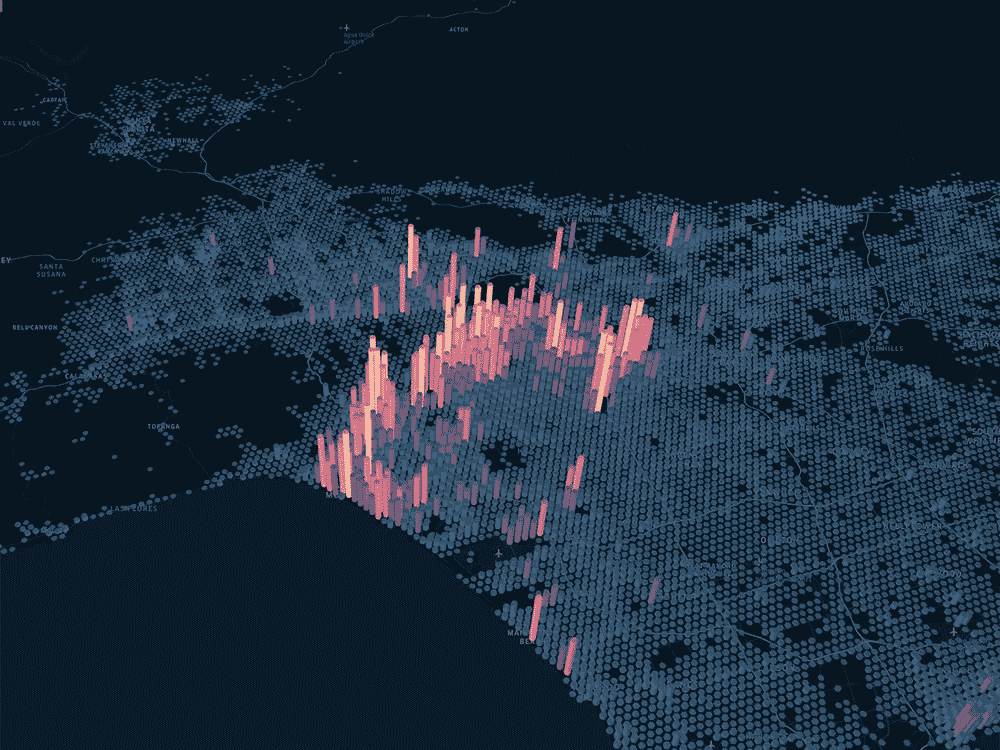
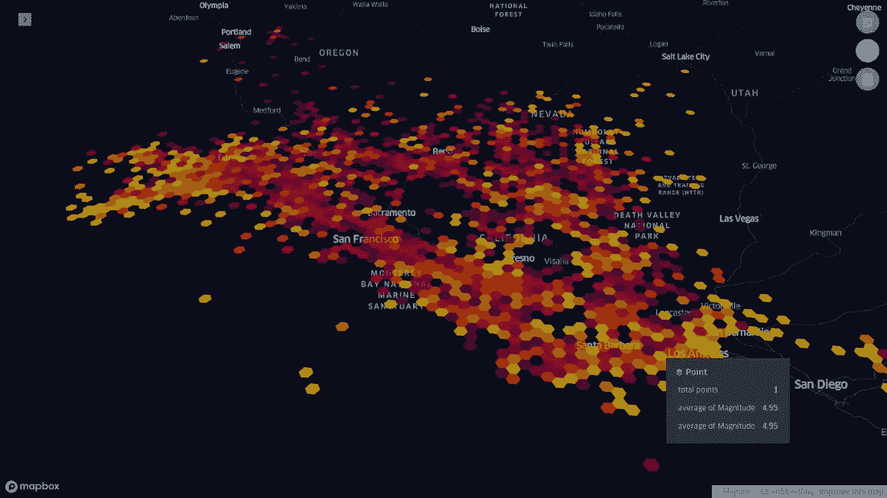
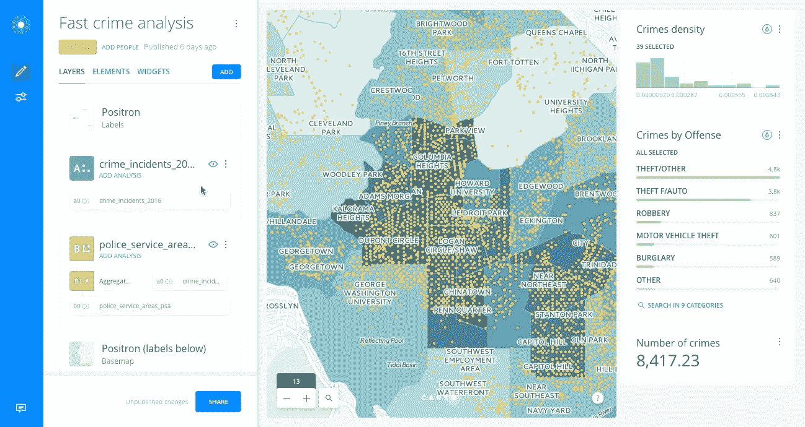
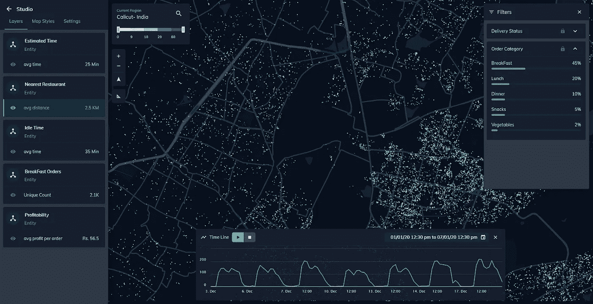
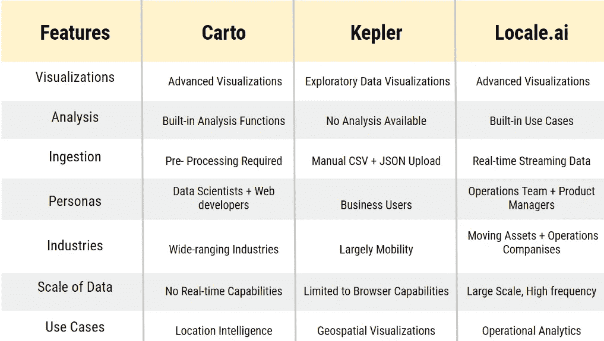
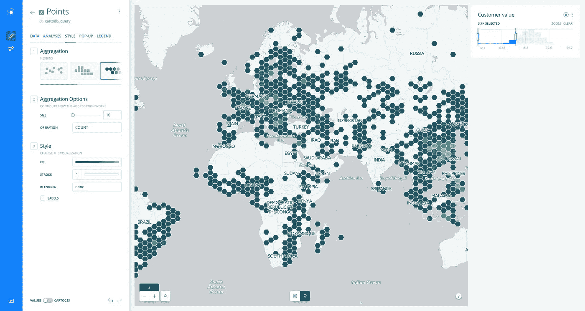
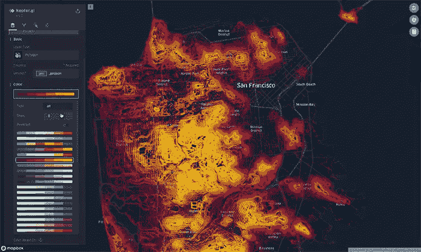

# Carto vs Kepler.gl:位置分析选择哪种工具？

> 原文：<https://towardsdatascience.com/carto-vs-kepler-which-tool-to-use-for-geospatial-analytics-894c867545b4?source=collection_archive---------25----------------------->

## 地理空间分析和洞察

## 不同用例的地理空间工具的比较

开普勒

# 工具的简要介绍

Carto 和 Kepler.gl 是公司在分析中用来做出地面运营决策的工具。在这篇文章中，我们从技术到目标用户等方面对它们进行了比较。

## 开普勒

开普勒

[Kepler.gl](http://kepler.gl/) 是一个基于网络的平台，用于可视化大规模位置数据。它由优步大学的可视化团队创建并开源，其使命是创建行业级开源框架来增强大数据。

## 三维电解剖标测系统

三维电解剖标测系统

[Carto](http://carto.com/) 是一个基于 PostGIS 和 PostgreSQL 的开源位置情报平台。CARTO(以前称为 CartoDB)是一个软件即服务(SaaS)云计算平台，提供 GIS、web 制图和空间数据科学工具。

## Locale.ai

locale.ai

在 [Locale.ai](http://locale.ai/) ，我们正在为按需公司的供应和运营团队建立一个使用位置数据的**运营**分析平台。类似于 web 分析工具(Google Analytics、Mixpanel、Clevertap)使用点击流数据对 web 产品进行分析，Locale 有助于使用地理空间数据分析和优化您的现场操作。

# 比较

此图简单展示了三种工具在不同特性或参数上的比较。本节将深入探讨所有参数。

比较汇总表

# 1-分析和可视化

## 开普勒

开普勒是探索性数据分析(EDA)的最佳地理空间可视化工具之一。优步团队已经对与移动公司相关的可视化特性做了彻底而详细的研究。

它最大的缺点之一是任何需要对数据进行的处理都需要在外部完成。不幸的是，Kepler.gl 是一个桌面工具，只接受 CSV、JSON 和 geoJSON 文件形式的数据。

当您处理大量数据并需要不断下载 CSV 以绘制到工具上时，这些特征会使您非常痛苦

## 三维电解剖标测系统

Carto 的可视化和分析能力更加水平，在他们作为一家公司处理的用例上撒下一张大网，其中包括不同种类的过滤器和小部件。它们在产品内部也有几个内置的分析(帮助你操作数据的预置函数)。

这里的缺点是，所有这些分析一次只能在一个数据集上进行。因此，这里的预处理也需要在系统之外进行，尤其是在更复杂的数据集的情况下。

## 现场

在现场，我们试图包括两个世界的最好的。我们从开普勒获得了可视化的灵感，并在产品中加入了分析——不是作为功能，而是作为用例。我们还跨不同的数据库、格式和系统接收您的所有数据，将其放在一个位置并建模，以便能够非常容易地进行这些分析。

三维电解剖标测系统

# 2-目标人物角色

## 开普勒

Kepler.gl 主要面向商业用户，由于其简单性，他们根本不知道如何编写代码或 SQL。然而，我们已经看到谷歌和 Airbnb 的大量数据科学家将它用于可视化。

## 三维电解剖标测系统

Carto 被定位为一个位置智能平台，具有数据分析和可视化的能力，不需要以前的 GIS 或开发经验。他们的 UX 是根据现代 web 开发人员和数据科学家的需求定制的。他们的可视化可以被商业用户用来做决定。

## 现场

我们在现场的目标用户也是业务用户——公司内部的供应和运营团队、产品团队、战略团队和营销团队。我们发现他们是最痛苦的人，大部分时间都在使用 excel 表格。他们仍然依赖分析师提供 BI 报告，或者依赖开发人员提供实时仪表盘。

# 3-目标行业

## 开普勒

如前所述，由于开普勒已经被优步开源，它的许多功能与移动公司更加相关。它也被学者和记者大量使用，因为他们不处理大量的数据直播。

## 三维电解剖标测系统

由于 Carto 更像一个平台，他们最终与各种各样的客户合作，从政府到金融、医疗保健到物流。

## 现场

我们认为我们的市场是供应和/或需求不断变化的每一家公司。这包括按需交付、微移动、物流、供应链以及劳动力公司。

开普勒

# 4-使用案例

## 开普勒

Kepler.gl 主要用于地理空间可视化。开普勒上已经建立的地图的一些例子是:

*   加州地震
*   纽约出租车之旅
*   旧金山海拔等高线
*   纽约市人口
*   旧金山街道树木地图

## 三维电解剖标测系统

Carto 涉足的用例有:

*   **场地规划:**推动场地选择和投资决策
*   **物流优化:**优化供应链设计
*   **地区优化:**协调销售和服务地区
*   **地理营销:**根据用户的位置和移动方式锁定用户&
*   **移动性规划:**更好的基础设施决策&减少流量

## 现场

我们在现场处理的用例有:

*   **生命周期分析:**对用户、骑手或订单旅程的分析，以减少掉线。
*   **供需分析:**分析需求(订单)和供应(骑手)的不匹配，减少闲置时间。
*   **行程分析:**分析行程和移动以提高利用率。
*   **单次行程分析:**根据运动模式创建单个用户、自行车或行程的简档。
*   **站址分析:**分析静态(或固定)实体的性能。

# 5-技术

## 开普勒

Kepler.gl 中有四个主要套件可供使用——Deck、Luma、React map 和 React vis——来制作漂亮的数据驱动地图。它是用 [deck.gl](https://deck.gl/#/) 构建的**和利用 [WebGL](https://www.wikiwand.com/en/WebGL) (一个 JavaScript API)更快更高效地渲染大数据。**

## 三维电解剖标测系统

Carto 的网络应用程序名为 Builder，用户可以在其中管理数据，运行用户侧分析和设计定制地图。CARTO 引擎是一组 API 和开发人员库，用于创建自定义地图和数据可视化界面。该工具在前端 web 应用程序、后端基于 rails 的 API 和客户端库中广泛使用 JavaScript。

## 现场

Locale.ai 使用各种强大的开源工具来处理前端和后端的大规模数据集。前端由优步的 Deck.gl 提供高性能可视化，Nebula.gl 提供额外的编辑功能，Mapbox-GL 用于渲染地图。

与其他平台不同，Locale 提供了实时和按需摄取大量数据的能力，以便动态地进行分析和获得洞察力。后端由 python、PostgreSQL 和 PostGIS 提供支持，用于强大的数据处理和地理空间操作。

# 内部构建

在与一些领先的按需和微移动公司合作时，我们观察到他们最终围绕开普勒本身或 QGIS 等开源工具进行黑客攻击。

有时开发人员也构建他们自己的内部工具，但大多数时候他们并不适合公司内部所有不同的受众，而且由于这些工具不是以可扩展的方式构建的，维护这些工具经常会占用他们大量的带宽！

很多时候甚至有重复的努力，轮子一遍又一遍地被重新发明。正如 Twilio 的杰夫·劳森所说

> “构建软件比以往任何时候都容易，但操作软件却比以往任何时候都难”。

## 为什么选择区域设置？

因此，如果你是一家决定在内部构建这一平台的公司，它必须像一个平台一样构建，(很像优步的做法)，并具有以下特征:

*   简单直观的用户界面来执行分析，特别是对于商业用户
*   具有可操作性的可扩展地理空间可视化
*   ETL 足够健壮，可以处理流数据以及及时返回的历史分析

这需要建立一个至少 6-7 人的团队(由前端和数据工程师、地理空间分析师以及数据科学家组成)。最重要的是，等待至少 6 个月来构建平台和启动分析的额外痛苦。

*如果你想进一步钻研，可以查看我们的* [*网站*](http://locale.ai/) *出来或者在*[*LinkedIn*](https://www.linkedin.com/in/aditi-sinha-6b774ba9/)*或者*[*Twitter*](https://twitter.com/aditi1002)*上与我取得联系。*

*原贴* [*此处*](https://medium.com/locale-ai/carto-vs-kepler-vs-locale-which-product-to-use-for-geospatial-analytics-2f85ff0c5537) *。*

## 相似读数

 [## 开普勒& QGIS:开源地理空间工具浅析

### 为什么我们需要地理空间分析？为什么现在比以往任何时候都重要？人类的大脑主要识别信息…

blog.locale.ai](https://blog.locale.ai/kepler-qgis-a-brief-analysis-of-the-open-source-geospatial-tools/)  [## 在地理空间上弥合最后一英里递送公司的供需差距

### 当供需缺口存在时，我们要么失去订单，要么我们的骑手闲置-这两者都导致…

blog.locale.ai](https://blog.locale.ai/bridging-supply-demand-gaps-in-last-mile-delivery-companies-geospatially/)