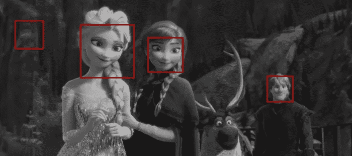
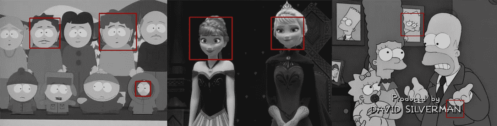
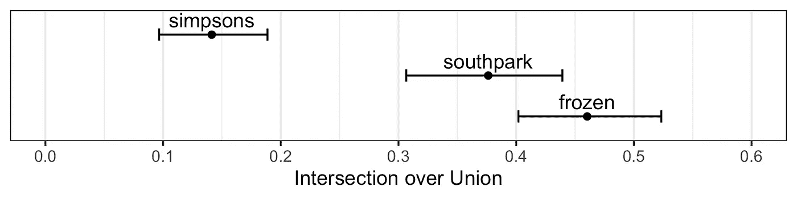
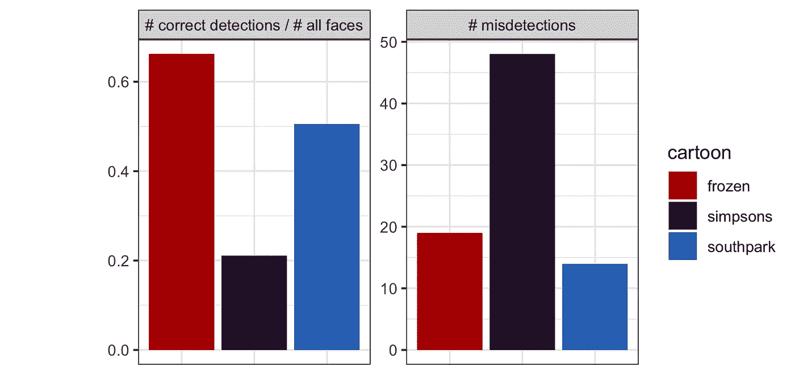
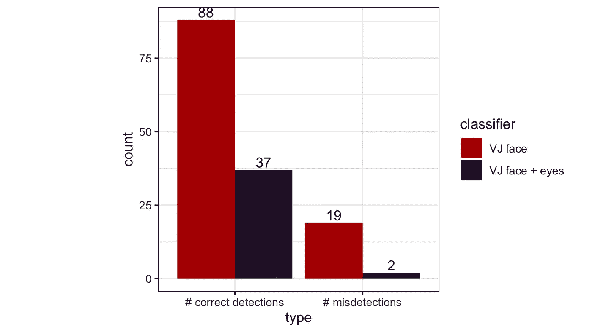

# 卡通对峙:使用 Viola Jones 检测人类卡通人物

> 原文：<https://towardsdatascience.com/cartoon-face-off-detecting-human-cartoon-characters-using-viola-jones-f805aa3c8e3b?source=collection_archive---------46----------------------->

## 《辛普森一家》、《南方公园》和《冰雪奇缘》中著名的人脸检测框架。

原始图像取自[动画屏幕截图](https://animationscreencaps.com/frozen-2013/)。

*我为基于图像的生物统计学课程做的一个有趣的项目。所有的脚本和数据都可以在* [*这里找到*](https://github.com/ggapac/cartoon-face-detection) *。*

# 介绍

人脸检测是计算机视觉中一个广泛研究的领域。随着近年来神经网络的兴起，我们的模型现在可以产生几乎人类水平的性能。然而，神经网络并不是所有任务的答案。它们在计算上是昂贵的、复杂的并且严重依赖于训练数据集，训练数据集也需要足够大并且提供大的变化以防止过拟合。换句话说，有时我们只是没有足够的数据、时间、计算能力……或者坦率地说，我们只是不想处理这些。

因此，我们仍然发现自己使用传统方法来解决某些人脸检测问题。在本文中，我们回到 2001 年，回到可以说是第一个实时提供有竞争力的对象检测率的对象检测框架——Viola-Jones 框架。这个计算机视觉老计时器今天仍然在许多不同的应用中使用。它简单、快速，而且在实时检测人脸方面做得很好，所以如果它没有坏，为什么要修复它呢？在本文中，我们检查该框架如何面对检测非人类人脸的挑战。我们在卡通人物脸上测试了预训练的 Viola-Jones 分类器。

# 方法学

## 数据和预处理

我们截取了三部风格迥异的动画片的截图:《辛普森一家》、《南方公园》和《Frozen⁴.》对于每部漫画，我们随机选择了 70 张截图，如果这些截图包括人脸而不是卡通人物的脸(脸朝向相机，不应倾斜)，我们认为这些截图将是合适的输入。

我们还对图像进行了预处理:为了减少 CPU 时间，我们将较大的图像的最大宽度调整为 700 px，并将它们转换为灰度，因为它们更容易处理，需要处理的数据也更少。为了能够正确评估我们的检测，我们使用了一个在线工具[来注释我们的图像。](https://dataturks.com/)

## 人脸检测

OpenCV 提供了预先训练好的 Viola-Jones 人脸分类器。我们对人脸使用正面人脸分类器，后来，为了改进我们的检测器，我们还使用人脸和眼睛分类器的组合——只有当这些分类器的检测区域相应地重叠时，我们才接受人脸检测。

## 检测器评估

对于每幅图像，我们以两种不同的方式评估我们的检测:

*   **交集超过并集(IoU)** ，在这里我们测量检测到的对象和地面真实之间的相似性。

*   **与数据集中所有人脸的数量相比，计算误检测和正确检测**。

# 结果

人脸检测示例。原始图片取自[斯普林菲尔德！斯普林菲尔德！](https://web.archive.org/web/20140906195710/http://www.springfieldspringfield.co.uk/framegrabs.php?tv-show=southpark)、[动画屏保](https://animationscreencaps.com/frozen-2013/)和 [Frinkiac](https://frinkiac.com/) 。

我们使用带有默认参数的 Viola-Jones 正面人脸分类器。我们的脚本返回每个输入图像的 IoU 值。因为这些值不是正态分布，我们使用非参数 bootstrap⁵来说明 IoU 均值的不确定性。结果如下图所示。

IoU 和 95%自举百分位数置信区间。

由于我们的数据集相对较小，我们也可以用更直观的方式呈现结果。这很费时间，但是值得！底部的条形图让我们对分类器的性能有了更好的了解。它显示了每幅漫画的错误检测总数和正确检测总数与数据集中所有人脸总数的比较。

每幅漫画的错误检测总数和正确检测总数与数据集中所有人脸总数的比较。

毫不奇怪，该算法在冻结数据集上表现最佳。这部漫画的画风是最真实的，人物都有相配的五官，如眉毛、鼻梁等。虽然《辛普森一家》是一部关于(相关的)人类家庭的卡通片，但维奥拉-琼斯似乎不同意最后一部分。这些角色是以如此艺术的方式绘制的，以至于我们的算法在大部分时间里都在挣扎并优雅地失败了。还有，我们几乎从来没有看到他们“直接面对镜头”，这是 Viola-Jones 默认的问题。相反，南方公园的绘画风格非常扁平，大多数场景都包括直接“面对镜头”的人物。这使得算法的工作容易得多，即使他们的特征不太像人脸(大眼睛，小或不存在的鼻子和耳朵，怪异的头型)，结果也令人惊讶地好。

最后，我们尝试通过结合 Viola-Jones 人脸和眼睛分类器来增强我们的检测器。我们在 IoU 最高的数据集(在我们的例子中是冻结数据集)上测试了它。我们注意到，平均 IoU 显著降低(平均从 0.46 降至 0.27)，下图再次帮助我们理解结果，它显示了更详细的比较。

检测器的比较:冻结数据集上的人脸分类器与人脸和眼睛分类器的组合。

如果我们只关注 IoU 值，看起来面部分类器优于我们提出的方法，但是如果我们仔细观察，我们注意到通过使用分类器的组合，错误检测的数量显著下降，并且我们的检测器不容易出错，这在一些应用中也可能是期望的。因此，我们不能说分类器的组合导致更差的性能，这只是取决于用户的需求。

# 结论

快 20 岁了，但对一个老前辈来说还是很适合的！Viola-Jones 人脸检测器再次证明了它的鲁棒性，即使在“非人类”人脸上也表现出了不错的性能(但当然，只有在卡通人脸与人脸足够相似以使算法检测到典型的面部特征的情况下)。

这个有趣的小研究项目引出了更多的问题和想法！如果我们使用一些优化方法来确定分类器的最佳参数，我们可能会改进我们的结果。仔细观察每幅漫画的结果并试图确定最像人类的角色也是很有趣的，但我们需要更大的数据集才能确定。

[1] P. Viola 和 M. Jones，[使用简单特征的增强级联进行快速目标检测](https://www.cs.cmu.edu/~efros/courses/LBMV07/Papers/viola-cvpr-01.pdf) (2001)，CVPR，2001 年

[2] [《辛普森一家》](https://frinkiac.com)剧集截图，访问时间:2019–12–06

[3] [《南方公园》](https://www.springfieldspringfield.co.uk/framegrabs.php?tv-show=southpark)剧集截图，访问时间:2019–12–06(编辑:他们的服务器目前好像宕机了，你可以在[网络档案馆](https://web.archive.org/web/20140906195710/http://www.springfieldspringfield.co.uk/framegrabs.php?tv-show=southpark)上访问)

[4] [截图自《冰雪奇缘》](https://animationscreencaps.com/frozen-2013/)，访问时间:2019–12–06

[5] B. Efron， [Bootstrap Methods:再看 Jackknife](https://projecteuclid.org/download/pdf_1/euclid.aos/1176344552) (1979)，统计年鉴