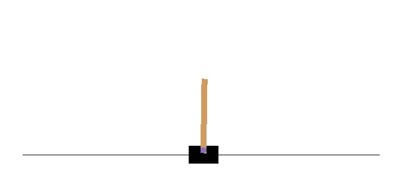
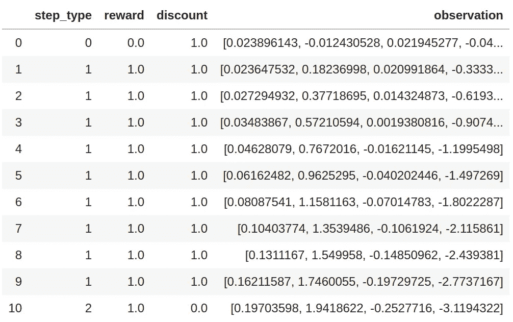
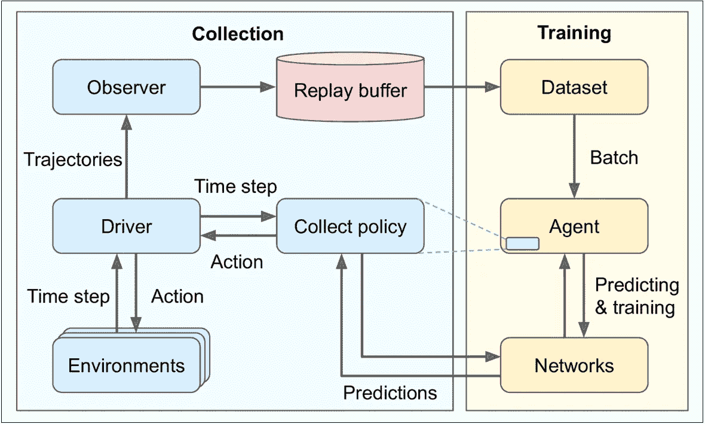
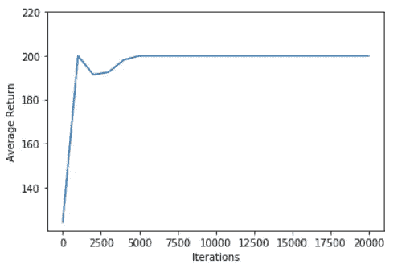

# 使用 TF-Agents 解决横向问题——构建您的第一个强化学习应用程序

> 原文：<https://towardsdatascience.com/cartpole-problem-using-tf-agents-build-your-first-reinforcement-learning-application-3e6006adeba7?source=collection_archive---------46----------------------->

## TF-agent 利用深度 Q-网络学习最优策略

强化学习是人工智能的一个新兴子领域，在一些应用中既酷又有效。这篇文章的前几段提到了强化学习，还有数百篇关于这个主题的介绍性博客文章。假设读者熟悉强化学习的概念，让我们使用 CartPole 问题创建我们的第一个强化学习应用程序。

# 横竿问题

信用:开放健身房

侧手翻问题就是平衡侧手翻的问题。CartPole 是一种结构，其中一根杆连接到车上，车可以在无摩擦的表面上自由滑动。通过向左或向右滑动手推车，手推车可以保持平衡。

## 目标

所以，翻筋斗的目的是防止它落下或移出射程。因此，故障条件为:

*   极点相对于垂直线的角度幅度超过某个阈值。
*   横竿离中心的距离超过了某个阈值。

为了让横滚继续无限多步，我们将步数限制在某个值(在我们的例子中是 200)。

为了让步骤和情节之间的区别更加清晰，我引用前面提到的[博客](/creating-a-custom-environment-for-tensorflow-agent-tic-tac-toe-example-b66902f73059)中的摘录:

> 这里值得一提的是*第*集*第*步。一集*是一个游戏的实例(或者游戏的生命)。如果游戏结束或生命减少，该集结束。*另一方面，步长*是在*情节*中单调增加的时间或某个离散值。随着游戏状态的每次改变，步骤*的值*增加，直到游戏结束。*

## 环境

一般来说，环境是主体执行动作的环境或设置。在这里，横竿环境是横竿和横竿运作的环境。环境由重置功能、下一步生成器(基于当前状态和动作)、动作说明、状态说明和其他辅助功能组成。我们不需要像在之前的[博客](/creating-a-custom-environment-for-tensorflow-agent-tic-tac-toe-example-b66902f73059)中那样创建一个定制的环境。我们通过 TF-Agents 使用 OpenAI gym 中可用的环境。TF-Agents 的一个通用特性是它支持像 OpenAI Gym、Unity 的 ML-Agents 等现成的图书馆环境。

让我们使用*套件 _ 健身房*模块加载横拉杆环境。

## 国家、行动和奖励

那么，我们如何在 CartPole 环境中表示**状态**？磁极在某个位置(线性和角)，它有一定的速度(也是线性和角)。因此，四个变量——线性位置、角位置、线速度、角速度——代表环境的状态。

让我们在重置环境后得到横竿的状态—初始状态。

它返回*时间步长*对象，该对象包含环境状态以及一些其他信息。我们稍后会谈到这一点，但现在，我们可以看到它如何给出当前状态。

**动作**是代理执行的活动。在这里，代理可以让购物车向右或向左走。所以，动作用 0 和 1 来表示。0 表示向左，1 表示向右。

含糊地说，**奖励**是代理人因执行良好行为而获得的好处或鼓励。就像一个学生因为取得好成绩而受到表扬一样，如果我们的代理商表现良好，我们也应该给予表扬。在这里，翻筋斗不倒下或出界应该得到奖励和鼓励。因此，对于每一个没有倒下或超出范围的掷骰子的例子，我们有+1.0 的奖励。

现在让我们对我们的环境采取一些行动，看看状态如何变化，奖励如何授予，以及情节如何结束。更重要的是，让我们了解什么是*时间步长*以及*时间步长*的组成部分是什么意思。

## 时间步长和实验

当我们运行 *env* 的 *reset* 方法时，我们得到了*时间步长*对象。我们先来了解这个对象是什么，包含了什么。

***TimeStep*** 是包含状态信息的对象，如当前观察值、步长类型、奖励和折扣。给定在某个状态上执行的某个动作，它给出新的状态、新步骤(或状态)的类型、折扣和获得的奖励。在我们的 CartPole 环境中，有三种类型的步骤——一集的开始、一集的中间步骤和一集的最后步骤。当一集开始时，该步骤的类型为 0，并在该集结束前变为 1。在剧集的最后一步，该步骤的类型变为 2。这有助于了解该步骤是否是最后一步。折扣是一个参数，它给出了后一个奖励相对于前一个奖励的重要性比率。奖励是对达到当前步骤的奖励。

最初，我们运行*重置*方法，并获得*时间步长*，这给出了当前观察值。我们看到 *step_type* 为 *0* ，显然没有收到奖励。

让我们连续对其应用动作 *1* (向右移动)并查看该集何时结束。

结果显示在下面的熊猫数据框 *df* 中。

显示每个步骤的时间步长值的表格

我们在这里看到，在 *10* 步之后，这一集结束了。可以猜得很好，总是右动的政策不好。

让我们看看随机向左或向右移动。如果代理从可能的动作列表中采取随机动作，则该策略称为随机策略。

平均步骤数比我们尝试的仅右策略多一倍左右，但是不，这并不好。

# 培训架构

TF-Agents 培训项目的培训架构通常由两部分组成:采集部分和培训部分。收集部分使用驱动程序来收集轨迹(经验),训练部分使用代理来训练网络。网络一度训练更新**收集政策**。在解释培训架构时，我们将讨论收集策略。

TF-agent 的典型训练架构(来源:Scikit-Learn、Keras 和 TensorFlow 的上机学习，第 2 版，Aurelien Geron(第 18 章:强化学习))

我们已经讨论了环境、时间步长和行动。让我们一个一个地讨论与我们的横竿问题有关的各个部分。

## 环境

我们创建了两种不同的环境:用于培训的培训环境和用于评估的评估环境。这是正常情况，因为培训可能需要多种环境和比评估环境更多的资源。

## DQN 代理商

现在让我们创建深度 Q-网络代理。代理从重放缓冲器中取出一批轨迹，并训练 Q-网络。我们创建一个 Q 网络( *q_net* )并将其传递给代理。与网络一起，我们通过*时间步长*和*动作*规范列车环境、优化器、损耗和列车步数计数器。

## 策略和收集策略

在深度强化学习环境中有两种类型的策略。*策略*是用于评估和部署我们的模型的策略，而收集策略是用于创建轨迹/体验的策略。基于收集策略，驱动程序执行动作并生成轨迹。**轨迹**简单来说就是经历。它们由当前步骤、奖励和当前下一步组成。它们的批次用于训练网络。

为了用一些轨迹填充重放缓冲区，以便在训练之前帮助评估一次代理的策略，我们利用随机策略并预先收集数据。

此外，让我们创建实用函数来计算平均回报并收集重放缓冲区中的数据。在此之前，让我们运行一下**重放缓冲区**。重放缓冲器是存储轨迹的缓冲器。从中提取批次轨迹来训练 Q 网络。当从重放缓冲区以随机方式创建批次时，训练轨迹是相同且独立的，因此有助于使用梯度下降算法的训练过程。

现在，来自重放缓冲区的数据被转换为 iterable*TF . data . dataset*管道，并将被提供给代理。

这里， *num_steps* 被设置为 *2* ，因为我们需要两个观察值来计算损失。将 *num_steps* 设置为 2 会对批次中每个项目的两个相邻行进行采样。并行调用和预取优化了数据集。

# 培养

由于我们已经构建了所有组件，现在让我们来培训我们的代理。在训练之前，让我们定义我们的超参数。

*num_iterations* 是我们将要进行的训练的迭代次数。*collect _ steps _ per _ iteration*是我们将在每次训练迭代中执行的收集步骤数。我们将其设置为 1，因此在训练开始时只有一个单独的集合步骤。 *replay_buffer_max_length* 是重播缓冲器的最大长度。它是在可用内存的基础上保存的。 *batch_size* 是供给代理的一批轨迹的大小。 *learning_rate* 是 Adam 优化器的学习速率。 *log_interval* 是记录训练损失的间隔， *eval_interval* 是使用平均回报率评估算法的间隔。*num _ eval _ epites*是我们用来计算平均回报的剧集数。

我们现在开始训练吧。

希望平均回报保持增长，直到饱和在 200 步左右(这是每集允许的最大步数)。

恭喜你！你用 TF-Agents 训练了你的第一个强化学习算法。拿一杯你最喜欢的饮料。你应得的！

惠特尼·赖特在 [Unsplash](https://unsplash.com?utm_source=medium&utm_medium=referral) 上拍摄的照片

# 形象化

现在让我们来想象一下训练过程。我们看到的是平均回报而不是损失的趋势，因为平均回报是我们的目标，而不是损失。更好地了解政策和损失可能并不总是齐头并进。当代理探索新的空间时，它可能仍在学习，但损失可能会增加。类似地，当代理人长时间被困在某个空间时，损失可能会减少，但策略不是广义的策略，即过度拟合。

我们学习过的代理的平均回报与迭代

我们在这里看到，在 *5000* 集之后，平均奖励在 *200* 左右饱和。呜哇！

# 在活动

现在，让我们看看我们的代理如何使用我们刚刚学到的最优策略。

由于培训和评估是在 Jupyter 实验室进行的，下面给出了显示评估视频的代码片段。

现在，我们的代理人在 CartPole 环境中表演的视频附在下面。

由于我们将最大步数保持在 *200* 的范围内，代理并不关心如何平衡它，使它能够支持超过 *200* 步数。所以，我们看到它在接近 200 级台阶时会下降。我们可以通过增加最大步数的限制或者根据线性和角位移给予不同的奖励来解决这个问题。

怎么会。酷毙了。是。它？

希望这篇文章能给读者一些关于强化学习及其使用 TF-Agents 实现的想法。TF-Agents 通过使培训体系结构的组件模块化、灵活和容易获得，使许多事情变得更容易。在接下来的日子里，我们将探索更多的强化学习环境和问题。敬请期待！