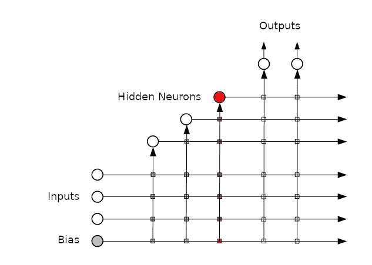
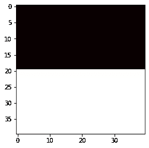
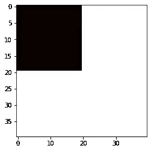
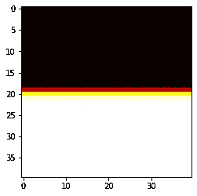
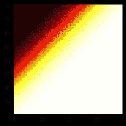
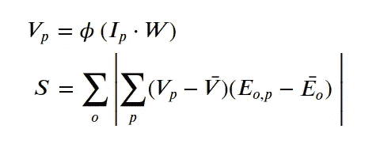
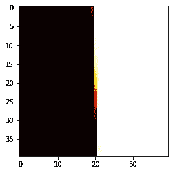
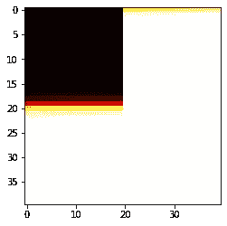

# 级联相关，一个被遗忘的学习架构

> 原文：<https://towardsdatascience.com/cascade-correlation-a-forgotten-learning-architecture-a2354a0bec92?source=collection_archive---------22----------------------->

## 1990 年第一个“深度学习”方法如何胜过经典神经网络。

1990 年，Scott E. Fahlman 和 Christian Lebiere 提出了一种动态神经网络架构，称为“级联相关”[1]，在训练速度、准确性和规模方面优于静态神经网络。在最近的一次讲座中，法尔曼称之为第一种使用类似“深度”学习的方法。
利用这种算法，他们成功地完成了“双螺旋”分类任务和人工语法学习问题。

然而他们的工作在很大程度上被遗忘或者被当作历史的旁注。尽管这个想法本身在精神上非常接近我们现在所说的机器学习算法的[‘助推’](https://en.wikipedia.org/wiki/Boosting_(machine_learning))家族——在某些问题集上比深度学习表现[更好的技术。这些方法——就像级联相关一样——都是基于这样的想法:通过堆叠专门的学习器，一次训练一个，来迭代地改进分类器。](https://www.youtube.com/watch?v=9GCEVv94udY)

有足够的理由去理解和实现 Fahlman 的方法——并在各种领域和挑战中对其进行测试！让我们调查它是否、在哪里以及如何仍然能够与现代机器学习工具竞争。

*本文是关注(循环)级联相关系列文章的第一部分。*

在第一部分中，我们将详细介绍如何使用 Python 和 PyTorch 实现一个简单的仅向前级联相关(简称 CasCor)网络。我们还将看到将它应用到一个简单问题领域的一些结果。

*在接下来的部分中，我们将研究如何更好地自动化和优化算法。我们还将实现和训练它的一个递归版本，并根据标准的机器学习解决方案对 CasCor 进行基准测试。*

*要阅读本文，您应该熟悉如何使用损耗梯度的反向传播来训练神经网络(截至 2020 年，这是一种广泛使用的方法)。也就是说，您应该了解梯度通常是如何计算的，并应用于网络的参数，以尝试迭代实现损耗收敛到全局最小值。*

# 第 1 部分:级联相关

事不宜迟，让我们实现一个简单版本的 CasCor！因为我们正在使用 Python，所以我们需要导入一些基础知识和 PyTorch:

## 概观

CasCor 算法从一层网络(只有输出神经元)开始。然后，它遵循以下步骤:

1.  火车(仅限！)输出神经元，直到达到平台期
2.  如果残差足够好，停止；
3.  否则，冻结现有网络的所有权重
4.  然后，通过优化其输出和最后测量的残差之间的相关性，训练一个新的隐藏神经元(见下文)
5.  回到步骤 1——冲洗并重复

第四步。是 CasCor 最重要也是最复杂的部分，如下图所示。在训练完成之前，隐藏神经元与网络断开。我们静态地将所有原始输入和早期层的值作为加权和提供给它的激活函数。然后，训练算法优化神经元的权重，以实现其输出值与在早期迭代中测量的样本集残差的最佳可能相关性。
为了训练最佳相关性，我们将需要使用相关性度量来代替一些标准的损失函数，稍后会详细介绍。

训练完成后，我们可以将隐神经元加入到网络中。输出神经元现在将接收它的值作为额外的输入，我们需要训练它们的新权重，所以我们跳回到步骤 1。

CasCor 论文[1]以类似的方式说明了最终的网络(带有快捷方式)和添加隐藏神经元的过程:

添加新的隐藏神经元时，仅迭代新的权重(红色方块)。在这里，箭头是馈入描述激活函数的圆的加权和。(图片翻译自[维基百科](https://de.wikipedia.org/wiki/Datei:Cascar.png)，2020)

在本文中，我们主要关注 CasCor 的两个主要部分:步骤 1。第四。，即训练输出和训练隐藏神经元。其余的我们将简单地手动完成。

## 测试装置

为了简单起见，我们使用 2D 分类任务进行测试(这样更容易调试)。因此，我们的网络将有 2 个输入维度(网格的坐标)和 1 个输出维度(介于 0 和 1 之间的值)。
我们将在以下数据集上进行训练(没有测试集)，其中 0 值为黑色，1 值为白色:

为了将输入和输出实际输入到我们的训练函数中，我们还需要将它们转换成“长”形式，并添加一个静态偏置值 1。
此外，测试表明，当输入标准化时，CasCor 和 quickprop 的性能更好，所以我们也这么做吧。

## 快速推进

为了训练 CasCor 网络中的单元，他们使用了一种也被 Fahlman 在 1988 年发明的技术[2],叫做 quickprop。
Quickprop 是反向传播的一种替代方案，它使用了[牛顿法](https://en.wikipedia.org/wiki/Newton's_method)的一种变体。除了原始论文之外，关于这方面的更多信息，Giuseppe Bonaccorso 的这篇有用的博客文章也很好地描述了这一点。

*注意，quickprop 并不是实现 CasCor 所必需的。然而，为了贴近原文并最大限度地学习，我们也将在这里使用它。这本身就是一个有趣的话题，我鼓励你去研究它！
如果您对 quickprop 不感兴趣，请跳到下一节，将任何关于它的进一步提及简单地视为“基于给定输入的训练神经元权重&预期输出对”。*

我们的实现是基于这篇博文的——但是由于我们不想在本文中关注 quickprop，我们将只看一下他们代码的一些调整，而不是深入研究数学。

**灵活性。**post 的代码使用了固定的激活和丢失函数，静态实现了它们的渐变。对于 CasCor，我们需要更灵活一点(至少在损失方面)，所以我们将这些函数作为参数传递。

**自动梯度计算。**由于激活和损失函数现在是可变的，我们在试图建立它们的梯度时会遇到麻烦。但是，使用 PyTorch，我们可以轻松地跳过这一步，让`autograd`来完成繁重的工作。

**收敛。** Giuseppe 的代码测试每次迭代的权重变化，以确定收敛性。一些快速测试发现这很麻烦，因为它似乎经常陷入鞍点和局部最小值。所以不用这个，我们用残差。
具体来说，我们将计算残差的移动平均值，并检查每次迭代的平均值差异是否小于给定的`tolerance`。
最后但同样重要的是，如果误差发散或收敛太慢，quickprop 在一定的迭代次数后干脆放弃(它用完了`patience`，见函数参数)。

## 输出训练

随着 quickprop 的实现，让我们开始有趣的部分吧！
CasCor 从一层网络开始，即我们将使用单个输出神经元，并将其连接到我们的输入(和偏置)。为了开始训练这个神经元，我们获取输入(`x`)和输出(`y`)样本集，并创建新初始化的(随机)权重，所有这些都输入到 quickprop 中。

*注意，这种方法并不关心网络是单层的还是更深层的——因为我们*只是*训练输出权重，我们也可以通过多个隐藏层运行输入，并将其用作训练的* `*x*` *。*

让我们用训练集来测试一下。

简单的看起来不错！

不出所料，这不是很匹配，因为我们只训练了一个单位。但就目前而言，这是一个足够好的近似值。

## 隐藏神经元训练

正如我们所看到的，我们简单的单神经元模型近似第二种形状，有相当大的误差。为了达到更好的拟合，我们需要添加隐藏层。当我们添加一个隐藏的神经元时，我们:

1.  冻结所有其他参数(包括输出)
2.  通过网络向前运行训练样本，并使用输入值和其他隐藏单元值作为新单元的输入
3.  训练新神经元，使其值与先前运行中计算的残差最佳相关

协方差函数 S(我们将用它来代替相关性；关于[1]中的更多细节由下式给出:

其中 phi 是神经元的激活函数，V 是它的值，E 是残差(较早的预测减去实际目标)。条形项是平均值，o 和 p 分别是输出值和样本的指数。

有了这个“损失”函数，我们可以简单地再次运行 quickprop。

*请注意，事后看来，在这里使用 quickprop 有点危险，因为它使用了二阶导数的近似值。这不是一个好的解决方案，因为* ***S*** *的一阶导数由于幅度计算而不是连续的。在 CasCor 的论文中，Fahlman 等人实际上使用梯度上升来训练神经元。*

让我们用上一个样本集的单层网络预测(`pred`)来运行这个！

这很好地向我们展示了目前误差最大的地方(第一张图中非常暗或非常亮的点)以及神经元试图与之相关的事情(第二张图)。

## 组合隐藏和输出神经元

作为(本文的)最后一步，我们现在再次训练我们的输出层，另外基于我们新训练的神经元计算的值(`neuron_value`)。为此，我们需要将这些值作为输入包含到输出神经元中(`x2`)。

漂亮！

输出神经元现在可以近似该形状，因为它可以将其回归基于隐藏神经元的附加值。由于这与我们从早期优化中得到的误差相关，添加它具有将输出神经元必须解决的问题减少一维的效果。

## 警告

所有的图片都是执行代码片段的结果，然而，你看不到的是它们在生成这些图片之前的运行频率。特别是，训练神经元仅以非常低的概率收敛到产生显示值的权重，即，我必须运行算法几次，直到我得到特定的输出。
这可能部分归因于此处 quickprop 的使用，因为它依赖于损失函数的一些性质，如在其一阶导数中连续。正如我上面提到的，法尔曼等人。艾尔。实际上在[1]中使用梯度上升来训练隐藏的神经元。

但是 quickprop 有更多的问题，上面的简单实现没有正确解决。从 Fahlman 的论文[2]和另一篇更近期的 quickprop 与反向传播的比较[3]中可以清楚地看出，a)它需要更多的调整才能更可靠地产生好的结果，b)它并不是在所有领域都表现得一样好。具体来说，在一些现实世界的图像分类问题中，它无法在偏差和方差上与 back-prop 竞争。

也就是说，使用标准反向传播和 Adam 优化器训练的可比网络结构(1 个隐藏，1 个输出神经元)在测试运行期间甚至从未收敛到上述结果(它需要至少一个其他神经元来收敛到该结果)，但这可能是坏运气，因为它不是受控的测试设置。

CasCor 的另一个问题是网络的厚度与深度。由于 GPU 可以非常有效地处理矩阵，因此与较薄和较深的网络(如 CasCor 默认生成的网络)相比，通过深度较浅(即可以更好地表示为矩阵)的较宽网络运行会更快。对于我们的小例子来说，这当然不是太大的问题，但当生成的网络解决更复杂的任务时，这可能会成为一个问题。

这就把我们带到了下一部分。

## 未来的改进

正如我们所看到的，CasCor 的这个基本实现实际上是可行的！:)
然而，我们仍然缺少许多使过程自动化的样板代码，以及训练方法的一些优化，以更高的概率找到全局最优。
这就是为什么，在本系列的下一部分，我们将看到我们如何:

*   自动化*输出- >隐藏- >输出- >隐藏- > …* 训练循环
*   更改 quickprop 以提供更稳定的结果，并训练一组新节点，而不是只有一个(并选择最好的)
*   进一步改进该流程以选择多个节点(即具有“更宽”的层)
*   将问题域转换为更有趣/更具挑战性的问题域(例如，只能通过更深层次和/或循环网络解决的问题域)
*   在一个受控的环境中，将其与其他机器学习方法进行比较

如前所述，Quickprop 本身值得更详细的研究。出于这个原因，我写了一篇更深入的文章，涵盖了它背后的数学原理、可能的实现和一些改进。

该系列的第 2 部分目前正在进行中，当它发布时将链接到这里。
该系列所有成品笔记本和代码也[在 Github](https://github.com/ephe-meral/cascor) 上。请留下反馈并提出改进建议。

如果你想支持这篇和类似精彩文章的创作，你可以[注册一个中级会员](https://medium.com/@johannaappel/membership)和/或[关注我的账户](https://medium.com/subscribe/@johannaappel)。

[1] S. E. Fahlman 和 C. Lebiere，[《级联相关学习架构》](http://web.cs.iastate.edu/~honavar/fahlman.pdf) (1990)，神经信息处理系统的进展(第 524–532 页)

[2] S. E. Fahlman，[反向传播网络学习速度的实证研究](http://www.it.uu.se/edu/course/homepage/mil/vt11/handouts/fahlman.quickprop-tr.pdf) (1988)，卡内基梅隆大学计算机科学系

[3] C. A. Brust，S. Sickert，M. Simon，E. Rodner 和 J. Denzler，[既不快速也不适当——学习深度神经网络的 QuickProp 的评估](https://arxiv.org/pdf/1606.04333.pdf) (2016)，arXiv 预印本 arXiv:1606.04333