# 案例研究:使用支持向量机的乳腺癌分类

> 原文：<https://towardsdatascience.com/case-study-breast-cancer-classification-svm-2b67d668bbb7?source=collection_archive---------18----------------------->

## 创建一个模型，根据肿瘤特征预测患者是否患有乳腺癌


由[彼得·波恰](https://unsplash.com/@peterboccia?utm_source=medium&utm_medium=referral)在 [Unsplash](https://unsplash.com?utm_source=medium&utm_medium=referral) 上拍摄

在本教程中，我们将创建一个模型，根据几个肿瘤特征来预测患者是否有阳性乳腺癌诊断。

# **问题陈述**

乳腺癌数据库是来自 UCI 机器学习知识库的公开可用的数据集。它提供了肿瘤特征的信息，如肿瘤的大小、密度和质地。

**目标:**创建一个分类模型，根据几个特征预测癌症诊断是良性还是恶性。

**使用的数据:**[Kaggle-乳腺癌预测数据集](https://www.kaggle.com/merishnasuwal/breast-cancer-prediction-dataset?select=Breast_cancer_data.csv)

# **第一步:探索数据集**

首先，让我们了解我们的数据集:

```
**#import required libraries** import pandas as pd
import numpy as np
import matplotlib.pyplot as plt
%matplotlib inline
import seaborn as sns**#import models from scikit learn module:** from sklearn.model_selection import train_test_split
from sklearn import metrics
from sklearn.svm import SVC**#import Data**
df_cancer = pd.read_csv('Breast_cancer_data.csv')
df_cancer.head()**#get some information about our Data-Set** df_cancer.info()
df_cancer.describe()**#visualizing data** sns.pairplot(df_cancer, hue = 'diagnosis')plt.figure(figsize=(7,7))
sns.heatmap(df_cancer['mean_radius mean_texture mean_perimeter mean_area mean_smoothness diagnosis'.split()].corr(), annot=True)sns.scatterplot(x = 'mean_texture', y = 'mean_perimeter', hue = 'diagnosis', data = df_cancer)
```

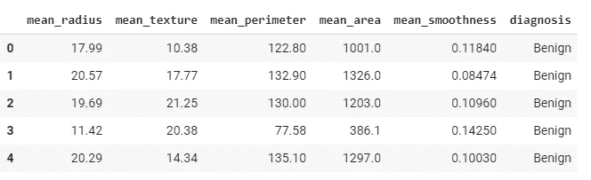

乳腺癌数据

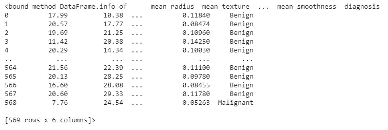

关于数据集的一些信息

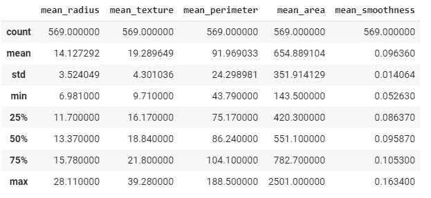

Data.describe()

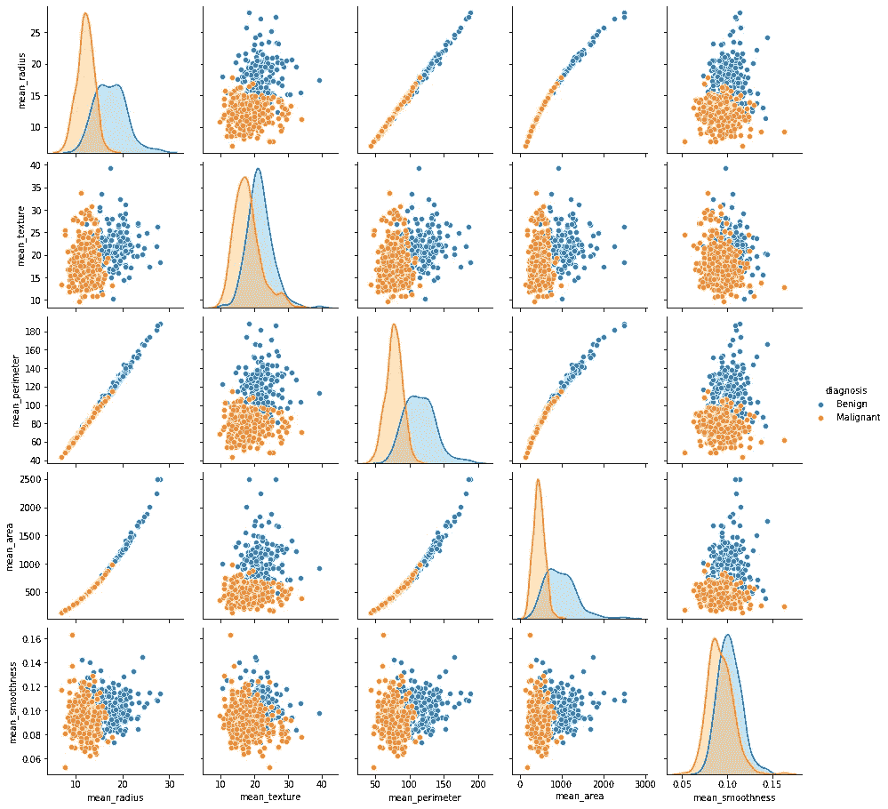

乳腺癌数据的特征对图

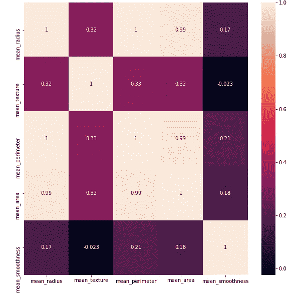

特征之间的相关性

```
**#visualizing features correlation** palette ={0 : 'orange', 1 : 'blue'}
edgecolor = 'grey'fig = plt.figure(figsize=(12,12))
plt.subplot(221)ax1 = sns.scatterplot(x = df_cancer['mean_radius'], y = df_cancer['mean_texture'], hue = "diagnosis",
data = df_cancer, palette =palette, edgecolor=edgecolor)
plt.title('mean_radius vs mean_texture')plt.subplot(222)
ax2 = sns.scatterplot(x = df_cancer['mean_radius'], y = df_cancer['mean_perimeter'], hue = "diagnosis",
data = df_cancer, palette =palette, edgecolor=edgecolor)
plt.title('mean_radius vs mean_perimeter')plt.subplot(223)
ax3 = sns.scatterplot(x = df_cancer['mean_radius'], y = df_cancer['mean_area'], hue = "diagnosis",
data = df_cancer, palette =palette, edgecolor=edgecolor)
plt.title('mean_radius vs mean_area')plt.subplot(224)
ax4 = sns.scatterplot(x = df_cancer['mean_radius'], y = df_cancer['mean_smoothness'], hue = "diagnosis",
data = df_cancer, palette =palette, edgecolor=edgecolor)
plt.title('mean_radius vs mean_smoothness')fig.suptitle('Features Correlation', fontsize = 20)
plt.savefig('2')
plt.show()
```

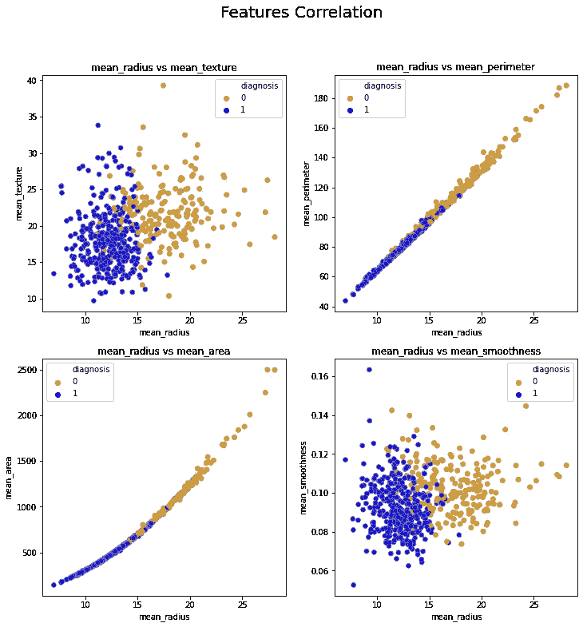

# **第二步:缺失/分类数据的处理**

*   在应用任何方法之前，我们需要检查是否有任何值丢失，如果有，就处理它们。在这个数据集中，没有丢失的值，但是始终保持检查数据集中的空值的习惯！
*   由于机器学习模型基于数学方程，我们需要对分类变量进行编码。这里我使用了**标签编码**，因为我们在“诊断”列中有两个不同的值:

```
**#check how many values are missing (NaN)** here we do not have any missing values
df_cancer.isnull().sum()**#handling categorical data** df_cancer['diagnosis'].unique()df_cancer['diagnosis'] = df_cancer['diagnosis'].map({'benign':0,'malignant':1})df_cancer.head()
```


让我们继续攀升我们的数据集:

```
**#visualizing diagnosis column >>> 'benign':0,'malignant':1** sns.countplot(x='diagnosis',data = df_cancer)plt.title('number of Benign_0 vs Malignan_1')**# correlation between features** df_cancer.corr()['diagnosis'][:-1].sort_values().plot(kind ='bar')
plt.title('Corr. between features and target')
```

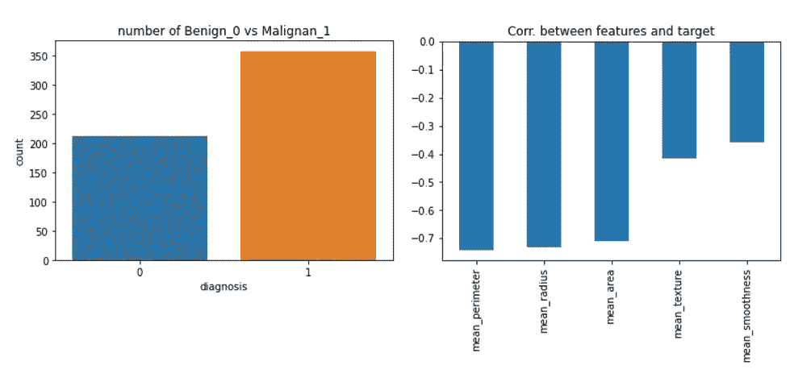

计数图—相关性

# ***第三步:将数据集分割成训练集和测试集***

数据分为`Train`组和`Test`组。我们使用`Train`集合让算法学习数据的行为，然后在`Test`集合上检查我们的模型的准确性。

*   特性(`X`):插入到我们的模型中的列将用于进行预测。
*   预测(`y`):特征预测的目标变量。

```
**#define X variables and our target(y)** X = df_cancer.drop(['diagnosis'],axis=1).values
y = df_cancer['diagnosis'].values**#split Train and Test** from sklearn.model_selection import train_test_split
X_train, X_test, y_train, y_test = train_test_split(X, y, test_size=0.25, random_state=101)
```

# ***第四步:数据建模——支持向量机***

**支持向量机(SVM)** 是最有用的监督 ML 算法之一。它可用于分类和回归任务。

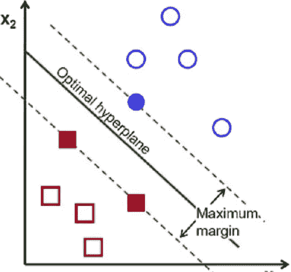

来源:[研究之门/图](https://www.researchgate.net/figure/Linear-support-vector-machine-SVM-in-a-two-dimensional-example_fig2_328739480)

我们首先需要理解几个概念:

*   **SVM 的工作是什么？SVM 选择类之间分离最大的超平面。**
*   **什么是硬边距和软边距？**如果数据可以线性分离，SVM 可能会返回最大的准确性(硬利润)。当数据不是线性可分的时候，我们需要做的就是放宽界限，允许错误分类 **(** 软界限)。
*   **什么是超参数 C？**可以使用 C 参数控制误分类错误的数量，C 参数对超平面有直接影响。
*   **什么是超参数伽玛？** Gamma 用于对接近支持向量的点进行加权。换句话说，改变 gamma 值会改变超平面的形状。
*   **什么是内核绝招？**如果我们的数据不是线性可分的，我们可以应用“核技巧”方法，将非线性数据映射到更高维空间。

现在让我们回到我们的代码！

```
**#Support Vector Classification model** from sklearn.svm import SVC
svc_model = SVC()
svc_model.fit(X_train, y_train)
```

# **第五步:模型评估**

```
from sklearn.metrics import classification_report, confusion_matrixy_predict = svc_model.predict(X_test)
cm = confusion_matrix(y_test, y_predict)
sns.heatmap(cm, annot=True)
```

`confusion_matrix`信息结果是什么意思？：

*   在我们的测试集中有 143 名女性。
*   在 55 名预测不会患乳腺癌的女性中，有两名被归类为没有患，而实际上她们已经患了(第一类错误)。
*   在 88 名预测患有乳腺癌的女性中，14 名被归类为患有乳腺癌，而她们并没有(第二类错误)。

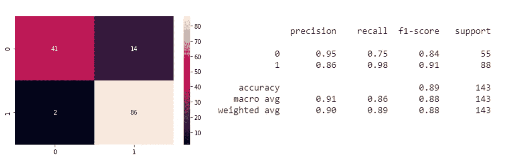

这个分类报告结果意味着什么？基本上，这意味着 SVM 模型能够以 89%的准确率将肿瘤分为恶性和良性。

注意:

*   **精度**是相关结果的分数。
*   **Recall** 是所有相关结果中被正确分类的部分。
*   **F1-得分**是精确度和召回率之间的调和平均值，范围在 0(糟糕)到 1(完美)之间。

# 第六步:我们能做些什么来改进我们的模型？

## **1。数据标准化**

特征缩放将帮助我们从相同的镜头(相同的比例)看到所有的变量，这样我们将把所有的值带入范围[0，1]:

```
**#normalized scaler - fit&transform on train, fit only on test** from sklearn.preprocessing import MinMaxScaler
n_scaler = MinMaxScaler()X_train_scaled = n_scaler.fit_transform(X_train.astype(np.float))
X_test_scaled = n_scaler.transform(X_test.astype(np.float))**#Support Vector Classification model -  apply on scaled data** from sklearn.svm import SVC
svc_model = SVC()
svc_model.fit(X_train_scaled, y_train)from sklearn.metrics import classification_report, confusion_matrix
y_predict_scaled = svc_model.predict(X_test_scaled)
cm = confusion_matrix(y_test, y_predict_scaled)
sns.heatmap(cm, annot=True)print(classification_report(y_test, y_predict_scaled))
```

**混淆矩阵信息结果是什么意思？:**

*   我们的测试中有 143 名女性
*   在 55 名预测未患乳腺癌的妇女中，4 名妇女被归类为未患，而实际上她们患了(1 型错误)
*   在 88 名预测患有乳腺癌的妇女中，7 名被归类为患有乳腺癌，而她们并没有(2 型错误)

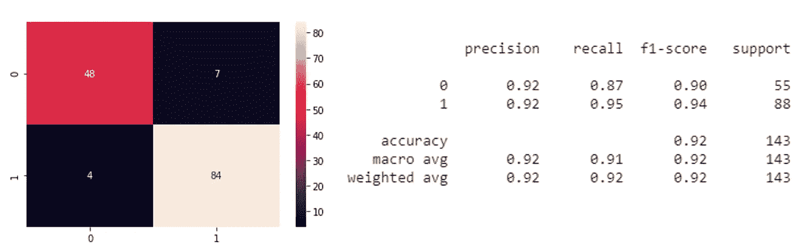

SVC 模型的结果-缩放数据集

W **这个分类报告结果是什么意思？**基本上，这意味着 SVM 模型能够以 92%的准确率将肿瘤分为恶性/良性。

## **2。SVM 参数优化**

**C 参数** —如我们所说，它控制着`Train`数据上错误分类的成本。

*   **较小的 C:** 较低的方差但较高的偏差(软裕度)并降低误分类的成本(较少的惩罚)。
*   **更大的 C:** 更低的偏倚和更高的方差(硬边际)以及增加误分类的成本(更严格)。

**Gamma:
Gamma 越小:**方差越大，到达距离越远，解越一般化。
**更大的 Gamma:** 高方差低偏倚，接近到达，也更接近的数据点具有更高的权重。

因此，让我们使用网格搜索找到模型的最佳参数:

```
**#find best hyper parameters** from sklearn.model_selection import GridSearchCVparam_grid = {'C':[0.1,1,10,100,1000],'gamma':[1,0.1,0.01,0.001,0.001], 'kernel':['rbf']}grid = GridSearchCV(SVC(),param_grid,verbose = 4)
grid.fit(X_train_scaled,y_train)grid.best_params_
grid.best_estimator_grid_predictions = grid.predict(X_test_scaled)
cmG = confusion_matrix(y_test,grid_predictions)
sns.heatmap(cmG, annot=True)print(classification_report(y_test,grid_predictions))
```

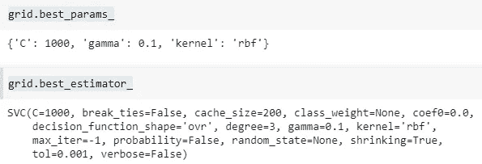

使用 SVC 模型的结果(缩放数据+最佳参数)

如您所见，在这种情况下，最后一次模型改进并没有产生正确的百分比。然而，我们成功地减少了第二类错误。

我希望这有助于你更好地理解这个话题。欢迎任何反馈，因为它让我获得新的见解，并纠正任何错误！