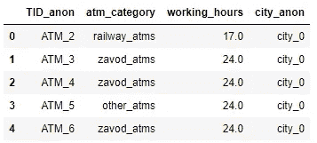
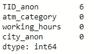
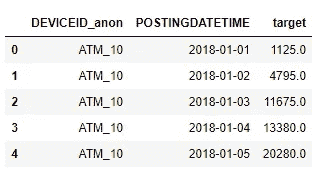
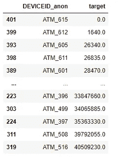
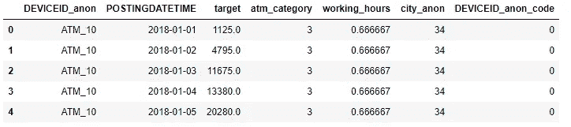
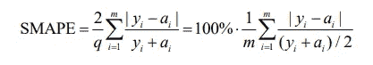
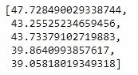
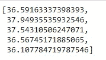
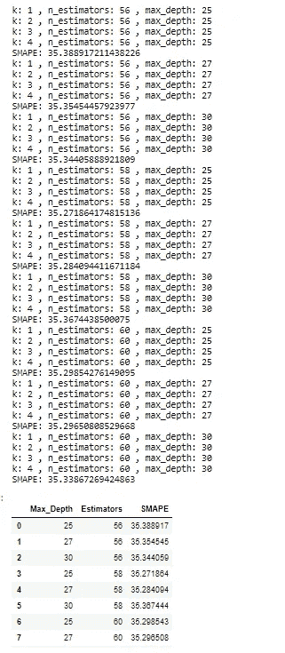

# 自动取款机现金需求预测

> 原文：<https://towardsdatascience.com/cash-demand-forecasting-for-atms-6113dd45fb2d?source=collection_archive---------29----------------------->

## 我努力为任何一款 lvl 的 DS 提供端到端的解决方案


Nikita Lazarionok 的图片

## 介绍

在这个主题中，我想向您展示一个端到端的解决方案。两周前在明斯克有一场由白俄罗斯银行代表领导的黑客马拉松。总共有 3 个任务，其中一个必须解决。对我来说，自动取款机上的现金需求任务是最有趣的，我想分享一下我的解决方案。

## 工作

需要预测各种自动取款机的每日现金需求量。数据是匿名的，特定 ATM 的操作时间以小时为单位，位置靠近主要城市设施(地铁、大型购物中心、企业检查站等)。)以及它属于哪个类似的无名城市。还会有用户贡献的金额报告。应该注意的是，如果在足够长的一段时间内没有对给定自动柜员机的需求(目标变量为零)，那么，可能当时它由于这样或那样的原因而不工作。SMAPE 将被用作度量标准。

## 目标

此任务的目标是预测在要求的日期需要存入自动柜员机的现金金额。

## 计划

解决这样一个问题的计划很简单:

*   熊猫的 EDA 分析
*   数据编码
*   RF (sklearn)模型和 XGBoost 模型
*   自定义搜索参数
*   创建最终模型

## 导入，设置

```
import numpy as np
import pandas as pd
import pickle
import warnings
import xgboost as xgbfrom sklearn.ensemble import RandomForestRegressor
from sklearn.preprocessing import LabelEncoderpd.set_option('max_columns', 105)
warnings.filterwarnings("ignore", category=FutureWarning)
warnings.filterwarnings("ignore", category=DeprecationWarning)
```

## **了解数据**

总共提供了 3 个数据集:每个自动柜员机的参考书、交易活动以及带有目标的数据集。但是，既然这种竞争的条件之一是对未来时期的预测，那么，相应地，我们将无法考虑并从交易活动中获得必要的信息。这会导致我们接受再培训，这并不好。因此，考虑剩下的 2 个数据集。

首先是一本参考书。

```
active_atms_lookup = pd.read_csv('active_atms_lookup.csv', delimiter=',')
active_atms_lookup.head()
```



Nikita Lazarionok 的图片

我们看到的:只有 4 列，如自动柜员机的 ID、类别、工作小时数和所在城市。

让我们检查一下是否有空值。

```
active_atms_lookup.isna().sum()
```



Nikita Lazarionok 的图片

原来我们只有 6 台 ATM 的信息，但是我们不知道它们。让我们移除它们。

```
active_atms_lookup = active_atms_lookup[~active_atms_lookup['TID_anon'].isna()]
```

让我们试着从这个指南中分离出尽可能多的信息，以便它能帮助我们在将来改进我们的结果。在这种情况下，我们可以将小时数带入值[0；1]，我们立即通过 LabelEncoder 和 Pandas 编码器对分类特征进行编码。

```
active_atms_lookup['working_hours'] = active_atms_lookup['working_hours'] / 24active_atms_lookup["atm_category"] = active_atms_lookup["atm_category"].astype('category')
active_atms_lookup["city_anon"] = active_atms_lookup["city_anon"].astype('category')active_atms_lookup["atm_category"] = active_atms_lookup["atm_category"].cat.codes
active_atms_lookup["city_anon"] = active_atms_lookup["city_anon"].cat.codeslb = LabelEncoder()
active_atms_lookup['DEVICEID_anon_code'] = lb.fit_transform(active_atms_lookup['DEVICEID_anon'])filename = 'atm_encoder.sav'
```

关键时刻-考虑一个带有目标变量的数据集。

```
train_target = pd.read_csv('train_target.csv', delimiter=';')
train_target.head()
```



Nikita Lazarionok 的图片

让我们将每个自动柜员机的值分组，看看是否有负值或零值。

```
train_target.groupby('DEVICEID_anon')['target'].sum().reset_index().sort_values('target')
```



Nikita Lazarionok 的图片

原来有这样的自动取款机。让我们移除它，在未来，为了形成预测，我们将移除它。

```
train_target = train_target[train_target['DEVICEID_anon'] != 'ATM_615']
```

现在，让我们结合我们的数据集，并做一些进一步的转换。

```
train_target = train_target.merge(active_atms_lookup, on=['DEVICEID_anon'])
train_target.head()
```



Nikita Lazarionok 的图片

我们有个约会。我不想用这种形式寄它。让我们从中提取所有信息:日、月、年等。让我们进行一些额外的转换，例如选择十年、一个周末或一个工作日。

```
train_target['POSTINGDATETIME'] = pd.to_datetime(train_target['POSTINGDATETIME'])train_target['HOUR'] = train_target['POSTINGDATETIME'].dt.hour
train_target['DAYOFWEEK'] = train_target['POSTINGDATETIME'].dt.dayofweek
train_target['QUARTER'] = train_target['POSTINGDATETIME'].dt.quarter
train_target['MONTH'] = train_target['POSTINGDATETIME'].dt.month
train_target['YEAR'] = train_target['POSTINGDATETIME'].dt.year
train_target['DAYOFYEAR'] = train_target['POSTINGDATETIME'].dt.dayofyear
train_target['DAYOFMONTH'] = train_target['POSTINGDATETIME'].dt.day
train_target['NAME_WEEKOFYEAR'] = train_target['POSTINGDATETIME'].dt.day_name()
train_target['WEEKOFYEAR'] = train_target['POSTINGDATETIME'].dt.weekofyeartrain_target['WORKDAY'] = train_target['NAME_WEEKOFYEAR'].apply(lambda x: 0 if x == 'Saturday' or x == 'Sunday' else 1)train_target.reset_index(inplace = True)
train_target.drop(['index'] , axis = 1, inplace = True)train_target['POSTINGDATETIME'] = train_target['POSTINGDATETIME'].dt.strftime('%Y-%m-%d')train_target = train_target.drop(['NAME_WEEKOFYEAR'], axis = 1)train_target = train_target.replace([np.inf, -np.inf], np.nan)
```

我们应该受到祝贺。我们会对这些数据做任何我们想做的事情。

## 建模和评估

让我们从度量开始。在这项任务中，使用了 STAPE 度量。一方面，使用这个指标，你可以很容易地向企业解释这个或那个机器学习模型是如何表现的，这很好。另一方面，在我们有一个目标变量= 0 的情况下，它会导致问题，因为我们以这样一种方式调整我们的算法，它猜测 0 而不是零值。

SMAPE 的公式是:



Nikita Lazarionok 的图片

这个公式的代码是:

```
def smape(actual, predicted):
    return 100/len(actual) * np.sum(2 * np.abs(predicted - actual) / (np.abs(actual) + np.abs(predicted)))
```

对于这个任务，我只选择了两个模型进行评估:梯度推进和决策树。为什么是他们？因为我测试了很多不同的，这 2 个显示了最好的结果。

但是我们也不会用我们的数据进行测试。为了不满足过度拟合的事实，我们将使用时间序列交叉验证。

先说梯度提升。

```
data_for_modeling = train_target
data_for_modeling['POSTINGDATETIME'] = pd.to_datetime(data_for_modeling['POSTINGDATETIME'])
tscv = TimeBasedCV(train_period=360,
                   test_period=60,
                   freq='days')
for train_index, test_index in tscv.split(data_for_modeling,
                                          date_column='POSTINGDATETIME'):
    print(train_index, test_index)# get number of splits
tscv.get_n_splits()#### Example- compute average test sets score: ####
X = data_for_modeling[columns]
y = data_for_modeling['target']
from sklearn.linear_model import LinearRegression
import numpy as npscores = []
for train_index, test_index in tscv.split(X):data_train   = X.loc[train_index].drop('POSTINGDATETIME', axis=1)
    target_train = y.loc[train_index]data_test    = X.loc[test_index].drop('POSTINGDATETIME', axis=1)
    target_test  = y.loc[test_index]

    dtrain = xgb.DMatrix(data_train, label=target_train)
    dvalid = xgb.DMatrix(data_test)# if needed, do preprocessing here
    watchlist = [(dtrain, 'train')]

    model = xgb.train(xgb_pars, dtrain, 500, watchlist, early_stopping_rounds=500,
                  maximize=False, verbose_eval=15)

    preds = model.predict(dvalid)

    # accuracy for the current fold only    
    r2score = smape(target_test, preds)
    print('SMAPE is ' + str(r2score))scores.append(r2score)# this is the average accuracy over all folds
average_r2score = np.mean(scores)
```



Nikita Lazarionok 的图片

老实说，我期待更好的结果。而当它们在不同的时间间隔分歧这么大的时候，那我们以后就不用了。然后我们将重点放在决策树上。



Nikita Lazarionok 的图片

这样好多了:)
但是我不认为这是建模的极限。因此，我们来调一下模型。

## 调谐

众所周知的调优方法，如 hoperopt 和 gridsearch，对于这样一个模型似乎并不十分重要。因此，我们将自己的调音称为“一步一步”。有什么意义？我们接受 n 个参数并开始迭代它们。一旦我们找到最好的，就采用+1 或+2 参数，以同样的方式进行。以此类推直到结束，直到参数用完。
这样调音的一个例子:

```
def random_forest(n_estimators, max_depth):
    result = []
    for estimator in n_estimators:
        for depth in max_depth:
            wmaes_cv = []
            for i in range(1,5):
                print('k:', i, ', n_estimators:', estimator, ', max_depth:', depth)
                x_train, x_test, y_train, y_test = train_test_split(X_train, Y_train, test_size=0.3)
                RF = RandomForestRegressor(n_estimators=estimator, max_depth=depth)
                RF.fit(x_train, y_train)
                predicted = RF.predict(x_test)
                wmaes_cv.append(smape(y_test, predicted))
            print('SMAPE:', np.mean(wmaes_cv))
            result.append({'Max_Depth': depth, 'Estimators': estimator, 'SMAPE': np.mean(wmaes_cv)})
    return pd.DataFrame(result)n_estimators = [56, 58, 60]
max_depth = [25, 27, 30]random_forest(n_estimators, max_depth)
```



Nikita Lazarionok 的图片

找到最佳参数后，我们可以保存模型并使用它。

```
import picklefilename = 'model_reg.pkl'
pickle.dump(RF, open(filename, "wb"))
```

## 结论


Nikita Lazarionok 的图片

在独立的数据集上，这样的模型显示了相当好的结果。落后于对手的差距往往只有几分之一。

需求会受到许多其他因素的影响，这些因素可以从互联网上收集:假期、各种经济形势、政治、天气等。如果我们学会考虑到这一点，我们可以保证结果有时会有所改善。


Nikita Lazarionok 的图片

我希望这篇文章对一个初学数据的科学家来说非常有用，并且有所帮助。
如果你喜欢这篇文章，请点赞:)