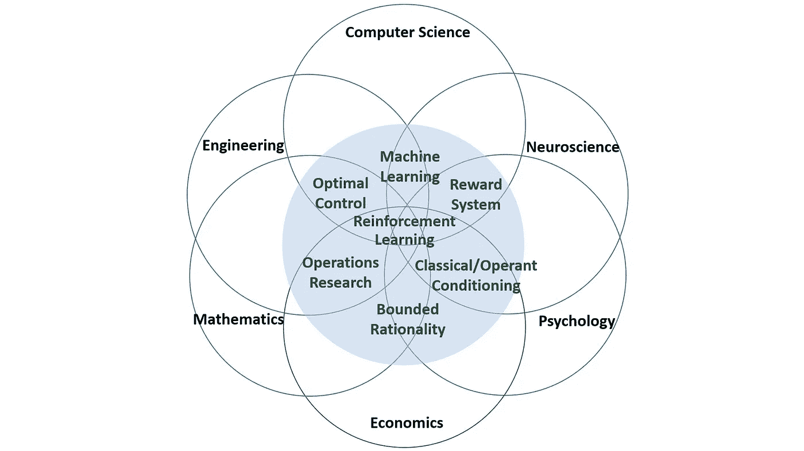

# 强化学习入门

> 原文：<https://towardsdatascience.com/casual-intro-to-reinforcement-learning-4a78b57d4686?source=collection_archive---------49----------------------->

## AWS DeepRacer 系列

## 对强化学习的直观解释

在 [Unsplash](https://unsplash.com?utm_source=medium&utm_medium=referral) 上由 [Picsea](https://unsplash.com/@picsea?utm_source=medium&utm_medium=referral) 拍摄的照片

首先，我要感谢 [Jakarta 机器学习](https://jakartamachinelearning.com/)和 AWS 让我有机会加入 [AWS DeepRacer](https://aws.amazon.com/deepracer/) 新兵训练营。我一定会通过我的文章分享我在这次训练营的学习经历。所以，请继续关注并了解更多关于我的新兵训练营经历！

在这次训练营中，我和其他 8 名参与者将为 AWS DeepRacer 联赛做准备。对于那些不知道的人来说，AWS DeepRacer 基本上是一辆自主规模的赛车，AWS DeepRacer League 是第一个全球自主赛车联盟。

为了自主比赛，AWS DeepRacer 需要*学习*如何自己驾驶，就像职业赛车手驾驶自己的汽车一样。这种*学习*机制也类似于学步儿童学习如何走路。和前面的例子类似，AWS DeepRacer 也应用了这种*学习*的方法，称为*强化学习*。

# 什么是强化学习？

此时，你可能会疑惑强化学习是什么意思。简单来说，强化学习就是通过**与环境**互动来学习。它是**主动的和顺序的**，这意味着未来取决于早期的互动。除此之外，它指向一个**目标**，并且系统可以在没有最佳行为示例的情况下进行学习(**)。**

*对于自动驾驶汽车，你可能会问以下问题。*

> *为什么我们不能给汽车编程，让它准确地知道在哪里左转和右转？*

**嗯*，学习有两个原因。首先，我们想找到以前**未知的**解。比如能打败人类象棋大师的程序。其次，我们想为**无法预见的**情况找到解决方案。例如，一辆自动驾驶汽车可以在不同于任何已知轨道的轨道上行驶。*

*换句话说，强化学习是从与环境的相互作用中学习做出决策的科学。这个概念被应用于许多领域，从计算机科学到经济学。*

**

*作者图片*

*几个特征使得强化学习不同于其他类型的学习。第一，没有**没有监督**，只给出奖励信号。它只是告诉你它有多喜欢一个决定，但并没有告诉你你必须做什么。另一个特点是反馈可以**延迟**，而不是瞬间获得。**序列**也很重要，因为**之前的**决定会影响**之后的**互动。*

*为了更好地理解强化学习，我们需要看一个决策问题的例子。一个例子是管理一个投资组合，其中你根据**回报** ( *利润*)做出决定。这个奖励可能是短期的，也可能是长期的，也就是说奖励是**延迟**的。此外，买卖顺序也会影响你的投资组合。它表明这是一个强化学习问题的例子。*

> *强化学习的特征是奖励信号、延迟反馈和顺序。*

# *核心概念*

*在理解强化学习时，有几个方面是我们必须知道的。他们是*****奖励信号****和 ***代理人。****代理*还包括 ***代理状态*** *，* ***策略*** *，**值函数* 。****

***代理*和*环境*之间的交互可以描述如下。在每个时间步，*代理*接收*观察*和*奖励*，同时执行一个*动作*。另一方面，*环境*接收一个*动作*然后发出*观察*和*奖励*。**

***奖励*是一个反馈信号，表明*代理*在每个时间步做得有多好。*代理人的*工作是**最大化**从现在到未来的累计*奖励*。累计*奖励*也称为**回报*回报*回报**。这向我们展示了强化学习是基于**奖励假设**的。**

> **任何目标都可以被认为是回报最大化的结果。**

**现在，我要你考虑一下。你接受还是拒绝这个假设？**

**基于*回报*，我们还对*值*感兴趣，它是从现在开始的预期*回报*。“预期”一词意味着我们考虑到了未来回报发生的可能性。因此，代理的目标变为**通过选择**最佳行动**最大化** *值*。**

**然而，行动可能会产生长期后果，奖励可能**不会**立即收到。在某些情况下，牺牲眼前的回报从长远来看可能是有益的。例如，一项金融投资可能需要几年时间，直到它变得非常有利可图，尽管它在开始时可能会有一些损失。**

****

**[吉利](https://unsplash.com/@gillyberlin?utm_source=medium&utm_medium=referral)在 [Unsplash](https://unsplash.com?utm_source=medium&utm_medium=referral) 上拍照**

# **代理组件**

> **一个*代理的三个基本组成部分:代理状态、策略、*和*价值函数*。**

**动作取决于代理的**状态。一个*状态*可以被定义为用于确定接下来发生什么的信息。在最简单的情况下，只有一个*状态*。然而，根据具体情况，可能有许多不同的*状态*。例如，当我们想要购买食物时，我们会无意识地访问我们身体的状态，例如饥饿程度和食物偏好。****

**从*状态*到*动作*的映射称为 ***策略*** 。*策略*根据代理的当前状态定义代理的行为。以我自己为例，每次下雨我都会想要一杯热巧克力。相反，我会在大热天喝一杯冰柠檬茶。换句话说，我的行为是由我的*政策*决定的，它将天气状况*状态*转化为我的饮料选择*动作*。**

***状态*和*政策*决定代理人的行为，而 ***价值函数*** 计算预期*回报*或对未来*回报*的预测。它用于评估*状态*的可取性，以及哪些操作最有益。有时，使用*折扣系数*是很有用的，它权衡了即时回报和长期回报的重要性。低折扣系数意味着你只关心眼前的*回报*，反之亦然。**

**虽然强化学习解决了很多决策问题，但是有一个问题叫做 ***剥削和探索*** 。*剥削*是指代理人利用**已知的**信息来最大化报酬。另一方面，*探索*正在寻找**新的**信息，希望获得更多的回报。**

**比如，在决定你想吃什么的时候，你可以认为*奖励*就是你的进食满意度。为了充分利用它，你可以选择吃你最喜欢的食物。或者，你可以尝试新的菜肴，寻找味道更好的东西。**

****

**照片由[雷切尔·帕克](https://unsplash.com/@therachelstory?utm_source=medium&utm_medium=referral)在 [Unsplash](https://unsplash.com?utm_source=medium&utm_medium=referral) 拍摄**

# **结论**

> **简而言之，强化学习是指通过试错来学习，在此期间，代理人应该通过与环境的交互来发现一个使回报最大化的好政策。**

# **参考**

**如果你想了解更多关于强化学习的知识，我建议你像我一样查阅这些资料。**

1.  **Hado van Hasselt 关于强化学习的讲座——课程 1:强化学习简介。**
2.  **《强化学习:导论》( 2015 ),作者理查德·萨顿和安德鲁·巴尔托。**

# **结束语**

**感谢您花时间阅读这篇文章！希望你能学到新的东西，能把这个理念融入到你的生活中。请务必关注我即将发表的关于强化学习和 AWS DeepRacer 细节的文章。我希望你有美好的一天！**

# **关于作者**

**Alif Ilham Madani 是一名有抱负的数据科学和机器学习爱好者，他热衷于从他人那里获得洞察力。他在印尼顶尖大学[*Institut Teknologi Bandung*](https://www.itb.ac.id/)主修电子工程。**

**如果你有任何要讨论的话题，你可以通过 [LinkedIn](https://www.linkedin.com/in/alif-ilham-madani/) 和 [Twitter](https://twitter.com/_alifim) 与 Alif 联系。**