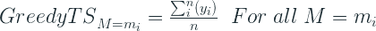
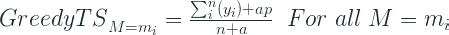

# CatBoost

> 原文：<https://towardsdatascience.com/catboost-d1f1366aca34?source=collection_archive---------25----------------------->

## [梯度助推器](http://towardsdatascience.com/tagged/the-gradient-boosters)

## 人迹罕至

当 XGBoost 和 LightGBM 在 Kaggle 竞赛中独领风骚时，另一个竞争者在 Yandex 诞生了，即来自俄罗斯的 Google。它决定采用较少读取的路径，并采用不同的方法进行梯度提升。在他们看来，他们试图解决世界上所有其他 GBM 中的一个关键问题。

来源: [Unsplash](https://unsplash.com/photos/-IZ2sgQKIhM)

让我们来看看它的不同之处:

# 分类编码

让我们来看看赋予该算法名称的创新——CatBoost。与 XGBoost 不同，CatBoost 以本机方式处理分类变量。许多研究表明，一次性编码高基数分类特征并不是最好的方法，尤其是在基于树的算法中。和其他流行的选择都在[目标统计的保护伞下——目标均值编码、留一编码等。](https://www.coursera.org/lecture/competitive-data-science/concept-of-mean-encoding-b5Gxv)

目标统计的基本思想很简单。我们用具有相同分类值的训练样本的所有目标的平均值来替换分类值。例如，我们有一个称为天气的分类值，它有四个值—晴天、雨天、多云和下雪。最简单的方法是所谓的贪婪目标统计，我们用天气“晴朗”的所有训练样本的目标值的平均值来代替“晴朗”。

如果 m 是我们正在编码的分类特征，mᵢ是 m 中的特定值，并且 *n* 是 M = mᵢ的训练样本的数量

但是当具有 mᵢ的样本数量太低或为零时，这是不稳定的。因此，我们使用朴素贝叶斯分类器中使用的[拉普拉斯平滑来使统计更加稳健。](/introduction-to-naïve-bayes-classifier-fa59e3e24aaf)

其中*a*0 为参数。 *p* (之前)的常见设置是数据集中的平均目标值。

但是这些方法通常会遇到所谓的目标泄漏，因为我们使用目标来计算分类变量的表示，然后使用这些特征来预测目标。留一编码试图通过排除计算表示的样本来减少这种情况，但并不是万无一失的。

CatBoost 作者在这里提出了另一个想法，他们称之为有序目标统计。这是受在线学习算法的启发，该算法按时间顺序获取训练样本。而在这种情况下，目标统计将只依赖于过去的训练实例。为了使这种想法适应标准的离线训练范式，他们想象了一个人工时间的概念，但随机排列数据集，并认为它们在本质上是连续的。

然后，他们仅使用在人工时间中特定样本之前出现的样本来计算目标统计数据。值得注意的是，如果我们只使用一种排列作为人工时间，它将不会非常稳定，为此，他们用多种排列进行编码。

# 有序升压

如论文作者所述，CatBoost 算法的主要动机是传统梯度增强模型中固有的目标泄漏，他们称之为预测偏移。高层的想法很简单。正如我们所知，任何梯度推进模型都是通过以加法方式在基础学习者上构建基础学习者来迭代工作的。但由于每个基础学习器都是基于相同的数据集构建的，作者认为存在一点目标泄漏，这会影响模型的泛化能力。根据经验，我们知道梯度增强的树有过度拟合数据的压倒性趋势。针对这种泄漏的唯一对策是像二次采样这样的功能，他们认为这是一种启发式的处理问题的方法，只能缓解而不能完全消除它。

作者形式化了提出的目标泄漏，并从数学上证明了它的存在。他们的另一个有趣的观察结果是，目标位移或偏差与数据集的大小成反比，即如果数据集很小，目标泄漏会更加明显。这个观察结果也与我们的经验观察结果一致，即梯度增强的树倾向于过度适应小数据集。

为了解决这个问题，他们提出了一种新的梯度增强方法，称为有序增强。这个想法的核心是非常直观的。以前梯度增强的主要问题是每次迭代都要重复使用相同的数据集。因此，如果每次迭代都有不同的数据集，我们就解决了泄漏问题。但是，由于没有一个数据集是无限的，这种想法，纯粹应用，将是不可行的。因此，作者提出了上述概念的实际实现。

它从创建数据集的 *s+1* 排列开始。这种排列是算法考虑的人工时间。姑且称之为σ₀到σₛ.σ₁到σₛ的排列用于构造树分裂，σ₀用于选择叶值 bⱼ.在没有多重排列的情况下，具有短“历史”的训练样本将具有高方差，因此具有多重排列缓解了该缺陷。

我们之前看到了 CatBoost 处理分类变量的方式，我们提到过在那里我们使用多种排列来计算目标统计数据。这被实现为 boosting 算法的一部分，该算法在任何迭代中使用从σ₁到σₛ的特定排列。使用采样排列计算树分裂所需的梯度统计和分类编码所需的目标统计。

一旦所有的树都建立起来了，最终模型 f 的叶值就可以通过标准的梯度推进过程(我们在以前的文章中看到过)使用置换σ₀.来计算当最终模型 F 被应用于来自测试集的新样本时，目标统计量是在整个训练数据上计算的。

需要注意的一点是，CatBoost 还支持传统的梯度增强，除了有序增强(*Boosting _ type*= '*Plain*或' *Ordered* ')。如果是' *Plain* '，并且有分类特征，则仍然为目标统计创建排列，但是树构建和提升在没有排列的情况下完成。

# 被遗忘的树

CatBoost 在另一个关键方面也不同于其他鸟群——在它的整体中构建的树的种类。默认情况下，CatBoost 构建对称树或不经意树。这些是树，相同的特征负责将学习实例分成树的每一层的左和右分区。

这在算法中有双重影响-

1.  正则化:由于我们将树构建过程限制为每层只有一个特征分裂，我们实质上降低了算法的复杂性，从而实现了正则化。
2.  计算性能:任何基于树的算法中最耗时的部分之一是在每个节点搜索最优分割。但是，因为我们将每个级别的特征分割限制为一个，所以我们只需搜索单个特征分割，而不是 k 个分割，其中 k 是该级别中的节点数。即使在推断过程中，这些树也能让它快如闪电。据推断，它比 XGBoost 快 8 倍。

虽然默认选项是“ *SymmetricTree* ”，但是也可以使用参数“ *grow_policy* ”切换到“*depth wise*”(XGBoost)或“*loss guide*”(light GBM)，

# 分类特征组合

CatBoost 的另一个重要细节是，它在树构建过程中隐式地考虑分类变量的组合。这有助于它考虑多个分类特征的联合信息。但是由于可能的组合总数会迅速增加，所以在树构建过程中采用了贪婪的方法。对于当前树中的每个分割，CatBoost 将叶中所有以前使用的分类特征与所有其余的分类特征连接起来作为组合，并动态计算目标统计数据。

# 过拟合检测器

CatBoost 中另一个有趣的特性是内置的过拟合检测器。如果 CatBoost 检测到过度拟合，它可以在我们设置的迭代次数之前停止训练。CatBoost 中实现了两个过拟合检测器:

1.  Iter
2.  IncToDec

*Iter* 相当于提前停止，算法在停止迭代之前等待 *n* 次迭代，因为验证损失值有所改善

*IncToDec* 稍微涉及一点。它通过跟踪一次又一次迭代的度量迭代的改进来采取稍微复杂的路线，并且还使用类似于指数平滑的方法来平滑进展，并且设置阈值以在平滑值低于阈值时停止训练。

# 缺少值

跟随 XGBoost 的脚步，CatBoost 也单独处理缺失值。CatBoost 中有两种处理缺失值的方法——最小值和最大值。

如果选择“最小值”，缺失值将作为该特征的最小值进行处理。如果您选择“最大”，缺失值将作为该特性的最大值进行处理。在这两种情况下，可以保证在每一次树拆分中都考虑缺失值和其他值之间的拆分。

# 超参数

如果说 LightGBM 有很多超参数，CatBoost 甚至更多。有这么多超参数需要优化，GridSearch 不再可行。对于任何给定的问题，获得正确的参数组合变得更像是一门艺术。但我还是会尝试总结一些你必须牢记的关键参数。

*   *one_hot_max_size* :设置分类特征中唯一值的最大数量，低于该数量时，将进行一次性编码，不使用目标统计数据。建议您在输入特性集之前不要进行一次性编码，因为这会损害算法的准确性和性能。
*   *迭代次数* —要在集合中构建的树的数量。这必须用 cv 来调整，或者应该采用一种过拟合检测方法来使迭代停止在理想迭代处。
*   *od_type、od_pval、od_wait* —这三个参数配置过拟合检测器。
*   *od_type* 是过拟合检测器的类型。
*   *od_pval* 为 IncToDec 的阈值(推荐范围:[10e-10，10e-2])。该值越大，越早检测到过度拟合。
*   od_wait 根据 od_type 有不同的含义。如果是 *IncToDec* ，则 *od_wait* 是过拟合检测器开始工作之前必须运行的迭代次数。如果是 *Iter* ，则 *od_wait* 是在停止训练之前，在度量没有改善的情况下，它将等待的迭代次数。
*   *learning_rate* —通常的意思。但是 CatBoost 会根据数据集属性和设置的迭代次数自动设置学习率。
*   *深度* —这是树的深度。最佳值范围从 4 到 10。如果 *boosting_type* 为 *Lossguide* 则默认值为 6 和 16
*   l2 _ leaf _ reg 这是沿着叶子的正则化。任何正值都允许作为值。增加该值可以增加正则化效果。
*   *has_time* —我们已经看到，完成有序升压需要一段人工时间。但是如果你的数据实际上有一个时间顺序呢？在这种情况下，设置 has_time = True 以避免在有序提升中使用排列，而是使用数据被提供的顺序作为唯一的排列。
*   *grow_policy* —如前所述，CatBoost 默认构建“ *SymmetricTree* ”。但有时“ *Depthwise* ”和“Lossguide”可能会给出更好的结果。
*   min_data_in_leaf 是控制每个叶中训练样本的最小数量的常用参数。这只能在深度方向的*损耗导轨*和*中使用。*
*   max_leaves 是任何给定树的最大叶子数。这只能在*损耗导轨*中使用。这里不建议使用大于 64 的值，因为这会显著降低训练过程的速度。
*   *rsm 或 col sample _ by level*-在每个分割选择中使用的特征百分比。这有助于我们控制过度拟合，值的范围为(0，1)。
*   nan_mode —可以将值“禁止”、“最小”、“最大”作为三个选项。“禁止”不允许缺少值，并将引发错误。最小值和最大值我们前面已经讨论过了。

[*中的其他文章*](http://towardsdatascience.com/tagged/the-gradient-boosters) 中的梯度助推器

*   [老好人渐变助力](/the-good-old-gradient-boosting-f4614b0e62b0)
*   [正规化的贪婪森林](/regularized-greedy-forest-a17cd0c85f06)
*   [XGBoost](/xgboost-b736c2ab10ce)
*   [LightGBM](/lightgbm-800340f21415)
*   CatBoost(你在这里)

# 参考

1.  贪婪函数近似:一种梯度推进机器。安。统计学家。29 (2001 年)，第 5 号，1189-1232。
2.  普罗霍伦科娃、柳德米拉、古塞夫、格莱布等人(2018 年)。 [CatBoost:具有分类特征的无偏增强](https://arxiv.org/abs/1706.09516)。神经信息处理系统的进展
3.  CatBoost 参数。[https://catboost . ai/docs/concepts/python-reference _ parameters-list . html](https://catboost.ai/docs/concepts/python-reference_parameters-list.html)

*原载于 2020 年 2 月 29 日 http://deep-and-shallow.com***。**