# 你能用信用卡付款吗？

> 原文：<https://towardsdatascience.com/catch-me-if-you-can-predicting-credit-card-default-using-classification-analysis-28b2955f7f7d?source=collection_archive---------41----------------------->

## 使用分类分析发现客户拖欠付款的迹象。

图片由 [ideyweb](https://www.shutterstock.com/g/ideyweb33) 通过 Shutterstock.com 提供

由于新冠肺炎，许多人失去了工作，导致人们捆扎现金和拖欠信用卡付款。情况变得如此糟糕，以至于摩根大通和花旗集团等信用卡公司不得不留出额外准备金，以弥补信用卡违约带来的损失。现在，这是一个非常极端的情况，这种情况并不经常发生(我真的希望不会)。人们无力支付信用卡账单可能是由于不同的情况。然而，当它是故意的，意味着客户没有偿还银行的计划，这将被认为是一种欺诈。不管怎样，这给信用卡公司带来了巨大的风险，我们需要找到一种方法来标记它们。

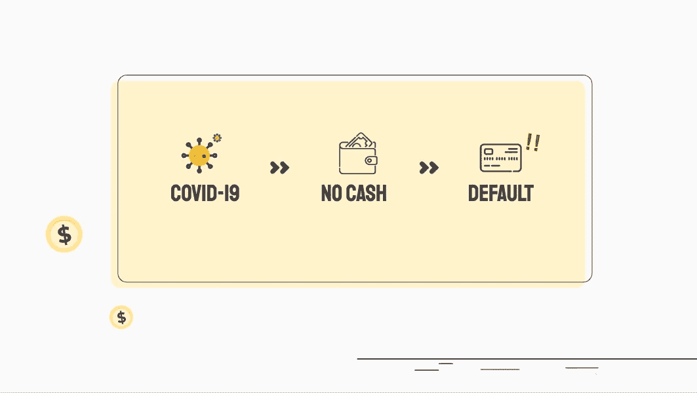

Slidesgo 的演示模板| Freepik 的信息图表

为了解决这个问题，我们可以根据某些属性来预测潜在的默认帐户。这个想法是，越早发现潜在的违约账户，我们承受的损失就越低。另一方面，我们可以主动向客户提供提示，以防止违约。这不仅保护了我们的客户，也将我们的风险和潜在损失降至最低。

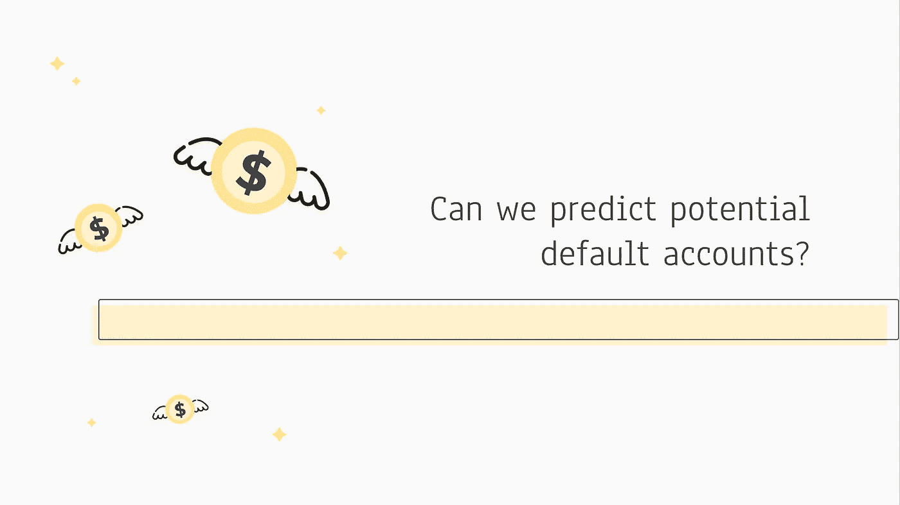

Slidesgo 的演示模板| Freepik 的信息图表

# 目标

预测客户下个月是否会拖欠信用卡付款。

# 方法

下图是我如何着手构建和最终确定分类模型的高级概述。

幻灯片演示模板 go

## 为召回而优化

在这种情况下，我们将专注于拥有最高的回忆分数，同时不要过于牺牲精确性。高误报率意味着我们可能会错误地对下个月拖欠信用卡的人进行分类，并因为关闭他们的账户而失去客户。高假阴性意味着我们错误地将不会违约的账户分类，最终我们可能需要动用储备金来弥补损失。如前所述，信用卡违约可能被视为欺诈，因此我们正确地对所有违约案例进行分类以最大限度地降低风险和损失非常重要。

# 数据收集

从[加州大学欧文分校机器学习库](https://archive.ics.uci.edu/ml/datasets/default+of+credit+card+clients)获得的数据集包含台湾信用卡客户的信息。它包括 30，000 个观察值和 24 个特征。

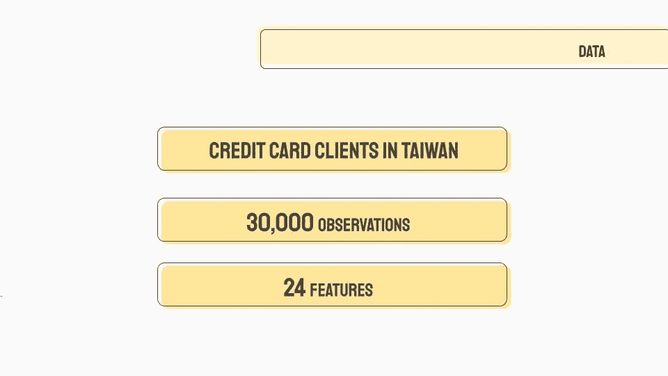

幻灯片演示模板 go

## **特色**

*   **信用信息:**信用额度
*   **人口统计:**性别、最高教育程度、年龄和婚姻状况
*   **还款历史(2005 年 4 月~ 9 月):**每月还款状态、还款金额、账单金额

## **目标**

信用卡客户下个月会不会违约

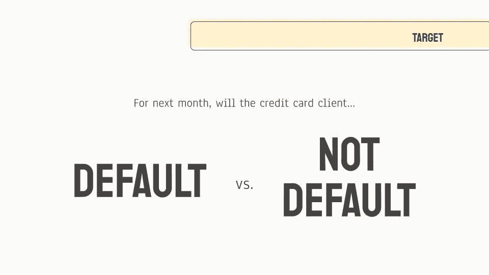

幻灯片演示模板 go

# 数据探索

## 阶级不平衡

有一个类不平衡的问题，因此我们稍后将使用一些过采样技术来解决这个问题。

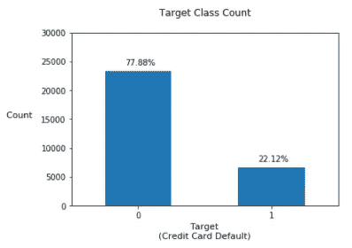

目标分布要求 22%为违约，78%为无违约。

## 阶级分布

在任何人口统计数据上，违约和非违约的分布都没有非常明显的区别。

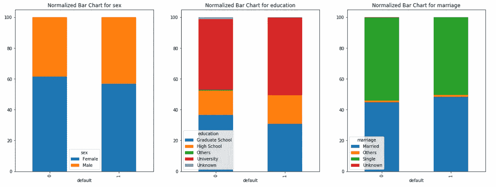

人口统计变量的标准化分布条形图

然而，你可以看到每月还款状态的目标类别的分布差异。

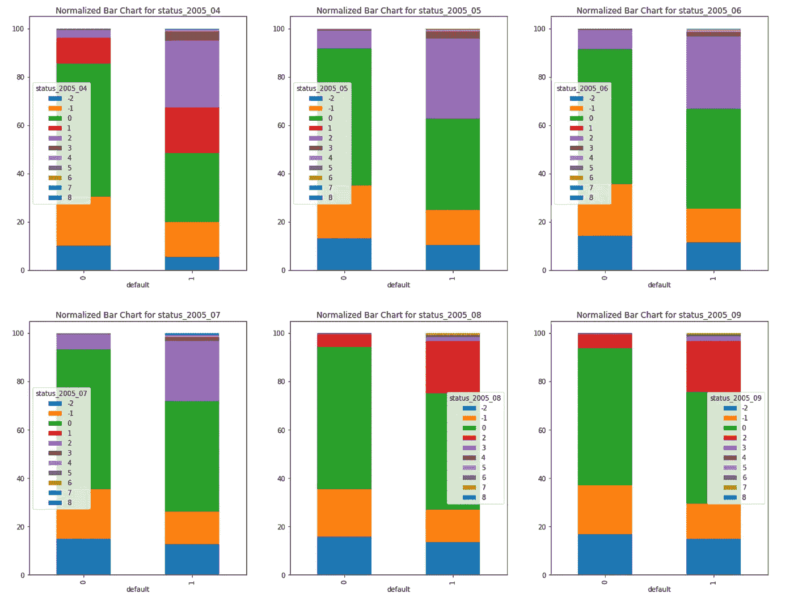

2005 年 4-9 月客户还款状况归一化分布柱状图*(还款状况衡量尺度:-2:余额已全部支付且无交易；-1:全额支付的余额和由于最近交易的正余额；0:已付最低金额；1 =延迟一个月付款；2 =付款延迟两个月；。。。；9 =付款延期九个月)*

## 检查数据类型和空值

检查完特性后，我们看到没有空值，所有变量都是整数。

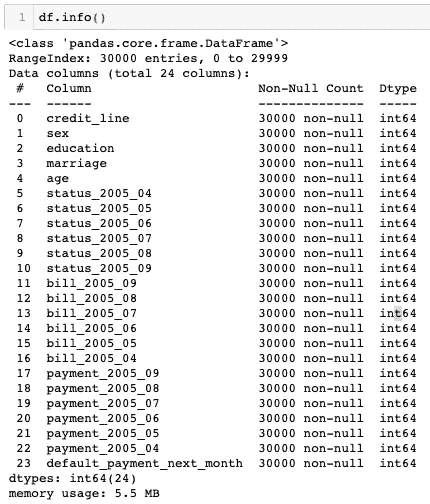

检查空值和数据类型的所有特性。

## **执行特征工程**

请注意，我已经在 EDA、特征工程和建模之间走来走去，因此下面创建了转换的特征。

*   **信用额度使用:**从 0 到 1，这是从 2005 年 4 月到 9 月使用的信用的总百分比。
*   **世代:**用`age`计算此人属于哪一代，即“X 世代”、“千禧一代”等。
*   **延期付款的总月数:**6 个月(2005 年 4 月~ 9 月)中，延期付款的月数。
*   **付款延迟:**这是一个 1/0 标志，表示是否有付款延迟。
*   **虚拟变量为**T1。

## **多重共线性**

为了避免高维数的灾难，如果更少的要素(更简单的模型)产生相同(或更好)的结果，我们通常应该避免多重共线性。我们看到`education_University`和`education_Graduate School`相互关联，这是意料之中的，因为这些变量对于教育来说是虚拟变量(互斥的)。其余的变量似乎并不相互关联。

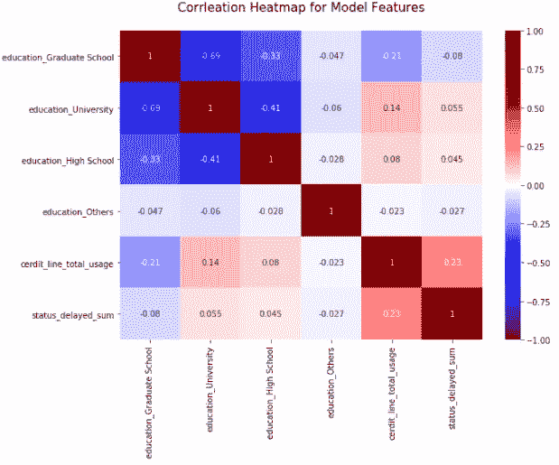

# **数据建模**

1.  **将数据分为 80%的训练集和 20%的保留集。**只在 80%的训练集上训练数据，在所有特征和超参数最终确定之前，不接触保留集。
2.  **使用** [**最小最大缩放器**](https://scikit-learn.org/stable/modules/generated/sklearn.preprocessing.MinMaxScaler.html) **应用缩放，通过将每个特征缩放到 0 到 1 的范围来变换特征。**与[标准缩放器](https://scikit-learn.org/stable/modules/generated/sklearn.preprocessing.StandardScaler.html)相反，[最小最大缩放器](https://scikit-learn.org/stable/modules/generated/sklearn.preprocessing.MinMaxScaler.html)最适用于有异常值的数据集。由于我最终为模型选择的特征，我的数据集没有异常值。
3.  **使用**[**ADASYN**](https://imbalanced-learn.readthedocs.io/en/stable/generated/imblearn.over_sampling.ADASYN.html)**应用过采样技术。**我也试过 [RandomOverSampler](https://imbalanced-learn.readthedocs.io/en/stable/generated/imblearn.over_sampling.RandomOverSampler.html) 和 [SMOTE](https://imbalanced-learn.readthedocs.io/en/stable/generated/imblearn.over_sampling.SMOTE.html) ，最后 [ADASYN](https://imbalanced-learn.readthedocs.io/en/stable/generated/imblearn.over_sampling.ADASYN.html) 取得了最好的召回分数。然而，ADASYN 是最慢的采样方法，因为该技术通过计算数据点之间的距离来生成合成数据。
4.  **使用带有逻辑回归、K-最近邻、随机森林、额外树和朴素贝叶斯的五重交叉验证**训练数据。
5.  **最终确定模型的特征。**以下是模型中最终确定的特征:1)信用额度使用，2)延迟付款的总月数，以及 3)`education`的虚拟变量
6.  **根据召回分数选择前 3 名表现最佳的车型。**根据召回分数，表现最好的前 3 个模型是随机森林、额外树和逻辑回归。

幻灯片演示模板 go

在上面的图表中，每一行都用不同的型号进行了颜色编码。图例显示，Random Forest 的 ROC-AUC 得分最高，这意味着它在三个模型中表现最佳。在右边，Random Forest 也显示了它几乎总是比其他两个模型表现得更好，因为几乎没有重叠的区域。

# 结果

根据 ROC-AUC 评分，**随机森林胜出**！

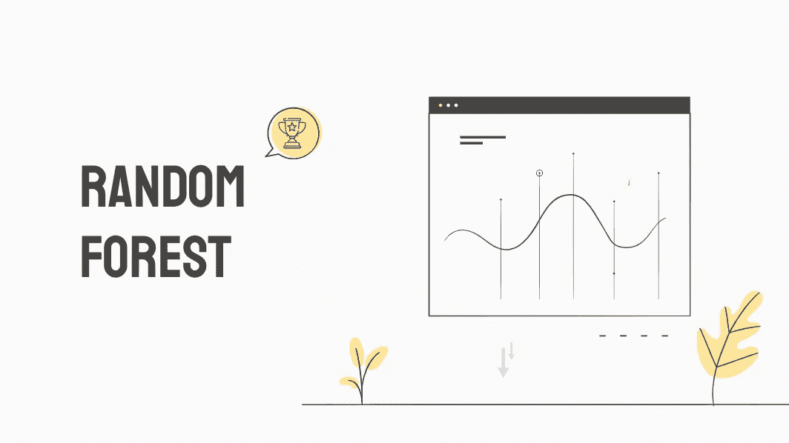

Slidesgo 的演示模板| Freepik 的信息图表

## 韵律学

该模型的召回率为 67.37%。查看下面的混淆矩阵，误报率较高(22.52%)，这是我们关注召回时所预期的。因此，假阴性相对较低，保持在 7.22%。

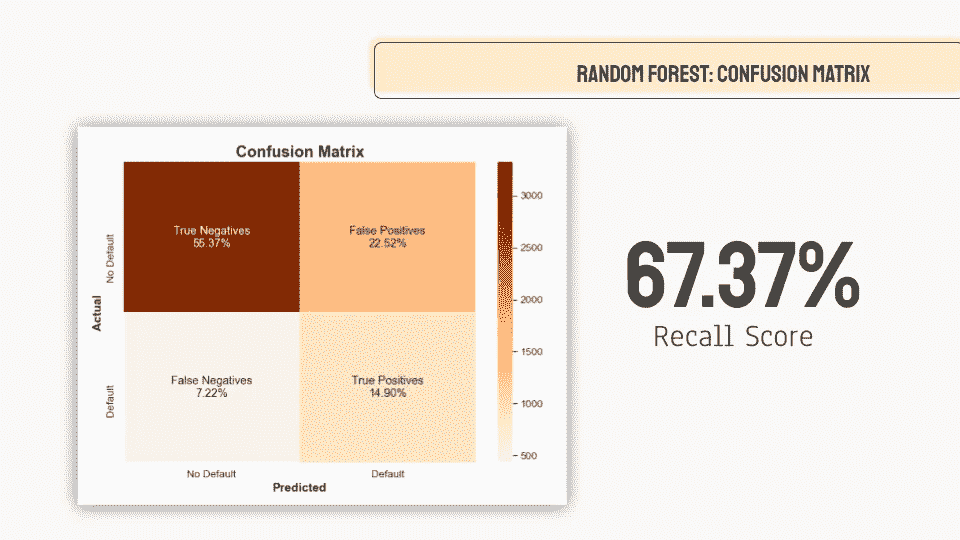

幻灯片演示模板 go

## 特征重要性

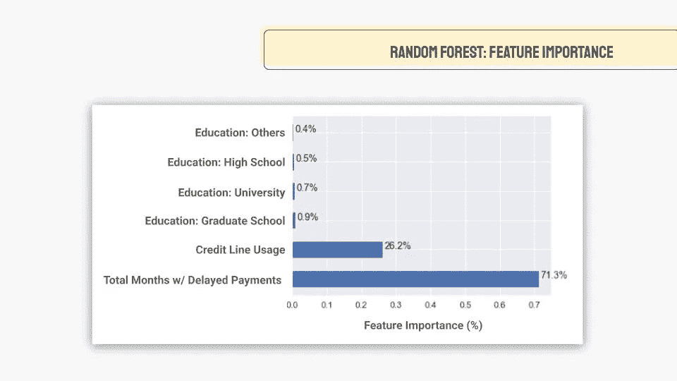

幻灯片演示模板 go

以下特征(及其特征重要性百分比)最终非常有助于预测客户下个月是否会拖欠信用卡付款:

1.  延迟付款的总月数— 71%
2.  信用额度使用率— 27%
3.  `education`–0.4 ~ 0.9%
    *的虚拟变量你可能会奇怪，既然它们的重要性很低，我为什么不直接删除它们。我真的做了，模型实际上表现更差，因此我把它们留在那里。*

## 最佳阈值

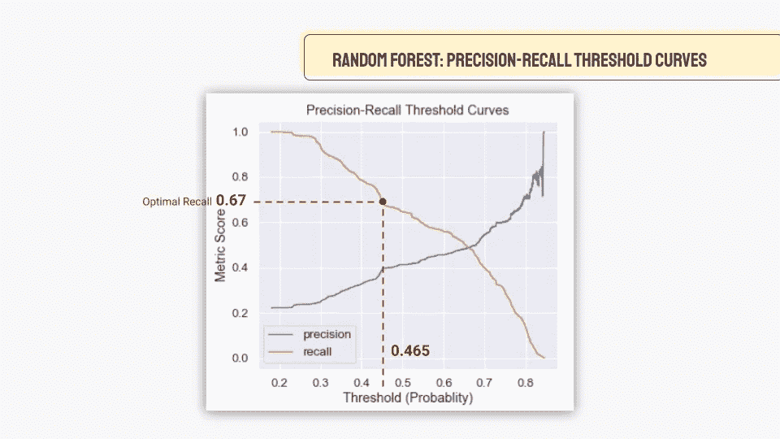

幻灯片演示模板 go

最后，阈值被设置为 0.465，以实现 0.67 的召回分数。随着阈值的上下移动，可以看到精度和召回率会相互补偿。由业务部门决定适当的误报和漏报百分比，我们可以随时调整阈值以达到期望的百分比。

# 未来的工作

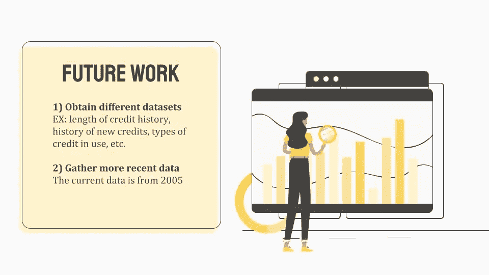

幻灯片演示模板 go

如果有更多的时间，我希望在未来的分析中包括以下内容:

1.  **获取不同的数据集**，特别是关于客户信用历史的长度、新信用历史、当前使用的信用类型等。因为我相信这些可以极大地提高模型的预测能力。
2.  **获取更近的数据**，因为该模型使用的数据来自 15 年前的 2005 年。在过去的 15 年里，很多事情可能已经改变了！

[1]:美联社。(2020 年 4 月 15 日)。各大银行准备应对贷款违约，留出近 200 亿美元来弥补损失。[https://www . Dallas news . com/business/banking/2020/04/15/major-banks-brace-for-loan-defaults-拨备-200 亿-弥补损失/](https://www.dallasnews.com/business/banking/2020/04/15/major-banks-brace-for-loan-defaults-setting-aside-20-billion-to-cover-losses/)