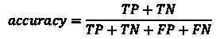
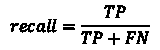
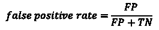

# 使用机器学习捕捉网络中的入侵者

> 原文：<https://towardsdatascience.com/catching-intruders-in-networks-using-machine-learning-dd25443709fe?source=collection_archive---------39----------------------->

## 算法在检测和对抗网络攻击方面具有非凡的潜力。为什么它们很少被使用？

图片来自 [Pixabay](https://pixabay.com/?utm_source=link-attribution&amp;utm_medium=referral&amp;utm_campaign=image&amp;utm_content=2463383) 的 [Yatheesh Gowda](https://pixabay.com/users/5187396-5187396/?utm_source=link-attribution&amp;utm_medium=referral&amp;utm_campaign=image&amp;utm_content=2463383)

电脑受到攻击。民族国家利用网络攻击占据上风。犯罪分子利用网络攻击获利。网络安全对于企业和个人保护其数据和计算机系统至关重要。检测攻击是网络安全中的一个重要目标，因为它会发出危险信号并实现快速响应。

入侵检测是检测针对计算机网络的攻击的一种方法。入侵检测系统监控来自网络或个人计算机的信息，以提醒响应者网络攻击。入侵检测系统通常分为基于网络和基于主机两类，但基于网络的系统最为常见。

> 随着网络对手调整他们的攻击，产生特征来检测他们是具有挑战性的。

入侵检测还可以分为基于特征的系统和基于异常的系统。基于签名的系统依赖于代表攻击的已知模式的目录。另一方面，基于异常的检测系统寻找与正常活动不一致的模式。

传统的入侵检测系统是基于特征的，并且依赖于人们创建规则，通常是基于他们经历过的攻击。随着网络对手调整他们的攻击，产生特征来检测他们是具有挑战性的。这些系统很少会发现新的攻击，因为它们是建立在预定义的规则之上的。

## 利用机器学习进行入侵检测

入侵检测的机器学习研究始于 1987 年左右[1]。从那以后，它一直是一个研究课题。合适的机器学习算法不仅能够检测已知的攻击模式，还能够检测新的攻击。

随着机器学习方法的发展，不同的算法已经被应用于入侵检测。成功的方法包括决策树、神经网络、贝叶斯算法、支持向量机和遗传算法。此外，无监督方法已经应用了图论、聚类和集成方法来检测入侵。

机器学习在入侵检测方面具有非凡的潜力，因为它特别擅长发现数据中的模式。在大多数情况下，人类分析师要处理的数据太多了。他们必须仔细检查大型日志文件，寻找攻击的迹象。这是机器学习算法做得最好的。

尽管进行了所有这些研究，但入侵检测的机器学习应用尚未在实践中广泛采用[2]。这是由于许多挑战。首先，网络上使用的数据集非常大，并且在持续增长。这使得资源饥渴的算法很难跟上。其次，入侵检测系统通常会产生很高的误报率。第三，与机器学习的许多应用不同，有一个对手试图篡改算法以逃避检测。许多机器学习算法容易受到篡改，这使得它们对于入侵检测来说不太准确。

## 不平衡数据的问题

与正常数据量相比，入侵数据非常小。因此，这些数据集非常不平衡。例如，UNSW-NB15 数据集中只有 3.2%的文件包含攻击示例。当机器学习应用于这些不平衡的数据集时，只看准确性是不够的。

准确度的计算方法是真阳性和真阴性的总和除以所有结果的总和。

如果一个数据集有 1000 条记录，有三条记录是攻击，那么一个简单地预测没有一条记录是攻击的算法，f(X) = 0，会产生 99.7%的准确率。

与其在不平衡的数据集中测量准确性，更重要的是看真实的阳性率，也称为召回率。真阳性率的计算方法是真阳性的数量除以真阳性和假阴性的总和。

在 f(X) = 0 的示例中，真正的阳性率是 0%，这意味着没有检测到任何攻击。这对于一个应该检测攻击的算法来说是不可接受的，即使它有很高的准确率。

不平衡数据集的另一个重要度量是假阳性率。假阳性率的计算方法是假阳性的数量除以假阳性和真阴性的总和。

在另一个例子中，假设在 1，000 个记录的数据集中，其中三个记录是攻击，该算法找到了所有三个攻击记录，但是也错误地预测了 100 个实际上正常的攻击。在这种情况下，90%的准确性分数不算太差，但假阳性率为 10%，这意味着人类分析师将需要花时间审查假警报。

## 寻找一个好的数据集

入侵检测机器学习的最大挑战之一是找到一个好的测试数据集。监督学习需要带标签的数据，但是由于网络数据的数量和保密性要求，大多数数据集都包含模拟数据。为了标记攻击，许多数据集使用红色分组在正常数据中创建攻击流。

最早的数据集，1999 年 KDD 杯，是作为第三届国际知识发现和数据挖掘工具竞赛的一部分而创建的[3]。竞赛的目标是建立一个网络入侵检测系统。该数据集基于从模拟空军局域网捕获的九周网络数据。原始网络数据被处理以创建 CSV 数据集。它包括四种主要类型的攻击:拒绝服务；来自远程计算机的未授权访问；对本地特权帐户的未授权访问；和探索。

> 入侵检测机器学习的最大挑战之一是找到一个好的测试数据集。

尽管 1999 年 KDD 杯的数据集对最初的比赛和随后的研究都很有用，但它几乎是 15 年来唯一用于入侵检测研究的数据集。随着时间的推移，数据集因包含重复记录和代表过时技术而受到批评。计算机和网络在 15 年里发生了巨大的变化。

从那时起，许多研究人员创造了更多的现代数据集，以解决 1999 年 KDD 杯的弱点。最值得注意的是，UNSW-NB15 数据集创建于 2015 年，代表了一个更现代的网络[4]。它是在模拟器中创建的，包括标记的数据以及计算机系统的 IP 地址。

UNSW-NB15 比 1999 年 KDD 杯数据集更不平衡，攻击记录比正常记录少得多。在撰写本文时，UNSW-NB15 数据集已有五年历史。尚不清楚它在研究中会有多长时间的用处，但是生成数据集的新方法使得创建数据集的工作量大大减少[5]。

## 未来方向

入侵检测仍然是机器学习中的一个开放的研究问题。它很可能仍然很有趣，因为技术变化很快，需要研究跟上最新的趋势。这也很有趣，因为对手经常采用新方法来攻击网络。能够识别新型攻击的机器学习算法对于成功防御计算机网络尤为重要。

## 参考

[1] D. E. Denning，[一个入侵检测模型](https://doi.org/10.1109/TSE.1987.232894) (1987)，IEEE 软件工程汇刊，(2)，222–232

[2] R. Sommer 和 V. Paxson，[在封闭世界之外:使用机器学习进行网络入侵检测](https://doi.org/10.1109/SP.2010.25) (2010 年 5 月)，IEEE 安全和隐私研讨会，305–316

[3]加州大学欧文分校[1999 年 KDD 杯数据](http://kdd.ics.uci.edu/databases/kddcup99/kddcup99.html) (1999)

[4] N .穆斯塔法， [UNSW_NB15 数据集](http://dx.doi.org/10.21227/8vf7-s525) (2019)，IEEE 数据端口

[5] N. Moustafa，[机器人-物联网数据集](http://dx.doi.org/10.21227/r7v2-x988) (2019)，IEEE 数据端口