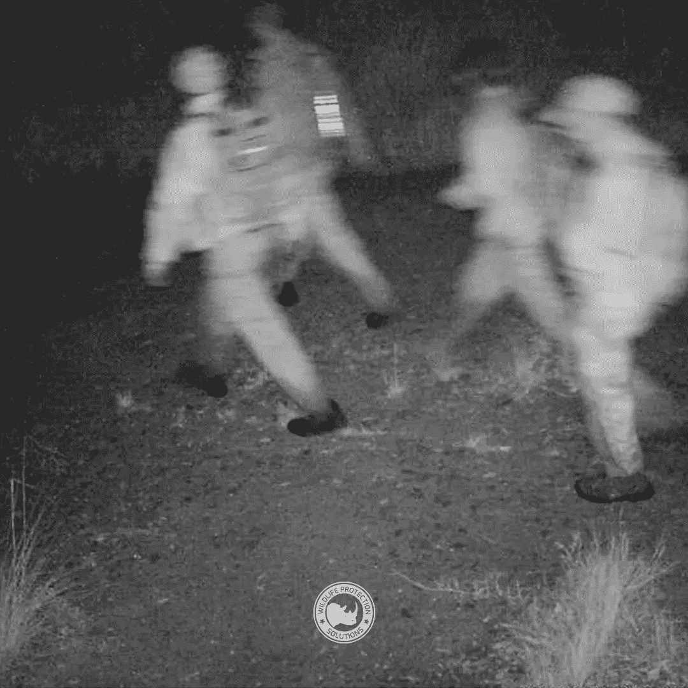
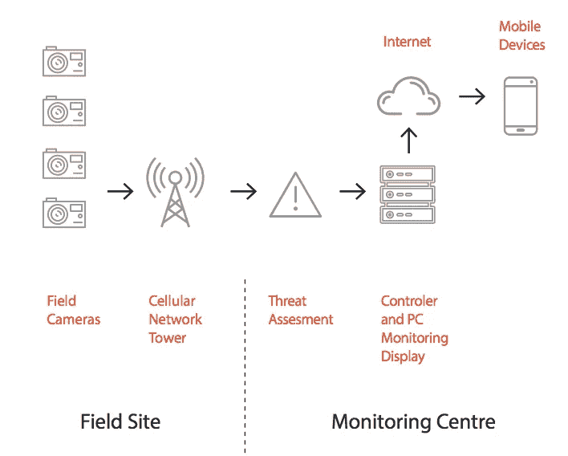
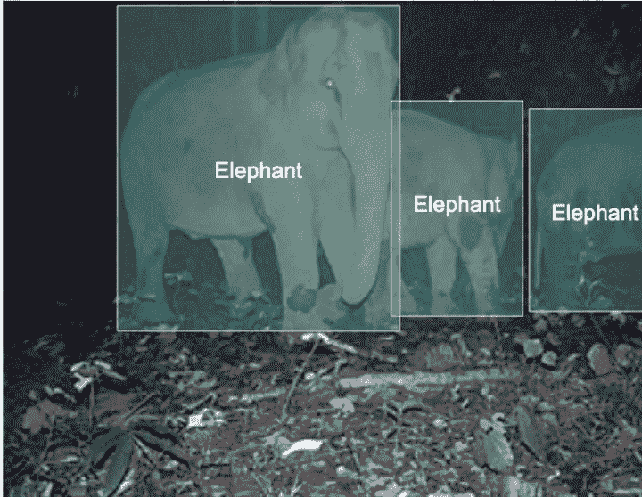
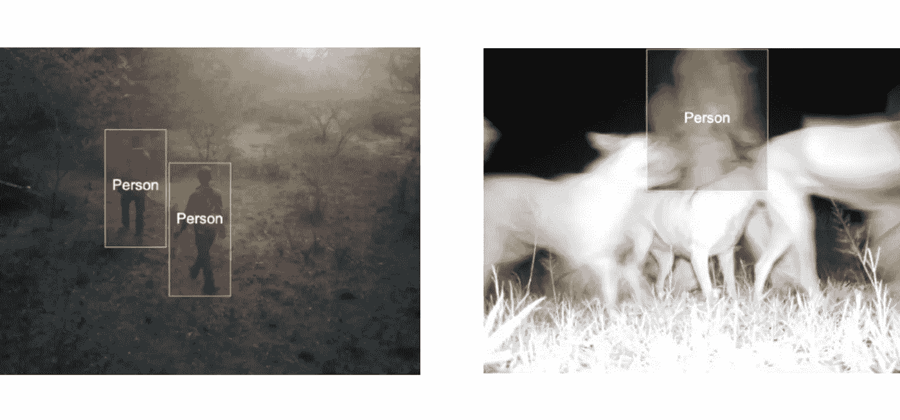

# 用机器学习抓偷猎者

> 原文：<https://towardsdatascience.com/catching-poachers-with-machine-learning-118eec41d5b9?source=collection_archive---------47----------------------->

## 建立一个监测自然保护区偷猎者的 ML 系统

*完全披露:我是* [*的维护者，这是一个开源的 ML 平台，Cortex*](https://github.com/cortexlabs/cortex) *，旨在构建类似下面讨论的项目。*

据估计，每天都有近 100 头非洲象被偷猎者杀害。全世界每天总共有 1000 只动物被偷猎。

大量的偷猎发生在自然保护区，这是许多濒危物种最后(理论上)安全的地方。

对于负责保护这些动物的护林员来说，阻止偷猎者是一场寡不敌众的战斗。超过 70 亿美元的非法产业吸引了看似永无止境的偷猎者。

一个非营利组织，野生动物保护解决方案(WPS)，最近开始用机器学习来打击偷猎者——而且很有效。

通过使用运动探测器、摄像机和训练有素的模型，WPS 正在以前所未有的速度识别更多的偷猎者，并在打击偷猎的斗争中引入新的优势。

# 你如何监控 100 万公顷的野生动物？

防止偷猎最难的部分也是最简单的部分之一:

自然保护区真的很大。

对一小队护林员来说，全天候监控 100 万公顷的区域，包括茂密的森林、悬崖和其他自然障碍，是一项艰巨的任务——即使是远程监控。

WPS 和相关团体已经在整个自然保护区部署运动传感器摄像机多年了。这种相机的工作原理是捕捉大型移动物体的图像，并实时发送给人类监视器，由监视器分析它们是否有偷猎活动。如果另一端的人类看到偷猎活动，他们会向响应者网络发送警报。

[南非偷猎者被 WPS 抓获](https://wildlifeprotectionsolutions.org/wpswatch/)

虽然这种远程监控是一种进步，但它仍然存在一些挑战。同时分析来自许多摄像机的镜头——并且足够快地在行动中抓住偷猎者——需要比一般自然保护区更多的审查人员。

即使努力自动过滤偷猎者的图像，WPS 估计该系统也只能检测到 40%的记录在案的偷猎者。

# 用机器学习检测偷猎者

为了提高他们的检测率，WPS 将机器学习引入到他们的监控系统中。在引入机器学习之前，监控系统可以这样描述:

[来源:银池](https://silverpond.com.au/wp-content/uploads/2019/09/WPS-Casestudy-Highlighter-web.pdf)

野外摄像头捕捉图像，并将它们传送到监控中心，如果管理中心的人看到偷猎活动的证据，他们会向相关人员发送通知。

他们引入机器学习的目标是在威胁评估阶段插入一个经过训练的模型，作为一个 API。所有传入的图片都将被自动过滤掉偷猎行为，只有正面的图片会被传递给审核者。

通过与 ML 开发平台 HighLighter 合作，WPS 能够训练一个对象检测模型，该模型可以识别特定的动物，以及人类、车辆和其他潜在的偷猎迹象:

来源:[银池](https://silverpond.com.au/case-studies/wildlife-protection-solutions/)

部署该模型后，他们能够将其插入现有设置，而无需重新构建整个监控系统。

在测试的第一周，他们抓到了两名偷猎者。该小组估计，该系统的效率是以前的两倍，**吹嘘有 80%的检测率，并在不断改进更多的数据。**

自从最初的测试成功以来，WPS 已经在三大洲的自然保护区推出了该模型，仅在第一个月就提供了超过 100 万次预测。

# 非营利组织如何负担得起机器学习？

这个故事的许多令人兴奋的方面之一是，机器学习的这种应用不仅仅是可行的——它是可行的。

小团队和单独的工程师部署普通的预训练模型已经有一段时间了，但为这样的任务设计、培训和部署模型一直是大型科技公司的领域。

但是对于 WPS 来说，像 OpenCV 这样的现成解决方案是行不通的。他们需要培训和部署自己的模型。几年前，他们是一个小型非营利组织的事实会阻止他们这样做，但现在不会了。

模型开发平台和开源模型已经发展到现在，即使是小团队也可以训练模型。工程师们已经花了数年时间在像 Cortex 这样的[开源基础设施平台上工作，因此任何工程师都可以将一个模型变成偷猎者探测器、视频游戏或癌症筛查器。](https://github.com/cortexlabs/cortex)

人们已经谈论机器学习民主化很长时间了，但这个项目证明，现在，它终于发生了。