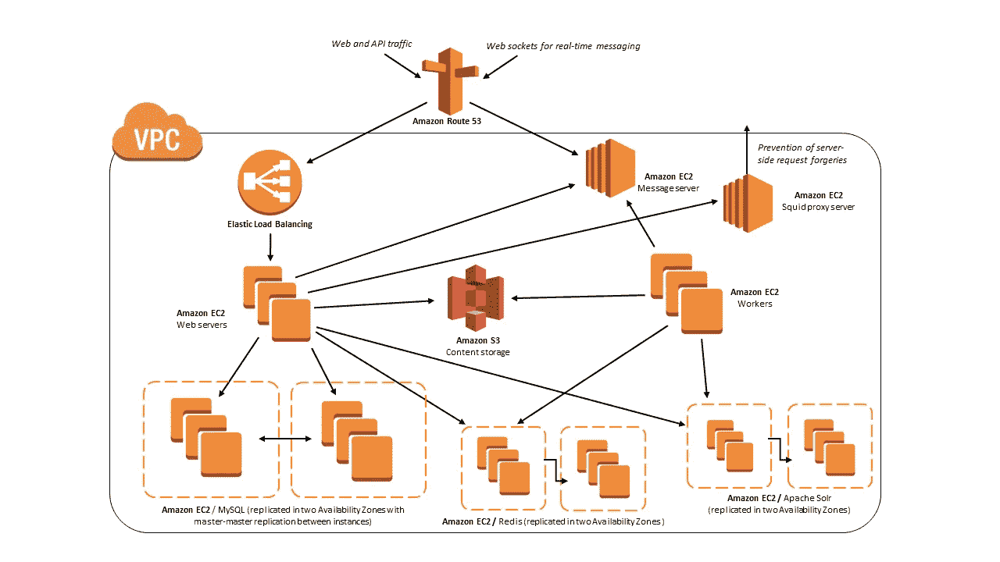
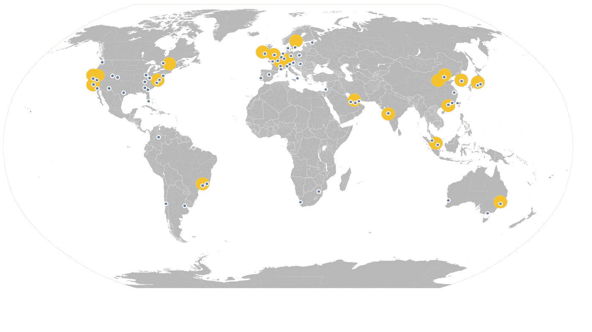
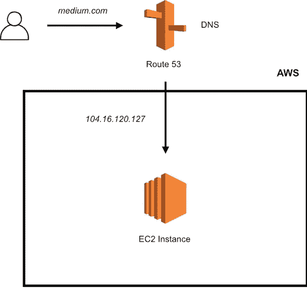
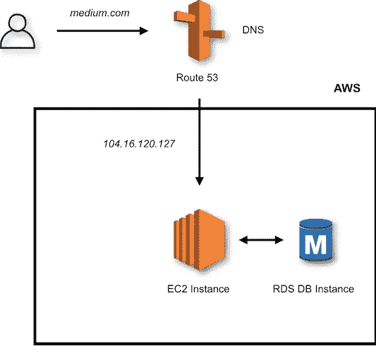
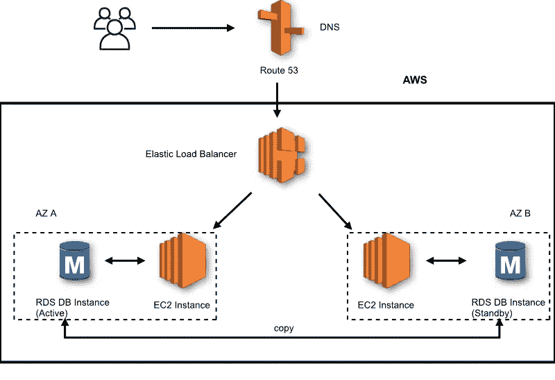
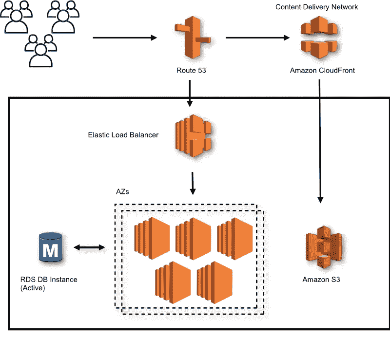
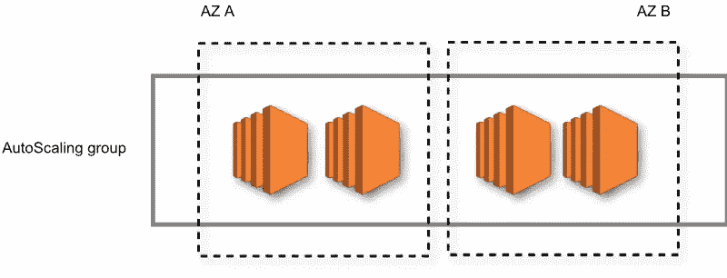
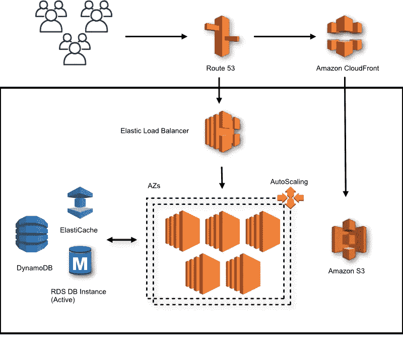

# 赶上云趋势和 AWS 生态系统

> 原文：<https://towardsdatascience.com/catching-up-with-the-cloud-trend-and-the-aws-ecosystem-dd512e8e2456?source=collection_archive---------18----------------------->

新加坡的海湾花园。 [Pixabay](https://www.pexels.com/@pixabay) 。

*几个月前，我对云业务及其产品一无所知，尽管我反复听说过。* *作为数据科学行业的标准，我必须赶上潮流。在本文中，我将与您分享我对市场领导者亚马逊网络服务(AWS)的了解。我还将向您展示哪些云架构和 AWS 服务可以用作全球数据密集型 web 应用程序的后端，如* [*Slack*](https://slack.com/intl/en-sg/) *。如果您对计算机网络(IP 地址、客户端、服务器等)有一些基本的了解，这将有所帮助，但不是强制性的。)为文章的第二部分。*

AWS 上的 Slack 云架构概述。[来源](https://aws.amazon.com/solutions/case-studies/slack/)

# 介绍

云计算已经存在很多年了。亚马逊在 2006 年首次推广了这一概念，然后其他科技巨头在 2008 年(谷歌)和 2010 年(微软)跟进。这种技术转变的核心思想是，除非这是你的工作，否则你不应该费心去建立自己的 IT 系统。这怎么可能呢？让我们直入主题吧！

# 了解云计算和 AWS 生态系统

## 云计算定义

首先，我们应该界定这一切大惊小怪的原因。云计算是一种允许您访问 IT 资源和应用程序的服务:

*   点播，
*   通过互联网，
*   采用现收现付的定价方式

这基本上意味着，你可以使用亚马逊的服务器( *IT 资源*)、坐在家里(*通过互联网*)、随着你的应用增长或放缓而扩展你的基础设施(*按需*)，但总是为你所使用的东西付费(*按需付费*)。

不用说，这种设置使您能够真正专注于您的产品，而不是采购、IT 维护或扩展。你受益于科技巨头的规模经济。例如，亚马逊的云计算业务 AWS 被网飞用于其几乎所有的后端基础设施。当你将这一点与网飞占互联网下游流量的近 15%这一事实联系起来时(见 [2019 Sandvine 报告](https://www.sandvine.com/press-releases/sandvine-releases-2019-global-internet-phenomena-report))，很明显，AWS 在购买他们的服务器、电力等时很可能进行了强烈的谈判。允许他们的最终客户享受更低的价格。

最后但同样重要的是，云提供商将其数据中心分布在世界各地。这具体意味着，您将能够在全球范围内以大致相同的速度为您的用户提供服务，因为他们很可能离云提供商的设施很近。这使您可以在几分钟内为全球用户创建应用程序，而无需在不同地理位置设置硬件。

现在让我们来关注一下最大的云提供商 AWS(根据 2019 年 Q2[Synergy Research Group](https://www.srgresearch.com/articles/cloud-service-spending-still-growing-almost-40-year-half-it-won-amazon-microsoft)的数据，占有 33%的市场份额)。让我们看看 AWS 如何以灵活的方式构建其全球 IT 基础设施，以实际交付我们所描述的内容。

## AWS 基础设施设置

到目前为止，AWS 已经在全球定义了 22 个*地区*(见下图)，在那里安装了 it 基础设施集群。每个集群被称为一个*可用性区域* (AZ)，每个区域至少应该有两个(但通常是三个)。反过来，每个 AZ 由多个*数据中心组成。*最后，每个数据中心都可能由数千台服务器组成。

AWS 区域(黄色)和边缘位置(蓝色)的大致位置。基于 [AWS 的网站](https://aws.amazon.com/about-aws/global-infrastructure/regions_az/)。

例如，AWS 定义的地区之一是我居住的新加坡。目前有三个 az，让我们假设它们分别位于樟宜(东)、商业区(南)和裕廊(西)。每个都有自己的建筑，24 小时有人看守。它还拥有独立的电源和网络连接，以便在该地区受到风暴或新加坡闪电影响的情况下限制中断。但是，这三个 az 通过低延迟(光纤)链路相互连接。通过这种方式，你的应用程序可以被复制，并提供更多的流量。如果您选择此设置，您的应用程序将被称为高可用性*应用程序。这种冗余也使您的应用程序更具弹性，在发生故障时，流量可以路由到任何剩余的功能 AZ。*

如果现在，你的用户位于菲律宾呢？那里没有阿兹。你的应用可能没有新加坡快。这就是为什么 AWS 也在许多边缘位置建立了数据中心。边缘位置基本上是一个缓存数据中心，它使静态内容更接近用户，以实现低延迟连接。现在全世界有超过 180 个这样的网站，即使你远离 AWS 地区，你也可以快速下载你的网飞电影。这项服务是由亚马逊 *CloudFront* ，一个内容交付网络(CDN)促成的。

通过查看地图，您仍然可以注意到没有 AWS 存在的区域。AWS 网络仍然是一项正在进行的工作，它显然是由市场力量驱动的，以发展其区域。然而，值得一提的是，它有一些严格的要求，例如电力供应商禁止它在任何地方安装区域。这是 AWS 保证的高水平服务的结果。例如，其存储服务 S3(简单存储服务)拥有 99.999999999%的耐用性。这具体意味着，如果你在 S3 上存储 1000 万个对象(每个对象可以包含高达 5TB 的数据)，你可以预期每 10，000 年丢失一个对象。有了这些保障，在坚实的基础上建立区域是有意义的。

# 在 AWS 上构建 web 应用程序的架构

现在让我们探索构建 web 应用程序所需的 AWS 服务。

## **基本设置**

在最简单的设置中，您可以放置您的 web 应用程序、数据库等。在单个*弹性云计算* (EC2)实例上。这是 AWS 上最受欢迎的服务，基本上是在 AWS 的一个区域的服务器上运行的虚拟计算机。据说它是*弹性的*，因为你可以根据需要启动和停止你的实例(或者简单地说你的计算机)。您可以选择硬件规格(内存、CPU、GPU……)以及名为 *Amazon 机器映像* (AMI)的软件配置，包括操作系统(Windows、Linux 等)。).设置计算实例后，您还需要处理一些其他事情，主要是网络、存储和安全性。我们将在我的下一篇文章中更详细地探讨网络和安全方面，敬请期待！

一旦您的 EC2 实例启动并运行，您将在一个特定的端口上启动您的应用程序(比方说一个 [Flask](https://en.wikipedia.org/wiki/Flask_(web_framework)) 应用程序需要 5000 个端口)。知道了正确配置的实例的 IP 地址，人们现在应该能够从互联网访问您的应用程序。然而，在浏览器中，我们通常使用人类可读的地址，如*medium.com。*这就是为什么你需要建立一个域名系统(DNS)，一个将网站名称(*medium.com)*转换成 IP 地址(104.16.120.127)的网络服务。与云中的一切一样，AWS 提供这项服务，它被称为 *Route 53。*

一个(非常)基本的应用程序设置。

## **解决可用性问题**

这很好，但是，如果您需要关闭 EC2 实例或者在停电的情况下，您将会丢失 web 应用程序生成的所有数据，而不会提到您的网站将会关闭。那么如何让你的数据持久化呢？这是您想要使用数据库实例的地方，与初始 EC2 实例分开。您可以使用第二个 EC2 实例，自己设置一切，管理数据库等等。但是这就麻烦了。相反，AWS 拥有完全托管的数据库服务。对于结构化数据(比如表格数据)，你可以选择亚马逊*关系数据库服务*(亚马逊 RDS)，在上面你可以运行几个可能的数据库引擎，比如 [MySQL](https://en.wikipedia.org/wiki/MySQL) 、 [PostgreSQL](https://en.wikipedia.org/wiki/PostgreSQL) 或[亚马逊 *Aurora*](https://aws.amazon.com/rds/aurora/) (据说比 PostgreSQL 快 3 倍)。

有了这个，你的数据就安全了，太棒了。但是，您的网站仍然处于关闭状态，以防出现故障。让我们让你的应用更有弹性，或者用 AWS 的行话来说就是 *HA* (高可用性)。

如果您的 EC2 实例宕机，这意味着它所在的 AZ 遇到了问题，对吗？然后，让我们使用第二个 AZ，也不太可能受到影响。您将简单地在一个区域内的几个 az 上复制以前的架构。将你的架构缝合在一起的主要工具是一个*负载平衡器*。它不是任何负载均衡器，它是一个*弹性*负载均衡器(ELB ),就像在任何云环境中一样。顾名思义，ELB 将向您的 web 服务器分发流量，并执行一些健康检查(您的服务器是否正在运行，以什么速度运行，等等)。).如果一台服务器出现故障，ELB 会自动将流量路由到其他服务器。这也有助于在实例上均匀分布流量，以避免流量突然激增时过载。您也可以使用两个数据库，其中一个被频繁使用，而另一个则始终维护一个副本。

跨 AZs 复制你的应用程序使它更有弹性和可用性。

到目前为止，您已经使您的应用程序具有弹性和高可用性。如果现在，你希望你的应用程序是高性能和高效的，即使有数百万用户？

## **解决体积问题**

是时候利用我们之前谈到的边缘位置了！在你的网站上，你可能有大量的静态内容，如电影或图片，这些内容不会被编辑，但需要高度可用和高度耐用(你不想失去布拉德叔叔的照片)。由于亚马逊 CloudFront(内容交付网络),我们将把这种数据存储在一个简单的存储服务(T1 )( S3)桶中，并放在离你的用户更近的地方。内容将存储在您最初选择的地区(例如新加坡)，并在边缘位置复制，所有这些都由 CloudFront 为您管理。使用 S3 的优势在于，它是一个对象存储解决方案，而不是 EC2 实例中使用的块存储解决方案(称为*弹性块存储*或 EBS，您可以将其视为硬盘)。无需深入了解两者之间的区别，您可以记住，对象存储是作为过去几年数据爆炸的解决方案出现的:

*   它比块存储耐用得多，并且随着时间的推移更容易增加存储容量，同时降低成本
*   它非常适合存储不需要像文本这样的增量变化的对象(例如，非常适合备份)
*   当不经常访问数据时，存储成本会降低。例如，普通的 S3 存储桶每月每 GB 成本约为 2 美分，而 S3 冰川存储桶(用于长期归档)的成本为 0.2 美元(成本因地区而异)。

恭喜你。您的应用程序现在非常健壮，可以为全球用户提供大量内容和低延迟连接！

通过将 S3 桶与 CloudFront 结合使用，让静态内容更贴近用户，从而提高应用速度。

当您的需求随时间变化时，现在会发生什么？一场突如其来的炒作将你的网络应用置于聚光灯下，成千上万的用户涌入你的网站。或者相反，你刚刚度过了一个季节性高峰，面临着日常用户的急剧减少。这时你就需要一些自动化了！

## **自动缩放**

网站流量的变化会转化为一些指标的具体变化:比如存储和 CPU 使用率。有了 Amazon *CloudWatch* ，您可以在一个预定义的组上监控这些指标，比如说下面这个组，它有两个 az 上的四个 EC2 实例:

您可以跨 AZs 定义自动缩放组。

在一个简单的例子中，您希望能够根据当前的需要添加或删除这个组。这很容易使用*自动缩放*来设置闹钟。在这里，您可以定义一个扩展策略。例如，假设您定义了一个当平均 CPU 利用率超过可用容量的 80%时触发的警报。您可以选择在现有 CPU 资源上增加 30%的容量，以防警报响起。正是这种灵活性让您能够适应用户流量的任何变化。

这是您的 web 应用程序的整体架构:

这是一个很大的过程，甚至有更多的 AWS 服务！以存储为例:你可以使用 *DynamoDB* 来存储非结构化数据，或者使用*elastic cache*来极快地访问数据。您可以使用*弹性豆茎*等等来自动化部署。我们无法在这里一一介绍，但是可以随意浏览亚马逊文档来了解更多。

# 结论

总的来说，你应该记住的是，云提供商已经在世界各地建立了极具弹性的基础设施，以托管任何类型的应用程序，所以你不应该自己做。除了节省成本，它还能为您带来*灵活性*。以(到目前为止)市场领导者 AWS 为例，我们看到了如何使用他们的(数百个)服务来构建云架构。

我希望你喜欢这篇文章。因为这是我的第一次，请在评论中告诉我你的反馈！敬请关注下一篇文章，我们将重点关注 AWS 网络和安全概念(VPC、安全组、互联网逃逸等)。)!