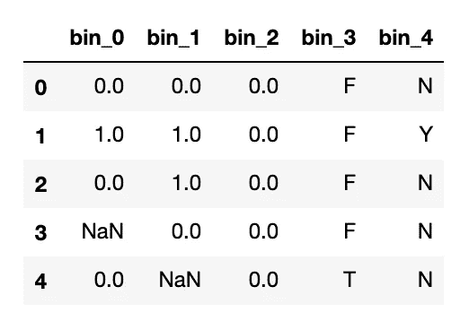
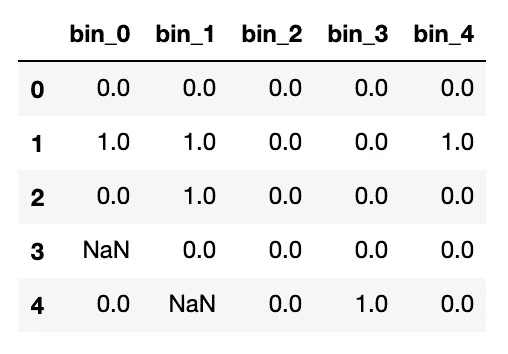
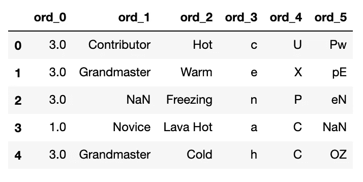
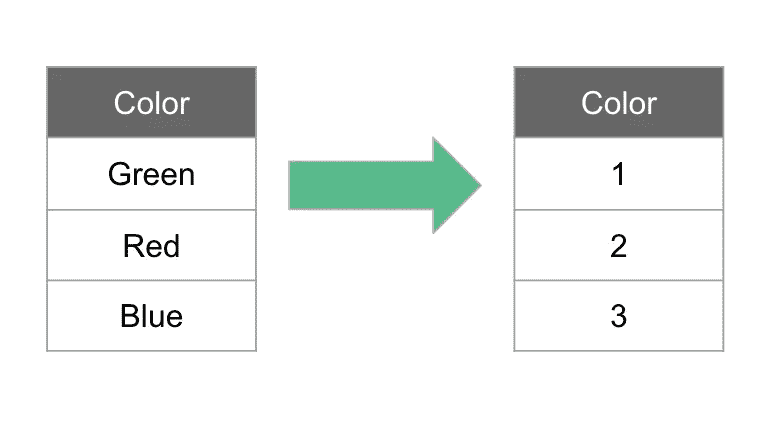
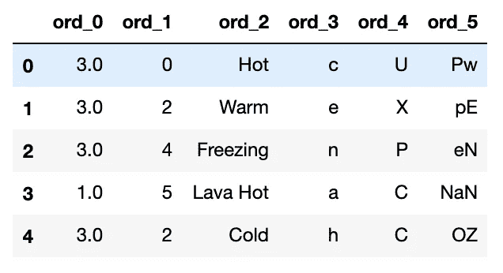
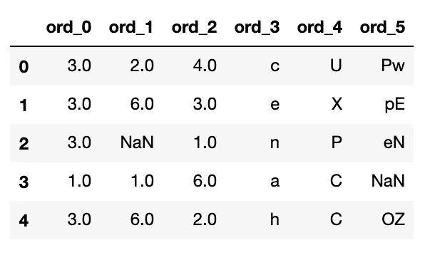
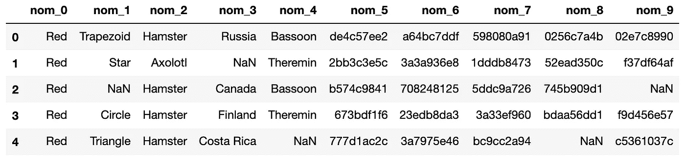
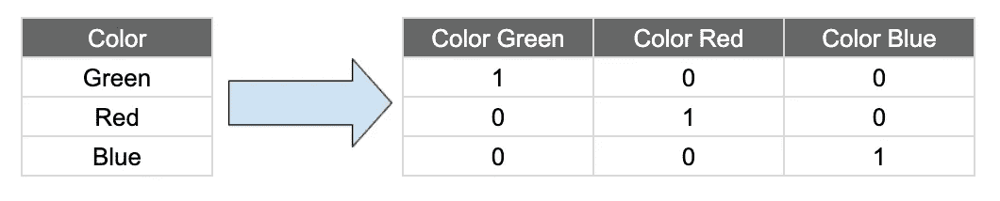
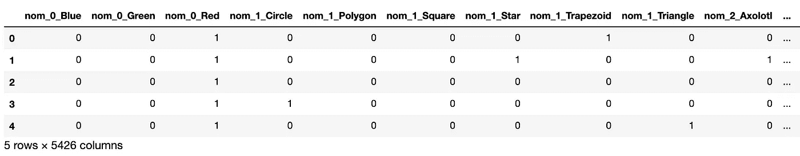

# 分类特征编码技术

> 原文：<https://towardsdatascience.com/categorical-encoding-techniques-93ebd18e1f24?source=collection_archive---------7----------------------->

## Python 中分类特征的编码方法


照片由 [v2osk](https://unsplash.com/@v2osk?utm_source=unsplash&utm_medium=referral&utm_content=creditCopyText) 在 [Unsplash](https://unsplash.com/s/photos/categories?utm_source=unsplash&utm_medium=referral&utm_content=creditCopyText) 上拍摄

分类数据是一种常见的非数值型数据，它包含标签值而不是数字。一些例子包括:

*   颜色:红色、绿色、蓝色
*   城市:纽约、奥斯汀、丹佛
*   性别:男，女
*   排名:第一，第二，第三

根据[维基百科](https://en.wikipedia.org/wiki/Categorical_variable)，“分类变量是一个可以取有限的，通常是固定数量的可能值的变量。”

通常将分类变量的可能值称为级别。

有几种不同类型的分类数据，包括:

*   **二进制**:只有 2 个值的变量。例如，对/错或是/否。
*   **序数**:一个变量，它有一些相关的顺序，就像我们上面的 place 例子。
*   **名义**:没有数值重要性的变量，例如颜色或城市。

许多机器学习算法不能直接处理分类数据。它们要求数据是数字。因此，了解如何对分类变量进行编码至关重要。

## 数据

我们将使用来自 [Kaggle 的分类特征编码挑战 II](https://www.kaggle.com/c/cat-in-the-dat-ii) 的数据。这个挑战的特点是数据集只有分类变量，这使得它非常适合探索不同的分类编码方法。

数据集包含二进制、名义和序数要素。我们将探索对每种类型的特征进行编码的方法。

完整的笔记本可以在[这里](https://www.kaggle.com/tboyle10/categorical-encoding-techniques)找到。

# 二进制特征编码

二元特征是那些只有两个可能值的特征。

我们的数据集中有五个二元要素。正如我们在下面看到的，前三个已经是数字，不需要任何操作，`bin_3`和`bin_4`是需要编码的字符串。



编码前的二进制特征

因为这些是二进制特征，我们可以用[熊猫的](https://pandas.pydata.org/pandas-docs/stable/reference/api/pandas.DataFrame.replace.html)T2 对它们进行编码:

```
df['bin_3'] = df['bin_3'].replace({'T':1}, 'F':0})
df['bin_4'] = df['bin_4'].replace({'Y':1, 'N':0})
```

这里我们将一个字典传递给`replace()`，以当前值作为键，以所需值作为值。下面我们可以看到我们的二进制特征编码。(现在，我们将忽略空值。)



编码后的二进制特征

对于二元特征，使用`replace()`非常有帮助，但是如果我们有更多类别的分类特征呢？

# 序数特征编码

序数特征是那些具有某种顺序的特征。我们可以从下面的有序特征样本中看出，这些特征有一个可能很重要的顺序。

从 Kaggle 的排名系统中，我们知道特级大师的位置高于新手或贡献者。

机器学习模型可能能够使用订单信息来做出更好的预测，我们希望保留它。



编码前的序数特征。

对于序数特征，我们使用整数编码。要对数据进行整数编码，我们只需将标签转换为整数值。



标签编码。

虽然整数编码有许多方法，但我们将在这里讨论两种:

*   Sklearn 的`LabelEncoder()`
*   熊猫的`map()`

我们可以用 [Sklearn 的](https://scikit-learn.org/stable/modules/generated/sklearn.preprocessing.LabelEncoder.html) `LabelEncoder()`来标注编码数据:

```
from sklearn.preprocessing import LabelEncoder#label encoder can't handle missing values
ordinal_features['ord_1'] = ordinal_features['ord_1'].fillna('None')# Label encode ord_1 feature
label_encoder = LabelEncoder()
ordinal_features['ord_1'] = label_encoder.fit_transform(ordinal_features['ord_1'])# Print sample of dataset
ordinal_features.head()
```



ord _ 1 编码的序数特征。

上面我们看到了编码特征`ord_1`。我们可以看到值*特级大师*用整数 2 编码，*新手*用整数 5 编码，*无*用整数 4 编码。

虽然使用`LabelEncoder()`非常快速和简单，但它可能不是这里的最佳选择:我们的编码顺序并不完全正确。此外，在能够使用它之前，我们必须处理我们的空值。

`LabelEncoder()`的另一个缺点是，文档声明它应该用于编码目标值(y ),而不是输入值(x)。让我们探索一种不同的方法来编码我们的序数特征。

这里的另一个选项是使用`map()`。

[熊猫的](https://pandas.pydata.org/pandas-docs/stable/reference/api/pandas.Series.map.html) `map()`用另一个指定值替换每个值，类似于我们上面用的`replace()`。在这里，我们用我们想要的映射创建一个字典，并将映射应用到我们的系列:

```
# create dictionary of ordinal to integer mapping
ord_2 = {'Freezing':1, 
            'Cold':2, 
            'Warm':3, 
            'Hot':4, 
            'Boiling Hot':5, 
            'Lava Hot':6}# apply using map
df['ord_2'] = df.ord_2.map(ord_2)
```



ord _ 1 和 ord _ 2 使用 map 编码的序号要素。

使用`map()`允许我们指定分类特征中值的顺序，以确保它们处于有意义的排列中。

这些方法应该只用于顺序特征，因为顺序很重要。对于顺序不重要的特性，我们必须探索其他技术。

# 名义特征

名义特征是没有数字重要性的分类特征。顺序并不重要。



编码前的名义特征。

当顺序不重要时，一键编码是一种更好的技术。例如，在特征`nom_1`中，我们有形状。这里没有明显的顺序。一种形状并不比另一种好。

在这种情况下，顺序并不重要，整数编码可能会导致模型性能下降，因此不应该使用。



一个热编码

在一个热编码中，为分类变量中的每个唯一值创建一个新的二进制(虚拟)变量。在上图中，我们有三种独特的颜色，所以我们创建了三个新的特征，每种颜色一个。如果值为真，则将整数 1 放入字段中，如果值为假，则放入 0。

这里我们可以使用[熊猫的](https://pandas.pydata.org/pandas-docs/stable/reference/api/pandas.get_dummies.html) `get_dummies()`对我们的名义特征进行一次热编码。

该方法将分类变量转换为虚拟变量，并返回数据帧。`drop_first`参数有助于通过移除第一级来获得 k-1 个假人。

```
nominal_features = pd.get_dummies(nominal_features, drop_first=True)
```



编码后的名义特征。

我们可以从上面的一个热编码的名义特征的例子中看到，这种类型的编码可以大大增加我们的列数。我们输入 10 列，编码后现在有超过 5000！

在高基数特性的情况下，那些具有许多可能值的特性，我们可能需要在编码之前做一些操作。例如，对于只出现很少一部分时间的值，我们可以将它们归入“其他”类别。

# 其他技术

## 删除分类变量

另一种方法是从数据集中删除分类变量。虽然移除特征始终是一种选择，但它可能不是处理分类变量的最佳方式，因为我们会丢失潜在的重要信息。

由于我们一直在处理的数据集只包含分类特征，这显然不是这种情况下的一个选项！

# 结论

我们探索了根据类型对分类变量进行编码的基本技术:

*   二进制的
*   序数
*   名义上的

虽然回顾的技术决不是编码分类变量的唯一选择，但它们是一个很好的起点。

在以后的文章中，我们将探索其他分类编码技术。