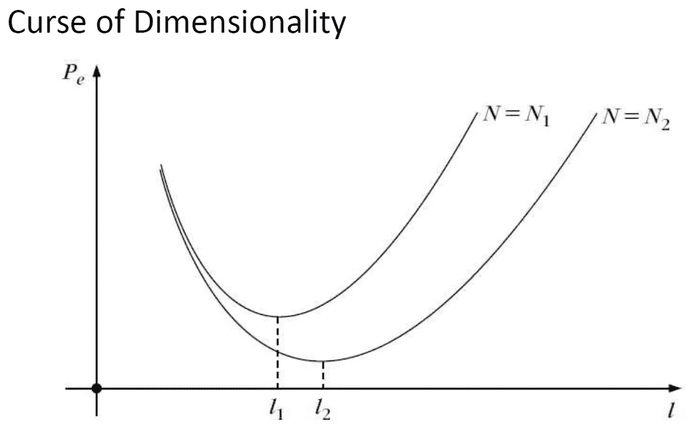
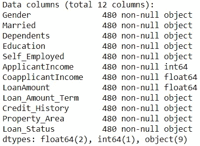
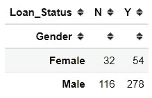
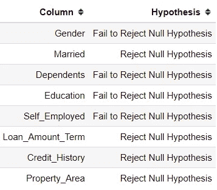
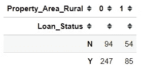
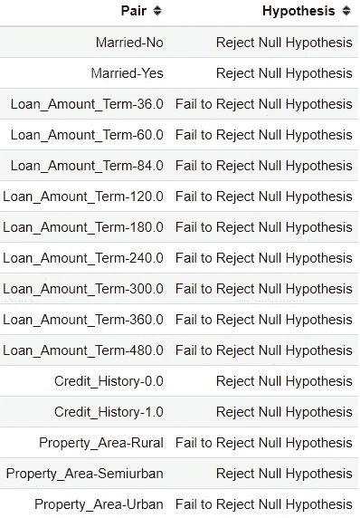
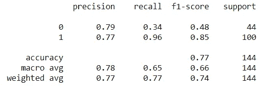
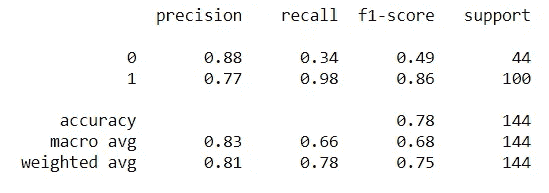

# 通过卡方进行分类特征选择

> 原文：<https://towardsdatascience.com/categorical-feature-selection-via-chi-square-fc558b09de43?source=collection_archive---------7----------------------->

## 分析和选择用于创建预测模型的分类特征


照片由 [Siora 摄影](https://unsplash.com/@siora18?utm_source=medium&utm_medium=referral)在 [Unsplash](https://unsplash.com?utm_source=medium&utm_medium=referral) 上拍摄

在我们日常的数据科学工作中，我们经常会遇到分类特征。有些人会对如何处理这些特性感到困惑，特别是当我们想要创建一个预测模型，而这些模型基本上是一个接受数字的方程时；不是一个类别。

一种方法是使用 OneHotEncoding 方法对所有 category 变量进行编码(将所有 category 类编码为数值 0 和 1，其中 0 表示不存在，1 表示存在)。


一种热编码方法的例子

许多人更喜欢这种方法，因为信息仍然存在，并且很容易理解概念。当我们拥有许多高基数的分类特征时，一个酒店编码过程后的特征数量将是巨大的。为什么我们不希望我们的训练数据集中有很多特征？这是因为维度的诅咒。



虽然增加特征可以减少我们的预测模型中的误差，但它只会减少到一定数量的特征；之后，误差会再次增大。这就是维数灾难的概念。

有很多方法可以缓解这个问题，但我的一个方法是通过卡方独立性测试进行特征选择。

# 独立性卡方检验

独立性卡方检验用于确定两个分类(名义)变量之间是否存在显著关系。这意味着独立性的卡方检验是一个假设检验，有两个假设；零假设和替代假设。假设写在下面。

**零假设(H0):** 变量之间没有关系

**替代假设(H1):** 变量之间有关系

就像任何统计测试一样，我们根据我们选择的 p 值(通常是 0.05)进行测试。如果 p 值显著，我们可以拒绝零假设，并声称研究结果支持替代假设。我不会过多地讨论统计理论，因为本文的目的是展示使用卡方检验的特征选择在实际应用中是如何工作的。

例如，我将使用来自 [Kaggle](https://www.kaggle.com/burak3ergun/loan-data-set) 的贷款数据集来解决分类问题。这里，数据集包括各种数值、序数和名义变量，如下所述(出于文章目的，我将删除所有实际上需要另一次分析的空值)。

```
import pandas as pd
loan = pd.read_csv('loan_data_set.csv')#Dropping the uninformative feature
loan.drop('Loan_ID')#Transform the numerical feature into categorical feature
loan['Loan_Amount_Term'] = loan['Loan_Amount_Term'].astype('object')
loan['Credit_History'] = loan['Credit_History'].astype('object')#Dropping all the null value
loan.dropna(inplace = True)#Getting all the categorical columns except the target
categorical_columns = loan.select_dtypes(exclude = 'number').drop('Loan_Status', axis = 1).columnsloan.info()
```



在卡方检验中，我们以交叉列表(应急)格式显示数据，每行代表一个变量的水平(组)，每列代表另一个变量的水平(组)。让我们尝试在性别和 Loan_Status 列之间创建一个交叉制表表。

```
pd.crosstab(loan['Gender'], loan['Loan_Status'])
```



交叉标签示例

现在，让我们尝试使用卡方独立性检验来测试这两个特征之间的关系。幸运的是 python 库 scipy 已经包含了测试函数供我们使用。

```
# Import the function
from scipy.stats import chi2_contingency#Testing the relationship
chi_res = chi2_contingency(pd.crosstab(loan['Loan_Status'], loan['Gender']))print('Chi2 Statistic: {}, p-value: {}'.format(chi_res[0], chi_res[1]))
```


独立性结果的卡方检验

如果我们选择 p 值水平为 0.05，由于 p 值测试结果大于 0.05，我们无法拒绝零假设。这意味着，基于独立性的卡方检验，性别和贷款状态特征之间没有关系。

我们可以尝试在所有分类特征都存在的情况下使用这个测试。

```
chi2_check = []
for i in categorical_columns:
    if chi2_contingency(pd.crosstab(loan['Loan_Status'], loan[i]))[1] < 0.05:
        chi2_check.append('Reject Null Hypothesis')
    else:
        chi2_check.append('Fail to Reject Null Hypothesis')res = pd.DataFrame(data = [categorical_columns, chi2_check] 
             ).T 
res.columns = ['Column', 'Hypothesis']
print(res)
```



对所有分类特征进行独立卡方检验的结果

# **事后测试**

独立性的卡方检验是一个综合检验，这意味着它将数据作为一个整体进行检验。如果我们在一个类别中有多个类，并且卡方表大于 2×2，那么我们将无法轻易辨别哪个类的要素负责这种关系。为了确定哪个类是负责任的，我们需要一个事后测试。

为了进行多重 2×2 卡方独立性测试，我们需要对每个测试的特征进行重新分组，使其成为一个相对于其他类别的类别。为此，我们可以对每个类应用 OneHotEncoding，并针对另一个特性创建一个新的交叉表。

例如，让我们试着对 Property_Area 特性做一个事后测试。首先，我们需要对 Property_Area 特性进行 OneHotEncoding。

```
property_dummies = pd.get_dummies(data = loan[['Property_Area', 'Loan_Status']], columns = ['Property_Area'])
```


接下来，我们根据目标 Loan_Status 为每个 Property_Area 类创建交叉表。

```
#Example
pd.crosstab(property_dummies['Loan_Status'], property_dummies['Property_Area_Rural'])
```



然后我们可以对这一对进行卡方检验。


但是，有一点要记住。将多个类别相互比较意味着每次测试的假阳性错误率。例如，如果我们选择 p 值水平为 0.05 的第一个测试，意味着有 5%的机会出现假阳性；如果我们有多个类，那么之后的测试会使错误增加，有 10%的机会成为假阳性，等等。每进行一次后续测试，错误率都会增加 5%。在我们上面的例子中，我们有 3 个成对的比较。这意味着我们的卡方检验会有 15%的错误率。这意味着我们测试的 p 值等于 0.15，这相当高。

在这种情况下，我们可以使用 Bonferroni 调整方法来校正我们使用的 p 值。我们通过想要进行的成对比较的数量来调整我们的 P 值。公式为 p/N，其中 p=原始测试的 p 值，N=计划的成对比较的次数。例如，在我们的例子中，我们在 Property_Area 特性中有 3 个类；这意味着如果我们根据 Loan_Status 特性测试所有的类，我们将有 3 个成对的比较。我们的 P 值是 0.05/3 = 0.0167

使用调整后的 P 值，我们可以测试所有以前的重要结果，以查看哪个类负责创建重要的关系。

```
check = {}
for i in res[res['Hypothesis'] == 'Reject Null Hypothesis']['Column']:
    dummies = pd.get_dummies(loan[i])
    bon_p_value = 0.05/loan[i].nunique()
    for series in dummies:
        if chi2_contingency(pd.crosstab(loan['Loan_Status'], dummies[series]))[1] < bon_p_value:
            check['{}-{}'.format(i, series)] = 'Reject Null Hypothesis'
        else:
            check['{}-{}'.format(i, series)] = 'Fail to Reject Null Hypothesis'res_chi_ph = pd.DataFrame(data = [check.keys(), check.values()]).T
res_chi_ph.columns = ['Pair', 'Hypothesis']
res_chi_ph
```



在这里，我还包括了用于成对比较的二元特性。正如我们所看到的，许多类实际上并不重要。甚至在事后测试导致所有类之前显著的 Loan_Amount_Term 也不显著。

# 预测模型

这种特征选择技术的目的是看它如何影响我们的预测模型。让我们用最简单的模型；作为基准的逻辑回归。首先，我会使用所有的数据，并在初始阶段查看模型性能。在这里，我将所有分类数据视为名义数据(甚至是序数数据)。

```
#OneHotEncoding all the categorical variable except the target; Also drop_first = True to avoid multicollinearity for Logistic Regressiondata_log = pd.get_dummies(data = loan, columns = loan.select_dtypes(exclude = 'number').drop('Loan_Status', axis =1).columns, drop_first =True)#Change the class into numerical valuedata_log['Loan_Status'] = data_log['Loan_Status'].apply(lambda x: 0 if x == 'N' else 1)#Splitting the data into Training and Test datafrom sklearn.model_selection import train_test_split
X_train, X_test, y_train, y_test = train_test_split(data_log.drop('Loan_Status', axis =1), data_log['Loan_Status'], test_size = 0.30, random_state = 101)#Creating the prediction model
from sklearn.linear_model import LogisticRegression
log_model = LogisticRegression(max_iter = 1000)
log_model.fit(X_train, y_train)#Performance Check
from sklearn.metrics import classification_report, confusion_matrix, roc_curve,auc, accuracy_scorepredictions = log_model.predict(X_test)
print(accuracy_score(y_test, predictions))
Out: 0.7708333333333334print(classification_report(y_test,predictions))
```



```
#Creating the ROC-AUC plotpreds = log_model.predict_proba(X_test)[:,1]
fpr, tpr, threshold = roc_curve(y_test, preds)
roc_auc = auc(fpr, tpr)
plt.figure(figsize=(10,8))
plt.title('Receiver Operator Characteristic')
plt.plot(fpr, tpr, 'b', label = 'AUC = {}'.format(round(roc_auc, 2)))
plt.legend(loc = 'lower right')
plt.plot([0,1], [0,1], 'r--')
plt.xlim([0,1])
plt.ylim([0,1])
plt.ylabel('True Positive Rate')
plt.xlabel('False Positive Rate')
plt.show()
```


将所有数据作为训练数据的模型的 ROC-AUC

以上是我们使用所有数据时的模型性能，让我们将其与我们通过独立性卡方检验选择的数据进行比较。

```
#Get the list of all the significant pairwisesignificant_chi = []
for i in res_chi[res_chi['Hypothesis'] == 'Reject Null Hypothesis']['Pair']:
    significant_chi.append('{}_{}'.format(i.split('-')[0],i.split('-')[1]))#Drop the data with duplicate informationfor i in ['Married_No', 'Credit_History_0.0']:
    significant_chi.remove(i)#Including the numerical data, as I have not analyze any of this featurefor i in loan.select_dtypes('number').columns:
    significant_chi.append(i)print(significant_chi)Out: ['Married_Yes', 'Credit_History_1.0','Property_Area_Semiurban',
 'ApplicantIncome','CoapplicantIncome', 'LoanAmount']
```

以前，如果我们使用所有的数据，我们最终会得到 21 个独立变量。通过功能选择，我们只有 6 个功能可以使用。我不会再次进行训练测试分割，因为我想用相同的训练数据和测试数据来测试数据。让我们看看我们的模型性能如何与这些选定的功能。

```
#Training the model only with the significant features and the numerical featureslog_model = LogisticRegression(max_iter = 1000)
log_model.fit(X_train[significant_chi], y_train)#Metrics check
predictions = log_model.predict(X_test[significant_chi])
print(accuracy_score(y_test, predictions))Out: 0.7847222222222222print(classification_report(y_test,predictions))
```



具有唯一选定特征的 ROC-AUC

# **结论**

就度量标准而言，具有所选特征的模型比使用所有特征训练的模型表现稍好。从理论上讲，这是可能发生的，因为我们消除了数据中的所有噪声，只得到最重要的模式。虽然，我们还没有分析可能也很重要的数字数据。总的来说，我已经表明，通过卡方独立性检验，我们最终只能得到最重要的分类特征。

# 如果你喜欢我的内容，并想获得更多关于数据或作为数据科学家的日常生活的深入知识，请考虑在这里订阅我的[时事通讯。](https://cornellius.substack.com/welcome)

> 如果您没有订阅为中等会员，请考虑通过[我的推荐](https://cornelliusyudhawijaya.medium.com/membership)订阅。