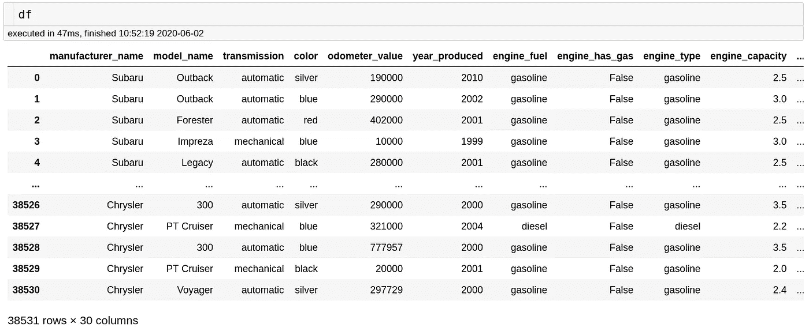
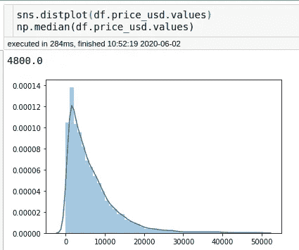
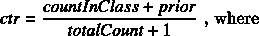
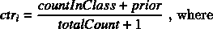
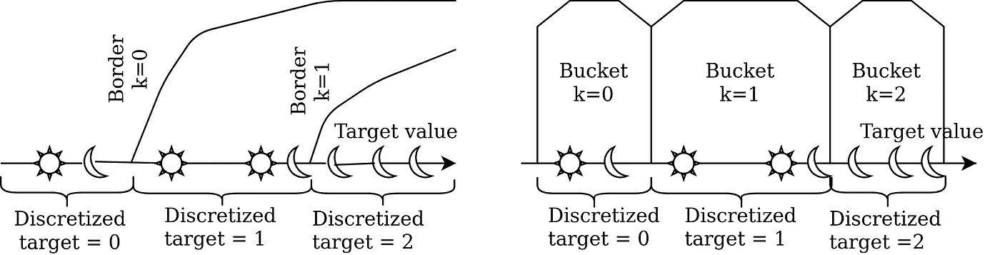
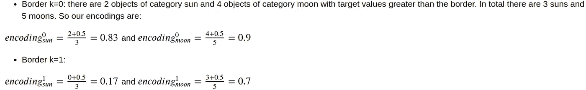
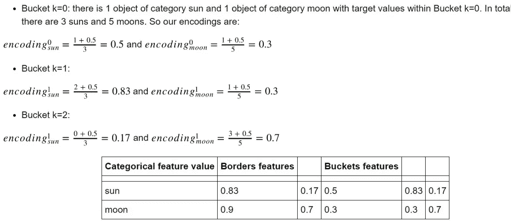
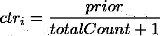

# CatBoost 中的分类特征参数

> 原文：<https://towardsdatascience.com/categorical-features-parameters-in-catboost-4ebd1326bee5?source=collection_archive---------9----------------------->

## 掌握你不知道存在的参数


分类特征示例:猫的脸型

CatBoost 是一个开源的渐变增强库。CatBoost 和其他梯度增强库的区别之一是它对分类特性的高级处理(事实上，包名中的“Cat”并不代表🐱但对于“绝对的”)。

CatBoost 可以很好地处理现成的分类数据。然而，它也有大量的训练参数，这些参数提供了对分类特征预处理的精细控制。在本教程中，我们将学习如何更好地使用这些参数。本教程分为以下几个部分:

1.  **简介:机器学习中的分类特征**
2.  **CatBoost 中的分类特征处理**
3.  **实验:分类特征设置如何影响预测旧车价格的准确性**。

# 1.简介:机器学习中的分类特征

**с类别特征**是一个具有一组离散值的特征，这些离散值被称为*类别*，这些类别*不能通过<或>相互比较*。在现实世界的数据集中，我们经常处理分类数据。分类要素的基数，即要素可以采用的不同值的数量，在要素和数据集之间变化很大-从几个到数千甚至数百万个不同的值。分类特征的值可以几乎均匀地分布，并且可能存在频率相差数量级的值。要在梯度提升中使用分类特征，需要将其转换为决策树可以处理的某种形式，例如转换为数字。在下一节中，我们将简要介绍将分类特征值转换为数字的最流行的机器学习方法。分类特征预处理的标准方法

*   **一键编码**包括为每个类别创建一个二进制特征。该方法的主要问题是具有巨大基数的特征(例如用户 id)导致大量特征。
*   **标签编码**映射每个类别，即一个分类特征可以取为一个随机数的值。这难道不是很有道理吗？它在实践中也不太管用。
*   **哈希编码**使用哈希函数将字符串类型特征转换为固定维度向量。
*   **频率编码**包括用数据集中类别的频率替换分类特征值。
*   **目标编码**用一个数字替换分类特征的值，该数字根据分类变量的特定值的目标值的分布计算得出。有时被称为**贪婪目标编码**的最直接的方法是对属于该类别的对象使用目标的平均值。但是，这种方法会导致目标泄漏和过拟合。这些问题的一个可能的解决方案是**维持目标编码** —训练数据集的一部分用于计算每个类别的目标统计数据，而训练是在其余的训练数据上执行的。它解决了目标泄露问题，但需要我们牺牲一部分宝贵的训练数据。为此，实践中最流行的解决方案是 **K 倍目标编码**和**留一目标编码**。K 折叠目标编码背后的思想非常类似于 K 折叠交叉验证-我们将训练数据分成几个折叠，在每个折叠中，我们用在其他折叠上计算的类别的目标统计来替换分类特征值。留一目标编码是 K 重编码的特例，其中 K 等于训练数据的长度。k 倍编码和留一目标编码也可能导致过拟合。考虑以下示例:在训练数据集中，我们有一个具有单个值的单一分类特征，以及 5 个类 0 对象和 6 个类 1 对象。显然，只有一个可能值的特征是无用的，然而，如果我们对所有类别 0 的对象使用具有均值函数的留一目标编码，特征值将被编码成 0.6，而对所有类别 1 的对象，特征编码值将是 0.5。这将允许决策树分类器选择 0.55 的分割，并在训练集上实现 100%的准确性。

# 2.CatBoost 中的分类特征处理

CatBoost 支持一些传统的分类数据预处理方法，比如一键编码和频率编码。然而，这个包的一个特征是它的分类特征编码的原始解决方案。

CatBoost 分类特征预处理背后的核心思想是**有序目标编码**:执行数据集的随机排列，然后仅使用放置在当前对象之前的对象，对每个示例*执行某种类型的目标编码(例如，仅计算该类别对象的目标平均值)。*

通常，在 CatBoost 中将分类特征转换为数字特征包括以下步骤:

1.  **随机排列**训练对象。
2.  **量化**即根据任务类型将目标值从浮点转换为整数:

*   分类-目标值的可能值为“0”(不属于指定的目标类)和“1”(属于指定的目标类)。
*   多分类-目标值是目标类的整数标识符(从“0”开始)。
*   回归-对标注值执行量化。**在启动参数**中设置桶的模式和数量。位于单个存储桶内的所有值都被分配一个标签值类—一个由公式定义的范围内的整数:<存储桶 ID — 1 >。

3.**编码**分类特征值。

CatBoost 创建了训练对象的四种排列，对于每种排列，都会训练一个单独的模型。三个模型用于树结构选择，第四个用于计算我们保存的最终模型的叶子值。在每次迭代中，随机选择三个模型中的一个；该模型用于选择新的树结构，并计算所有四个模型的树叶值。

使用几种模型进行树结构选择增强了分类特征编码的鲁棒性。如果在一个排列中，一个对象靠近数据集的开始，并且在另外两个排列中对少量对象计算编码统计，则它可能更靠近数据集的结尾，并且许多对象将用于计算统计。

另一个要点是 **CatBoost 可以结合现有的分类特征创建新的分类特征**。并且它实际上会这样做，除非你明确地告诉它不要这样做:)原始特征和创建的特征的处理可以分别由设置`simple_ctr`和`combinations_ctr`单独控制(我们将详细讨论它们)。

# 3.分类特征参数在实际中的应用:旧车价格预测


[丘特尔斯纳普](https://unsplash.com/@chuttersnap?utm_source=unsplash&utm_medium=referral&utm_content=creditCopyText)在 [Unsplash](https://unsplash.com/s/photos/cars?utm_source=unsplash&utm_medium=referral&utm_content=creditCopyText) 上拍照

# 资料组

对于本教程中的实验，我们将使用[https://www.kaggle.com/lepchenkov/usedcarscatalog](https://www.kaggle.com/lepchenkov/usedcarscatalog)

该数据集由旧汽车的描述及其特征组成，既有数字的，如里程、生产年份等，也有分类的，如颜色、制造商名称、型号名称等。

我们的目标是解决*回归*任务，即预测一辆旧车的价格。



让我们看看每个分类变量有多少个唯一值:

```
df[categorical_features_names].nunique()manufacturer_name      55
model_name           1118
transmission            2
color                  12
engine_fuel             6
engine_type             3
body_type              12
state                   3
drivetrain              3
location_region         6
```

目标值分布如下:



首先，我们将粗略估计完成这项任务所需的树的数量和学习率。

```
0:	learn: 5935.7603510	test: 6046.0339243	best: 6046.0339243 (0)	total: 73.2ms	remaining: 6m 5s
2000:	learn: 1052.8405096	test: 1684.8571308	best: 1684.8571308 (2000)	total: 19.5s	remaining: 29.2s
4000:	learn: 830.0093394	test: 1669.1267503	best: 1668.7626148 (3888)	total: 41.4s	remaining: 10.3s
4999:	learn: 753.5299104	test: 1666.7826842	best: 1666.6739968 (4463)	total: 52.7s	remaining: 0usbestTest = 1666.673997
bestIteration = 4463
```

现在，我们将编写一个简单的函数，在给定参数的情况下测试 CatBoost 在三重交叉验证上的性能，并返回最后一个模型的完整参数列表。可选地，该函数将模型的度量与用默认分类特征参数训练的模型的结果进行比较。

我们将估计器的数量固定为 4500，学习率为 0.1。

# CatBoost 中编码参数的分类特征

CatBoost 中与分类特征处理相关的参数数量庞大。下面是一个完整的列表:

*   `one_hot_max_size` (int) -对所有具有小于或等于给定参数值的不同值的分类特征使用一键编码。对这些特征不进行复杂的编码。*回归任务的默认值为 2。*
*   `model_size_reg`(从 0 到 inf 浮动)-模型大小正则化系数。该值越大，模型尺寸越小。详情参见“模型尺寸正则化系数”部分。只有具有分类特征的模型(其他模型很小)才需要这种正则化。如果分类特征具有大量值，则具有分类特征的模型可能会有数百亿字节或更多。如果正则项的值不为零，则使用分类要素或具有大量值的要素组合会产生不利影响，因此在生成的模型中使用的分类要素或要素组合较少。*默认值为 0.5*
*   `max_ctr_complexity` -可以组合的最大特征数量。每个结果组合由一个或多个分类特征组成，并且可以选择包含以下形式的二进制特征:“数字特征>值”。*对于 CPU 上的回归任务，默认值为 4。*
*   `has_time` (bool) -如果`true`，分类特征处理的第一步，置换，不执行。当数据集中的对象按时间排序时非常有用。对于我们的数据集，我们不需要它。*默认值为*
*   `simple_ctr` -简单分类特征的量化设置。
*   `combinations_ctr` -分类特征组合的量化设置。
*   `per_feature_ctr` -分类特征的每特征量化设置。
*   `counter_calc_method`用`Counter`决定是否使用验证数据集(通过`fit`方法的参数`eval_set`提供)来估计类别频率。默认情况下，它是`Full`，使用验证数据集中的对象；传递`SkipTest`值以忽略验证集中的对象
*   `ctr_target_border_count` -用于分类特征目标量化的最大边界数。*回归任务的默认值为 1。*
*   `ctr_leaf_count_limit` -具有分类特征的叶子的最大数量。默认*值为无，即没有限制。*
*   `store_all_simple_ctr` -如果先前的参数在某一点上梯度推进树不再能够通过分类特征进行分割。默认值等于`False`时，限制适用于原始分类特征和 CatBoost 通过组合不同特征创建的特征。如果该参数设置为`True`，只有组合特征上的分割数量受到限制。

三个参数`simple_ctr`、`combinations_ctr`和`per_feature_ctr`是控制分类特征处理的第二和第三步骤的复杂参数。我们将在接下来的章节中详细讨论它们。

# 默认参数

首先，我们测试现成的 CatBoost 分类特征处理。

```
last_model_params = score_catboost_model({}, True)
R2 score: 0.9334(0.0009)
RMSE score: 1659(17)
```

我们将保存具有默认分类特征参数的模型的度量，以供进一步比较。

# 一键编码最大尺寸

我们尝试的第一件事是让 CatBoost 对我们所有的分类特征使用一键编码(我们数据集中的最大分类特征基数是 1118 < 2000). The documentation says, that for the features for which one-hot encoding is used no other encodings are computed.

*默认值是:*

*   如果在 CPU 上以成对计分模式进行训练，则不适用
*   255 如果在 GPU 上执行训练，并且所选 Ctr 类型需要在训练期间不可用的目标数据
*   10 如果在分级模式下进行训练
*   2 如果以上条件都不满足

```
model_params = score_catboost_model({'one_hot_max_size' : 2000})R2 score: 0.9392(0.0029) +0.6% compared to default parameters
RMSE score: 1584(28) -4.5% compared to default parameters
```

# 模型尺寸正则化

*如果训练数据具有分类特征，该参数会影响模型大小。*

*关于分类特征的信息对模型的最终大小有很大的贡献。为模型中使用的每个分类特征存储从分类特征值散列到一些统计值的映射。特定要素的映射大小取决于该要素采用的唯一值的数量。*

*因此，当选择树中的分裂以减小模型的最终尺寸时，可以在最终模型中考虑分类特征的潜在权重。选择最佳分割时，会计算所有分割分数，然后选择分数最高的分割。但是在选择具有最佳分数的分割之前，所有分数根据以下公式变化:*


*s_new* 是根据某个分类特征或组合特征进行分割的新得分， *s_old* 是根据该特征进行分割的旧得分， *u* 是该特征的唯一值的数量， *U* 是所有特征中所有值的最大值， *M* 是`model_size_reg`参数的值。

这种正则化在 GPU 上的工作方式略有不同:特性组合的正则化程度比在 CPU 上更高。因为组合的 CPU 成本等于训练数据集中存在的这些组合中不同特征值的数量。在 GPU 上，一个组合的成本等于该组合所有可能的不同值的数量。例如，如果组合包含两个分类要素 c1 和 c2，则成本将为 c1 中的#categories * C2 中的# categories，即使该组合中的许多值可能不在数据集中。

让我们尝试将模型大小正则化系数设置为 0——因此我们允许我们的模型使用尽可能多的分类特征及其组合。

```
model_params = score_catboost_model({'model_size_reg': 0})R2 score: 0.9360(0.0014) +0.3% compared to default parameters
RMSE score: 1626(26) -2.0% compared to default parametersmodel_params = score_catboost_model({'model_size_reg': 1})R2 score: 0.9327(0.0020) -0.1% compared to default parameters
RMSE score: 1667(30) +0.5% compared to default parameters
```

为了检查此设置如何影响模型的大小，我们将编写一个函数，给定参数字典将训练一个模型，将其保存在一个文件中，并返回模型的权重:

```
model_size_reg_0 = weight_model({'model_size_reg': 0})model_size_reg_1 = weight_model({'model_size_reg': 1})model_size_reg_0/model_size_reg_112.689550532622183
```

正如我们可以看到的，具有强正则化的模型几乎比没有正则化的模型小 13 倍。

# 组合的功能数量

# 组合的功能数量

**特征组合**:注意，几个分类特征的任何组合都可以被认为是一个新的组合。例如，假设任务是音乐推荐，我们有两个分类特征:用户 ID 和音乐流派。比如说，一些用户更喜欢摇滚乐。当我们将用户 ID 和音乐流派转换为数字特征时，我们会丢失这些信息。两个功能的组合解决了这个问题，并提供了一个新的强大功能。然而，组合的数量随着数据集中分类特征的数量呈指数增长，因此不可能在算法中考虑所有的组合。当为当前树构造新的分裂时，CatBoost 以贪婪的方式考虑组合。对于树中的第一次拆分，不考虑任何组合。对于接下来的分割，CatBoost 将当前树中存在的所有组合和分类特征与数据集中的所有分类特征相结合。组合值被动态转换成数字。CatBoost 还以下列方式生成数字和分类特征的组合:树中选择的所有拆分都被视为具有两个值的分类，并以与分类相同的方式用于组合。

*可以组合的最大特征数。每个结果组合由一个或多个分类特征组成，并且可以选择性地包含以下形式的二进制特征:“数字特征>值”。对于 CPU 上的回归任务，默认值为 4。*

虽然文档中没有提到，但该参数值必须小于或等于 15。(因为此参数应小于最大梯度推进树深度)。

```
model_params = score_catboost_model({'max_ctr_complexity': 6})R2 score: 0.9335(0.0016) +0.0% compared to default parameters
RMSE score: 1657(24) -0.2% compared to default parametersmodel_params = score_catboost_model({'max_ctr_complexity': 0})R2 score: 0.9286(0.0041) -0.5% compared to default parameters
RMSE score: 1716(30) +3.4% compared to default parameters
```

正如我们在数据集上看到的，模型的准确性差异并不显著。为了检查模型的大小是如何受到影响的，我们将使用我们的函数对模型进行加权。

```
model_size_max_ctr_6 = weight_model({'max_ctr_complexity': 6})model_size_max_ctr_0 = weight_model({'max_ctr_complexity': 0})model_size_max_ctr_6/model_size_max_ctr_06.437194589788451
```

可以看出，可以组合多达 6 个特征的模型比根本不组合特征的模型重 6 倍。

# 有时间

启用此设置后，在将分类特征转换为数字特征的过程中，我们不会执行随机排列。当数据集的对象已经按时间排序时，这可能很有用。如果时间戳类型的列出现在输入数据中，则它用于确定对象的顺序。

```
model_params = score_catboost_model({'has_time': **True**})R2 score: 0.9174(0.0029) -1.7% compared to default parameters
RMSE score: 1847(29) +11.3% compared to default parameters
```

# `simple_ctr`和`combinations_ctr`

`simple_ctr`和`combinations_ctr`都是提供分类特征编码类型规则的复杂参数。虽然`simple_ctr`负责处理最初出现在数据集中的分类要素，但是`combinations_ctr`会影响新要素的编码，这些新要素是 CatBoost 通过组合现有要素创建的。可用的编码方法以及`simple_ctr`和`combinations_ctr`的可能值都是相同的，所以我们不打算分开来看。但是当然，你可以在你的任务中分别调整它们！

# 无目标量化的编码

**目标量化**正在使用一些边界将*浮点*目标值转换为*整数*目标值。我们将首先考虑不需要这种转换的目标编码方法。

## FloatTargetMeanValue(仅限 GPU)

第一个选项 *FloatTargetMeanValue* 是最直接的方法。分类变量的每个值被替换为放置在当前对象之前的相同类别的对象的目标平均值。

```
model_params = score_catboost_model(
{'simple_ctr' : 'FloatTargetMeanValue', 'combinations_ctr' : 'FloatTargetMeanValue', 'task_type' : 'GPU'})R2 score: 0.9183(0.0022) -1.6% compared to default parameters
RMSE score: 1837(32) +10.7% compared to default parameters
```

## FeatureFreq(仅限 GPU)

第二个选项是 *FeatureFreq* 。分类特征值被替换为数据集中类别的频率。同样，只使用放置在当前对象之前的对象。

```
model_params = score_catboost_model(
{'simple_ctr' : 'FeatureFreq', 'combinations_ctr' : 'FeatureFreq', 'task_type' : 'GPU'})R2 score: 0.9170(0.0019) -1.8% compared to default parameters
RMSE score: 1852(12) +11.6% compared to default parameters
```

## 计数器

我们已经在“默认参数”一节中讨论了 Counter 方法，因为默认情况下，该方法用于创建特性编码。值得注意的是，如果我们直接将`Counter`传递给`simple_ctr`和/或`combinations_ctr`，CatBoost 将只使用*的*计数器特性编码。

```
model_params = score_catboost_model({'simple_ctr' : 'Counter', 'combinations_ctr' : 'Counter'})R2 score: 0.9288(0.0014) -0.5% compared to default parameters
RMSE score: 1715(12) +3.3% compared to default parameters
```

## `CtrBorderCount`参数

假设我们已经计算了分类变量的编码。这些编码是浮动的，它们是可比较的:在`Counter`的情况下，较大的编码值对应于更频繁的类别。但是，如果我们有大量的类别，相近类别编码之间的差异可能是由噪声引起的，我们不希望我们的模型区分相近的类别。出于这个原因，我们将浮点编码转换为 int 编码𝑖∈[0,𝑙]i∈[0,l].默认情况下`CtrBorderCount=15`设置意味着𝑙=14(15−1)l=14(15−1).我们可以尝试使用一个更大的值:

```
model_params = score_catboost_model({'combinations_ctr': 
                               ['Counter:CtrBorderCount=40:Prior=0.5/1'],
                                     'simple_ctr':                  ['Counter:CtrBorderCount=40:Prior=0.5/1']})R2 score: 0.9337(0.0013) -0.0% compared to default parameters
RMSE score: 1655(13) +0.2% compared to default parameters
```

## 二值化目标平均值

第二种方法`BinarizedTargetMeanValue`非常类似于目标编码，除了我们使用 beans 值的和而不是精确目标值的和。其对应于以下公式:



其中:

*   *countInClass* 是该分类特征的标签值整数之和与最大标签值整数 *k* 的比值。
*   *totalCount* 是特征值与当前值匹配的对象总数。
*   *先验*是一个由起始参数定义的数(常数)。

```
model_params = score_catboost_model(
{'combinations_ctr':'BinarizedTargetMeanValue', 'simple_ctr': 'BinarizedTargetMeanValue'})R2 score: 0.9312(0.0008) -0.2% compared to default parameters
RMSE score: 1685(20) +1.6% compared to default parameters{k:v **for** k, v **in** model_params.items() **if** k **in** ctr_parameters}{'combinations_ctr': ['BinarizedTargetMeanValue:CtrBorderCount=15:CtrBorderType=Uniform:TargetBorderCount=1:TargetBorderType=MinEntropy:Prior=0/1:Prior=0.5/1:Prior=1/1'],
 'simple_ctr': ['BinarizedTargetMeanValue:CtrBorderCount=15:CtrBorderType=Uniform:TargetBorderCount=1:TargetBorderType=MinEntropy:Prior=0/1:Prior=0.5/1:Prior=1/1']}
```

在使用`BinarizedTargetMeanValue`方法的同时，我们还可以微调`Prior`和`CtrBorderCount`(用于量化类别特征编码的边界数量)。默认情况下，`CtrBorderCount` =15，0、0.5 和 1 `Prior`值用于构建三种不同的编码。

# 目标量化编码

## 桶和边框

现在我们继续设置需要目标量化的编码方法。首选是`Borders`vs`Buckets`。这两者之间的区别非常简单。两者都由以下公式描述:

对于`Borders`的【0， *k* -1】中的 *i* 和`Buckets`的【0， *k* 中的 *i* :



其中 *k* 是由参数`TargetBorderCount`调节的边界数量，

*totalCount* 是同一类别的对象数量。*之前的*由参数`prior`定义。唯一不同的是对于`Borders` *countInClass* 是离散化目标值**大于 *i* 的类别的对象数，而对于`Buckets` *countInClass* 是离散化目标值**等于**到 *i* 的类别的对象数。**



让我们看一个小例子:我们有两类物体显示为太阳和月亮。我们将计算边界和桶的分类特征编码。

边框:我们有两个边框(对应于`TargetBorderCount=2`)，所以需要计算 2 个编码。假设我们的先验是 0.5



桶:【0，】k 中的 *i* 创建 *k* +1 个桶。因此，如果我们选择`Buckets`，相同的参数值`TargetBorderCount=2`会从每个分类特征中创建更多的特征。



*重要提示！这个例子只是用来说明* `*Borders*` *和* `*Buckets*` *的区别，整个数据集用来计算 countInClass 和 totalCount。实际上，CatBoost 仅使用在使用当前对象之前放置的对象。*

让我们看看它在实践中是否有所不同:

```
model_params = score_catboost_model({'combinations_ctr': 'Borders',
                                     'simple_ctr': 'Borders'})R2 score: 0.9311(0.0017) -0.2% compared to default parameters
RMSE score: 1688(40) +1.7% compared to default parametersmodel_params = score_catboost_model({'combinations_ctr': 'Buckets',
                                     'simple_ctr': 'Buckets'})R2 score: 0.9314(0.0048) -0.2% compared to default parameters
RMSE score: 1682(49) +1.4% compared to default parameters
```

细心的读者可能记得，默认情况下，CatBoost 使用`Borders`分割创建一些特征，也使用`Counter`方法创建一些特征。当我们显式传递`Borders`选项时，不使用`Counter`方法。

一般情况下，建议使用`Borders`进行回归任务，使用`Buckets`进行多分类任务。

# 缺失值和新类别的处理

*   如果测试集中有一个**新类别**从未出现在训练集中，会发生什么？答案是，由于𝑐𝑜𝑢𝑛𝑡𝐼𝑛𝐶𝑙𝑎𝑠𝑠𝑐𝑜𝑢𝑛𝑡𝐼𝑛𝐶𝑙𝑎𝑠𝑠等于零，先验被用于计算编码:



*   同时，分类特征中缺失的值被替换为`"None"`字符串。那么具有丢失特征值的所有对象被视为一个新的类别。

## 边界数量

边界或桶的数量可通过`TargetBorderCount`参数控制。默认情况下，我们只有一个边框，让我们看看有更多的边框是否有帮助:

```
model_params = score_catboost_model({'combinations_ctr': 'Borders:TargetBorderCount=4',
                                     'simple_ctr': 'Borders:TargetBorderCount=4'})R2 score: 0.9356(0.0019) +0.2% compared to default parameters
RMSE score: 1631(9) -1.7% compared to default parameters
```

# `simple_ctr`和`combinations_ctr`的默认值

默认情况下，CatBoost 使用多种编码技术对每个分类特征进行编码。

*   首先，它使用带有一个目标边界`TargetBorderCount` =1 的`Borders`方法(在我们的示例中，对于每个分类特征，我们只想看看它是否会使汽车更贵)。获得的浮点编码被进一步离散成`CtrBorderCount` =15 个不同的值。`Prior`参数的三个值用于创建三种不同的编码:`Prior=0/1:Prior=0.5/1:Prior=1/1`
*   同样，对于每个分类特征，我们用`Counter`方法创建一个编码。分类编码值边界的数量`CtrBorderCount`也等于 15，并且仅使用一个值`Prior=0/1`。

我们总是可以用`get_all_params()`方法检查我们的模型所使用的参数。

```
last_model_params = score_catboost_model({}, True)
last_model_params['simple_ctr']['Borders:CtrBorderCount=15:CtrBorderType=Uniform:TargetBorderCount=1:TargetBorderType=MinEntropy:Prior=0/1:Prior=0.5/1:Prior=1/1',
 'Counter:CtrBorderCount=15:CtrBorderType=Uniform:Prior=0/1']last_model_params['combinations_ctr']['Borders:CtrBorderCount=15:CtrBorderType=Uniform:TargetBorderCount=1:TargetBorderType=MinEntropy:Prior=0/1:Prior=0.5/1:Prior=1/1',
 'Counter:CtrBorderCount=15:CtrBorderType=Uniform:Prior=0/1']
```

# 通过`per_feature_ctr`参数控制个别功能

我想在本教程中谈的下一件事是用参数`per_feature_ctr`对不同的特性使用不同的编码方法。当您知道您的某个功能比其他功能更重要时，这可能会很有用。例如，我们可以增加模型名称特征的目标边界数量:

```
model_params = score_catboost_model({'per_feature_ctr': ['1:Borders:TargetBorderCount=10:Prior=0/1'] })R2 score: 0.9361(0.0005) +0.3% compared to default parameters
RMSE score: 1625(28) -2.1% compared to default parameters
```

# 其他参数

# 计数器计算方法

该参数决定是否使用验证数据集(通过`fit`方法的参数`eval_set`提供)来估计`Counter`的类别频率。默认为`Full`，使用验证数据集中的对象；传递`SkipTest`值以忽略来自我们`score_catboost_model`函数中验证集的对象，我们在训练期间根本不给 CatBoost 验证数据集，因此为了检查该方法的效果，我们将使用训练/测试分割。

```
model = CatBoostRegressor(custom_metric= ['R2', 'RMSE'], learning_rate=0.1, n_estimators=4500, 
                          counter_calc_method='Full')
model.fit(train_pool, eval_set=test_pool, verbose=**False**)
r2_res = r2_score(df_test.price_usd.values, model.predict(test_pool))
rmse_res = mean_squared_error(df_test.price_usd.values, model.predict(test_pool))print('Counter Calculation Method Full: R2=**{:.4f}** RMSE=**{:.0f}**'.format(r2_res, rmse_res))Counter Calculation Method Full: R2=0.9334 RMSE=2817626model = CatBoostRegressor(custom_metric= ['R2', 'RMSE'], learning_rate=0.1, n_estimators=4500, 
                          counter_calc_method='SkipTest')
model.fit(train_pool, eval_set=test_pool, verbose=**False**)
r2_res = r2_score(df_test.price_usd.values, model.predict(test_pool))
rmse_res = mean_squared_error(df_test.price_usd.values, model.predict(test_pool))print('Counter Calculation Method SkipTest: R2=**{:.4f}** RMSE=**{:.0f}**'.format(r2_res, rmse_res))Counter Calculation Method SkipTest: R2=0.9344 RMSE=2777802
```

# 目标量化的边界数量

*用于分类特征目标量化的最大边界数。回归任务的默认值为 1。*

让我们试一试相当多的边界:

```
model_params = score_catboost_model({'ctr_target_border_count': 10})R2 score: 0.9375(0.0046) +0.4% compared to default parameters
RMSE score: 1606(73) -3.2% compared to default parameters
```

# 分类值限制

此参数控制模型使用的最常见分类特征值的数量。如果我们有 *n* 个唯一类别和`ctr_leaf_count_limit` = *m* 个唯一类别，我们只保留最频繁类别中对象的分类特征值。对于剩余类别中的对象，我们用`None`替换分类特征值。

该参数的默认值是`None` -所有分类特征值都被保留。

```
model_params = score_catboost_model({'ctr_leaf_count_limit' : 5})R2 score: 0.8278(0.0236) -11.3% compared to default parameters
RMSE score: 2661(187) +60.4% compared to default parameters
```

哎呀！在我们的数据集上，它破坏了模型性能。

# 存储简单的分类特征

如果对之前的参数`ctr_leaf_count_limit`进行此设置，则只会影响 CatBoost 通过组合初始要素创建的分类要素，而数据集中存在的初始分类要素不会受到影响。当参数`ctr_leaf_count_limit`为`None`时，参数`store_all_simple_ctr`无效。

```
model_params = score_catboost_model({'store_all_simple_ctr' : **True**, 'ctr_leaf_count_limit' : 5})R2 score: 0.8971(0.0070) -3.9% compared to default parameters
RMSE score: 2060(74) +24.2% compared to default parameters
```

# 内部特征重要性

对一个分类特征使用几种编码是很常见的。例如，默认情况下，CatBoost 为每个分类特征创建 4 种不同的编码(参见“simple_ctr 和 combinations_ctr 的默认值”一节)。当我们调用`get_feature_importances`方法时，我们得到分类特征的所有编码重要性的集合。这是因为在实践中，我们通常只想比较数据集中不同特征的总体有用性。

然而，如果我们想知道哪种编码最适合我们呢？为此，我们需要获得**内部特性重要性。**目前，它仅在命令行版本的 CatBoost 库中可用。你可以在这里找到关于安装[的细节，在本教程](https://catboost.ai/docs/concepts/cli-installation.html)中[找到一个如何用命令行版本训练模型的例子。](https://github.com/catboost/catboost/blob/master/catboost/tutorials/cmdline_tutorial/cmdline_tutorial.md)

要使用命令行版本训练模型，我们首先需要创建一个列描述文件:

```
descr = ['Categ' if i in categorical_features_names else 'Auxiliary' for i in df.columns]
descr[14] = 'Target'
pd.Series(descr).to_csv('train.cd', sep='\t', header=None)
```

然后训练一个模型:

`catboost fit --learn-set cars.csv --loss-function RMSE --learning-rate 0.1 --iterations 4500 --delimiter=',' --has-header --column-description train.cd`

然后创建一个内部特征重要性文件:`catboost fstr -m model.bin --cd train.cd --fstr-type InternalFeatureImportance -o feature_strength.tsv`

在我们的例子中，这个文件的内容如下:

```
9.318442186    transmission   7.675430604    {model_name} prior_num=1 prior_denom=1 targetborder=0 type=Borders  
3.04782682    {model_name} prior_num=0 prior_denom=1 targetborder=0 type=Borders  
2.951546528    {model_name} prior_num=0.5 prior_denom=1 targetborder=0 type=Borders   
2.939078189    {body_type} prior_num=0 prior_denom=1 targetborder=0 type=Borders   
2.666138982    {state, transmission} prior_num=0.5 prior_denom=1 targetborder=0 type=Borders   
2.431465565    {body_type} prior_num=1 prior_denom=1 targetborder=0 type=Borders   
2.059354431    {manufacturer_name} prior_num=0 prior_denom=1 targetborder=0 type=Counter   
1.946443049    {state} prior_num=1 prior_denom=1 targetborder=0 type=Borders   
1.932116622    {color} prior_num=1 prior_denom=1 targetborder=0 type=Borders   
1.633469855    {color} prior_num=0.5 prior_denom=1 targetborder=0 type=Borders   
1.561168441    {manufacturer_name} prior_num=0.5 prior_denom=1 targetborder=0 type=Borders   
1.419944596    {manufacturer_name} prior_num=0 prior_denom=1 targetborder=0 type=Borders   
1.3323198    {body_type} prior_num=0 prior_denom=1 targetborder=0 type=Counter   1.068973258    {color} prior_num=0 prior_denom=1 targetborder=0 type=Counter   
1.038663366    {manufacturer_name} prior_num=1 prior_denom=1 targetborder=0 type=Borders   
1.001434874    {manufacturer_name, body_type} prior_num=0 prior_denom=1 targetborder=0 type=Counter   
0.9012036663    {body_type} prior_num=0.5 prior_denom=1 targetborder=0 type=Borders   
0.8805961369    {manufacturer_name, body_type} prior_num=1 prior_denom=1 targetborder=0 type=Borders   
0.8796937131    {drivetrain} prior_num=0 prior_denom=1 targetborder=0 type=Borders   
...   
...   
1.476546485e-05    {engine_fuel, engine_type} prior_num=0 prior_denom=1 targetborder=0 type=Borders   
7.417408934e-06    {engine_type, body_type, state, location_region} prior_num=0.5 prior_denom=1 targetborder=0 type=Borders
```

*   我们可以看到，最重要的特征是传输；
*   然后我们有 3 个`Borders`类型编码用于具有不同先验的`model_name`分类特征；
*   然后对`body_type`特征进行编码；
*   然后我们有一个 CatBoost 从`state`和`transmission`特征的组合中创建的分类特征

一个有趣的观察结果是，对于像`model_name`这样的一些特征，最有用的是`Border`类型的编码，而对于其他特征，例如`manufacturer_name`，最有用的编码是通过`Counter`方法获得的。

# `logging_level=Info`

了解你的模型如何工作的另一种方法是用`logging_level=Info`参数进行训练。此设置允许我们查看为每棵树选择的特征分割:

```
model = CatBoostRegressor(custom_metric= ['R2', 'RMSE'], learning_rate=0.3, n_estimators=5)
model.fit(train_pool, eval_set=test_pool, logging_level='Info')year_produced, bin=47 score 669154.1979
{drivetrain} pr0 tb0 type1, border=10 score 754651.9724
year_produced, bin=56 score 809503.2502
year_produced, bin=51 score 856912.7803
engine_capacity, bin=24 score 888794.1978
{state} pr1 tb0 type0, border=12 score 901338.6173
0:	learn: 5040.7980368	test: 5141.1143627	best: 5141.1143627 (0)	total: 17.9ms	remaining: 71.7msyear_produced, bin=49 score 474289.2398
engine_capacity, bin=14 score 565290.1728
year_produced, bin=54 score 615593.891
year_produced, bin=43 score 638265.472
{state} pr1 tb0 type0, border=10 score 663225.8837
engine_capacity, bin=24 score 667635.803
1:	learn: 4071.9260223	test: 4162.4422665	best: 4162.4422665 (1)	total: 24.9ms	remaining: 37.3msyear_produced, bin=50 score 332853.7156
{body_type} pr2 tb0 type0, border=8 score 403465.931
{manufacturer_name} pr0 tb0 type0, border=7 score 428269.628
year_produced, bin=38 score 458860.027
feature_2, bin=0 score 474315.0996
year_produced, bin=54 score 485594.3961
2:	learn: 3475.0456278	test: 3544.0465297	best: 3544.0465297 (2)	total: 31.3ms	remaining: 20.9msyear_produced, bin=45 score 250517.4612
engine_capacity, bin=13 score 290570.2886
year_produced, bin=55 score 340482.1423
{manufacturer_name} pr1 tb0 type0, border=6 score 352029.1735
feature_1, bin=0 score 368528.2728
year_produced, bin=50 score 376011.7075
3:	learn: 3066.9757921	test: 3128.4648163	best: 3128.4648163 (3)	total: 37.4ms	remaining: 9.35msyear_produced, bin=46 score 184224.3588
feature_6, bin=0 score 214268.3547
{body_type} pr0 tb0 type1, border=5 score 238951.9169
{state} pr1 tb0 type0, border=9 score 260941.1746
transmission, value=1 score 275871.0414
{engine_fuel} pr1 tb0 type0, border=7 score 289133.3086
4:	learn: 2797.0109121	test: 2864.4763038	best: 2864.4763038 (4)	total: 42.8ms	remaining: 0usbestTest = 2864.476304
bestIteration = 4
```

*对于数字特征，格式如下:*

特征名称、所选分割的索引、分割分数

示例:`year_produced, bin=47 score 669154.1979`

*分类特征的格式为:*

特征名称、先验、目标边界、编码类型、分类特征边界、分割分数

例子:`{state} pr1 tb0 type0, border=12 score 901338.6173`

为了方便起见，分类特征名称写在括号{}中

# 二元分类和多元分类任务的参数调整。

在我们的教程中，我们正在进行回归任务，所以我想对二元分类和多分类任务的分类参数调整做一些说明。

*   对于**二元分类，**参数调整与回归任务非常相似，除了增加`TargetBorderCount`参数值通常是无用的(除非你传递概率作为目标)。
*   在**多分类**任务中，我们应该记住，通常我们在类上没有任何自然顺序，所以不推荐使用`FloatTargetMeanValue`或`BinarizedTargetMeanValue`编码。如果你的训练时间太长，你可以试着将`TargetBorderCount`设置为一个比默认的 n_classes - 1 更低的值，如果有办法将你的一些类合并的话。

# 结论


恭喜所有读完本教程的人:)正如我们看到的，CatBoost 包中与分类特征处理相关的可调参数的数量令人印象深刻。我们学会了如何控制它们，我非常希望这些知识能够帮助您在涉及分类数据的任务中获得最佳结果！