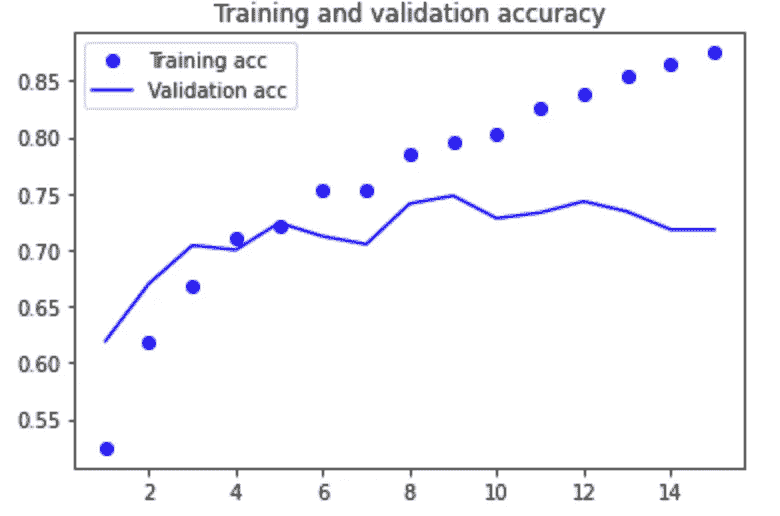
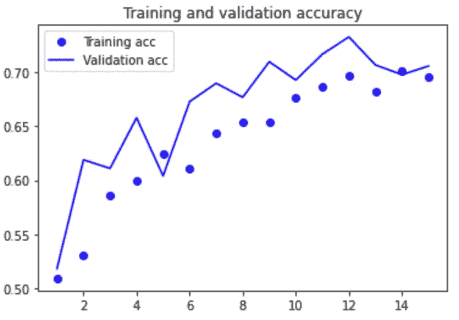
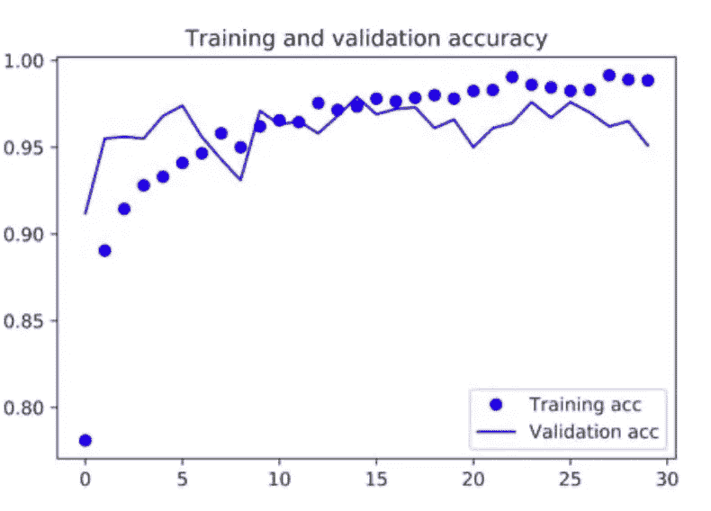

# 猫与狗——5 分钟内你的第二个端到端 CNN 分类器

> 原文：<https://towardsdatascience.com/cats-vs-dogs-your-second-end-to-end-cnn-classifier-in-5-minutes-9adfbde08a09?source=collection_archive---------53----------------------->

在 [Unsplash](https://unsplash.com?utm_source=medium&utm_medium=referral) 上由 [Tran Mau Tri Tam](https://unsplash.com/@tranmautritam?utm_source=medium&utm_medium=referral) 拍照

> 第二个分类器？！

听起来很奇怪吗？所以，这是我 DIY CNN 模型系列的第二篇博客。你可以在这里查看第一个分类器。如果你没有读过我以前的文章，我强烈建议你读一读，因为我将在它的基础上进行构建。这个博客的格式将保持不变。我会给你一个 Colab 文件，你必须运行它(没有如果没有但是)，然后再继续。

所以现在开始吧— [运行它](https://colab.research.google.com/drive/1nZ_0o2MbAwWa7bUC-2yDLRLOK7iMY3lL?usp=sharing)！🏃‍♀️

是的，我知道这需要一些时间来运行。在那之前，请随意阅读。我总是希望你在前进之前运行它的原因是——它让你感觉更依赖于手头的问题陈述，并且倾向于给出更好的见解。所以更多的钱！

# 猫的人还是狗的人？

猫和狗的数据集没有和 Keras 打包在一起。它是由 Kaggle 在 2013 年的一次计算机视觉比赛中提供的。当时他们能够达到 95%的准确率。很酷，是吧？

在本文中，我们将重点关注 3 种不同的模型和实现更高精度的方法。酷吗？让我们开始吧。

# 模型 1 —基本模型

***结果:~74%准确率***

这和我们之前的分类模型一模一样。不过，根据问题的性质，会有一些变化。让我们简单讨论一下。

## 数据预处理

你有图像，但是模型在矩阵上工作！对！因此，这是几乎所有基于 CNN 的模型都需要的一步。上一篇文章中已经讨论了其中的大部分内容，所以不再赘述。所以:

*1。加载图像
2。将 JPEG 内容解码为 RGB 像素网格。
3。将图像大小调整为 150*150 像素(以缩小图像大小)。
4。将像素值(0 到 255 之间)重新缩放到区间(0，1)区间*

## Keras 图像数据生成器

通常，我不会深入研究实现逻辑，但这一点需要特别提及。上面的部分可能看起来工作量很大，对吗？！但是，这个美丽的 Keras 构造真的可以帮助你完成你的工作。

它在 Python 生成器上工作。如果你不熟悉它，强烈建议你这么做。简而言之，生成器是一种特殊的迭代器，工作起来很慢。与列表不同，它们不将内容存储在内存中，而是在需要时生成内容。这些迭代器不会阻塞你的内存，而是在需要的时候使用它。很神奇的东西，对吧？

## 卷积层++

有人可能会说——不，这个模型和之前的不一样。它有 3 层以上的回旋。罪名成立！是的，你能想出一个理由吗？

我们的手写分类器具有[28 * 28]的矩阵大小，而这里我们处理的是[150 * 150]的矩阵大小。所以，因为我们处理更大的图像和更复杂的问题，我们倾向于增加更多的层。这主要是为了在输入到达展平图层时减小输入的大小。

此外，随着越来越深入卷积层，该模型可以检测到更加复杂的模式。因此，这也增加了网络的容量。

准确率:~74%

# 模型 2 —解决过度拟合问题

***结果:84%准确率***

如果你看到上图中的结果，你会怎么想？这是一个经典的过度拟合案例。随着时间的推移，训练精度呈线性增长，但测试精度却停滞在 70%左右。让我们分析一些处理过度拟合的常用方法。

## 脱落层

这是一种正则化技术，其中随机选择的神经元在训练过程中被完全忽略。他们只是被随机“丢弃”。因此，一旦训练开始，模型就开始基于所提供的数据学习专门的特征。可能发生的情况是，这些特征对于训练数据可能变得过于具体，并且可能在测试数据上完全失败。因此，为了增加一层随机性并使其更通用，采用了这种方法。

## 数据扩充

过度拟合通常发生在学习的训练样本太少的时候。因此，我们可以合理地假设，给定无限量的数据，我们的模型永远不会过度拟合，因为它已经通过接触各种图像学习得很好。

因此，通过这种技术，我们试图通过将我们的训练数据随机转换成其他可信的图像来创建更多的训练数据。您可以旋转图像、翻转图像、缩放图像等，并创建一个全新的不同图像，为您的模型提供更多不同的训练数据集。

准确度— 84%

# 模型 3 —预训练的 CNN

***结果:94%准确率***

为什么要重新发明轮子？！当有人已经做到了，为什么还要从头开始呢？这是这种方法背后的主要直觉。

## 特征抽出

正如我们前面提到的，表现最好的网络是那些经过无限数据训练的网络。比方说，某个很有权力的人，在 ImageNet 上训练了一个网络(这个数据集包含数百万张动物图片)。我们应该能够直接重用这个在许多动物身上训练的特定模型来检测我们的猫和狗的用例。

但通常情况下，只建议重用卷积层，而不是内部 FC 层。主要原因是在卷积层学习的内核可能有点通用，可以很容易地重用。比方说，检测眼睛和鼻子的能力可以很容易地被我们的系统重用。

但是，在 FC 层中学习的权重可能更具体地针对问题的性质，并且可能对我们的特定用例没有太大价值。比方说，当需要检测 100 类动物时，这些 FC 砝码可能表现良好，但当只需要检测 2 类动物时可能会失败(根据我们的用例)。

## 微调

随着卷积层深度的增加，检测复杂特征的能力也增加。因此，我们可以说，在初始层中，它可能只是检测一条垂直线或水平线或某种颜色，但随着你向前移动到层中，它可能最终会检测到更复杂的特征，如猫的胡须或狗的尾巴或斑马的鳞片等。

因此，在使用预训练的网络时，而不是复制所有的卷积层，可以认为只是按原样采用初始层，并训练(微调)另一个深度卷积层。复杂的内核可能不适合我们的用例。

比方说，一个内部卷积层，当对数百万只动物进行训练时，学会了一个可以检测斑马纹的内核，但在我们的猫和狗的用例中，我们可能根本不需要它。因此，我们可能应该重复使用初始层，但可以微调内部回旋。

准确度— 94%

我希望这给你一个很好的概述，可以部署的想法，以提高 CNN 网络的准确性。今天就到这里吧，伙计们！

大部分内容都受到了《用 Python 进行深度学习》这本书的极大启发。这是一本免费的书。如果有机会，一定要把这本书读完。