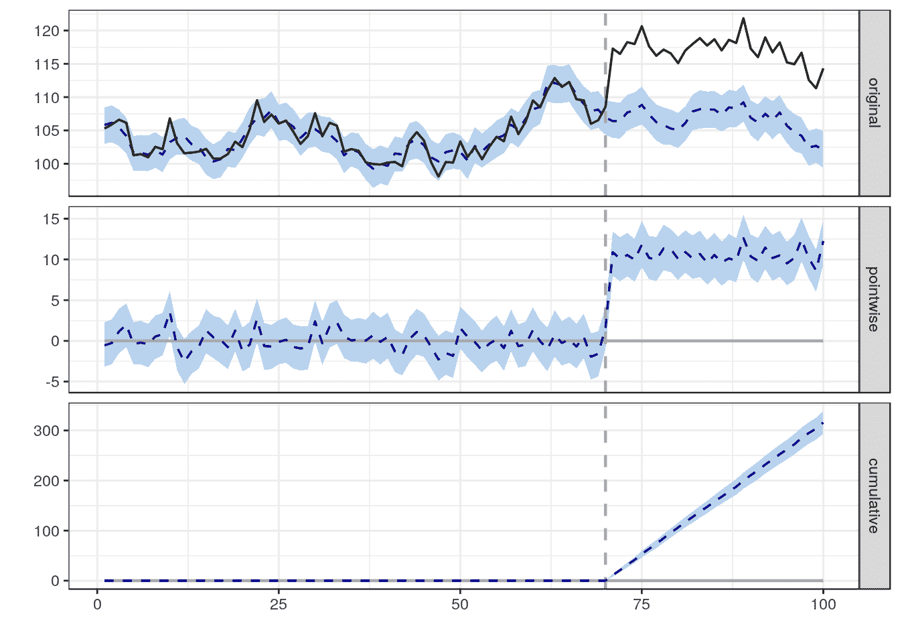

# Python 中的因果影响 R 包

> 原文：<https://towardsdatascience.com/causal-impact-r-package-in-python-bc005f63f4c2?source=collection_archive---------20----------------------->

## 因果关系

## 如何在您的 Python 环境中运行 Google 的 CausalImpact R 包


斯蒂芬·菲利普斯-Hostreviews.co.uk 在 Unsplash[拍摄的照片](https://unsplash.com/s/photos/google?utm_source=unsplash&utm_medium=referral&utm_content=creditCopyText)

CausalImpact 是 Google 开发的一个 R 包，用于使用贝叶斯结构时间序列模型进行因果推断。这里可以找到 R 版[。](http://google.github.io/CausalImpact/CausalImpact.html)

简而言之，这个软件包所做的是做出反事实的预测。换句话说，如果干预从未发生，在平行宇宙中会发生什么？这里有一个直接来自谷歌网站的快速示例:“给定一个响应时间序列(例如，点击量)和一组控制时间序列(例如，在未受影响的市场上的点击量或在其他网站上的点击量)，该软件包构建了一个贝叶斯结构时间序列模型。然后，该模型被用于尝试和预测反事实，即，如果干预从未发生，那么干预后的反应指标将如何演变。”



因果影响 1.2.1，Brodersen 等人，《应用统计学年鉴》(2015)。[http://google.github.io/CausalImpact/](http://google.github.io/CausalImpact/)

图像描述:图像(原始)的 A 部分用连续的黑线显示了我们正在监控的事物的时间序列。蓝色虚线部分是反事实预测。垂直灰线是进行干预的时刻。我们可以观察到，从那时起，蓝线和黑线逐渐分开。B 部分(逐点)说明了这些线随时间的差异，这实质上是我们感兴趣的因果效应，而 C 部分(累积)是随时间的累积差异。

我知道您可以使用 R，但是对于 Python 爱好者来说，我不知道有什么等价的包。当然，有一些库实现了原始论文的一部分。通过检查一些 Python 实现，我注意到了结果的不同。长话短说，在这里您可以查看如何从 python 运行这个包。类似地，这种方法可以推广到任何 R 包。

对我有用的是创建一个新的 Conda 环境，预装了 Python 库和 core R 包。这里有一个例子:`conda create -n r_env numpy pandas statsmodels r-essentials r-base`

创造环境需要一些时间。另外，请注意，Jupyter notebook 需要进一步配置，所以我倾向于在任何编程编辑器中编辑代码，并从命令行运行。

我们还需要的是为我们做所有工作的`rpy2`。它是 R 语言的 python 接口。`pip install rpy2`就行。

如下加载所有库:

```
**#rpy2 lib**
from rpy2.robjects.packages import importr
import rpy2.robjects as robjects
from rpy2.robjects import pandas2ri
from rpy2.robjects import Formula
import rpy2.robjects.packages as rpackages
import rpy2.robjects.vectors as StrVector
from rpy2.ipython.ggplot import image_png**#typical python libs**
import numpy as np
import pandas as pd
import datetime**#arma**
from statsmodels.tsa.arima_process import ArmaProcess
```

创建一个至少有 3 列的 Pandas dataframe，1 列用于`datetime`(下面我们将使其成为一个索引)，一个预测值`x1`或更多(`x2,x3,x4,…,xn`)和一个响应变量`y`。这假定您已经准备好数据供使用，否则，您可以如下创建一些数据:

```
**# Creating synthetic data - skip this if you are running it on your # own data - The data generation is taken from #**[**https://github.com/dafiti/causalimpact**](https://github.com/dafiti/causalimpact)ar = np.array([1, 0.9])
ma = np.array([1])
arma_process = ArmaProcess(ar, ma)
X = 100 + arma_process.generate_sample(nsample=100)
y = 1.2 * X + np.random.normal(size=100)
y[70:] += 5base = datetime.datetime.today()
dt = [base - datetime.timedelta(days=x) for x in range(100)]df = pd.DataFrame({'y': y, 'x1': X,'date':dt}, columns=['y', 'x1','date'])
```

如上所述，确保将`datetime`作为索引。

```
**#make datetime an index to the df**
df.set_index('date',inplace=True)
```

根据`dataframe`中的索引`datetime`定义干预前的时间段和干预后的时间段。

```
**#Set pre and post intervention periods**
pre_period = [0, 69]
post_period = [70, 99]**#R conversion**
pre_period=robjects.FloatVector(pre_period)
post_period=robjects.FloatVector(post_period)
```

这将为您提供从周期开始到干预(pre_period)和从干预到数据中最后一天(post_period)之间的时间间隔。

```
**#Load R libraries from within Python - R interface** utils=rpackages.importr('utils')
utils.chooseCRANmirror(ind=1)
packnames=('CausalImpact','bsts') # any other R library required
names_to_install = [x for x in packnames if not rpackages.isinstalled(x)]**#Load package required to install R packages**
from rpy2.robjects.vectors import StrVectorif len(names_to_install) > 0:
    utils.install_packages(StrVector(names_to_install))
```

这可能需要一些时间；喝点咖啡，再来点。

但是现在我们在这里。准备对我们的数据进行因果推断。

```
robjects.numpy2ri.activate()
pandas2ri.activate()
rdf=robjects.conversion.py2rpy(df)
causalimpact=importr('CausalImpact')
impact=causalimpact.CausalImpact(rdf,pre_period,post_period)summary_func=robjects.r('function(x) summary(x)')
summary_func(impact)**#Summary with descriptive report**
summary_report_func=robjects.r('function(x) summary(x,"report")')
summary_report_func(impact)**#Create causality plot**
img_file='causalimpact.png'
rstr="""
library(ggplot2)
function(x,y){
p<-plot(x)
ggsave(y,plot=p)
}"""rfunc=robjects.r(rstr)
rfunc(impact,img_file)
```

有关因果影响包的更多选项和讨论，请参见以下内容:

[](https://stats.stackexchange.com/search?q=causalimpact) [## 包含“因果影响”的帖子

### 搜索类型搜索语法标签[tag]确切的“单词在此”作者用户:1234 用户:我(你的)得分得分:3 (3+)得分:0…

stats.stackexchange.com](https://stats.stackexchange.com/search?q=causalimpact)  [## 因果影响

### 这个包是做什么的？这个 R 包实现了一种方法来估计因果效应的设计…

google.github.io](http://google.github.io/CausalImpact/CausalImpact.html) 

*喜欢这篇文章吗？成为* [*中等会员*](https://azenresearchlabs.medium.com/membership) *继续无限制学习。如果你使用下面的链接，我会收到你的一部分会员费，不需要你额外付费。*