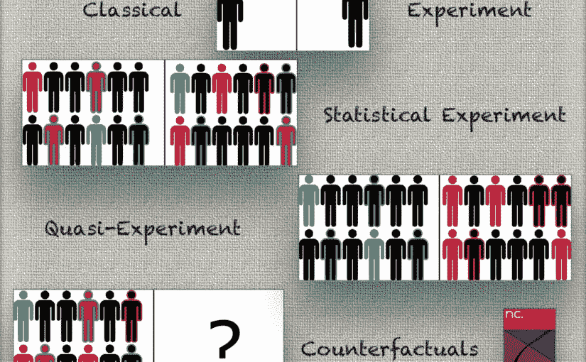
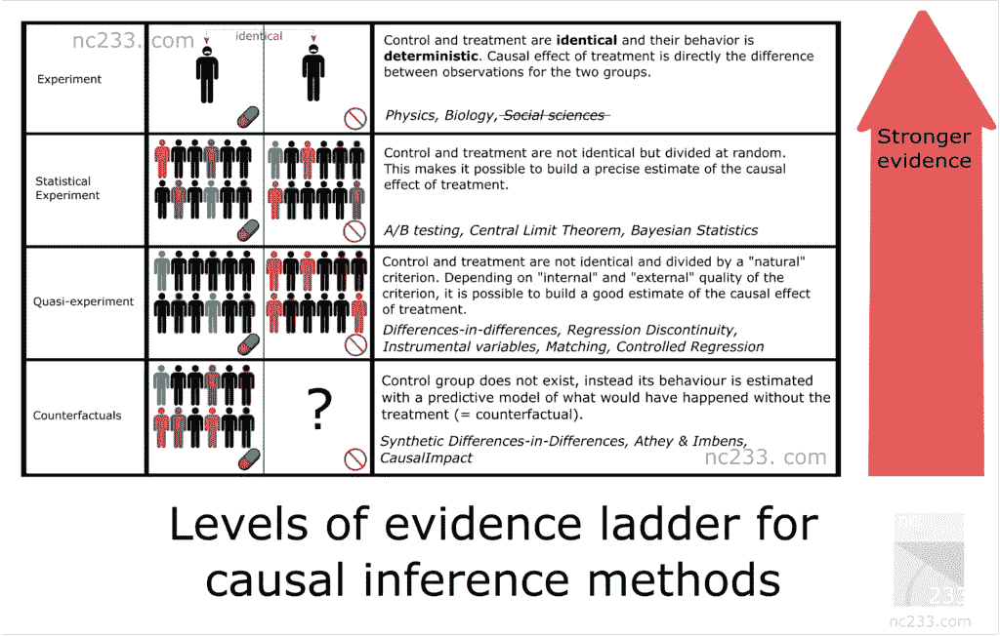
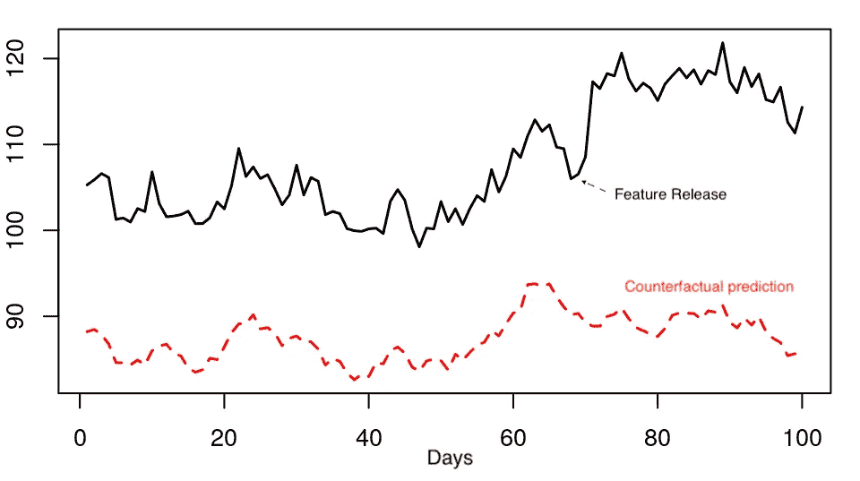

# 数据科学家的因果推理备忘单

> 原文：<https://towardsdatascience.com/causal-inference-cheat-sheet-for-data-scientists-a1d97b98d515?source=collection_archive---------35----------------------->

## 为什么因果洞察力对商业很重要，以及如何使用你的数据来推断因果关系

对于任何数据科学团队来说，无论其规模大小，能够做出因果声明都是一个关键的商业价值。快速分析(换句话说，描述性统计)是任何优秀数据分析师的面包和黄油，他们与产品团队一起快速循环，以了解他们的用户。但有时会出现一些需要更精确答案的重要问题。商业价值有时意味着区分什么是真正的洞察力，什么是偶然的噪音。与临时营销材料相比，见解将站得住脚。换句话说*因果关系*。

回答这些问题时，需要绝对的严谨。未能理解关键机制可能意味着错过重要的发现，推出错误版本的产品，并最终使您的企业损失数百万美元或重要的机会。
微软实验团队前主管罗恩·科哈维有一个[的著名例子](https://hbr.org/2017/09/the-surprising-power-of-online-experiments):改变 Amazon.com 上展示信用卡优惠的地方为公司带来了数百万的收入。

在过去的 6 年中，科技行业已经开始接受这一趋势，使得因果推理成为数据科学中的一个热门话题。[网飞](https://www.youtube.com/watch?v=IlcQzO-enJg)、[微软](https://www.microsoft.com/en-us/research/blog/dowhy-a-library-for-causal-inference/)和谷歌都围绕因果方法的一些变体建立了完整的团队。因果分析也是(终于！)在[纯 AI 领域](https://www.wired.com/story/ai-pioneer-algorithms-understand-why/)获得大量牵引力。因此，了解因果推理方法能为你和你的企业做些什么变得越来越重要。

# 证据阶梯的因果推理层次

因此，因果推理阶梯小抄！除了对数据科学家本身的价值，我过去还成功地向内部客户展示了这张幻灯片，以解释我们是如何处理数据并得出结论的。

“阶梯”分类解释了每种方法将提供给你的**级证据**。越高，就越容易确保您的方法得到的结果是真实的和可重复的——缺点是实验的设置会更复杂。例如，设置 A/B 测试通常需要专门的框架和工程资源。
沿着阶梯往下走的方法在设置上需要较少的努力(想想:观察数据)，但在分析的严密性上需要更多的努力。确保你的分析有真实的发现，而不仅仅是评论一些噪音(或者更糟，完全是错误的)，这是一个叫做**稳健性检查**的过程。这可以说是任何因果分析方法中最重要的部分。如果我是你的评审，你的方法越靠下，我需要的健壮性检查就越多🙂

我还想强调的是，较低级别的方法并没有降低价值——事实恰恰相反！它们是允许使用观察数据得出结论的卓越方法，如果像过去 10 年中为这些方法做出重大贡献的[苏珊·阿塞](https://athey.people.stanford.edu/)和[圭多·因本斯](https://www.gsb.stanford.edu/faculty-research/faculty/guido-w-imbens)这样的人有一天被授予诺贝尔奖，我也不会感到惊讶！

## 梯级 1 —科学实验

阶梯的第一级是典型的科学实验。你可能在中学甚至小学都学过的那种。为了解释科学实验应该如何进行，我的生物老师让我们从一个盒子里取出种子，把它们分成两组，然后把它们种在两个罐子里。老师坚持让两个罐子里的条件完全相同:同样数量的种子，同样湿润的土地，等等。我们的目标是测量光对植物生长的影响，所以我们把一个罐子放在窗户附近，把另一个锁在壁橱里。两个星期后，我们所有靠近窗户的罐子都长出了漂亮的小芽，而我们放在壁橱里的那些几乎没有长出来。
暴露在光线下是这两个罐子的唯一区别，老师解释道，我们被允许得出结论**光线不足导致植物无法生长。**

听起来够简单吧？当你想确定原因时，这基本上是最严格的了。坏消息是，只有当你对你的**治疗组**(接受光线的那个)和你的**对照组**(橱柜里的那个)都有一定程度的控制时，这种方法才适用。足够的控制至少所有的条件都是严格相同的*但是*你正在试验的一个参数(在这种情况下是光)。显然，这不适用于社会科学，也不适用于数据科学。

那么你可能会问，为什么我要把它放在这篇文章里？因为这是参考方法。所有的因果推断方法在某种程度上都是为了重现这种简单的方法，如果你严格遵守中学老师解释的规则，你就不能得出结论。

## 梯级 2 —统计实验(又名 A/B 测试)

可能是科技界最著名的因果推断方法:A/B 测试，也就是我们生物统计学朋友的随机对照试验。统计实验背后的想法是依靠随机性和样本大小来减轻无法将你的治疗组和对照组置于完全相同的条件下。基本统计定理，如[大数定律](https://en.wikipedia.org/wiki/Law_of_large_numbers)、[中心极限定理](https://en.wikipedia.org/wiki/Central_limit_theorem)或[贝叶斯推理](https://en.wikipedia.org/wiki/Bayesian_inference)保证了这一点，并提供了一种从您收集的数据中推断估计值及其精度的方法。

可以说，实验平台应该是任何数据科学团队应该投资的第一批项目之一(当然，一旦所有的[基础水平](https://hackernoon.com/the-ai-hierarchy-of-needs-18f111fcc007)都到位)。在科技公司建立实验文化的影响已经被很好地记录下来，并为谷歌、亚马逊、微软等公司带来收益。数十亿美元。

当然，尽管理论上相当可靠，A/B 测试也有自己的一套警告。罗恩·科哈维和微软实验平台的其他创始成员撰写的这份白皮书非常有用。

## 梯级 3 —准实验

尽管 A/B 测试(或 RCT)可能很棒，但在某些情况下，它们就是无法执行。这可能是因为缺乏工具(技术中的一个常见情况是当一个特定的框架缺乏适当的工具来超级快速地建立一个实验，并且测试变得适得其反)，道德问题，或者仅仅是因为你想事后研究一些数据。幸运的是，如果你处于其中一种情况，有些方法仍然能够得到一个因素的因果估计。在第三章中，我们谈论了*准实验*(也称为*自然实验*)的迷人世界。

准实验是这样一种情况，你的治疗组和对照组被一个自然过程分割，这个过程不是真正的*随机的，但可以被认为足够接近于计算估计值。在实践中，这意味着你将有不同的方法，这些方法将对应于关于你有多“接近”A/B 测试情形的不同假设。自然实验的著名例子包括:利用越战征兵彩票来估计成为一名老兵对你收入的影响，或者利用新泽西州和宾夕法尼亚州的边界来研究最低工资对经济的影响。*

现在让我给你一个公平的警告:当你开始寻找准实验时，你会很快被它迷住，并开始考虑在不可能的地方聪明地收集数据…现在你不能说你没有被警告过😜我有不少朋友因为对自然实验的热爱而被计量经济学的职业所吸引。

准实验世界中最流行的方法是:**差异中的差异**(最常见的方法，根据[因果推理混合磁带](https://scunning.com/cunningham_mixtape.pdf)的作者 Scott Cunnigham 的说法)；**回归不连续设计**、**匹配**或**工具变量**(这是一个绝对出色的构造，但在实践中很少有用)。如果你能够观察(即收集数据)解释治疗和控制如何分离的所有因素，那么一个简单的[线性回归](https://en.wikipedia.org/wiki/Linear_regression)包括所有因素[将会给出好的结果](https://medium.com/teconomics-blog/5-tricks-when-ab-testing-is-off-the-table-f2637e9f15a5)。

## 梯级 4——反事实的世界

最后，你有时会想尝试从纯粹的观察数据中发现因果因素。技术领域的一个经典例子是，在没有进行 A/B 测试的情况下，评估一项新功能的效果，并且没有任何一组人没有收到您可以用作对照的功能:

略微改编自[因果影响](https://google.github.io/CausalImpact/CausalImpact.html)的文档

也许你在想:等等……你是说我们可以*简单地*查看前后的数据，然后做出结论吗？嗯，诀窍在于，通常做一个严格的分析或者甚至计算一个估计都不是*那么简单。这里的想法是创建一个模型，允许计算一个*反事实*控制组。反事实意味着“如果这个特征不存在，会发生什么”。如果你有一个用户数量的模型，你有足够的信心做出一些稳健的预测，那么你基本上拥有了一切*

不过有一个问题。当使用反事实方法时，你的预测的质量是关键。在不涉及太多技术细节的情况下，这意味着你的模型不仅要足够准确，还需要“理解”什么潜在因素在驱动你目前观察到的情况。如果一个与你的最新部署无关的混杂因素发生了变化(例如经济气候)，你不希望把这种变化归因于你的特性。如果你想做出因果关系的声明，你的模型也需要理解这一点。

这就是为什么在使用反事实时鲁棒性检查如此重要。一些很酷的因果推理库，比如微软的[道为什么](https://www.microsoft.com/en-us/research/blog/dowhy-a-library-for-causal-inference/)会自动为你做这些检查😲像在 R 包 [tipr](https://cran.r-project.org/web/packages/tipr/index.html) 中实现的灵敏度方法对于检查一些假设也非常有用。最后，我怎么能在不提及 [DAGs](https://cran.r-project.org/web/packages/ggdag/vignettes/intro-to-dags.html) 的情况下写一篇关于因果推理的完整文章呢？它们是一种广泛使用的工具，用来陈述你的假设，尤其是在梯级 4 方法的情况下。

(快速补充说明:现在，由于前所未有的新冠肺炎危机，很可能各种应用中使用的大多数预测模型都已经过时了。显然，那些不能用于反事实的因果分析)

从技术上讲，梯级 4 的方法看起来很像梯级 3 的方法，只是做了一些小的改动。例如， [synthetic diff-in-diff](https://arxiv.org/abs/1812.09970) 是 diff-in-diff 和 matching 的组合。对于时间序列数据来说， [CausalImpact](https://google.github.io/CausalImpact/CausalImpact.html) 是一个非常酷的知名 R 包。 [causalTree](https://github.com/susanathey/causalTree) 是另一个值得关注的有趣方法。更一般地说，由领域专家精心制作并经过严格测试的模型是仅使用反事实控制组进行因果推断的最佳工具。

希望这份备忘单能帮助您找到正确的因果分析方法，并对您的业务产生影响！请在我们的 [Twitter](https://twitter.com/nc233) 上或评论中告诉我们您的最佳#causalwins！

*原载于 2020 年 4 月 29 日 http://nc233.com**的* [*。*](http://nc233.com/2020/04/causal-inference-cheat-sheet-for-data-scientists/)