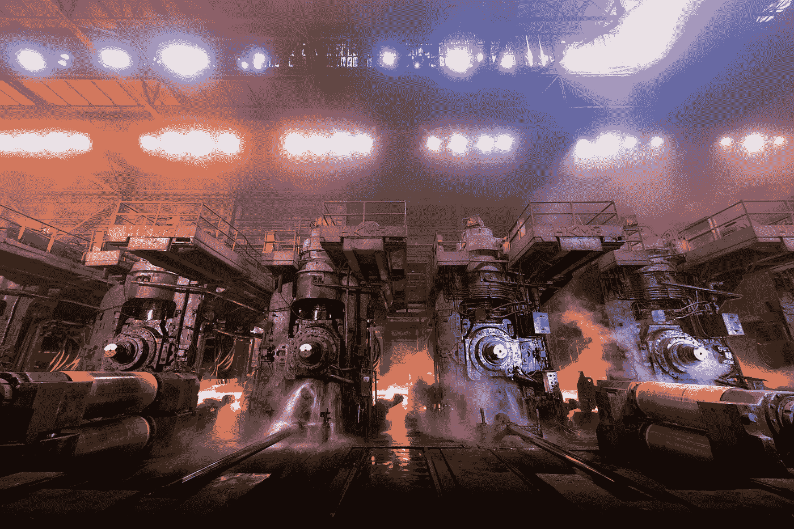

# 钢铁厂的因果推理

> 原文：<https://towardsdatascience.com/causal-inference-for-a-steel-mill-1e4dff991501?source=collection_archive---------40----------------------->

## 如何为钢铁厂创建一个结合了人类专业知识和因果推理原理的数据科学产品。



照片由 severstal.com 谢维尔斯塔尔拍摄

# 我们的项目

我想分享我为圣彼得堡附近的谢韦尔钢铁厂创建数据科学产品的经验。我们在这家工厂生产 5 米宽的钢卷。例如，您可以用这种钢制造石油和天然气管道。作为输入，你发送一个 20 吨重的钢板，经过 15-30 次迭代后，钢板就变成了预期厚度的钢板。

下面是您可以观看的视频，以便更深入地了解这一过程:

在我们的项目之前，一个操作员习惯于为每次迭代手动选择一个速度，我们的目标是自动化这个过程。我们的模型现在工作在实时模式下，我们可以观察到模型的速度比人的速度快 5+ %。

为什么不能在每次迭代中选择最大可能的速度？速度越高，发动机上的电流(I)越高，如果电流超过阈值，发动机将停止工作以防止故障。因此，操作员选择速度时要考虑厚度、delta(迭代前后的厚度差)和其他参数。

# 数据

为简单起见，我们假设我们的数据中只有厚度、增量、速度和电流。

让我们的数据集中有 20000 次迭代。让我们从最小值等于 5、最大值等于 15 的均匀分布中生成厚度，并从最小值等于 1、最大值等于 4 的相同分布中生成增量。这意味着迭代前的金属厚度将在 5 到 15 之间，并且该厚度将在每次迭代中减少 1-4 点。

假设操作员根据以下规则选择速度:

```
df['speed'] = np.round(25 - 0.1 * df['thickness'] ** 0.9 - 4 * df['delta'] ** 1.1
```

此外，操作员可以以 5 %的概率选择高 1 个单位的速度，或者以相同的概率选择低 1 个单位的速度。

因此，我们的速度在 4.61–21.47 范围内。

让我们的电流服从这个规则:

```
df['I'] = 3000 + 1500 * (df['thickness'] ** 0.8 + 5 * df['delta'] ** 1.4) + 2000 * df['speed']
```

此外，让我们给电流增加一些噪声。噪声取自标准偏差等于 500 的正态分布。

因此，我们可以将数据集分成三个部分:训练集中的 15000 个观察值，2500 个开发，2500 个测试。

让电流过剩从 78647 个单位开始——这是一种罕见的情况，在我们的数据集中频率约为 0.3 %。

我们的研究都准备好了=)

# 直接法

你可以选择错误的方式来处理这个问题:选择一个强大的算法，在你的数据上训练它。例如，您可以使用梯度推进，训练它，改变速度，以提高生产率，不要超过电流。

我们选择了一个具有 12 个叶子、0.1 学习率和 500 棵树的算法，我们的 RMSE 在所有数据集(训练、开发和测试)上都是 500 50。该度量非常接近实际误差(500)，因此我们可以说我们的算法接近完美。

但是只有当我们在同一个发行版中工作时，这才是正确的=)

让我们为测试集中的每个观察值选择一个速度。我们将从我们的分布中以最大速度开始，并且如果我们的电流预测小于临界速度减去三个标准偏差，我们将停止。作为标准差，我们取 600(我们的 500 50 和小保):

我们的新速度比旧速度提高了 30 %以上！伟大的结果！

让我们看看我们的引擎是如何工作的。由于我们知道虚拟世界中速度和电流之间的真实依赖关系，我们可以模拟我们的实验结果:

0.3168

因此，我们有 31.7 %的情况下，我们的电流高于临界，这是 100 倍以上的手动控制期间的频繁事件。这怎么可能呢？当我们训练我们的算法时，它没有任何关于速度和厚度与δ之间因果关系的信息。因此，我们的算法记住了速度、厚度和δ的每种组合的电流。如果我们改变速度，模型仍然看到旧的厚度和增量，并认为一切都会好起来。在这种情况下我们能做什么？

# 也许我们应该预测一个速度？

我们的目标是加快我们的工厂。我们知道，在类似的情况下，操作员可以做得更好或更差。因此，我们可以根据过去的最佳速度来预测速度！

对于这些类型的问题，k-NN 是一个完美的算法(我们可以通过它从过去准确地选择一个速度):

使用该算法，我们可以在电流过剩率仅为 0.24%的情况下实现 1.2 %的生产率增长:

1.0110062977330752
0.0024

伟大的结果！但是我们能做得更好吗？

# 因果推理

为了达到比我们从 k-NN 得到的更好的速度，我们应该提取速度和电流之间的真实相关性。当我们的数据集只包含相互依赖的观察值时，我们该如何做呢？我们可以开始一个实验，但是在真正的工厂里这是一个昂贵的方法。然而，我们可以使用因果推理方法来处理相互依赖关系。

我们想演示一种最简单的因果推理方法。这个方法很简单，但也很有效:

1)让我们创建一个模型，通过厚度和增量来预测速度。这个模型不应该太精确，但应该包含变量之间的依赖关系:

2)让我们根据该模型的预测来分割我们的数据集，因此在该数据集的每个部分都将有相似的预测。然后，我们在每个数据集上训练不同的线性回归模型:

3)现在我们的系数更接近 2000 年:它们从 1924 年到 2031 年变化。如果我们创建一个没有这种分裂的线性回归，我们将得到一个等于 1404 的系数，这将导致我们低估速度的影响，结果，电流过剩。为什么这种方法有效？我们可以假设，通过这些箱对我们的原始数据集的分割允许我们检测相对于速度具有相似厚度和增量值的集合。因此，我们可以更好地确定速度和电流之间的关系。

4)现在，我们可以取这些系数的最大值，并根据这些信息选择速度:

0.0004
1 . 56687 . 68686868661

电流过剩比以前少！我们已经实现了 30 %的速度提升！

5)我们看到结果与我们的测试集一致:

0.0008
1 . 58681 . 38686868661

它比直接方法好得多=)

# 结论

在这个虚拟例子中，我们有一个不公平的优势，因为我们知道速度和电流之间的真实依赖关系，所以我们可以看到当速度增加时，电流实际上会发生什么。在现实世界中，它是未知的。我们可以根据历史数据来测试我们的模型，但是在现实世界中，我们的模型可能会导致电流过剩并使工厂停止运转。所以，我们可以做两件简单的事情来防止风险:

1)我们可以从一小步一小步的速度开始改进。因此，当它明显不同时，我们可以足够接近我们的历史分布和轨迹。

2)此外，我们可以从一个不直接控制磨机速度的推荐系统开始。因此，运营商应在试点的第一阶段确认我们的建议。

在很短的时间内，操作员将开始对所提出的系统有信心，并且它可以随着速度的逐渐增加而转换到全自动化模式。今天，我们工厂的最大速度比一年前提高了约 33 %，平均速度提高了 5 %以上。

对了，如果你想了解更多的因果推断，可以从这个[教程](https://causalinference.gitlab.io/kdd-tutorial/)开始。

这篇文章的完整代码可以在[这里](https://www.kaggle.com/bvoskresenskii/causal-inference-for-a-steel-mill)找到。