# 通过因果影响进行因果推理

> 原文：<https://towardsdatascience.com/causal-inference-via-causalimpact-b0551b6dae92?source=collection_archive---------25----------------------->

## CausalImpact 简介 Google 的一个开源包


图片由 PixaBay 上的 Jarmoluk 拍摄

# **什么是因果推断？**

维基百科对它的定义是，根据一个结果发生的条件，得出一个关于因果联系的结论的过程。简而言之，因果推断是关于确定事件/变化对期望结果指标的影响。例如，如果一个新推出的营销活动对公司的销售产生了影响，或者一项新的法律对人们的行为产生了影响。虽然查看图表并比较前期和后期可以给出一个好主意，但在大多数情况下，这还不够好。尤其是在风险很大的情况下，例如数百万美元的营销预算。在医学或公共政策领域，确定事件的因果影响变得更加重要，因为这样的决定会影响数百万人。

## 因果推理的局限性:

假设发生了一个事件/处理，例如营销事件。让我们用这个药片来代表它:


治疗(由 [Kate Hliznitsova](https://unsplash.com/@kate_gliz?utm_source=unsplash&utm_medium=referral&utm_content=creditCopyText) 在 [Unsplash](https://unsplash.com/s/photos/medicine?utm_source=unsplash&utm_medium=referral&utm_content=creditCopyText) 拍摄)

通过观察我们知道这是治疗后的结果:


快乐的顾客(照片由 [Lidya Nada](https://unsplash.com/@lidyanada?utm_source=unsplash&utm_medium=referral&utm_content=creditCopyText) 在 [Unsplash](https://unsplash.com/s/photos/happy?utm_source=unsplash&utm_medium=referral&utm_content=creditCopyText) 上拍摄)

同样重要的是知道如果事件没有发生会发生什么。让我们用这个来表示否则会发生的结果:


悲伤的顾客(照片由[马太·亨利](https://unsplash.com/@matthewhenry?utm_source=unsplash&utm_medium=referral&utm_content=creditCopyText)在 [Unsplash](https://unsplash.com/s/photos/sad?utm_source=unsplash&utm_medium=referral&utm_content=creditCopyText) 上拍摄)

现在，通过比较两种可能的结果，我们可以推断或衡量事件的影响。我们可以说顾客高兴而不是悲伤是治疗的影响。

但现实世界中的问题是，我们如何做到这一点？我们如何同时知道发生了什么和可能发生了什么？在这种情况下，我们如何确定这种事件的因果推断？

让我们通过列表和比较各种场景来使其更加清晰:

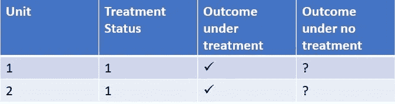

表 1

假设有两个人，1 和 2，他们都暴露在治疗/事件中。通过让他们都接受治疗，我们也可以观察到所呈现的结果。但是我们不知道否则会有什么样的结果。

因为不可能知道它，我们能做的下一个最好的事情是估计其他可能的结果。

## 随机对照试验:

随机对照试验是确定治疗对预期结果的影响的科学实验。这通常用于医疗领域，并被视为黄金标准。在 RCT，人们被随机选择并分成两组，一组接受治疗，另一组不接受。由于所涉及的随机性，两组被认为是相似的，结果的任何差异都可以归因于治疗的差异。

再次将上述内容列表，以便更清楚地理解:

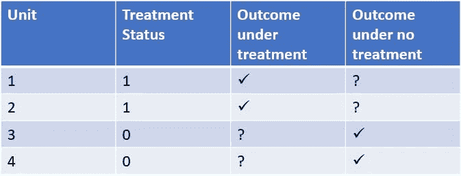

表 2

现在有四个人，随机抽取，分组。一半接受治疗，另一半不接受。两组的潜在结果是根据另一组的结果来估计的。

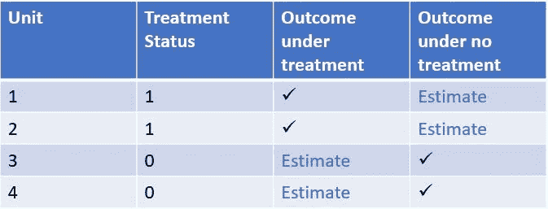

表 3

这种估计的结果就是通常所说的反事实。

## RCT 的局限性:

虽然 RCT 是估计因果推断的最佳方法，但它并不一定适用于所有情况。也许指挥 RCT 太昂贵或太困难了。例如，在一个小国家进行 RCT 可能太困难，因为很难将其分为测试和控制。或者可能根本没有进行 RCT，现在正在进行回顾性研究以了解其影响。

在这种情况下，我们如何估计结果或反事实。

# 因果影响:

这是谷歌发布的一个库，用于在这种情况下进行因果推理。这个库只在 R 中可用，所以我将介绍它背后的逻辑以及它是如何工作的。它在合成控制的帮助下处理这种情况。

以这张瑞士法郎对欧元的图表为例。在很长一段时间里，瑞士法郎与欧元挂钩，币值稳定。但在 2015 年取消挂钩后，人民币汇率出现了大幅波动。在这种情况下，我们是否需要一个 RCT 来确定瑞士法郎如果没有与美元脱钩会是什么样子？

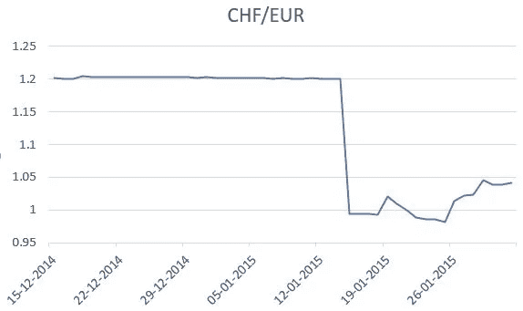

瑞士法郎/欧元

号码

简单地说，它将继续保持相对稳定，波动很小。这就是所谓的合成控制。这是可能的，因为这是一个简单的时间序列。

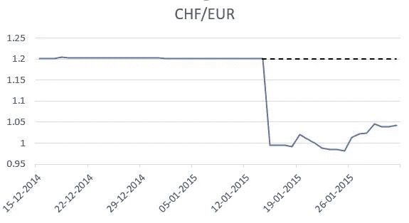

瑞士法郎/欧元

以这张图表为例:

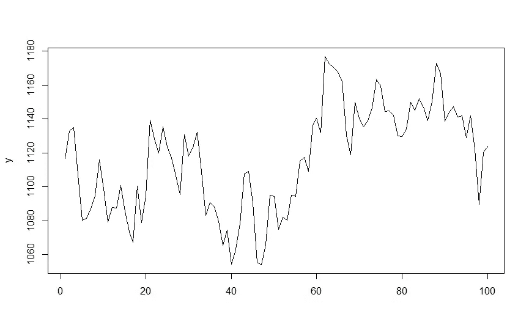

这是一个受多种因素影响的更复杂的时间序列图。即使是像 LSTM 这样最先进的技术也很难准确预测。在这种情况下，我们如何预测反事实/合成控制？

## 协变量:

我们可以利用其他变量或协变量来帮助估计综合控制。这里的技巧是找到与期望指标相关的协变量*，但不受处理*的影响。

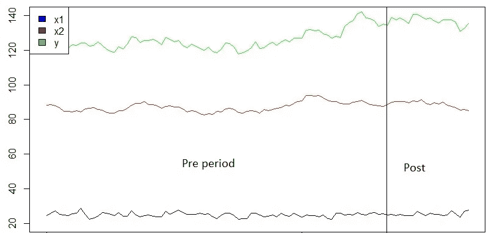

在上图中，y 是期望的指标，下面的 x1 和 x2 代表两个协变量。

在前期，我们训练并测试一个 ML 模型，以使用协变量预测所需的指标。

在后期，我们使用相同的模型来预测使用协变量的期望指标。预测的结果是这里的合成控制。然后将实际结果与合成对照进行比较，两者之间的差异被估计为事件对结果的影响。

## 型号选择:

以上就是 Google 的 CausalImpact 的工作原理简而言之。现在，您可以用各种模型进行试验，看看哪种模型有效。这可以通过将数据的前期划分为训练和验证部分以确定最佳模型来实现。

Google 软件包使用贝叶斯结构化时间序列模型。对于那些不知道贝叶斯统计如何工作的人，我写了一篇文章，你可以通过这个[链接](/intro-to-bayesian-statistics-5056b43d248d)获得。简而言之，贝叶斯统计的工作原理是结合一个关于事物如何表现的先验信念，并随着时间的推移基于新的数据更新信念。

大多数时间序列模型，只是一个时间序列模型。他们不能考虑影响变化和波动的外部因素。贝叶斯时间序列模型的优势在于，它既考虑了时间序列方面，也考虑了影响结果的外部因素。在这种情况下，它通过将外部因素或协变量作为模型的先验来合并它们。通过这种方式，它可以在预测时考虑时间演变以及外部因素。

## 演示:

让我们看看 CausalImpact 包和一些虚拟数据的用法。

```
library(CausalImpact)set.seed(1)
x1 <- 100 + arima.sim(model = list(ar = 0.999), n = 100)
x2 <- 25 + arima.sim(model = list(ma = 0.246), n = 100)
```

我正在导入包，并在 arima.sim 命令的帮助下模拟两个时间序列。这些将是协变量。

```
y <- 1.2 * x1 + 0.8*x2 + rnorm(100)
y[71:100] <- y[71:100] + 10
```

这里我创建了一个新的时间序列 y，它是我们两个时间序列 x1 和 x2 的函数。对于最后的 30 次观察，我在数值上加了一个额外的数值来模拟一个事件/治疗的效果。

```
time.points <- seq.Date(as.Date("2020-01-01"), by = 1, length.out = 100)data <- zoo(cbind(y, x1, x2), time.points)matplot(data, type = "l")
```

将日期部分添加到序列中并绘制它。

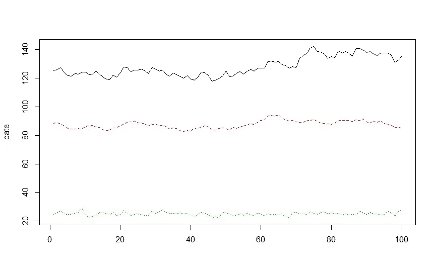

数据图

```
pre.period <- as.Date(c("2020-01-01", "2020-03-10"))
post.period <- as.Date(c("2020-03-11", "2020-04-09"))impact <- CausalImpact(data, pre.period, post.period)
```

我根据添加治疗效果的位置定义前期和后期，然后将数据和信息传递给包。

```
plot(impact)
```

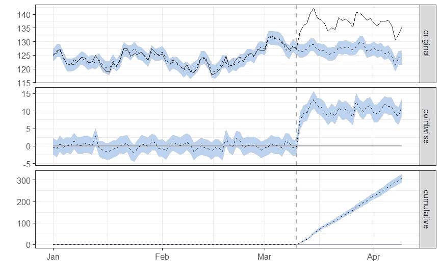

输出

第一个图叠加了原始数据和每个点的预测以及置信区间。

第二个图显示了每个点的原始数据和预测数据之间的差异以及置信区间。

第三个图通过对逐点差异求和来显示治疗的累积效果。

“summary(impact)”命令可用于提供表格形式的概述，而“summary(impact，“report”)则提供调查结果的书面报告。

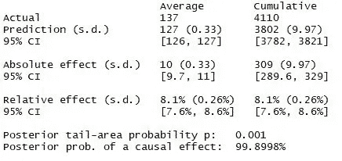

一览表

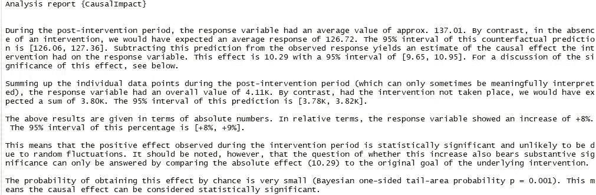

总结报告

从上面我们可以更好的了解治疗的效果以及置信区间。该摘要甚至给出了由于治疗本身引起的变化的概率，以便我们知道它不是任何虚假的关系或变化。

# **结论:**

因果推断是一个棘手的问题，我们数据科学家很少谈论。虽然这可能是因为我们通常不需要处理这个问题，但是知道如何解决这样的问题总是好的。在我们的工具箱里多一件工具，在我们的军火库里多一件武器，总不会有坏处。如果找到不受治疗影响的协变量的条件得到满足，这确实是在这种情况下使用的一种强有力的技术。

## 奖金:

我在参加 2019 年新加坡国立大学-NUHS 大学-麻省理工学院医疗保健数据马拉松时遇到了这项技术。我们的问题陈述围绕着估计一个事件对结果的影响，即因果推理。通过使用这个软件包，我们能够成功地完成我们的任务，并在数据马拉松比赛中获得第一名。下面是我们由最好的队友组成的团队的照片，没有他们，这一切都是不可能的:


你也可以在 [LinkedIn](https://www.linkedin.com/in/pranav-prathvikumar-0b4090a0/) 上和我联系。