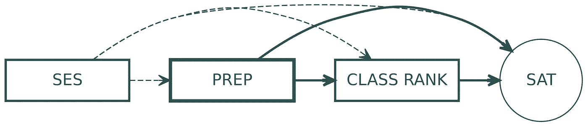

# 回归的因果模型

> 原文：<https://towardsdatascience.com/causal-models-for-regression-96270bf464e0?source=collection_archive---------7----------------------->

## **从相关到因果**

回归是社会科学中应用最广泛的统计工具，并且在大多数现成的软件中都很容易得到。因为回归背后的统计数据非常简单，它鼓励新人在确保为他们的数据建立因果模型之前点击运行按钮。然而，理解数学是必要的，但不足以恰当地解释回归输出。事实上，回归从未揭示变量之间的因果关系，而只是解开了相关性的结构。

为了看到这一点，让我们考虑二元回归模型*ŷ= a+bx*。系数 *b* 揭示了相关系数 *r(Y，X)* 的相同信息，并捕获了 *Y* 和 *X* 之间的无条件关系*∂ŷ/∂x*。
多元回归是一个完全不同的世界。多元系数揭示了 *Y* 与 *X* 之间的*条件关系*，即 *Y* 与其他回归变量的相关性被剔除后，两个变量的剩余相关性。在简单多元回归模型*ŷ= a+bx+cz*中，系数 *b = ∂(Y|Z)/∂X* 代表 *Y* 与 *X* 之间的条件或偏相关关系。我们通常的解释是“在保持 *Z* 不变的情况下， *X* 每增加一个单位，Y 就改变 *b* 个单位”。不幸的是，开始在回归模型中添加回归变量来解释因变量的更多变化是很诱人的。如果我们的目标是预测因变量的值，而不是对自变量和因变量之间的关系做出判断，这是好的——或者有点好，正如我们将看到的那样。逐步回归等算法将选择回归变量的过程自动化，以提高模型的预测能力，但这是以“可移植性”为代价的。通常情况下，所选择的回归变量并不依赖于因果模型，因此它们的解释能力是特定于特定的训练数据集的，并且不容易推广到其他数据集。因此，该模型不是“可移植的”。

***偏相关和维恩图***

为了理解为什么因果模型如此重要，我们需要理解回归系数是如何计算的。维恩图表示很方便，因为集合可以用来表示每个变量 *Y* 、 *X* 和 *Z* 的总变化。对于二元回归，使用代表 *Y* 和 *X* 共变的区域 *Y⋂X* 计算系数 *b* 。两个回归量完全相关的情况是两个集合重叠的情况。
在多变量情况下，使用协变区域的子集 *Y⋂X — (Y⋂Z)⋂X* )计算回归系数 *b* 。同样， *(Y⋂Z)⋂X* 不计入 *c* 系数的计算中，尽管 *Y* 和 *Z* 都有这种变化。这是因为三个区域的交集 *(Y⋂Z)⋂X* 捕捉到了 *Y* 的总变化量，这是由两个回归量共同解释的*。将接合区归属于任一系数都是任意的。*

多元回归的文氏图表示

从这个回归的图解中有两个重要的收获。首先，由两个回归量 *b* 和 *c* 解释的 *Y* 的总变化量不是总相关量 *ρ(Y，X)* 和 *ρ(Y，Z)* 之和，而是等于或小于该值。当 *(Y⋂Z)⋂X = ∅* 时，等式条件成立，这要求 *X* 和 *Z* 不相关。在这种情况下，几乎没有实际可能性，二元回归*中的回归系数*b*ŷ= a+bx*与多元回归*的系数ŷ= a+bx+cz*相同。
这让我们想到了维恩图的第二点，也是最重要的一点。**回归只是数据集中变量之间静态关系的数学映射**。增加模型的复杂性不会“增加”协变区域的大小，而只是决定了它们的哪些部分用于计算回归系数。没有变量之间关系的因果模型，将任何关系解释为因果总是没有根据的。实际上，多元回归中的系数 *b* 只代表 *Y* 中被 *X* 唯一解释的那部分变化。同样，多元系数 *c* 代表 *Y* 的变化，这是*通过 *Z* 唯一解释*。

**因果模型**

为了从数据关系的静态表示转移到动态解释，我们需要一个因果模型。在社会科学中，因果模型通常是基于对人类行为的某种高级解释的理论。然而，一个因果模型不一定是一个理论，而是可以是任何一个在变量之间施加等级的地图。一个“层次结构”必须是沿着连接目标解释变量 *X* 和因变量 *Y* 的路径的变量的时间顺序和逻辑推导。请注意这里的推理哲学与预测哲学的不同之处:在推理中，我们总是对两个个体变量之间的关系感兴趣；相比之下，预测是在给定一组未定义的预测因子的情况下，预测一个变量的值。为了建立这种等级制度，需要解决以下问题(请注意提及的时间顺序):

1.  在 X 确定之前确定的*变量以及对 *X* 产生影响的变量有哪些？*
2.  在确定 *X* 的同时确定*并对 *Y* 产生影响的变量有哪些？*
3.  X 确定后确定的*变量有哪些，对 *X* 和 *Y* 都有影响？*

当定义了三种类型的变量时，因果模型是详尽的(请注意对相关性的引用):

*   *前件:*在 *X* 之前定义的与 *X* 相关的所有变量，无论是否与 *Y* 相关；
*   *调节者*:与 *X* 定义相同且与 *X* 和 *Y 都相关的所有变量；*
*   *中介*:所有在 *X* 定义后定义的，与 *X* 和 *Y* 都相关的变量。

调解人和主持人之间的区别有时有点棘手，但我不会在这里讨论它。
使用回归估计 *X* 对 *Y* 的影响，必须在估计方程中指定 *X* 的所有前因和所有调节变量；相反，调解人不能被包括在内。指定中介会将 *b* 折叠成对 *X* 对 *Y* 的直接影响的估计，这有时很有趣，但不应与 *X* 对 *Y* 的总体影响混淆。这种效应是通过多种途径产生的，这些途径有助于协方差区域 *Y⋂X* 。

**因果模型:示例**

是时候介绍一个例子了。教育研究人员对学生在标准化考试中成绩的决定因素感兴趣，如 SAT、ACT、GRE、PISA 等。SAT 考试是在 400 到 1600 分之间的连续范围内评估的，特别适合回归分析。一名研究人员可能认为在 12 年级上预科班对 SAT 成绩有积极的影响，并希望验证这一假设。她认为——这是非常需要理论的地方——还有两个潜在的变量驱动着这种关系，父母的收入和 12 年级的班级排名。为了简单起见，她假设父母的收入从出生到 12 年级没有变化。因为班级排名和预科班几乎是同时进行的，所以很难说哪个决定了另一个。在她的模型中，父母收入(图中的 SES)首先被确定，它与其他变量的关系显示在下面的因果模型中(图中的 [GitHub 代码](https://github.com/matteozullo/Miscellanea/blob/master/Venn_CausalModels.R))。较高的社会经济地位提供了更多的教学资源，因此决定了班级排名和预科班的参与程度。此外，SES 对 SAT 考试成绩有直接影响，因为早期天赋决定了更高水平的认知能力——如果你对这个主题感兴趣，我建议查看 [Hanushek 等人，2015](https://www.sciencedirect.com/science/article/pii/S0014292114001433?casa_token=vZeJO2FtlHkAAAAA:fsVGJpRC4gmjBnqlAhnFngiU0VacPmDTQb453twqe1JLhMVSYAJ6oFHrPaCI5zI4LbLHE-3l) 。因此，收入对 SAT 考试成绩有直接影响，也通过班级排名和考试预科班有间接影响。此外，研究人员假设班级排名影响学生参加预科班的可能性，因为那些对自己的能力越不确定的学生更有可能去上课。在这个模型中，SES 和班级排名是先行变量，因此应该在估计方程中指定。

因果模型:示例(1)

第二位研究人员认为，这种关系反过来也是如此。参加预科班的学生更有可能在他们 12 年级的班级中排名更高。SES 仍然是先行词，而班级排名*调节*预科班对 SAT 考试分数的影响。因此，为了获得预科班对 SAT 成绩的总体影响，班级排名必须从估计方程中忽略。如果班级排名被包括在内——并且假设没有其他的中介变量——研究者将会估计一个*直接效应*而不是一个总效应。

因果模型:示例(2)

这是一个简单的例子，它忽略了教育生产函数中的许多维度。此外，我们还可以有更多的方式来思考这些变量之间的关系，以及支持一个或另一个因果模型的不同理由。然而，这个例子表明，在进行回归分析之前，研究人员将手绑在因果模型上是多么重要。回归只不过是一种工具，用来部分剔除数据中的变异，但并不能说明变量之间关系的本质。

下图比较了两个因果模型确定的协方差区域，作为预科班对 SAT 考试分数影响的因果估计。重要的是，它们不会改变协方差的基本结构，而只是决定哪些部分与推断相关。因此，因果模型是变量之间关系的静态(相关)表示和它们的动态(因果)表示之间的映射。

因果模型:文氏图表示法(1)

因果模型:文氏图表示法(2)

**结论**

上面粗略的例子的好处是，它警告从业者不要使用逐步回归算法和其他选择方法进行推理。这些对机器学习来说都重要吗？答案是肯定的，确实如此。尽管回归在机器学习中的典型用途是用于预测任务，但数据科学家仍然希望生成“可移植”的模型(查看[约万诺维奇等人，2019](https://www.sciencedirect.com/science/article/abs/pii/S0360131519300405) 了解更多关于可移植性的信息)。可移植模型是那些不过度特定于给定训练数据并且可以扩展到不同数据集的模型。确保可移植性的最佳方式是在可靠的因果模型上操作，这不需要任何牵强的社会科学理论，只需要一些合理的直觉。