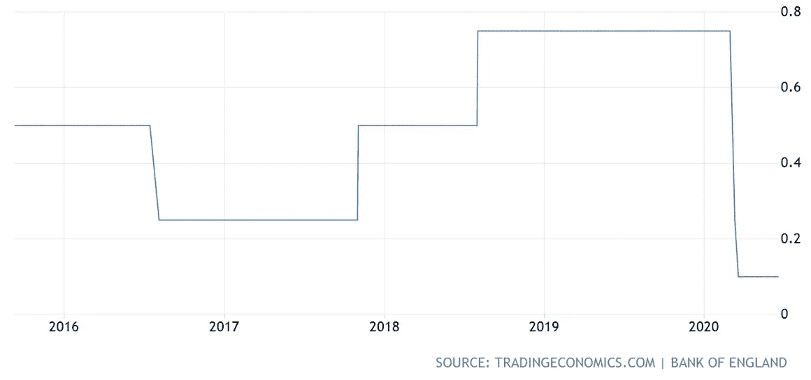
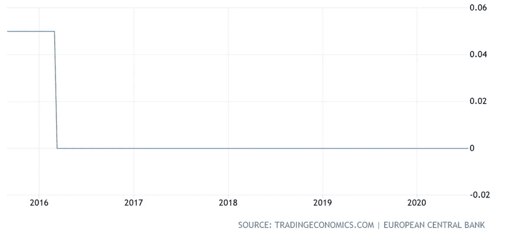
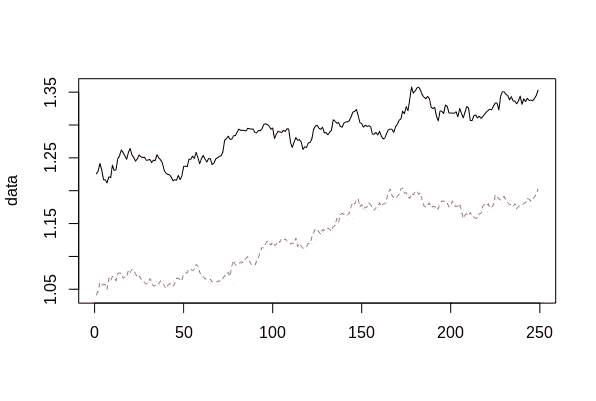
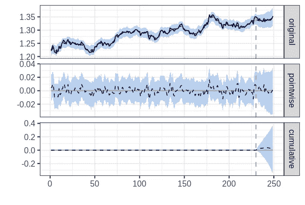
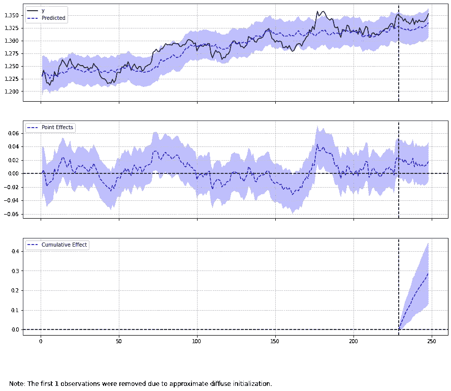

# 因果影响和 R:分析时间序列干预

> 原文：<https://towardsdatascience.com/causalimpact-and-r-analysing-time-series-interventions-27a5dfaec999?source=collection_archive---------25----------------------->

## 分析 R 中的时间序列干预


来源:图片来自 [Pixabay](https://pixabay.com/photos/clock-alarm-clock-watch-time-old-1274699/)

*免责声明:本文是在“原样”的基础上编写的，没有担保。它旨在提供数据科学概念的概述，不应被解释为投资建议或任何其他类型的专业建议。*

干预(或独立于时间序列的外部因素)通常会影响所述序列。

例如，营销活动可以影响公司未来的销售额。政府政策的改变会对经济活动产生重大影响。

分析干预的主要问题是，不可能分析如果干预没有发生会发生什么——至少不可能直接分析。

R 中的**因果影响**库允许通过使用单独的系列(不受干预影响的系列)作为协变量来分析干预效应。

# 我们的例子

2017 年 11 月，英国央行决定加息。当一个国家的中央银行决定以这种方式操纵利率时——货币的价值可能会受到影响——因为这种决定会影响投资者通过持有特定货币可以获得的收益率。



资料来源:tradingeconomics.com

在这方面，我们想研究一下利率上升是否会影响英镑/美元的价值。

为此，选择欧元/美元货币作为协变量——假设该货币不受干预的影响——因为欧洲央行在此期间没有加息。



资料来源:tradingeconomics.com

相关数据来自使用 Quandl 的 FRED 数据库。

这是两种货币的曲线图:

```
set.seed(1)
x1 <- eurusd$Value
y <- gbpusd$Value
data <- cbind(y, x1)dim(data)
head(data)
matplot(data, type = "l")
```



资料来源:RStudio

处理金融时间序列时，通常会将数据转换为对数格式。虽然这在分析具有显著不同价格范围的股票价格时是有意义的，但是在这个例子中数据是“按原样”分析的。

原因是货币数据的规模比大多数其他资产价格小得多，使用对数规模会使这些值非常接近，以至于在使用对数规模时，可以在原始系列中检测到的任何干预都可能无法检测到。

使用该数据，定义了**前期**和**后期**，然后绘制数据。

```
pre.period <- c(1, 230)
post.period <- c(231, 249)impact <- CausalImpact(data, pre.period, post.period)
plot(impact)
```



资料来源:RStudio

将生成影响摘要:

```
> summary(impact)
Posterior inference {CausalImpact}Average           Cumulative     
Actual                   1.3               25.5           
Prediction (s.d.)        1.3 (0.0099)      25.4 (0.1878)  
95% CI                   [1.3, 1.4]        [25.1, 25.8]   

Absolute effect (s.d.)   0.0014 (0.0099)   0.0275 (0.1878)
95% CI                   [-0.018, 0.02]    [-0.349, 0.38] 

Relative effect (s.d.)   0.11% (0.74%)     0.11% (0.74%)  
95% CI                   [-1.4%, 1.5%]     [-1.4%, 1.5%]Posterior tail-area probability p:   0.44186
Posterior prob. of a causal effect:  56%For more details, type: summary(impact, "report")
```

我们看到，预测值与实际值(平均值)在 **1.3** 处是相同的，累积值之间只有微小的差异(25.5 比 25.4)。

因果效应的后验概率为 56%。

让我们仔细看看生成的摘要报告。其中一部分指出:

```
Although the intervention appears to have caused a positive effect, this effect is not statistically significant when considering the entire post-intervention period as a whole. Individual days or shorter stretches within the intervention period may of course still have had a significant effect, as indicated whenever the lower limit of the impact time series (lower plot) was above zero. The apparent effect could be the result of random fluctuations that are unrelated to the intervention. This is often the case when the intervention period is very long and includes much of the time when the effect has already worn off. It can also be the case when the intervention period is too short to distinguish the signal from the noise. Finally, failing to find a significant effect can happen when there are not enough control variables or when these variables do not correlate well with the response variable during the learning period.The probability of obtaining this effect by chance is p = 0.442\. This means the effect may be spurious and would generally not be considered statistically significant.
```

# 与 pycausalimpact 的比较 Python 版本

当用 pycausalimpact 分析同一个例子时，结果略有不同。

该模型定义如下:

```
>>> ci = CausalImpact(data, pre_period, post_period)
>>> print(ci.summary())
>>> print(ci.summary(output='report'))
>>> ci.plot()
```

下面是生成的输出:

```
Posterior Inference {Causal Impact}
                          Average            Cumulative
Actual                    1.34               25.46
Prediction (s.d.)         1.32 (0.0)         25.17 (0.08)
95% CI                    [1.32, 1.33]       [25.01, 25.33]Absolute effect (s.d.)    0.02 (0.0)         0.29 (0.08)
95% CI                    [0.01, 0.02]       [0.13, 0.45]Relative effect (s.d.)    1.15% (0.32%)      1.15% (0.32%)
95% CI                    [0.52%, 1.77%]     [0.52%, 1.77%]Posterior tail-area probability p: 0.0
Posterior prob. of a causal effect: 100.0%
```

与 R 中的模型不同，该模型预测了因果效应的 100%后验概率。



来源:Jupyter 笔记本输出

这个库的 R 和 Python 版本在分析干预的方式上有所不同。具体来说，R 更多地依赖于先验概率，从而将先前的知识纳入模型假设中，而 Python 更多地依赖于结构性时间序列组件的分析，以便最大化似然函数。

也就是说，假设先验现在设置为**无**，即*先验 _ 级别 _ sd =无*。

```
ci = CausalImpact(data, pre_period, post_period, prior_level_sd=None)
print(ci.summary())
print(ci.summary(output='report'))
ci.plot()
```

结果如下:

```
Posterior Inference {Causal Impact}
                          Average            Cumulative
Actual                    1.34               25.46
Prediction (s.d.)         1.35 (0.02)        25.57 (0.3)
95% CI                    [1.31, 1.38]       [24.98, 26.15]

Absolute effect (s.d.)    -0.01 (0.02)       -0.11 (0.3)
95% CI                    [-0.04, 0.02]      [-0.7, 0.47]

Relative effect (s.d.)    -0.45% (1.17%)     -0.45% (1.17%)
95% CI                    [-2.72%, 1.86%]    [-2.72%, 1.86%]

Posterior tail-area probability p: 0.37
Posterior prob. of a causal effect: 63.34%
```

该模型确实预测了比率从 1.34 到 1.35 的变化，但是该模型指出:

```
The probability of obtaining this effect by chance is p = 36.66%.
This means the effect may be spurious and would generally not be
considered statistically significant.
```

在这点上，先验的选择可以显著影响模型的假设，从而影响干预最终是否会被检测到。

# 结论

在本文中，您已经看到:

*   因果关系在预测干预中的应用
*   R 和 Python 版本之间的区别
*   先验假设在确定干预检测中的作用
*   干预分析和总结报告的生成

非常感谢您的阅读，欢迎任何问题或反馈。

# 参考

*   [GitHub:dafi ti/causal impact](https://github.com/dafiti/causalimpact)
*   [使用 Kay Brodersen 的因果关系推断事件的影响](https://www.youtube.com/watch?v=GTgZfCltMm8)
*   [investing.com:英国利率决议](https://www.investing.com/economic-calendar/interest-rate-decision-170)
*   [记录:造成影响](https://www.rdocumentation.org/packages/CausalImpact/versions/1.2.4/topics/CausalImpact)