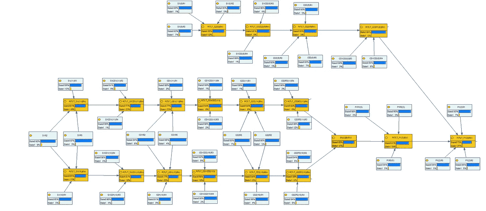

# 因果关系和贝叶斯网络

> 原文：<https://towardsdatascience.com/causality-and-bayesian-networks-fcd959d4c80a?source=collection_archive---------25----------------------->

艾莉娜·格鲁布尼亚克在 [Unsplash](https://unsplash.com/s/photos/network?utm_source=unsplash&utm_medium=referral&utm_content=creditCopyText) 上的照片

思考因果关系是行动的必要条件，因此可以预测、预测、设计、监督、评估和诊断组织。由此产生的问题是:**因果关系的本质是什么？**因此，我们有一个可能性的宇宙，因果关系描述了必然发生的结果 ***E*** ，当某个原因 ***C*** 发生时。因此，我们对因果关系有一个确定的和普遍的方法。这种方法受到概率方法和贝叶斯逻辑的挑战。

# 概率方法:

“澳斯必须能够以此为特征，增加他们 effets 的概率”(德鲁埃，2007)。我不知道原因 c 的发生是否是影响 e 必然发生的必要条件，但是我可以说，以我有限的知识所带来的谨慎“*原因 c 增加了其 effet E 的概率，因为条件概率 P(E|C)高于绝对概率 p(E* )

我可以在不知道所有原因的情况下分析因果关系，或者假设所有原因的有限集都存在。我们不知道作为一个吸烟者的属性会属于 suffirait 产生肺癌的一组因素。最重要的是，不能保证这样一套存在”

> 这并不意味着所有的原因都是平等的，而是说它们是有条件的，我们对它们的了解是有限的。

# 贝叶斯网络的特征

BN 的独创性在于将图(因果)和概率耦合起来。贝叶斯网络由除了单向图之外的东西组成，并且一组箭头在作为图的顶点的一组变量上构成二元关系。在这篇文章中，我提出了进一步的解释:

 [## 贝叶斯思维导论:从贝叶斯定理到贝叶斯网络

### 假设世界上存在一种非常罕见的疾病。你患这种疾病的几率只有千分之一。你想要…

towardsdatascience.com](/will-you-become-a-zombie-if-a-99-accuracy-test-result-positive-3da371f5134) 

所以 BN 是:

*   **功能**，BN 被顾问、项目负责人、管理者用于诊断或预测；
*   专注于一个领域和一个功能。BN 允许我们在 effet 推断一组变量的因果关系
*   **一个** **因果图**(形式对象、逻辑等。)和基于特定人群(RB 的特定方面)的**概率目标**测试
*   **一个描述性模型**，一个 BN 由引用不变量的节点组成，因此是一个宇宙、领域、专业等的描述性模型。它所关注的。这个描述模型由类别、属性、实例、集合关系组成。
*   **基于数据**，BR 必然链接到数据源，而数据源又指的是描述性或概念性模型。换句话说，BN 和数据库之间需要一些互操作性；
*   **动态**，BN 既是固定模型(机器学习)又是学习模型，在某种意义上，它可以随着时间的推移更好地学习其功能。

一个 BN 的例子，由我创作

# BN 的优势在哪里？

*   have **“因果经济学”**:知道一个表示概率分布的无环定向图，可以大大减少定义这个分布所需的参数数量
*   **易读性**:贝叶斯图中包含的信息如果用这种图形形式表示，而不是用自然语言表达，会更容易理解。应该注意的是，图形可读性与 BN 的整体形式以及其中确定的因果路径同样相关
*   **原因的可追溯性**:[……]在 **V** 【变量集】中的任何变量，相对于其在 V 中的直接原因集而言，独立于 **V** 中的所有变量，它不是这些变量的因果祖先。这个假设被称为:因果马尔可夫条件”。这种情况使得通过构建 BN 来追溯原因(因此我提出了术语“可追溯性”)到独立的根本原因成为可能。但是，请注意，路径分析的目的不是首先确定一个变量是否引起另一个变量，而是量化一个变量对它引起的另一个变量的影响”
*   **代表性**，BR 各组成部分的值指的是给定的人口(频率方法)；
*   **可修改性**，尽管具有通用性，但 BR 的组成部分的值可能会随着新数据的出现而改变。它们的外围成分可能也是如此，因为 rbd 是相加的(相对于相减)；
*   **原因的共同性**:通用描述模型使得将原因与类别和种类联系起来成为可能，这使得有可能通过聚类实现模块化因果方法，从而获得经济性和可读性。这就是你所做的，菲利普，通过将你的 BR 分层；

# **因果关系**

因果关系的概率理论是概念分析。这是一个确定 A 导致 b 意味着什么的问题。

这些概率理论是对因果关系概念的一个方面的分析。换句话说，概率因果理论回答了一个关于一般因果关系的问题。这个问题可以这样来表达: ***因果之间的共现关系是什么？*** *这个问题特别不同于 effet 的因果关系属于哪种现实的问题* (Drouet，2007)。

正如我们刚刚描述的那样，概率因果关系理论主要是作为一般因果关系的理论，而不是作为单一因果关系的理论(Drouet，2007)。一般因果关系和单一因果关系之间的区别是*“吸烟导致肺癌”*和*“彼得的吸烟导致了他的肺癌”*之间的区别，或者是“跌倒导致骨折”和“我今天早上从楼梯上摔下来导致我的右手腕骨折”之间的区别。因此，一般因果关系是属性之间的关系——例如，坠落的属性和骨折的属性。

贝叶斯因果网络专门用于研究**一般因果关系，而不是单一因果关系**。这意味着 RB 箭头表达了一种通用的因果关系，必须有一组通用的原因和结果，这种通用保证了 RB 在时间上的结构不变性，其组成部分的量化只能用一定量的数据来完成；

**使用 BN 建模时的挑战**

第一个挑战与数据有关，其结构并不独立于国民银行。BN 相关算法旨在从概率中推断原因，并且独立于任何实验。事实上，通过贝叶斯网络推断因果知识的概率数据是概率观察数据。此外，根据定义，BN 被认为是从特定的前提中得出一般结论，而不管理论假设的形成。正是因为它不是从因果假设的公式化出发，所以 BN 推论可以是演绎的。当 BN 是从先前的一般描述性模型中推断出来时，情况就不是这样了。

所以我们有一个问题:BN、描述性模型和底层数据都是基于对世界的某种概念化的构造。我们并不是为一个特定世界之外的观察者提出一个通过客观数据可获得的 BN，而是为一个明确的行为者提供一个实用的工具。**总之，正确的 BN 背后确实有理论模型。**解决方法可能是将 BN 视为验证建模问题的一般模型的元素之一。BN 然后在这个一般模型设定的界限内，在一个微观宇宙中运作。

下一个挑战涉及 BN 作为有效推理工具必须满足的形式约束，即因果马尔可夫条件(因果关系中的所有变量都独立于所有其他变量，除了它们的父母或后代)。同样，拥有一个抽象的描述模型有助于满足这些约束。伊莎贝尔·德鲁埃(Isabelle Drouet)经过特别深入的逻辑推理，得出以下结论:*“[……]使用贝叶斯网络进行因果推理只能有以下含义:将 BN 算法集成到一个假设演绎过程中[……]因果假设的说明最终总是基于理论考虑* s”。

**结论**

因此，BN 是检验由演绎工作产生的假设的特殊工具。这正是我们所做的:

 [## 使用贝叶斯网络进行项目管理评估

### 这篇文章展示了五篇论文的工作，其中项目管理指标与项目绩效指标相关…

towardsdatascience.com](/using-bayesian-networks-for-project-management-evaluation-13a6eda50605) 

因此，BN 并不代表一些倡导者提出的因果革命。然而，它们改变了我们构建和测试人工智能因果模型的方式。

**参考书目**

这篇文章是我对伊莎贝尔·杜洛埃作品的解读

> 如果你想继续阅读这样的故事，你可以[在这里订阅！](https://fesan818181.medium.com/membership)