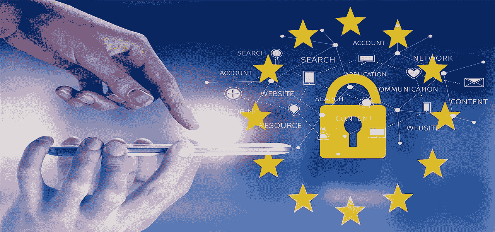
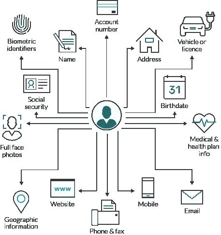
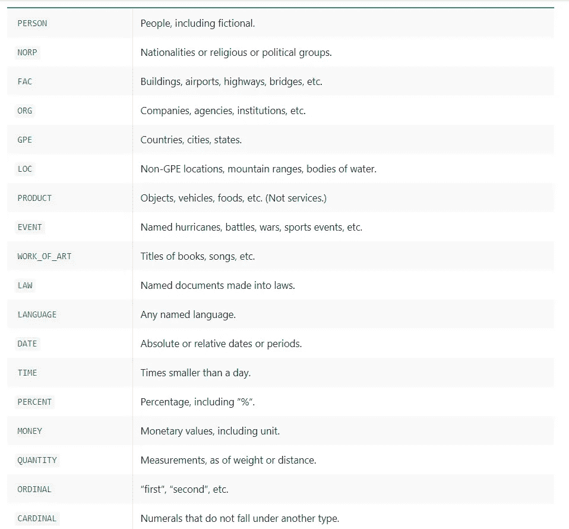
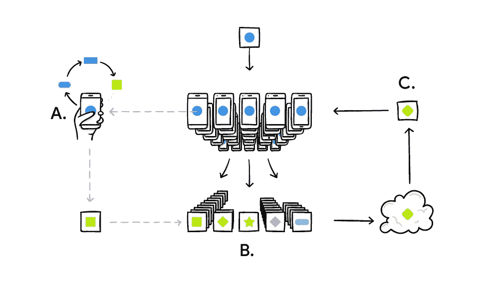

# 加州消费者隐私法，PII 和 NLP

> 原文：<https://towardsdatascience.com/ccpa-pii-and-nlp-b4165a92dc6d?source=collection_archive---------44----------------------->

## CCPA 和隐私的 NLP



[来源](https://pixabay.com/photos/regulation-gdpr-data-protection-3246979/)

加州消费者隐私法(CCPA)或 [AB 375](https://leginfo.legislature.ca.gov/faces/billTextClient.xhtml?bill_id=201720180AB375) 于 2020 年 1 月 1 日生效，这是加利福尼亚州保护加州居民个人信息的法律。个人身份信息(PII)是可用于识别用户/客户的任何数据。[通用数据保护条例(GDPR)](https://en.wikipedia.org/wiki/General_Data_Protection_Regulation) 是 2018 年通过的一项欧盟法律，赋予欧盟居民类似的权利。随着世界各地企业收集用户数据的规模越来越大，我认为世界各地的不同政府将会通过更多这样的法律。

**CCPA**

CCPA 给予加州居民以下权利(按原样取自[此处](https://leginfo.legislature.ca.gov/faces/billTextClient.xhtml?bill_id=201720180AB375)，第 2 节)→

```
**(1) The right of Californians to know what personal information is being collected about them.****(2) The right of Californians to know whether their personal information is sold or disclosed and to whom.****(3) The right of Californians to say no to the sale of personal information.****(4) The right of Californians to access their personal information.****(5) The right of Californians to equal service and price, even if they exercise their privacy rights.**
```

在数据泄露和其他违规的情况下，企业也必须支付罚款。

**PII**



[来源](https://www.imperva.com/learn/data-security/personally-identifiable-information-pii/)

CCPA 的目标之一是保护消费者的 PII 信息，这意味着公司需要开发工具，以安全的方式理解和存储 PII 信息。自然语言处理(NLP)和自然语言理解(NLU)技术将发挥关键作用，因为收集的数据中有很大一部分是文本形式的，如姓名、电子邮件、地址、社会保险号、健康信息等。上图来自 Imperva 展示了 PII 的各种例子。PII 可以进一步细分为 PHI(受保护健康信息)数据和 PCI(支付卡行业)数据。

**命名实体识别(NER)**

NER 的任务是识别姓名、组织、地点、日期/时间等。NER 可用于识别文本数据中包含的一些个人信息。

```
Example- John moved from Arizona to California in December. 
Above sentence has below three entities -Person → JohnLocation → Arizona and CaliforniaDate/Time → December
```

因此，人们可以训练一个深度学习模型，将句子中的每个单词分类为命名实体之一或不是。然而，有几个库提供了用于 NER 任务的预训练模型。识别 PII 信息非常重要，因为它有助于快速检索此类信息、适当保护信息(通过加密等)以及控制对此类信息的访问。以下是一些可用于 NER 的库→

**斯坦福核心 NLP**

[Stanford core NLP](https://stanfordnlp.github.io/CoreNLP/index.html) 是一个用 Java 编写的流行的 NLP 库，并附带了针对各种 NLP 任务的预训练，如英语和其他几种语言的 POS(词性)、NER 等。还有一个更新的项目 [StanfordNLP](https://stanfordnlp.github.io/stanfordnlp/) 是一个 python 库，目前支持 POS、lemmatization 等，但不支持 NER。

**空间**

Spacy 是一个非常流行的 NLP 库，它的一些核心组件是用 C 语言编写的，这使得它非常快。它还带有针对 NER 的[预训练模型](https://spacy.io/models)以及针对英语和其他几种语言的其他任务。根据您的应用，Spacy 有不同尺寸的型号可供选择。模型在[on notes 5 数据集](https://catalog.ldc.upenn.edu/LDC2013T19)上接受训练。这里我使用的是最大的英语语言模型——en _ core _ web _ LG(让我们看看如何使用 NER 的 Spacy

[来源](https://gist.github.com/suryavanshi/c4596e233e872fbb2d8bb5faa4b963e7)

在识别出实体之后，我们可以屏蔽它们(在上面的例子中，用“xxxx”得到“*我的名字是 xxxx xxxx，我住在 xxxx* ”)，以保存用户的个人信息。基于[本体注释 5](https://catalog.ldc.upenn.edu/LDC2013T19) 的空间预训练模型可以识别以下类型的实体→



空间本体注释 5 个实体— [来源](https://spacy.io/api/annotation)

对于电话号码、电子邮件等 spacy 无法识别的信息，可以使用 regex。除了屏蔽 PII 信息，还可以加密以进一步保护它。

[**Presidio**](https://github.com/microsoft/presidio)

Presidio 是微软专门为保护 PII 数据开发的库。它检测文本(以及图像)中的 PII 数据，然后通过编辑或加密来匿名化数据。它实际上默认使用空间 NER 模型来检测某些实体，也支持检测信用卡号码等。您还可以创建自定义的 PII 识别器。

[来源](https://microsoft.github.io/presidio/getting_started/)

**特定领域的 NER**

然而，当我们想要识别特定领域的实体时，问题就来了，例如，如果您想要识别疾病或药物，在这种情况下，我们必须为自定义 NER 数据训练或微调现有模型。对于仅包含少量单词的实体，简单的查找可能有效，但是拼写错误等仍然会导致该方法失败！定制的 NER 模型可以使用[空间](https://spacy.io/usage/training#ner)或[天赋](https://github.com/flairNLP/flair/blob/master/resources/docs/TUTORIAL_7_TRAINING_A_MODEL.md)来训练。

**联合学习**



[来源](https://ai.googleblog.com/2017/04/federated-learning-collaborative.html)

[联合学习](https://ai.googleblog.com/2017/04/federated-learning-collaborative.html) —联合学习是一种以分布式方式训练模型的技术，同时将原始数据保存在各个设备上以保护数据隐私。例如，在移动电话的情况下，设备下载现有的模型并针对设备特定的数据对其进行微调，因此设备数据永远不会被共享，所有个人训练数据都保留在设备上，并且更新也不会被共享。这也可以用[树莓酱](https://blog.openmined.org/federated-learning-of-a-rnn-on-raspberry-pis/)或其他设备来完成。[分割学习](https://splitlearning.github.io/)是另一种无需共享任何原始数据即可训练模型的技术，与联合学习的区别在于模型是分割的，一些训练可以在服务器上完成。使用 Coral Edge TPU 或 NVidia Jetson Nano 等边缘设备也有助于保护用户数据的安全。

[差分隐私](https://www.cis.upenn.edu/~aaroth/Papers/privacybook.pdf) —差分隐私是一种在不共享用户个人信息的情况下共享数据集的技术。来自[维基百科](https://en.wikipedia.org/wiki/Differential_privacy)

```
***an algorithm is differentially private if an observer seeing its output cannot tell if a particular individual’s information was used in the computation***
```

像[苹果](https://www.apple.com/privacy/docs/Differential_Privacy_Overview.pdf)、[谷歌](https://developers.googleblog.com/2019/09/enabling-developers-and-organizations.html)等各种公司使用差别隐私技术来保护用户隐私，同时改善用户体验。

**露天开采和库**

最近，人们对隐私以及如何在不损害用户隐私的情况下使用数据来训练深度学习模型有了很多关注。 [Openmined](https://www.openmined.org/) 是一个开源社区，其目标是让每个人都能轻松地进行保护隐私的机器学习。Openmined 开发了 [PySyft](https://github.com/OpenMined/PySyft) 库，支持[联邦学习](https://en.wikipedia.org/wiki/Federated_learning)、[差分隐私](https://en.wikipedia.org/wiki/Differential_privacy)和[多方计算](https://en.wikipedia.org/wiki/Secure_multi-party_computation)，同时支持 Pytorch 和 Tensorflow。OpenMined 还开发了 [PyGrid](https://github.com/OpenMined/PyGrid/) ，这是一个基于 PySyft 构建的 P2P 平台，用于在分布式/云环境中运行 PySyft。

[CrypTen](https://github.com/facebookresearch/CrypTen) —它是一个隐私保护的机器学习框架，来自脸书，构建在 Pytorch 之上。将 CrypTen 与 PySyft 集成的工作正在进行中。

[tensor flow Privacy](https://github.com/tensorflow/privacy)—[tensor flow Privacy](https://blog.tensorflow.org/2019/03/introducing-tensorflow-privacy-learning.html)是一个开源库，用于训练具有隐私的 ML 模型。

由 Udacity 和脸书提供的免费课程由 Andrew Trask 教授([Trask](https://medium.com/u/27c3e4437cc4?source=post_page-----b4165a92dc6d--------------------------------))——[安全和私人 AI](http://Secure and Private AI)

随着如此多的数据泄露和各种公司收集越来越多的个人信息，对机器学习中的安全和隐私的需求越来越多，尤其是在医疗保健领域。CCPA 现在很活跃，看看它对 2020 年及以后的商业的影响将会很有趣。要了解更多关于自然语言处理和人工智能的信息，你可以在推特上关注我——https://twitter.com/MSuryavansh

[](https://blog.openmined.org/encrypted-deep-learning-classification-with-pysyft/) [## 用 PyTorch + PySyft 加密深度学习分类

### 总结:伟大的理论需要伟大的实践。我们在这个博客中展示了如何使用一个私人神经网络来…

blog.openmined.org](https://blog.openmined.org/encrypted-deep-learning-classification-with-pysyft/) [](https://blog.openmined.org/federated-learning-of-a-rnn-on-raspberry-pis/) [## 一种递归神经网络在树莓 PIs 上的联邦学习

### 在本教程中，您将学习如何在 Raspberry PI 上设置 PySyft，以及如何训练递归神经…

blog.openmined.org](https://blog.openmined.org/federated-learning-of-a-rnn-on-raspberry-pis/) [](https://medium.com/analytics-vidhya/split-neural-networks-on-pysyft-ed2abf6385c0) [## PySyft 上的分裂神经网络

### 总结:在这个博客中，我们将介绍一种新的分散式学习方法，叫做…

medium.com](https://medium.com/analytics-vidhya/split-neural-networks-on-pysyft-ed2abf6385c0) [](https://blog.openmined.org/upgrade-to-federated-learning-in-10-lines/) [## 10 行联合学习

### 总结:简单的代码示例使学习变得容易。在这里，我们使用 MNIST 培训任务来介绍联合学习…

blog.openmined.org](https://blog.openmined.org/upgrade-to-federated-learning-in-10-lines/) [](https://www.csoonline.com/article/3292578/california-consumer-privacy-act-what-you-need-to-know-to-be-compliant.html) [## 加州消费者隐私法(CCPA):合规所需了解的内容

### 2018 年 6 月下旬，加利福尼亚州通过了消费者隐私法案 AB 375，这可能会对美国产生更多影响…

www.csoonline.com](https://www.csoonline.com/article/3292578/california-consumer-privacy-act-what-you-need-to-know-to-be-compliant.html) [](/2019-year-of-bert-and-transformer-f200b53d05b9) [## 2019 —伯特和变压器年

### 关于 2019 年 BERT 和 NLP 项目的简短帖子

towardsdatascience.com](/2019-year-of-bert-and-transformer-f200b53d05b9)