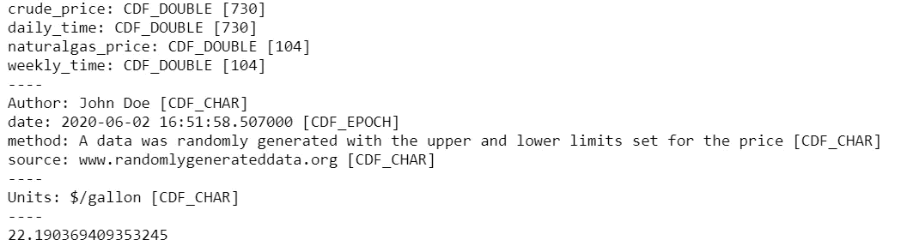
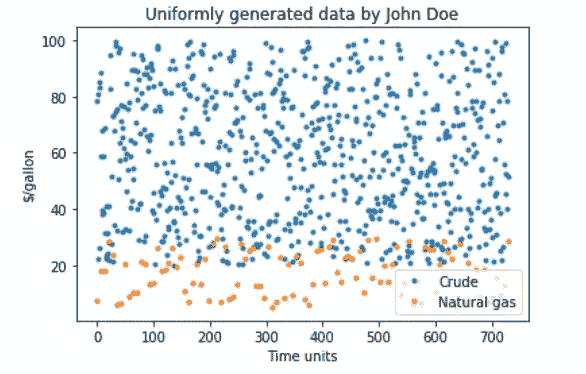

# CDFs:使用 spacepy 方便地读写数据

> 原文：<https://towardsdatascience.com/cdfs-using-spacepy-to-read-and-write-your-data-conveniently-9490f0bfee4a?source=collection_archive---------46----------------------->

## Spacepy python 库是存储和读取复杂文件的有用工具，同时还存储数据的描述。

图片来自美国宇航局 Unsplash

任何组织最重要的方面是拥有一种读取和存储数据的机制。存储数据最常见的方式是通过格式。csv '，'。tsv '或'。' txt '。虽然这些文件使用标准的稀疏器或定制的分隔符可以方便地读取信息，但是存储多维数据及其相应的信息(关于单位、数据收集方法等)变得很困难。).

存储数据及其信息的一种新方法是使用。文件的 cdf 格式。CDF 代表通用数据格式，它接受最通用的数据类型，而不管其维度和形状。由 Wolfram Research 创建的 CDF 可以轻松存储和传输信息。CDF 文件被许多组织使用，最著名的是 NASA，用来将多维数据存储到分离的、容易理解的符号中。

在本文中，我将指导您一步一步地创建. cdf 文件，以及如何在实践中使用它。同样的详细文档可以在这里找到:[https://spacepy.github.io/_modules/spacepy/pycdf.html](https://spacepy.github.io/_modules/spacepy/pycdf.html)

**导入库**

用于此问题的库

用于创建和读取。cdf 文件是 spacepy 库，嵌入了 pycdf 函数。要顺利运行库，请确保您的处理器具有与库相同的体系结构(32 位/64 位)。

**样题**

在本文中，我们将考虑一个简单的问题。如果你有一个数组或者。csv 文件，存储不等长的尺寸变得很困难。让我们假设，手头的问题是存储 2 年期间的美国原油价格(日平均)和 2 年期间的美国天然气价格(周平均)。因此，在这种情况下，原油和天然气的数据点数量会有所不同，分别为 730 和 104 个点。为了以易于阅读的格式存储数据，我们将使用。cdf 格式。

第一步是生成一些随机数据。我们假设美国原油价格波动超过 20-100 单位，而天然气价格波动超过 5-30 单位(数值是随机选取的，没有相关性)。

我们将变量 tcrude 和 tng 视为时间步长，前者为每日，后者为每周。原油和天然气价格是随机生成的。

随机数据生成

**编写一个 CDF 文件**

这个问题最关键的一步是正确地编写一个新的 cdf 文件，它包含我们所拥有的所有必需的属性。相同的示例代码如下:

将数据写入. cdf 文件

在上面的步骤中，完成了以下事情:

1.  我们产生了。使用 pycdf 中的 write 方法的 cdf 文件，指示用于写入新文件的空引号。
2.  我们存储数据的方式类似于 pandas 数据帧，但是，在这种情况下，数据没有索引，而是存储在一个单独的变量中
3.  的’。attrs 的方法用于添加关于数据的信息。在本例中，我们添加了以下内容:作者姓名、数据来源、采样方法。除此之外，我们还为数据添加了属性，例如价格的单位。

**阅读。cdf 文件**

现在我们已经创建了一个. cdf 文件，我们将使用同一个文件作为要读取的输入。这将带我们读一个文件，并验证我们写的数据。

的。cdf 文件有两个方面，我们存储的数字数据和属性。我们希望知道数据文件包含什么，以及作者是否希望传达任何附加信息。这可以通过导入。cdf 为只读，然后打印所需的数据。

写入的 cdf 文件的输出代码

这段代码的输出如下:

的输出。cdf 文件，包含所有的变量及其属性。

**处理来自。cdf 文件**

中处理数据很简单。cdf 文件。这可以通过与熊猫数据帧相同的方式来完成。示例绘图如下所示:

用于从绘制数据的代码。cdf 文件

该图与绘制数组或熊猫数据框的图相同。但是，使用的便利性。cdf 文件的一个优点是，你可以轻松地从同一个文件中取出不同维度的变量。此外，某些属性，如单位和作者姓名，也可以直接从文件中读取，无需任何额外的过滤。

示例图来自统一生成的数据，从。cdf 文件。

。cdf 很方便，不是吗？它们是数据帧的完美组合，但是允许不均匀的维度，并且可以使用键轻松地引用它们。唯一的缺点是。cdf 文件的一个缺点是它可能比正常文件大。csv 或。txt 文件，但有一个权衡。这种轻松。cdf 文件提供的很高！

jupyter 的整个笔记本都在这里:[https://github . com/yashgokhale/Miscellaneous/blob/master/netcdf _ tutorial . ipynb](https://github.com/yashgokhale/Miscellaneous/blob/master/netcdf_tutorial.ipynb)

CDF 非常有趣。数据分析也是如此。你可以打电话到 ashsgokhale@gmail.com[*y*](mailto:ysg@andrew.cmu.edu)*回复我，以获得任何进一步的澄清或建议，无论是关于这篇文章还是一般的。*

参考资料:

[1][https://spacepy.github.io/pycdf.html](https://spacepy.github.io/pycdf.html)

[2]h[ttps://CDA web . gsfc . NASA . gov/pub/software/CDF/doc/CDF 360/CDF 360 ug . pdf](https://cdaweb.gsfc.nasa.gov/pub/software/cdf/doc/cdf360/cdf360ug.pdf)