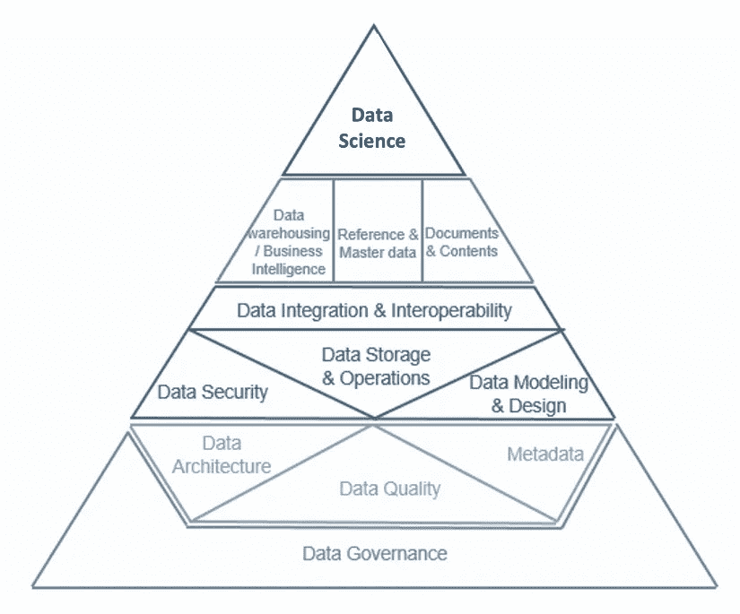

# 数据科学家如何获得最被低估的认证

> 原文：<https://towardsdatascience.com/cdmp-exam-d65e1255016b?source=collection_archive---------13----------------------->

## 数据策略越来越被视为数据科学职业发展的一项关键技能。

2020 年，我们数字世界的规模是 40 万亿千兆字节。这比 2010 年增长了 3000%。多兰·埃里克森在 [Unsplash](https://unsplash.com?utm_source=medium&utm_medium=referral) 上的照片

[认证数据管理专家(CDMP)](http://nicolejaneway.com/data-strategy/cdmp/) 考试授予**数据策略**领域的优秀，这是我们这个数据丰富的世界急需的学科。

考试包含 **100 道选择题**需在 **90 分钟**内作答。通过一级考试需要 60% 的**分数。可与**在线** **监考**一起进行**开卷**。这意味着你可以用你的笔记和 [*数据管理知识体系(DMBOK)*](https://amzn.to/32oK8hH) 作为参考。**

CDMP 在当今的就业市场中非常重要。该证书与高级领导职位相关联。商业和政府领域的潜在客户也认为这表明他们对数据管理有很深的了解。如果你刚刚开始与数据相关的职业旅程，CDMP 是一个开始**的好地方**。

2020 年 10 月初，我以 87/100 的分数完成了数据管理基础考试，获得了 CDMP 的认可。在这篇文章中，我将带你浏览我复习 [*DMBOK*](https://amzn.to/32oK8hH) 并成功参加考试的步骤。

在本指南中:

1.  [学习小贴士](#f201)
2.  [动机](#0814)
3.  [数据科学家的数据策略](#5463)

***免责声明*** *:本帖非达马国际赞助——所反映观点仅属我个人。我在亚马逊上添加了一个链接到* [*DMBOK*](https://amzn.to/32oK8hH) *的附属链接。通过此链接购买您的阅读材料有助于支持我关于数据科学和数据策略的写作以及 CDMP 研究小组的管理。我的目标是帮助数据科学家、分析师、工程师和其他技术人员获得 CDMP 证书，以推进他们的目标* — *预先感谢您的支持。*

## 我推荐的所有为 CDMP 而学习的事情

📘**购买** [***DMBOK 第二版。***](https://amzn.to/32oK8hH) **此时**。考试是**开卷**并且 *DMBOK* 作为数据管理工作的参考是非常有用的。DMBOK 占据了我桌子上的首要位置——我经常参考我的要点和便利贴来回答客户的问题。

❓ **现在就买** [**CDMP 考试**](https://cdmp.info/about/)**。您有无限的时间来安排考试日期，并且支付考试费用可以让您访问包含 200 个问题的**题库**，模拟真实考试。**

**🔖**高亮显示并粘贴 *DMBOK* 和**。好吧，这显然是开卷考试。你肯定想用荧光笔和便利贴来表明关键概念。我把**所有的便利贴都放在书**的一面，方便参考。我还建议你在标签页上写的东西要横着，这样它们就不会伸出书本太远。**

**❗️ **指示每章的开始**。使用宽便利贴或特定颜色的笔记来标记每一章的开始。在测试中，这对于快速找到与特定主题相关的内容是非常宝贵的。**

**🔨**使用章节框架**。 *DMBOK* 的所有章节都遵循以下结构*简介、活动、工具、技术、实施指南、治理、引用/推荐的作品。*将学习重点放在**概述和技术部分**上，相对于实施和组织部分，它们在考试中发挥的作用更大。**

**💙**按顺序阅读，然后按优先级复习**。 *DMBOK* 的主题以直观的顺序排列，即您在数据管理项目中评估这些主题的顺序。然而，考试中测试的 14 个主题的比例从数据治理等基础领域的 11%到大数据等高级活动的 2%不等。在你第二次阅读 *DMBOK* 的时候，我推荐按照本文 中的 [**优先顺序学习。**](/best-data-science-certification-4f221ac3dbe3#cdd5)**

**⭐️ **加入** [**CDMP 学习小组**](https://www.facebook.com/groups/346145433213551/) 。使用这个社区来交换意见、提问和寻找学习伙伴。**

> **质量差的数据会威胁到一个组织的生存**
> 
> **—乔·佩帕德，麻省理工学院斯隆管理学院首席研究科学家**

## ****动机****

**对于技术专业人士来说，参加 CDMP 非常简单而且有益。没有技巧性的问题，考试是开卷的，而且只需要 311 美元。希望这篇文章能让你思考获得 CDMP 奖会如何促进你的职业发展——例如:**

*   **您是一名数据科学家、数据工程师或软件开发人员，希望进入领导岗位**
*   **你是一名顾问，正在寻找一份证书，向你的客户展示你对数据管理有着深刻的理解**
*   **您是一名数据科学专业的学生，希望从端到端的角度了解数据相关主题**
*   **你是一个被驱使去学习有用的东西的人！**

**如果你对 CDMP 的好处有任何疑问，考虑一下从 2010 年到 2020 年的十年间，我们数字世界的数据量增长了 3000%，从 1.2 兆字节增长到 40 兆字节。那就是 **40 万亿千兆字节**。**

**随着时间的推移，组织产生的数据比以往任何时候都多。这创造了**重大机遇和巨大风险**。一个强大的数据战略可以支持促进比较优势的实验。薄弱的数据策略会危及组织的生存，将客户、利益相关者和员工置于风险之中。**

**急需能够将**数据作为战略资产**进行管理的专业人士。CDMP 是**唯一培训和评估端到端数据战略能力的认证**。**

## **这些学习小贴士，再说一遍:**

1.  **购买第二版的 DMBOK。 为开卷考试**
2.  **购买 [CDMP 考试](https://cdmp.info/about/)获得 200 道练习题**
3.  **高亮显示便签并放入 [*DMBOK*](https://amzn.to/32oK8hH)**
4.  **用特殊的便条纸标明每章的开始**
5.  **使用章节框架，重点关注*简介、活动、工具、*和*技术***
6.  **按顺序阅读章节，然后按[优先级](/best-data-science-certification-4f221ac3dbe3#cdd5)复习**
7.  **加入 [CDMP 学习小组](https://www.facebook.com/groups/346145433213551/)**

## **奖金—数据科学家的数据战略**

**仍然不相信为什么数据策略对机器学习工程师可能很重要？**

****

**艾肯金字塔经由 [*DMBOK*](https://amzn.to/32oK8hH)**

**作为一项高级业务职能，数据科学位于艾肯金字塔的顶端。它得到了数据战略基础领域的支持，如果没有这些领域的支持，它就无法取得成功。**

**提升您的数据战略能力将使您能够**在您的组织中倡导更好的数据基础设施**。反过来，这将提高您的数据科学计划的质量。获得 CDMP 不仅能为领导角色提供证书，还能让你获得对知识生成过程的深刻洞察。**

> **你获得的每一项技能都会让你成功的几率翻倍**
> 
> **——斯科特·亚当斯[如何在几乎所有事情上都失败的情况下仍然大获全胜](https://amzn.to/32AZik6)**

****如果你喜欢阅读这篇文章**，请关注我的[媒体](https://medium.com/@nicolejaneway)、 [LinkedIn](http://www.linkedin.com/in/nicole-janeway-bills) 和 [Twitter](https://twitter.com/Nicole_Janeway) 以获得更多提升你的数据科学技能的想法。加入 CDMP 考试学习小组。[购买 DMBOK](https://amzn.to/32oK8hH) 。**

## **提升技能的其他文章**

** [## 10 项被低估的 Python 技能

### 使用这些技巧来改进您的 Python 编码，以获得更好的 EDA、目标分析和功能，从而提升您的数据科学水平

towardsdatascience.com](/10-underrated-python-skills-dfdff5741fdf)  [## 如何不费吹灰之力通过 AWS 云从业者认证

### 预测:多云，第一次尝试有 100%的机会通过。

nicolejaneway.medium.com](https://nicolejaneway.medium.com/how-to-ace-the-aws-cloud-practitioner-certification-with-minimal-effort-39f10f43146)  [## 数据仓库综合指南

### 了解数据仓库作为分析就绪数据集的主存储库的角色。

towardsdatascience.com](/data-warehouse-68ec63eecf78)  [## 你的机器学习模型有可能失败吗？

### 规划过程中要避免的 5 个失误

towardsdatascience.com](/data-science-planning-c0649c52f867)  [## 如何让您的数据科学项目经得起未来考验

### ML 模型选择和部署的 5 个关键要素

towardsdatascience.com](/model-selection-and-deployment-cf754459f7ca)  [## 5 篇必读的数据科学论文(以及如何使用它们)

### 让您在数据科学领域保持领先的基本理念。

towardsdatascience.com](/must-read-data-science-papers-487cce9a2020)**