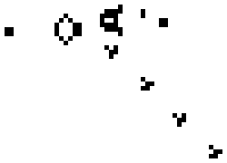

# 细胞自动机和深度学习

> 原文：<https://towardsdatascience.com/cellular-automaton-and-deep-learning-2bf7c57139b3?source=collection_archive---------21----------------------->

## 智能系统

细胞自动机(CA)是基于网格的计算系统，它模拟复杂性的增长。简而言之，细胞自动机是单向和混乱的进化模式。进化的规则是非常基本和简单的，然而，进化产生了高度复杂的结构和行为。CA 被认为是物理混沌系统中复杂性增长的模型，也是对称性如何从简单的定律中产生的模型。我喜欢将 CA 与统计力学进行比较:**对于气体来说，温度的概念在分子/原子水平上是不存在的。温度不是单个分子的属性。然而，当你把数百万/数十亿个分子放进一个盒子里时，分子之间的动力学和运动学会产生温度。我们称温度为系综**的“突发”属性。CA 的行为方式相似——它们遵循非常简单的局部规则，CA 的集合产生“涌现”的对称性和复杂的行为。

在这篇博客中，我们将关注 2d CA 最著名的例子，即“生活游戏”(GOL)。这是康威在 20 世纪 70 年代发现的。一个细胞的进化依赖于它的邻居。细胞有两种状态——死亡(黑色)或存活(白色)。自动机遵循这些简单的规则，

1.  一个邻居都死了的牢房因为**孤独**而死。
2.  一个有 3 个以上邻居的牢房死于**饥饿**
3.  由于**复制**，具有 3 个或更多活邻居的死细胞变得有活力
4.  具有 2 或 3 个活邻居的细胞保持相同的状态— **停滞**。

我们在下图中代表了所有这些状态，

GOL 规则(n =邻居)

我们让 CA 的 2d 网格随时间演化，并获得有趣的结构。初始起点通常是随机的。某些固定的起点产生了特定的结构。人们试图对可能出现的结构进行动物学分类。让我们看一些随机初始状态的进化例子，

GOL 进化

有时(基于初始条件)会出现如下非常有趣的结构，

一个有趣的模式出现了:滑翔机枪

维基百科上关于 CA 的文章包含了许多这些复杂结构的例子。**注意上图有一个与之相关的对称性，而规则是局部的，没有对称性。这是“突现”对称的一个例子。**

*说够了。深度学习和这有什么关系？*

# **实施**

规则是局部的(它们只看邻居)这一事实意味着 CA 与卷积运算非常相似。受此[链接的启发](https://arxiv.org/abs/1809.02942)提出了以下架构作为 CA 模型，

我们从一个 50x50 的图像(这是我们的世界网格)开始，执行翻转填充，使其成为 52x52。翻转填充意味着我们识别左右和上下边缘，以使整个网格连续。52×52 的图像被送入 100 个 3×3 的过滤器。该过滤器的数量随着您想要建模的 CA 的种类而变化。至少可以用 5 个滤波器来模拟 GOL。最后，我们实施 1x1 卷积，为下一个时间步获得 50x50 的图像。**我们想要强调的是，这个网络类似于 CA 的单时间步进化。**仅用一层卷积，不可能模拟任意长时间步长的演化。为了建模，CA 需要不断重用网络来生成 n 步进化。现在，让我们看看 TensorFlow 中的实现，

TF 2 中的两个简单实现

我们训练 CA 在随机产生的初始状态上进行一步进化。训练和评估模型的完整代码在[这里](https://github.com/sol0invictus/Blog_stuff/blob/master/CA.ipynb)给出。

现在让我们看看 CA 在现实世界中的各种应用。

# **应用**

1.  ***纠错。***
    CA 可以从很少的例子中快速学习。CA 可以在图像上被训练，以作为自校正网格来去除杂质。图像误差校正的一些例子是，

2. ***单向函数***:
CA 的传播不是双射函数，因此给定一个时间步长的状态，实际上不可能找到初始配置。可能的先前状态的数量呈指数增长。我尝试了深度和广度 conv 网来映射一个反向函数，但找不到初始配置。这表明寻找逆是一项重要的任务，也许根本不可能。

3. ***ARC(抽象推理挑战赛)***
Keras 的创造者弗朗索瓦·乔莱(Franç ois Chollet)最近出了一篇[论文](https://arxiv.org/abs/1911.01547)，关于如何衡量智力。他提出了大量的任务，包括不同种类的抽象解决技术。每个任务只有很少的(通常 2-3 个)训练样本和一个测试样本。目标是实际学习解决任务所需的逻辑，而不是学习某种转换。由于可用的训练样本非常少，基于神经网络的方法容易过度拟合。SOTA 方法使用决策树，并且有大约 50/400 的成功率(非常糟糕)。让我们看一些任务的例子，

寻找反射光线

将红色贴在蓝色上

正如你所看到的，任务是非常不同的，需要全局物理，拓扑等知识。设计一个可以概括所有可能情况的单一神经网络几乎是一项不可能的任务。基于 CA 的方法是针对以下任务的建议解决方案。我的一些初步实验给出了 20/400 的成功率。如果你想让我用 CA 来解决 ARC 任务，请在下面的评论中告诉我。

# **参考文献**

1.  代码: [Github](https://github.com/sol0invictus/Blog_stuff/blob/master/CA.ipynb)
2.  生命的游戏:[https://en.wikipedia.org/wiki/Conway%27s_Game_of_Life](https://en.wikipedia.org/wiki/Conway%27s_Game_of_Life)
3.  CA as Conv 网:[https://arxiv.org/abs/1809.02942](https://arxiv.org/abs/1809.02942)
4.  智力测量:[https://arxiv.org/abs/1911.01547](https://arxiv.org/abs/1911.01547)