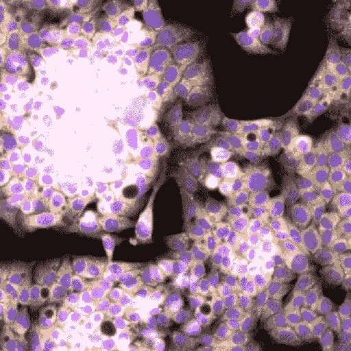
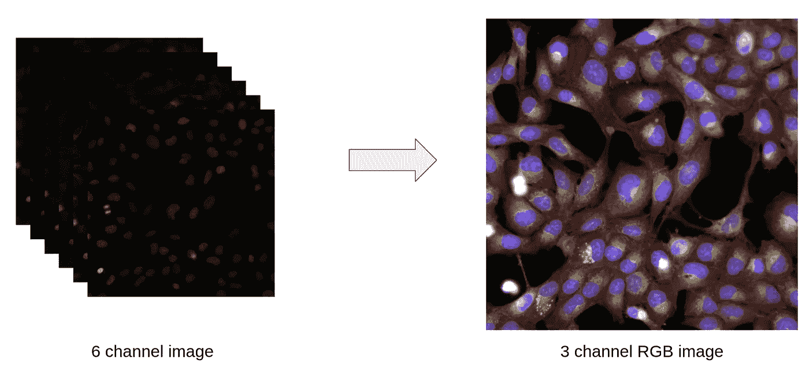
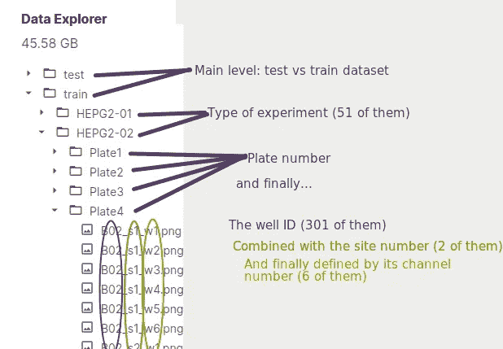
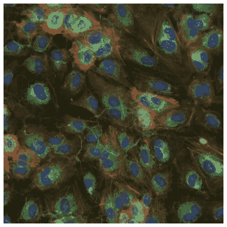
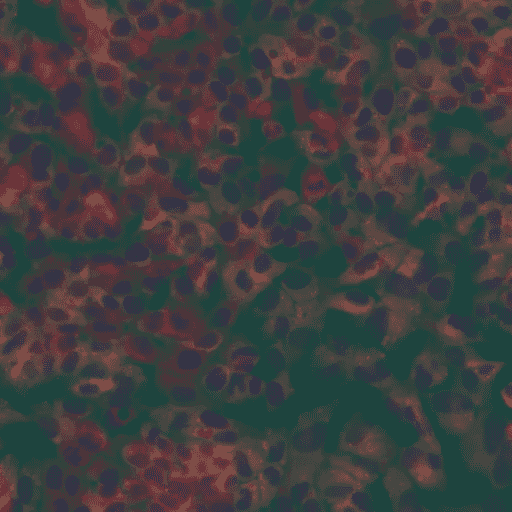
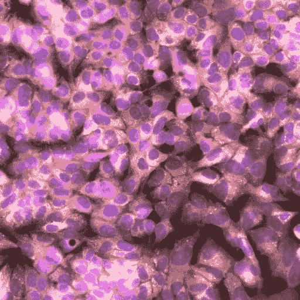
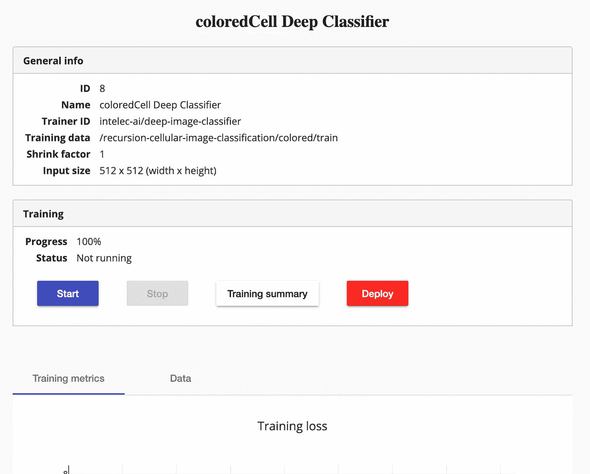
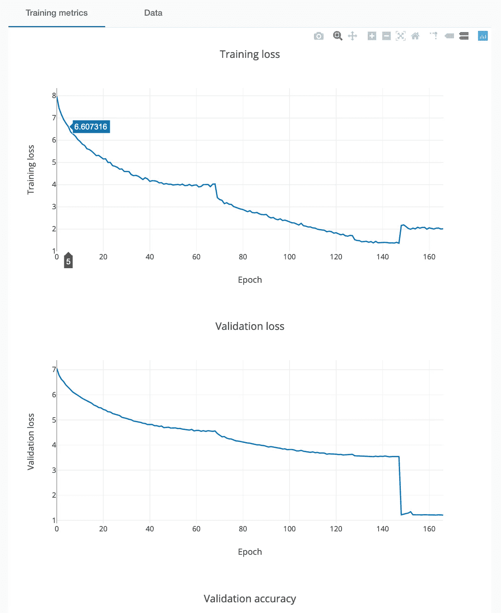

# 药物开发中的细胞图像分类:逐步指南

> 原文：<https://towardsdatascience.com/cellular-image-classification-with-intelec-ai-a-step-by-step-guide-7ebbc804371f?source=collection_archive---------43----------------------->

荧光显微镜:可视化细胞及其组成部分。图片由作者使用 [rxrx](https://www.rxrx.ai/) 库制作

你有没有想过，在没有任何深度学习知识的情况下，你是否可以对图像进行分类？如今，已经有了很棒的免费库，比如 Python 中的 [Keras](https://keras.io/) 和 [fastai](https://www.fast.ai/) ，或者已经成功抽象出深度学习的 [Intelec AI](https://www.intelec.ai/) 软件，任何人都可以开始他们的深度学习之旅，即使你只有一年的编码经验。

这篇文章将向你展示我如何参加一个复杂的关于细胞图像分类的竞赛，只使用了熊猫和智能。

# 概述和背景

药物和医疗方法通常需要很多年才能开发出来，因此价格昂贵，公众无法获得。递归制药公司。相信人工智能有能力减少生产新药的时间和成本。

用人工智能帮助制药公司的一个具体方法是能够对接受特定遗传扰动的不同细胞图像进行分类(称为 [siRNAs](https://en.wikipedia.org/wiki/Small_interfering_RNA) )。如果你能在给定图像的情况下，以很高的准确度猜出药物，这意味着药物以某种方式与细胞相互作用。

这正是我们 kaggle 挑战的问题:[递归细胞图像分类](https://www.kaggle.com/c/recursion-cellular-image-classification/overview)。给定一些图像，我们应该能够预测哪个 [siRNA](https://en.wikipedia.org/wiki/Small_interfering_RNA) 应用于它。

## 理解数据:荧光显微镜

左图:6 个通道上的荧光显微镜。右图:变形图像。图片由作者提供。

[荧光显微镜](https://www.youtube.com/watch?v=FwJEAgwn6Uw)的原理是使用不同的蛋白质，这些蛋白质只在特定的光谱颜色范围内发出荧光，并且倾向于附着在细胞的某些特定部分。

上面左边部分的图像代表了从同一台相机在同一地点通过六个不同的光谱颜色范围拍摄的照片。由于荧光显微镜的原理，这是可能的。每个频率都表示为黑白图像。第一个目标是能够将它们表示成一个单一的 RGB 图像，如右边部分所示。

# 挑战简介

 [## 递归细胞图像分类

### 细胞信号:从细胞图像的实验噪音中分离生物信号

www.kaggle.com](https://www.kaggle.com/c/recursion-cellular-image-classification/overview) 

Kaggle 发布了一个艰难的分类挑战:一个超过 750，000 张图像(代表几乎 50 GB)到超过 1100 个可能类别的分类任务。图像数据集以如下方式排列:有 51 个批次。每批有四个平板，每个平板有 308 个填充的孔。每口井在两个地点进行监控，并在六个频率上拍照。太多了！我们将在下一节看到如何减少数据集的大小，保留最相关的组件。你可以在这里下载[的资料。](https://www.kaggle.com/c/recursion-cellular-image-classification/data)

这种排列产生以下树形数据结构:

我们的数据是如何排列的？作者图片

## 理解数据:它看起来像什么？

如前所述，每个地点都是在六个频率上拍摄的(在上图中用 w1，…，w6 表示)。如果只有 3 个频率就好了，就像我们在处理 RGB(红绿蓝)图像一样，因为大多数最先进的神经网络将 RGB 图像(即正好有三个通道的图像)作为输入。有很多方法可以将一些数据从高维降低到低维。我们将探索其中的两个。

首先，我们将使用一个小而方便的库来处理由 [rxrx.ai](https://www.rxrx.ai/) 创建的特定数据。这个库将帮助我们以更有意义的方式可视化我们的数据。您应该在您希望运行所有脚本来准备数据的同一个文件夹中克隆他们的 git repo。从终端，您可以执行:

git 克隆[https://github.com/recursionpharma/rxrx1-utils](https://github.com/recursionpharma/rxrx1-utils)

然后，打开 [jupyter 笔记本](https://jupyter.org/)或 python 脚本，尝试以下操作:

> 这里有一个笔记本，上面有所有的代码。

为了确保您正确理解数据的树结构，请尝试更改 load_site_as_rgb 函数的参数，并查看是否有 rgb 单元格图像出现！

预期产出。作者图片

# 准备数据

因为我们想使用 [Intelec ai](https://www.intelec.ai/) 软件，我们需要坚持一些关于数据结构和标签文件的格式。我们将在后面讨论如何安装它。现在，我们已经创建了标签文件！

> 如果你想自己尝试，你没有义务尝试以下两种方法！一个就够了！

现在我们终于可以给我们的两个函数下一些定义了！

从左到右，作者使用 **PCA** 和 **Colormap** 技术生成的两幅图像如下所示。

## 主成分分析

[主成分分析(PCA)](https://en.wikipedia.org/wiki/Principal_component_analysis) 是对一些数据进行降维的常用技术。需要一个额外的库:scikit-learn。相应的代码如下:

尽管 PCA 通常在将数据嵌入到较低维度的流形中时显示出优异的结果，但这可能再次不适用于该问题，因为 PCA 通常在发现特征(此处为通道)之间的线性相关性时是好的，而对于那些细胞图像可能不是这样。

## 彩色地图

我们可以使用的最后一个想法是将每个通道的色图应用于 RGB 值。例如，可以想象第一通道将输出图像着色为红色值，第二通道着色为绿色值，第三通道着色为蓝色值，最后三个通道着色为某种组合，如洋红色等。但是要知道一个好的色彩映射表策略，我们应该对数据有深刻的理解，这不是我个人的情况。好在 rxrx 库有这个漂亮的方法叫 load_site_as_rgb！记得吗？它所做的是，我们需要指定它一个细胞图像，它应用一个自定义的色彩映射表来输出一个 3 通道的图像，正如我们所希望的那样！

有人会注意到我撒了一点谎，我们实际上使用了 convert_tensor_to_rgb 方法，因为另一个调用了他们的在线 API，比我们自己在本地打开图像要慢得多。

你可能会喜欢尝试自己的想法。为了保持代码对其他方法的模块化，我建议使用最后一种方法，它将允许我们根据需要选择任何函数:

现在我们需要主循环:遍历所有数据并将图像转换成 RGB 图像，如上所述。

关于上述代码的一些说明:

*   第一行是如果你想尝试一个特定的建议方法(或者尝试你自己的想法),你可能会改变的内容。)
*   你会注意到，在第 9 行，我们将站点固定为“1 ”,并且从未使用过第二个站点。原因是我们希望使用更轻的数据集，这只是一个演示，我们并不是要赢得 kaggle 竞赛(但如果你有动力，你可以使用这两个网站！)
*   由于并非所有组合都定义了完整的数据，可能会有一些图像在站点 1 中不存在，因此我们使用 try-except 块来避免程序崩溃。

就是这样，伙计们！我保证，我们完成了旅途中最艰难的一步！现在我们有了格式良好的数据，让我们使用 [intelec ai](https://www.intelec.ai/) ！

如果你愿意，你可以在这里查看完整的笔记本。

# 智能安装

点击[这里](https://www.intelec.ai/install)可以安装 Intelec ai。

 [## 支持 GPU 的自动化机器学习平台免费下载

### 编辑描述

www.intelec.ai](https://www.intelec.ai/install) 

你需要码头工人。如果你在安装上有问题，我邀请你去看看他们的[网站](https://www.docker.com/)。

 [## 增强开发者的应用开发能力| Docker

### 世界领先的服务，用于与您的团队和 Docker 社区查找和共享容器图像。对于…

www.docker.com](https://www.docker.com/) 

# 运行它的第一个模型

我们终于到了！是的，我知道你也不耐烦在没有任何代码的情况下训练你的深度学习模型，别担心，我会告诉你怎么做。

## 上传您的数据

首先，您需要上传您选择的数据，然后可以是 PCA 或 colormap 或您选择的任何其他版本。

1.  压缩你的文件夹。
2.  进入英特尔页面的“文件浏览器”标签。
3.  上传吧。
4.  右键点击它解压。

## 选择您的型号

Intelec 的免费版本已经提供了一些有趣的神经网络。转到“培训”选项卡。分类任务有一个简单和一个较重的模型。我的建议是直接接受更重的挑战，因为这个挑战是一项复杂的任务。无论您选择简单型号还是较重型号，步骤都是完全相同的:

1.  为您的分类器命名，例如深色细胞分类器
2.  选择名为“train”的文件夹，其中应包含另一个名为“images”的文件夹和您的“labels.csv”文件
3.  您可以选择添加一个测试或验证文件夹，我个人并没有为这个特定的任务这样做。否则，Intelec 将把培训的一部分作为默认验证，这完全没问题。
4.  您还可以设置收缩因子:分辨率越高，分辨率越小，即模型训练越快，但精度越低。我的建议是从一个高值开始，然后慢慢降低它，看看在一个模型上花更多时间是否值得。也许从 4 开始，因为图像分辨率已经很低了(512x512x3)。在我的结果中，我实际上使用了 1 的收缩因子，因为我为这个任务租了一个服务器，但是你肯定不需要这样做。

这就对了。你可以保存这个模型。应该会打开另一个页面，建议您开始训练程序。这可能需要一段时间，所以请确保您的 GPU 设置正确。如果你需要建议，你可以阅读这个有趣的话题。

模型准备部署。作者图片

如果您看到红色粗体的“部署”按钮，这意味着您成功地训练了您的分类器，祝贺您！当然，你可能很想知道你的训练有多好。向下滚动一点，你应该会看到类似下图的东西。如果您有兴趣，可点击“培训总结”按钮了解更多详情。

培训和验证损失。作者图片

> 为了获得有意义的度量，总是在验证数据集上测量您的损失是非常重要的，以确保您没有过度拟合。您可能已经自己指定了一个测试或验证集，但是如果您没有，不要担心 intelec 会为您做的。

太棒了，你的模特真的学到了一些东西！我们可以看到损失减少了多少！

如果您想更进一步，您可以部署模型来预测一个或几个测试图像。你也可以给它一个任务来预测整个文件夹，如果你想参加 kaggle 比赛，这真的很有用，因为几乎要做 20，000 次预测。一个很好的视频解释了如何做所有这些事情。如果你很好奇，看看吧！

# 结论

多好的旅程啊！我们学到了很多关于医疗行业和制药公司如何着手开发新产品的知识，更重要的是，深度学习如何能够拯救我们。事实上，我们没有看到我们的神经网络架构的实现细节，但这就是 intelec AI 软件的目的:让每个人都可以进行深度学习。我们只需要对 pandas 库有一些了解，对 python 有一点经验，然后我们就能够解决一个困难的问题，比如超过一千个类的分类任务。