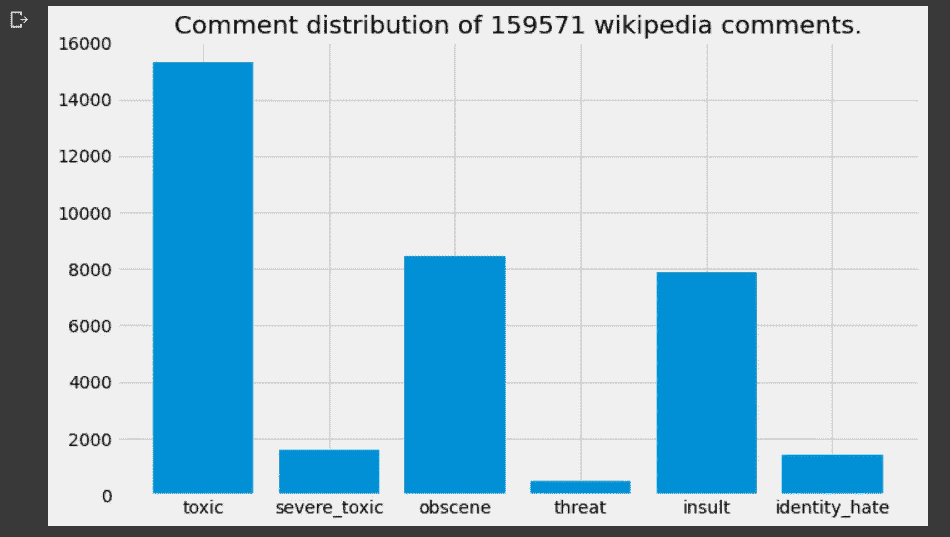
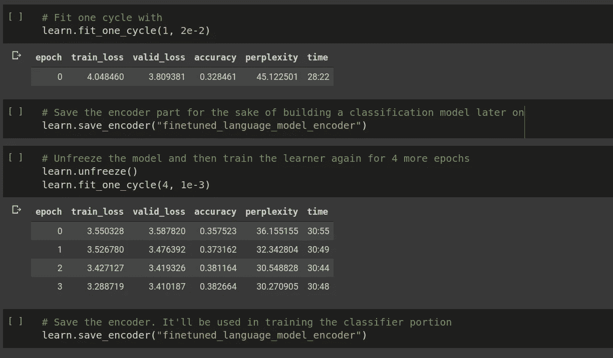

# 使用 fastai v2 和多标签文本分类器审查有毒评论

> 原文：<https://towardsdatascience.com/censoring-toxic-comments-using-fastai-v2-with-a-multi-label-text-classifier-12688157d0e6?source=collection_archive---------17----------------------->

## 让互联网成为一个安全的空间，一次一个字

近来，互联网已经成为一种基本的必需品，我们世界中的许多物理事物正处于数字化的边缘。世界上已经有很大一部分人使用互联网进行日常事务、娱乐、学术研究等。保持互联网成为一个安全的空间，让每个人都能来这里互动，这是一个重大的责任，因为有各种各样的人在互联网上张贴东西，而没有意识到其后果。

这篇文章介绍了一个文本分类器的制作过程，它接受一段文本(短语、句子、任意长度的段落),并判断该文本是否属于一系列不同类型的恶意文章。本帖涵盖的主题有

*   [简介](#0017)
*   [从 Kaggle 获取数据](#c0b6)
*   [数据探索](#7457)
*   [面向多标签文本分类的方法](#e8c5)
*   [fastai v2 中的语言模型](#5de3)
*   [fastai v2 中的分类模型](#5eaa)
*   [做出推论](#6eed)
*   [参考文献](#5227)

您可以单击上述任何一个要点，导航到相应的部分。

*免责声明:此处使用的数据集包含一些可能被视为亵渎、粗俗或冒犯的文本。*


乔恩·泰森在 [Unsplash](https://unsplash.com?utm_source=medium&utm_medium=referral) 拍摄的照片

# 介绍

自然语言处理是一个研究理解计算机和人类语言之间交互的领域。由于许多东西正在走向在线或数字化，而且这些服务已经普及到全世界，这些数据产生的规模是巨大的。在这个时代，地球上的每个人都在发表他们的观点、想法、事实、文章、诗歌等等。在网上，监控和调节这些文本是一项不人道的任务(即使我们认为人类是一个社区，而不是一个个体)。

多亏了高容量 GPU 和 TPU 的出现，以及人工智能在文本应用方面的最新进展，我们已经提出了许多解决这个问题的技术。递归神经网络是解决这些问题的关键要素。fastai 是一个深度学习库，建立在 PyTorch 的基础上，由杰瑞米·霍华德和西尔万·古格开发，使得为这些任务构建应用程序非常用户友好和简单。

让我们开始学习如何使用 fastai 进行文本分类。

# 从 Kaggle 获取数据

我们将用于演示多标签文本分类过程的数据来自 Kaggle 上的[有毒评论分类挑战。](https://www.kaggle.com/c/jigsaw-toxic-comment-classification-challenge)

我们的模型将负责检测不同类型的毒性，如威胁、淫秽、侮辱和基于身份的仇恨。该数据集包括来自维基百科谈话页面编辑的评论。事不宜迟，让我们开始下载这个数据集。

您可以手动从 Kaggle 下载数据集，也可以使用上面的命令使用 kaggle 提供的 API。

要使用 API，您必须创建一个 Kaggle 帐户并生成 API 密匙，该密匙允许您使用 shell 命令从 kaggle 下载数据集，并从工作笔记本或 shell 提交预测。一旦你创建了一个 Kaggle 帐户并创建了 API 密匙，你将得到一个 json 文件，其中包含你的用户名和密匙。根据您的唯一凭证，这些需要在上面的代码中输入。

[由](https://medium.com/analytics-vidhya/how-to-fetch-kaggle-datasets-into-google-colab-ea682569851a) [MRINALI GUPTA](https://medium.com/u/a30a62d08d0c?source=post_page-----12688157d0e6--------------------------------) 撰写的这篇文章很好地解释了如何开始使用 Kaggle API 下载数据集。

# 数据探索

让我们阅读训练集和测试集，并掌握其中包含的数据。


图片由 Vinayak 提供

数据帧中有几个字段。

*   **id** :与曾经的注释文本相关联的标识符。由于这是从维基百科的对话页面上获取的，它可能是某个发表评论的人的身份，或者是他们发布的文本的 HTML DOM id。
*   **comment_text** :用户发布的评论的文本。
*   **有毒、严重 _ 有毒、淫秽、威胁、侮辱、身份 _ 仇恨:**这些列表示 comment_text 中同名元素的存在。如果它们不存在，就用 0 表示，否则就用 1 表示。

这些元素在某种意义上是独立的，它们并不相互排斥，例如，一个评论可以是*有毒的和侮辱性的，*或者如果一个评论是有毒的，它就不一定是淫秽的，等等。



图片由 Vinayak 提供

总的来说，有不良文字的评论要少得多；考虑到我们有超过 10 万条评论，有不到几万个令人反感的类别(除了有毒的那几个)。知道这一点很好，但如果这类文本更少就更好了。

此外，文本被人类标注了这些标签。这个注释的任务是一个巨大的任务，伴随着这些注释，会有很多人为的解释和偏见。这是需要记住的事情，我们将在结束时讨论这个问题。

# 多标签文本分类方法

文本或句子是单个单元的序列——单词、子单词或字符(取决于你说的语言)。任何机器学习算法都无法处理除数字之外的任何东西。所以，我们首先要用数字来表示数据。

在任何与文本相关的问题中，首先我们创建一个词汇库，这个词汇库基本上是我们要考虑的全部词汇；任何其他单词都将被加上一个名为 unknown 的特殊标签，并放入该桶中。这个过程叫做 ***标记化。***

接下来，我们将每个单词映射到一个数字标记，并创建一个单词字典来存储这个映射。所以现在每一篇散文/评论/文字都转换成一串数字。这个过程叫做 ***数值化。***

最肯定的是，评论的长度不会一样长，因为人们并不局限于用固定的字数来评论。但是，当创建批量文本以提供给我们的网络时，我们需要它们都具有相同的长度。因此，我们用一个特殊的符号来填充句子，或者如果句子太长而不能压缩到固定长度，我们就截断句子。这个过程叫做 ***填充。***

在做上述所有事情的同时，还有一些其他的操作，比如将所有的文本小写，将标点符号作为单独的符号处理，理解大写而不管小写等等。这就是 fastai 的优秀员工让所有这些事情变得超级简单的地方。

*   **xxpad** :对于填充，这是使用的标准令牌。
*   **xxunk** :当遇到一个 oov(词汇外)单词时，这个令牌用来替换那个单词。
*   **xxbos** :在每个句子的开头，这是一个标记，表示一个序列的开始/起点。
*   xxmaj :如果一个单词是大写的或者标题是大小写的，这个符号会被加前缀以获取信息。
*   **xxrep** :如果一个单词重复，那么在标记化的表示中，我们将让这个单词后面跟着 xxrep 标记，后面跟着重复的次数。

有更多的语义信息用更多的这种标记来处理，但所有这些都确保捕捉到关于文本及其背后含义的宝贵信息。

一旦预处理完成，我们就可以建立一个 LSTM 模型来将文本分类到各自的标签中。单词被表示为 n 维向量，俗称编码/嵌入。PyTorch 中有一个用于嵌入的构造，它有助于在给定单词的数字标记的情况下查找单词的矢量表示，然后是其他 RNN 层和全连接层，以构建一个架构，该架构可以将序列作为输入，并返回一组概率作为输出。这些向量嵌入可以被随机初始化，或者从通常可用的 GLoVE 或 Word2Vec 嵌入中借用，这些嵌入已经在大的文本语料库上被训练，使得它们在一般意义上对特定语言中的上下文具有良好的语义单词理解。

然而，如果我们在构建分类器之前执行它，有一个技巧可以改善结果。这就是我们接下来要看的。

# **fastai v2 中的语言模型**

fastai 提出了在构建任何分类器或应用程序之前微调语言模型的这种经过试验和测试的方法。

简而言之，他们说的是，如果你有一组在大型语料库中训练过的单词嵌入，他们对从语料库中学到的单词有一个非常通用的理解。然而，当我们谈论仇恨言论和令人讨厌的评论以及有毒的东西的分类时，有一种与这些句子相关的特定的负面氛围，并且语义上下文还没有出现在我们的嵌入中。此外，许多特定于我们的应用程序的单词/术语(可能是医学或法律或有毒语言)可能不会经常在我们从中获得单词嵌入的庞大语料库中遇到。在我们的分类器将要使用的嵌入中，这些应该被包含并很好地表示出来。

因此，在建立分类器之前，我们将微调一个已经在维基百科文本语料库上训练过的语言模型。我们将把训练和测试数据集的注释绑定在一起，并将它们提供给语言模型。这是因为我们不是在做分类，而是在给定当前序列的情况下简单地猜测序列的下一个单词；这叫做自我监督任务。通过这种方式学习嵌入，我们将能够构建一个更好的分类器，因为它知道特定于我们语料库的概念。

让我们看看如何在 fastai v2 中实例化和微调语言模型。


图片由 Vinayak 提供

我们附加训练和测试数据，并丢弃标签，因为在这个自我监督的学习任务中我们不需要它们。接下来，我们必须创建一个数据加载器来标记这些文本，在将它输入语言模型之前进行所有的数值化、填充和预处理。

1

这在 fastai 中非常简单，您只需将所有参数包装在一个工厂方法中，并用它实例化 TextDataLoaders 类。否则，这至少需要一百行代码加上适当的注释和其他东西，但多亏了 fastai，它又短又甜。我们可以看看一批中的几个条目。


图片由 Vinayak 提供

正如我们所看到的，输出只是将给定的序列偏移一个字，这与我们想要的一致，即给定一个序列，预测序列的下一个字。一旦我们有了这个数据加载器，我们就可以创建一个语言模型学习器，它可以根据我们的语料库而不是以前的文本语料库来调整编码。



图片由 Vinayak 提供

有了语言模型学习器之后，我们可以让学习器适应几个时期，并使用 save_encoder 方法保存编码。我们可以看到，在给定当前单词序列的情况下，语言模型平均可以以 38%的准确率预测下一个单词会是什么，这对这个数据集来说是相当不错的。

一旦我们做好了准备，现在我们可以进入下一步，创建一个分类器来识别 comment_text 的不同标签的概率。

# fastai v2 中的分类模型

在我们开始创建分类模型之前，我们需要进行一些预处理，以便构建一个合适的数据加载器。在写这篇文章的时候，文本的数据块 API 有一个问题，它避免了正确地推断所有的因变量，因此我们不得不求助于这个方法。

基本上，我们将不得不在我们的数据帧中创建另一列，该列使用固定的分隔符来指示单个标签的存在或不存在。所以，如果一个评论是淫秽和有毒的，我们的新栏目会显示淫秽；分隔符为“；”时有毒。同样，对于没有任何不良文本的行，为了给出一个标签，我们现在称它们为 sober(没有任何标签，fastai 不会创建 dataloader)。


图片由 Vinayak 提供

因此，我们可以看到添加了包含“；”的列标签带分隔符的标签字段，所有的标签都在这里表示，而不是以一次性编码的格式提供。

现在，我们使用 datablocks API 创建数据加载器，分别为 x 使用“comment_text”字段，为 y 使用“Labels”字段。如果我们在 get_y 字段中作为一个列表提到了 6 列的名称，那么它总是只选取两个字段；由于数据加载器的这种不正确的推断，我们必须创建一个单独的标签列来获取因变量，即 y 的值。接下来，一旦我们有了数据加载器，我们就可以使用 LSTM 架构构建一个分类器模型。一旦实例化了语言模型，我们还需要将它的编码/嵌入加载到分类器中。


图片由 Vinayak 提供

然后我们可以开始训练分类器。最初，除了最终的 FC 层，我们将保持网络的大部分处于冻结状态。这意味着反向传播权重更新将仅发生在倒数第二层。我们将逐渐解冻之前的层，直到最终我们解冻整个网络。我们这样做是因为如果我们从一个未冻结的网络开始，模型将很难快速收敛到最优解。

可以看出，在训练结束时，准确率已经达到了相当稳固的 98%。由于训练和有效损失都在减少，我们可以理想地训练更多的纪元并继续下去，但出于时间的考虑，我们将认为这是一个足够好的分数，并从推论开始。

# 做出推论

现在我们有了一个训练好的模型，并且我们已经将它存储为 pkl，我们可以使用它对以前看不到的数据(即测试数据)进行预测。

我们将首先加载我们刚刚在 GPU 上创建和训练的模型。(由于我们有几十万条评论文本，CPU 推断会耗费大量时间)。接下来，我们将对 test_df 进行标记化，然后通过用于训练和验证数据的相同转换来传递它，以创建用于推断的测试注释的数据加载器。

接下来，我们将使用 get_preds 方法进行推理，并记住将 reorder 方法传递给 False，否则会发生文本的随机重排，这将导致最终预测的顺序不正确。

最后，我们将以 sample_submissions.csv 样式格式化这些预测。因此，在预测之后，我们得到一组 7 个值，每个类一个，并且不需要“清醒”类的概率，因为它是我们作为占位符引入的。我们把它去掉，把所有的 id 按正确的顺序排列。这是最终提交的样子。


图片由 Vinayak 提供

最后，我们可以使用 kaggle API 本身提交这些预测。无需手动转到 kaggle 并提交 csv 文件。这可以简单地通过这个 shell 命令来完成。

```
# Submit the predictions to kaggle!kaggle competitions submit -c jigsaw-toxic-comment-classification-challenge -f submissions_toxic.csv -m "First submission for toxic comments classification"
```

您可以根据自己的方便更改提交文件的名称和消息。我得到的最终提交分数如下所示


图片由 Vinayak 提供

排行榜上的最高分大约是 0.9885，所以我们的分数在这样少的代码行和很少甚至没有预处理的情况下还是不错的。我们可以删除停用词，清理 html 标签，处理标点符号，甚至调整语言模型，或者使用 GloVE 或 Word2Vec 嵌入，并采用像 Transformer 这样的复杂模型，而不是简单的 LSTM。许多人以不同的方式处理这个问题，并使用其中的一些技巧来获得如此高的分数。然而，通过使用已经实现的 fastai 库，我们可以在第一次尝试中获得足够好的分数。

最后，值得一提的是，这个由人类标注的数据集可能被贴错了标签，或者人与人之间可能存在主观差异，这也是公平的，因为这是一项非常手工和单调的工作。我们可以通过建立一个模型来帮助这一过程，然后用它来注释，并让人类监督注释，以使过程更简单，或者将这项工作众包给多个志愿者，以在少量时间内获得大量标记数据。无论如何，NLP 在解决现实世界中的许多语言问题方面已经变得非常有用，希望在阅读完这篇文章后，你有信心用 fastai 开始你的文本世界之旅！

# 参考

1.  [来自 Kaggle 的毒性评论数据集](https://www.kaggle.com/c/jigsaw-toxic-comment-classification-challenge/overview)
2.  [如何使用 Kaggle API 下载数据](https://medium.com/analytics-vidhya/how-to-fetch-kaggle-datasets-into-google-colab-ea682569851a)
3.  [Github 回购与这个帖子的所有代码](https://github.com/ElisonSherton/fastai-basic-notebooks)
4.  T [ext 分类笔记本使用 fastai](https://colab.research.google.com/github/fastai/fastbook/blob/master/10_nlp.ipynb)