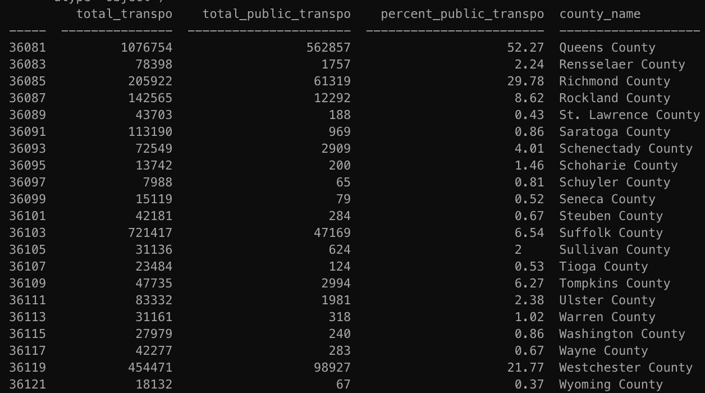
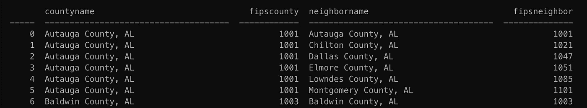
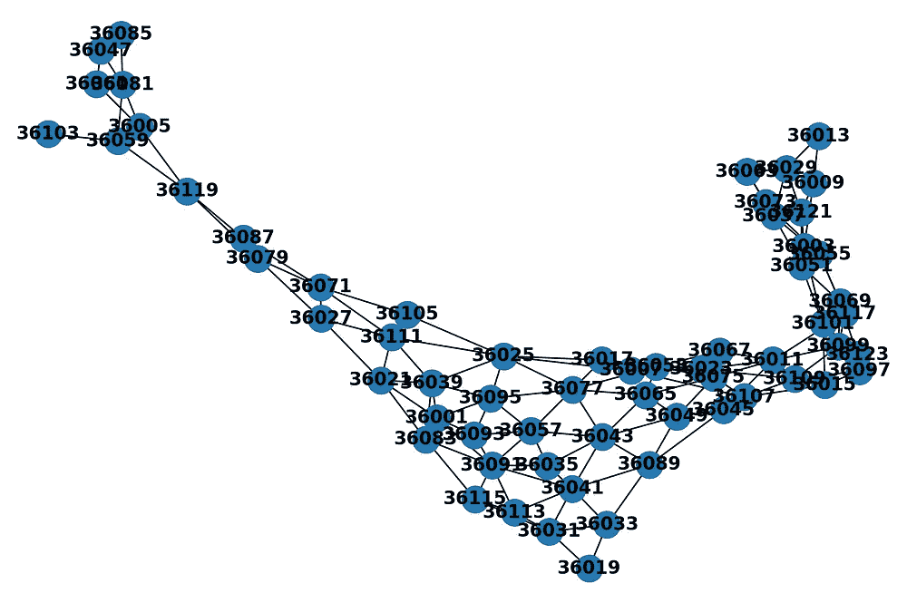
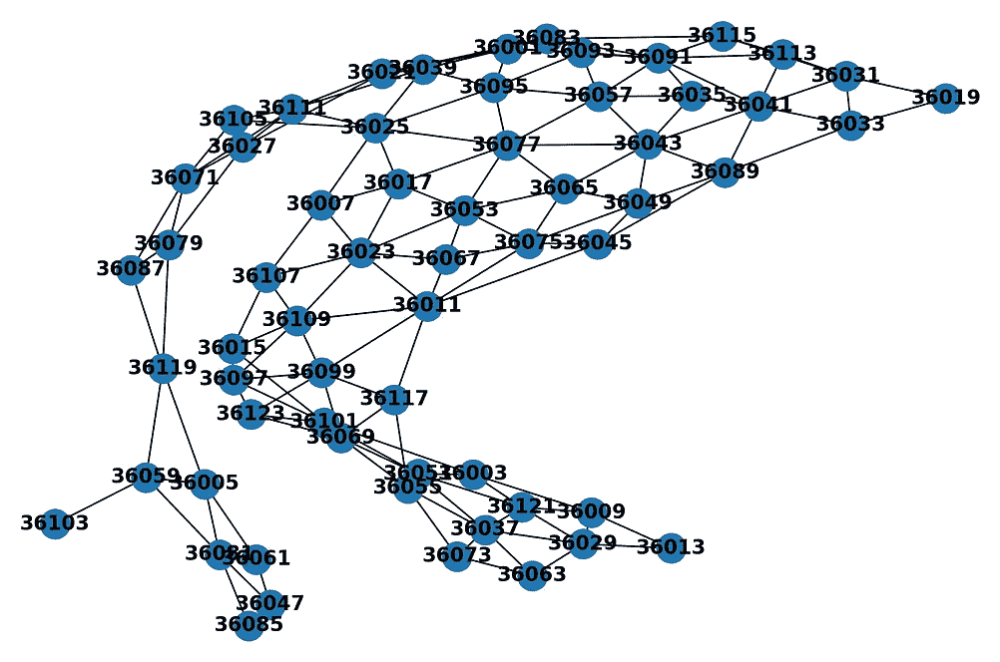

# 使用 NetworkX 的普查地理

> 原文：<https://towardsdatascience.com/census-geography-with-networkx-fe2aa6c8ab16?source=collection_archive---------65----------------------->

## 公共数据

## 使用 Python 中的图表表示人口普查地图的教程

## 概观

本教程的目标是创建一个表示纽约州各县之间地理关系的图形数据结构。具体来说，我们希望确定两个县何时相邻。

在我们开始写代码之前，让我们想一想我们想要如何构建这些关于节点和边的关系。

*   **节点—** 每个节点将代表纽约州的一个县。它们将通过它们的 FIPS(联邦信息处理标准)编号来识别。此外，每个节点将存储该县的自然语言名称以及公共交通的使用率。
*   **边—** 如果两个节点在地图上地理上相邻，它们将共享一条边

## 设置

要完成本教程，您需要以下内容

*   一个县[邻接文件](https://data.nber.org/data/county-adjacency.html)。
*   类似下面截图的人口普查数据框架。如果您对如何下载或格式化有任何疑问，请参考此处的。



在本教程中，我们将使用纽约州所有县的数据框架

## 节点

首先，我们需要导入一些包并实例化我们的 graph 对象。我们还假设我们的人口普查数据框架将被称为 df。

```
import pandas as pd
import networkx as nxdf=dfG = nx.Graph()
```

NetworkX 可以在每个节点以字典的形式存储数据。因此，为了存储我们的县名和公交使用数据，我们需要创建一个适当形式的节点列表。这将是一个 2 元组的列表，其中第一个元素是节点的名称，第二个元素是数据的字典。因此，单个元素将如下所示:

```
('36081', 
{'percent_public_transpo': 52.27, 'county_name': 'Queens County'})
```

要创建这个列表，让我们创建一个函数，该函数接收一个县的数据帧，并遍历该数据帧以返回所需的列表

```
def process_counties(df):
    final_list = []
    for index, row in df.iterrows():
        node = (str(index), 
          {'percent_public_transpo': row['percent_public_transpo'],
           'county_name': row['county_name']})
        final_list.append(node)
    return final_list
```

现在将这些节点添加到我们的图表中。

```
county_FIPS = process_counties(df)
G.add_nodes_from(county_FIPS)
```

## 优势

要添加邻接边，我们需要读入在设置部分链接的 CSV 邻接文件

```
adj_df = pd.read_csv('county_adjacency2010.csv')
```



邻接文件将会像这样读入。

这是全国每个县的名单。我们需要把范围缩小到纽约州的县，否则我们会把邻近州的县也包括进来。要做到这一点，从原始 df 中制作一个 FIPS 列表，然后根据它进行过滤。

```
county_FIPS_list = list(df.index)
adj_df = adj_df[adj_df['fipscounty'].isin(county_FIPS_list)]
adj_df = adj_df[adj_df['fipsneighbor'].isin(county_FIPS_list)]
```

然后删除除 FIPS 代码之外的所有列

```
adj_df = adj_df[['fipscounty', 'fipsneighbor']]
```

我们将定义一个函数，将数据帧转换为元组列表，同时删除任何镜像或自连接的边。

```
def create_tuples(df):
    all_tuples = list(df.itertuples(index=False, name=None))
    final_tuples = [] for tuple in all_tuples:
        if (tuple[1],tuple[0]) not in final_tuples:
            if tuple[1] != tuple[0]:
                final_tuples.append((str(tuple[0]),str(tuple[1]))) return final_tuples
```

最后，将邻接数据帧传递给它，并将结果添加到我们的图中。

```
fips_tuples = create_tuples(adj_df)
G.add_edges_from(fips_tuples)
```

## 肉眼观察

为了检查结果，我们将定义一个快速函数来绘制图形。

```
import matplotlib.pyplot as pltdef draw_graph(G):
    plt.close()
    nx.draw(G, with_labels=True, font_weight='bold')
    plt.show()
    return
```

最后，我们将把最终的 graph 对象传递给它来查看结果。这将是一个国家的抽象，可能看起来一点也不像纽约。

```
draw_graph(G)
```



NYS 邻接图的两种可能表示

就是这样。感谢您的阅读！