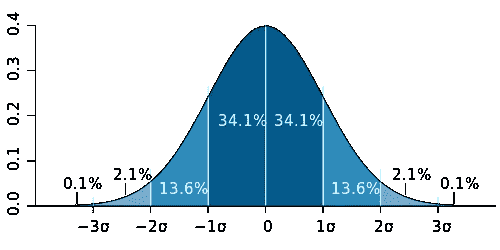
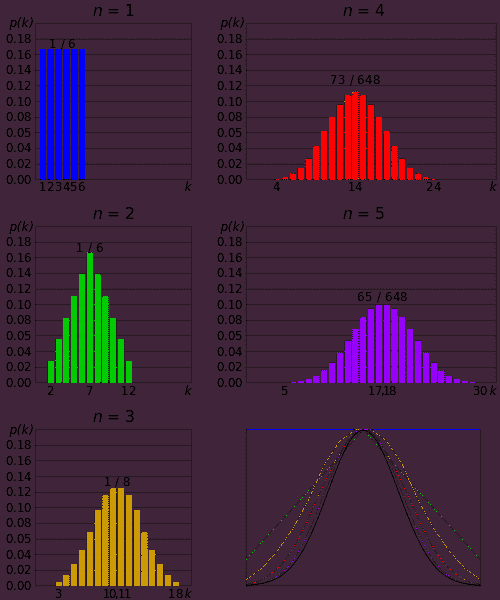

# 中心极限定理

> 原文：<https://towardsdatascience.com/central-limit-theorem-95f355934d98?source=collection_archive---------34----------------------->

## 对你永远记不住的概念的简要解释

由 [Unsplash](https://unsplash.com/s/photos/crowd?utm_source=unsplash&utm_medium=referral&utm_content=creditCopyText) 上的 [chuttersnap](https://unsplash.com/@chuttersnap?utm_source=unsplash&utm_medium=referral&utm_content=creditCopyText) 拍摄

在概率和统计中，特别是在假设检验中，你会经常听到一种叫做中心极限定理的东西。中心极限定理(CLT)或多或少地表明，如果我们重复地抽取独立的随机样本，随着样本量的增加，*样本*均值的分布接近正态分布。无论*群体*或原始变量的分布形状如何，都会发生这种情况。*提醒一下，* ***样本*** *是* ***总体*******正态分布*** *用钟形曲线表示(如下图)。我们也可以使用 CLT 来估计样本值大大偏离总体均值的概率。正如我们在下面的图表中看到的，样本均值偏离总体均值超过三个标准差的概率极低。**

**

*m . w . Toews——自己的作品，基于(概念上)杰瑞米·坎普的数字，2005 年 2 月 9 日，CC BY 2.5，[https://commons.wikimedia.org/w/index.php?curid=1903871](https://commons.wikimedia.org/w/index.php?curid=1903871)*

*中心极限定理对于从样本统计中估计总体参数非常有用，因为您通常无法从您的实验所代表的整个总体中获得数据。通常，数字 30 被用作 CLT 成立的最小样本量的标志。中央极限理论的一个流行例子是掷骰子的实验。掷出六面骰子时，掷出 1、2、3、4、5 或 6 的概率总是⅙.这个图看起来几乎是平的。然而，如果我们掷骰子两次，取平均结果，并重复 500 次，随着分布变得更正常，图形将开始变得更像钟形。随着我们在平均之前继续增加我们执行的滚动次数(n ),由于中心极限定理，该图将进一步表示正态分布。*

**

*By Cmglee —自己的作品，CC BY-SA 3.0，[https://commons.wikimedia.org/w/index.php?curid=18918612](https://commons.wikimedia.org/w/index.php?curid=18918612)*

## *参考资料:*

* [## 中心极限定理

### 在概率论中，中心极限定理(CLT)确定，在某些情况下，当独立随机…

en.wikipedia.org](https://en.wikipedia.org/wiki/Central_limit_theorem)  [## 中心极限定理:定义和例子在简单的步骤-统计如何

### 什么是中心极限定理？中心极限定理的例子:一步一步用视频剪辑中心极限定理…

www.statisticshowto.com](https://www.statisticshowto.com/probability-and-statistics/normal-distributions/central-limit-theorem-definition-examples/)*